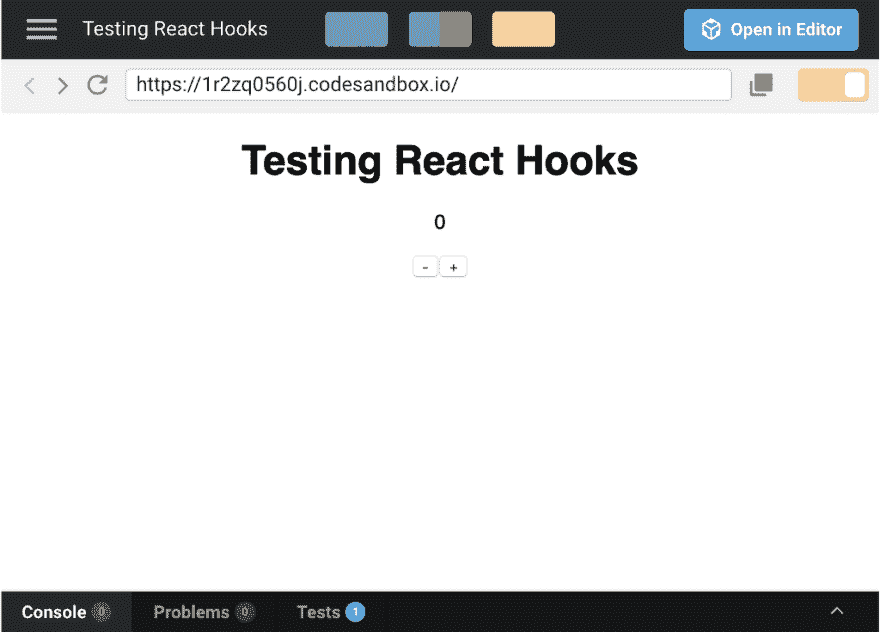
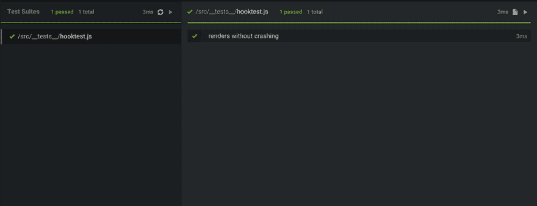
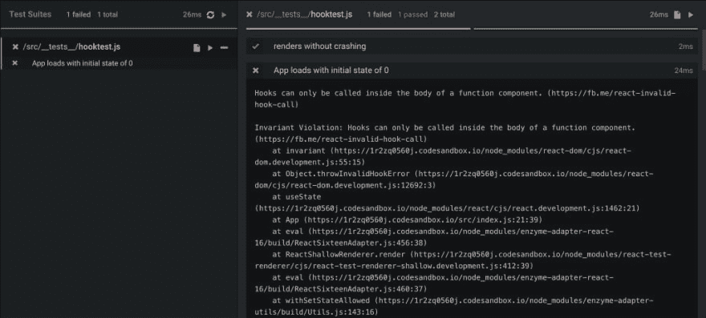
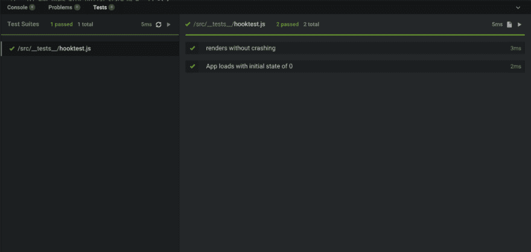
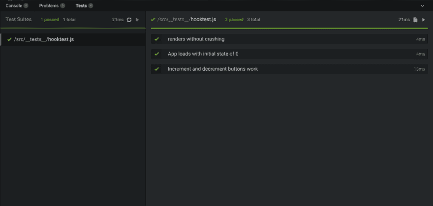
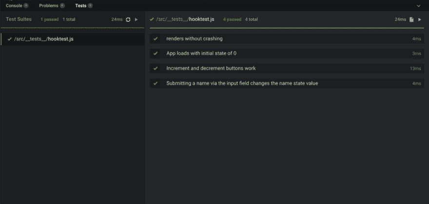

# 测试 React 钩子的快速指南

> 原文：<https://dev.to/bnevilleoneill/a-quick-guide-to-testing-react-hooks-1763>

[](https://res.cloudinary.com/practicaldev/image/fetch/s--tgqZh60Y--/c_limit%2Cf_auto%2Cfl_progressive%2Cq_auto%2Cw_880/https://cdn-images-1.medium.com/max/1024/1%2A1hV-mkBWd8ueEFf7jifbbA.png)

React 的 16.8.0 版本发布意味着 [React 钩子](https://reactjs.org/docs/hooks-intro.html)特性的稳定发布。React Hooks 于去年推出，并获得了 React 生态系统的好评。它本质上是一种创建具有状态等特性的组件的方法，而不需要类组件。

[](https://logrocket.com/signup/)

### 反应钩子简介

Hooks 特性是一个受欢迎的变化，因为它解决了 React 开发人员多年来面临的许多问题。其中一个问题是 React 不支持类组件之间的可重用状态逻辑。这有时会导致庞大的组件、构造函数和生命周期方法中的重复逻辑。

不可避免地，这迫使我们使用一些复杂的模式，如渲染道具和高阶组件，这可能导致复杂的代码库。

Hooks 的目标是通过让你能够编写可重用的组件来访问状态、生命周期方法、引用等等来解决所有这些问题。

### **挂钩类型**

以下是 React 应用程序中常用的一些主要挂钩:

*   useState —允许我们编写包含状态的纯函数
*   useEffect —让我们执行副作用。副作用可能是 API 调用、更新 DOM、订阅事件侦听器
*   use context——允许我们编写包含上下文的纯函数
*   useRef —允许我们编写返回可变 Ref 对象的纯函数

React 应用中可用于特定边缘情况的其他挂钩包括:

*   useReducer——替代[使用状态](https://reactjs.org/docs/hooks-reference.html#usestate)。接受一个类型为(state，action) = > newState 的缩减器，并返回当前状态和一个分派方法。当您有涉及多个子值的复杂状态逻辑或者下一个状态依赖于前一个状态时，通常最好使用 State
*   使用编号
*   use callback——use callback 挂钩用于返回内存化的回调
*   useImperativeMethods—useImperativeMethods 自定义使用 ref 时向父组件公开的实例值
*   useMutationEffects—useMutationEffect 类似于 useEffect 挂钩，它允许您执行 DOM 突变
*   useLayoutEffect——useLayoutEffect 挂钩用于从 DOM 读取布局并同步重新渲染

在我们继续看如何为 React 钩子编写测试之前，让我们看看如何使用钩子构建一个 React 应用程序。我们将建立一个应用程序，显示 2018 年 F1 比赛和每年的获胜者。

在 CodeSandbox 可以看到整个应用程序并与之交互。
[https://codesandbox.io/embed/pwwzw72l10](https://codesandbox.io/embed/pwwzw72l10)
在上面的应用中，我们使用了 useState 和 useEffect 钩子。如果您导航到 index.js 文件，在 App 函数中，您会看到一个使用了 useState 的实例。

```
// Set the list of races to an empty array
let [races, setRaces] = useState([]);
// Set the winner for a particular year
let [winner, setWinner] = useState(""); 
```

Enter fullscreen mode Exit fullscreen mode

useState 返回一对值，即当前状态值和一个允许您更新它的函数。它可以用任何类型的值(字符串、数组等)初始化，而不是像类中的 state 那样必须是一个对象。

这里使用的另一个钩子是 useEffect 钩子。useEffect 挂钩增加了从函数组件执行副作用的能力。它本质上允许您执行通常在 componentDidMount、componentDidUpdate 和 componentWillUnmount 生命周期中执行的操作。

```
// On initial render of component, fetch data from API.
useEffect(() => {
  fetch(`https://ergast.com/api/f1/2018/results/1.json`)
    .then(response => response.json())
    .then(data => {
      setRaces(data.MRData.RaceTable.Races);
    });
  fetch(`https://ergast.com/api/f1/2018/driverStandings.json`)
    .then(response => response.json())
    .then(data => {
      let raceWinner = data.MRData.StandingsTable.StandingsLists[0].DriverStandings[0].Driver.familyName + "  " + data.MRData.StandingsTable.StandingsLists[0].DriverStandings[0].Driver.givenName;
      setWinner(raceWinner);
    });
}, []); 
```

Enter fullscreen mode Exit fullscreen mode

在应用程序中，我们使用 useEffect 钩子进行 API 调用并获取 F1 比赛数据，然后使用 setRaces 和 setWinner 函数将它们各自的值设置到状态中。

这只是一个如何结合使用钩子来构建应用程序的例子。我们使用 useEffect 钩子从某个源获取数据，并使用 useState 设置进入状态的数据。

### 测试 React 钩子

#### **我们能用 Jest 还是酵素？**

[Jest](https://jestjs.io/) 和[酵素](https://airbnb.io/enzyme/)是用来测试 React apps 的工具。Jest 是用于测试 JavaScript 应用程序的 JavaScript 测试框架，Enzyme 是 React 的 JavaScript 测试实用程序，可以更轻松地断言、操作和遍历 React 组件的输出。

它们可能是 React 的首选测试工具，所以我们将看看它们是否可以用来测试 React 挂钩。为此，我在 [CodeSandbox](https://codesandbox.io/s/1r2zq0560j) 上创建了一个应用程序，我们将在测试套件中使用它。您可以通过在 CodeSandbox 上派生应用程序来跟进。

导航到`__tests__`文件夹，查看包含测试套件的`hooktest.js`文件。

```
import React from "react";
import ReactDOM from "react-dom";
import App from "../index";
it("renders without crashing", () => {
  const div = document.createElement("div");
  ReactDOM.render(<App />, div);
  ReactDOM.unmountComponentAtNode(div);
}); 
```

Enter fullscreen mode Exit fullscreen mode

我们将首先编写一个测试，看看应用程序是否在不崩溃的情况下呈现。

[](https://res.cloudinary.com/practicaldev/image/fetch/s--QEmw-p1g--/c_limit%2Cf_auto%2Cfl_progressive%2Cq_auto%2Cw_880/https://cdn-images-1.medium.com/max/1024/1%2AcjLeLKXTVA4uvvPtYYkcbA.png)

接下来，我们将尝试使用酶测试库来测试 React 钩子。要使用 Enzyme，我们需要将以下依赖项安装到 CodeSandbox 应用程序:

*   [酶](https://www.npmjs.com/package/enzyme)
*   [enzyme-adapter-react-16](https://www.npmjs.com/package/enzyme-adapter-react-16)[https://codesandbox.io/embed/1r2zq0560j](https://codesandbox.io/embed/1r2zq0560j)导航到`__tests__`文件夹，查看包含测试套件的`hooktest.js`文件。

在 hooktest.js 文件中，添加了一个额外的测试块。我们正在使用从酶导入的浅层方法进行测试。浅层方法或渲染用于将组件作为一个单元进行测试。它是不需要 DOM 的组件树的模拟呈现。

当我们尝试使用酶进行测试时，会出现以下错误。

[](https://res.cloudinary.com/practicaldev/image/fetch/s--0Jeb9T4z--/c_limit%2Cf_auto%2Cfl_progressive%2Cq_auto%2Cw_880/https://cdn-images-1.medium.com/max/1024/1%2A_MpQpfxiOSsYkrrxxbBOtA.png)T3】

```
Hooks can only be called inside the body of a function component. (https://fb.me/react-invalid-hook-call) 
```

Enter fullscreen mode Exit fullscreen mode

上面的错误意味着钩子在 Enzyme 中还不被支持，如本期[这里](https://github.com/airbnb/enzyme/issues/1938)所见。

因此，我们不能用酶对反应钩进行成分测试。那么可以用什么呢？

#### **引入 react-testing-library**

[react-testing-library](https://github.com/kentcdodds/react-testing-library) 是一个非常轻量级的 react 组件测试解决方案。它对 react-dom 和 react-dom/test-utils 进行了扩展，以提供轻量级的实用函数。它鼓励您编写与 react 组件的使用非常相似的测试。

让我们看一个使用 react-testing-library 编写钩子测试的例子。
[https://codesandbox.io/embed/rqj0lymyn](https://codesandbox.io/embed/rqj0lymyn)
在上面的应用程序中，使用了三种类型的钩子，useState、useEffect、useRef，我们将为它们编写测试。

除了递增和递减计数的 useState 示例之外，我们还添加了另外两个示例。

对于 useRef 钩子实现，我们实际上是使用 useRef 创建一个 Ref 实例，并将其设置为一个输入字段，这意味着现在可以通过 ref 访问输入的值。

useEffect 钩子实现本质上是将名称 state 的值设置为 localStorage。

让我们继续为上面的所有实现编写测试。我们将为以下内容编写测试:

*   初始计数状态是 0
*   增量和减量按钮起作用
*   通过输入字段提交名称会改变名称状态的值
*   名称状态保存在本地存储中

导航到`__tests__`文件夹，查看包含测试套件和下面代码导入行的`hooktest.js`文件。

```
// hooktest.js
import { render, fireEvent, getByTestId} from "react-testing-library"; 
```

Enter fullscreen mode Exit fullscreen mode

*   渲染-这将有助于渲染我们的组件。它呈现在附加到 document.body 的容器中
*   getByTestId —通过 data-testid 获取一个 DOM 元素
*   fireEvent—这用于“激发”DOM 事件。它在文档上附加了一个事件处理程序，并通过事件委托处理一些 DOM 事件，例如点击按钮
*   rerender —这用于模拟页面重新加载

接下来，在 hooktest.js 文件中添加下面的测试套件。

```
// hooktest.js

it("App loads with initial state of 0", () => {
  const { container } = render(<App />);
  const countValue = getByTestId(container, "countvalue");
  expect(countValue.textContent).toBe("0");
}); 
```

Enter fullscreen mode Exit fullscreen mode

该测试通过首先用 [getByTestId](https://testing-library.com/docs/api-queries#bytestid) 助手获取元素来检查初始计数状态是否被设置为 0。然后使用 expect()和 toBe()函数检查内容是否为 0。

[](https://res.cloudinary.com/practicaldev/image/fetch/s--qGj-Qjjp--/c_limit%2Cf_auto%2Cfl_progressive%2Cq_auto%2Cw_880/https://cdn-images-1.medium.com/max/1024/1%2AroFU4bmRvU_XNYnqVnbVfg.png)

接下来，我们将编写测试来查看递增和递减按钮是否有效。

```
// hooktest.js

it("Increment and decrement buttons work", () => {
  const { container } = render(<App />);
  const countValue = getByTestId(container, "countvalue");
  const increment = getByTestId(container, "incrementButton");
  const decrement = getByTestId(container, "decrementButton");
  expect(countValue.textContent).toBe("0");
  fireEvent.click(increment);
  expect(countValue.textContent).toBe("1");
  fireEvent.click(decrement);
  expect(countValue.textContent).toBe("0");
}); 
```

Enter fullscreen mode Exit fullscreen mode

在上面的测试中，测试检查如果 on 按钮被点击，状态被设置为 1，当 off 按钮被点击，状态被设置为 1。

[](https://res.cloudinary.com/practicaldev/image/fetch/s--coLm_5tg--/c_limit%2Cf_auto%2Cfl_progressive%2Cq_auto%2Cw_880/https://cdn-images-1.medium.com/max/1024/1%2AjVvvMlL2s1b_aTNCIKRIzg.png)

下一步，我们将编写一个测试来断言通过输入字段提交名称是否实际改变了名称状态的值，以及它是否成功地保存到了 localStorage。

```
// hooktest.js

it("Submitting a name via the input field changes the name state value", () => {
  const { container, rerender } = render(<App />);
  const nameValue = getByTestId(container, "namevalue");
  const inputName = getByTestId(container, "inputName");
  const submitButton = getByTestId(container, "submitRefButton");
  const newName = "Ben";
  fireEvent.change(inputName, { target: { value: newName } });
  fireEvent.click(submitButton);
  expect(nameValue.textContent).toEqual(newName);
  rerender(<App />);
  expect(window.localStorage.getItem("name")).toBe(newName);
}); 
```

Enter fullscreen mode Exit fullscreen mode

在上面的测试断言中，fireEvent.change 方法用于在输入字段中输入一个值，然后单击 submit 按钮。

然后，测试检查按钮被单击后 ref 的值是否等于 newName。最后，使用 rerender 方法，模拟应用程序的重新加载，并检查之前设置的名称是否存储在 localStorage 中。

[](https://res.cloudinary.com/practicaldev/image/fetch/s--GhvX6_mn--/c_limit%2Cf_auto%2Cfl_progressive%2Cq_auto%2Cw_880/https://cdn-images-1.medium.com/max/1024/1%2Ah5LNym4PHPWiV1rePpakDA.png)

### 结论

在本文中，我们看到了如何使用 react-testing-library 为 React 挂钩和 React 组件编写测试。我们还学习了如何使用 React 钩子的简短入门。

如果你有任何问题或意见，可以在下面分享。

* * *

### Plug: [LogRocket](https://logrocket.com/signup/) ，一款适用于网络应用的 DVR

<figure>[](https://logrocket.com/signup/)

<figcaption></figcaption>

</figure>

LogRocket 是一个前端日志工具，可以让你回放问题，就像它们发生在你自己的浏览器中一样。LogRocket 不需要猜测错误发生的原因，也不需要向用户询问截图和日志转储，而是让您重放会话以快速了解哪里出错了。它可以与任何应用程序完美配合，不管是什么框架，并且有插件可以记录来自 Redux、Vuex 和@ngrx/store 的额外上下文。

除了记录 Redux 操作和状态，LogRocket 还记录控制台日志、JavaScript 错误、堆栈跟踪、带有头+正文的网络请求/响应、浏览器元数据和自定义日志。它还使用 DOM 来记录页面上的 HTML 和 CSS，甚至为最复杂的单页面应用程序重新创建像素级完美视频。

免费试用。

* * *

帖子[测试 React 钩子的快速指南](https://blog.logrocket.com/a-quick-guide-to-testing-react-hooks-fa584c415407/)首先出现在[的 LogRocket 博客](https://blog.logrocket.com)上。