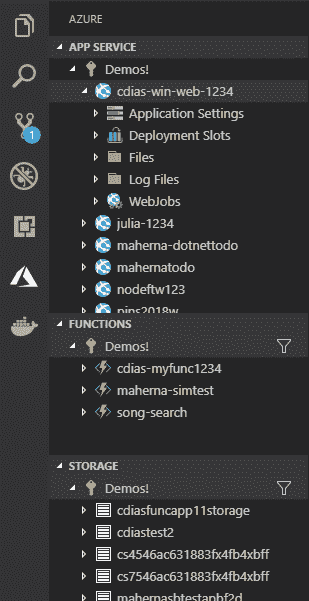
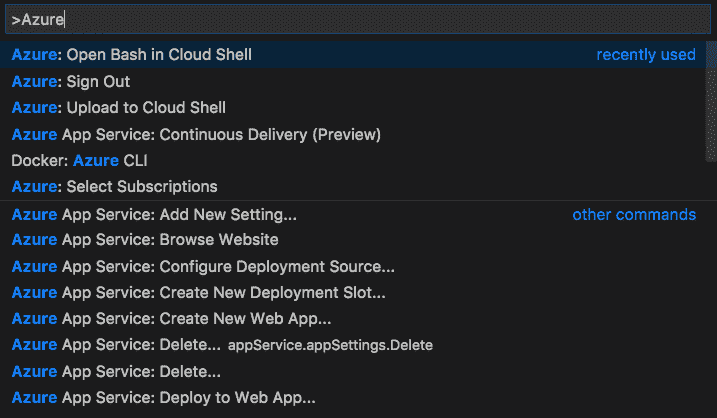
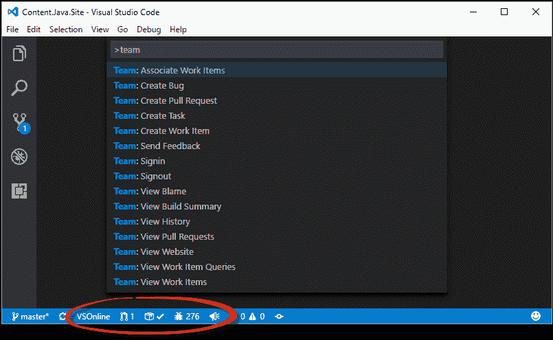

# 深入探讨:Visual Studio 代码- Azure 扩展

> 原文：<https://dev.to/vip3rousmango/deep-dive-visual-studio-code---azure-extensions-2b9o>

在过去的几年里，随着对 Visual Studio 代码的了解越来越多，当我发现如何轻松地部署 web 应用程序、UI 和其他前端相关项目时，我找到了一些新的有趣的学习途径。

我来自 Visual Studio 2015，在 Eclipse 之前，我习惯于让我的 IDE 完成大部分(如果不是全部)CI/CD 管道的运行工作。幸运的是，那些已经设置了环境/配置的开发人员让我可以轻松地进行入门和部署。高级和主要开发人员已经有了一个经过试验和测试的工作流程，确保其他开发人员遵循它是很重要的。

现在，我已经开始考虑为自己的项目做更多的全栈工作，我希望有一种简单、无障碍的方式，使用一些内置的 Visual Studio 代码(VSC)扩展来设置部署，以实现与过去项目开发商店相同的感觉和流程。

面向 VSC 的微软 Azure 扩展以及面向新开发人员的微软免费 Azure 产品(在美国为 200 美元信用和免费等级)使它成为了一个完美的尝试机会。只要确保[在部署应用时坚持使用免费层](https://azure.com/e/0b85c8efd3f744488c636e0e9c04fa0f)即可——否则 Azure 会很快花光那 200 美元！

如果你对 Azure 的产品清单不熟悉，[下面是 Azure 和 AWS](https://docs.microsoft.com/en-us/azure/architecture/aws-professional/services) 以及 Azure 和谷歌云之间的[对比。这帮助我学会了从一个到另一个的等效服务。](https://cloud.google.com/free/docs/map-azure-google-cloud-platform)

## Azure 扩展列表

这将是一个很长的扩展列表，但是 Azure Tools 扩展加上 Azure Repos 和 Azure Pipelines 完成了您需要的繁重工作，并使用其他 Azure 扩展来促进提到的功能的各个方面。

### [Azure 工具](https://marketplace.visualstudio.com/items?itemName=ms-vscode.vscode-node-azure-pack)

获得网站托管、SQL 和 MongoDB 数据、Docker 容器、无服务器功能等等，全部在 Azure 上，全部来自 VS 代码，在微软的这个扩展中。

这是一个必须具备的功能，它取代了几个单独的 Azure 扩展，并在 Visual Studio 代码中添加了 Azure Explorer。这让你可以轻松地浏览你的 Azure 门户资源，并可以在这里管理大多数项目。

*   Azure 应用服务扩展允许你快速创建站点，部署它们，查看日志，甚至设置环境变量(比如连接字符串)，就在 VS 代码中。

*   VS Code 的 Cosmos DB 支持允许你创建和管理数据库以及在剪贴簿中编写 MongoDB 命令脚本，具有丰富的补全功能(智能感知),就像你在编写 JavaScript、Python 或 C#一样。

*   如果您使用 SQL Server 或 Azure SQL 数据库为您的应用程序存储数据， [SQL Server 扩展](https://marketplace.visualstudio.com/items?itemName=ms-mssql.mssql)直接在 VS 代码中启用 SQL 数据库连接。使用方便的命令连接到数据库服务器或实例、编辑器中的查询结果视图和 SQL 的 IntelliSense 完成，您将能够验证您的代码正在正确地操作您的数据，而无需离开 VS 代码。

*   你想拥有一个静态网站吗？你可以使用 [Azure Storage](https://marketplace.visualstudio.com/items?itemName=ms-azuretools.vscode-azurestorage) 快速廉价地托管你的网站。存储服务还以低延迟和高吞吐量提供大规模 blob、文件和文档存储。VS Code 的存储支持允许您部署静态站点、浏览和编辑 Blob 容器、文件共享、表和队列。

*   使用 [Azure Container Registry](https://marketplace.visualstudio.com/items?itemName=formulahendry.docker-explorer) 将 Docker 图像存储在私有容器注册表中，并使用 App Service 在云中运行它们。VS Code 对 Docker 的支持有助于您创作 Dockerfile 和 docker-compose 文件，具有丰富的完成功能(IntelliSense)、语法突出显示和检查以及林挺支持。Explorer 视图使得构建、运行和管理您的本地和远程容器和映像变得容易。

*   Azure CLI 扩展使从终端管理所有 Azure 资源变得容易。如果你编写 CLI 脚本，VS Code 的支持为 CLI 命令以及 Azure 中的资源提供了语法高亮和完成(IntelliSense)。您可以执行一个或多个命令，甚至可以在格式丰富的 JSON，document 中看到结果。

*   您还可以使用[Azure Resource Manager(“ARM”)模板](https://marketplace.visualstudio.com/items?itemName=msazurermtools.azurerm-vscode-tools)来自动化 Azure 资源的管理。VS Code 对 ARM 的支持使得创作这些 JSON 文档变得很容易，具有丰富的部署模板和模板语言表达式的编辑和导航体验，包括 TLE 函数名的完成(IntelliSense)、参数引用、签名帮助、转到定义、查看定义和查找所有引用(Shift+F12)以及错误和警告。

*   使用 [Azure 物联网工具包](https://marketplace.visualstudio.com/items?itemName=vsciot-vscode.azure-iot-toolkit)开发物联网应用并将其连接到 Azure。通过这个扩展，你可以与 Azure 物联网中心进行交互，管理连接的设备，并为你的 Azure 物联网应用程序生成代码。

### [天蓝色管道](https://marketplace.visualstudio.com/items?itemName=ms-azure-devops.azure-pipelines)

这是一个小扩展，在自动化前端部署时对我来说至关重要。基本的 YAML 验证内置于 VS 代码中，但是现在你可以用语法高亮显示管道 YAML 模式。这意味着如果你在说`task:`的时候说了`tasks:`，你会得到红色的曲线。IntelliSense 也能感知架构。

### [蓝色休息](https://marketplace.visualstudio.com/items?itemName=ms-vsts.team)

此扩展允许您连接到 Azure DevOps 服务和 Team Foundation Server，并提供对 Team Foundation 版本控制(TFVC)的支持。它允许您监控您的构建，并管理您的 TFVC 或 Git 源存储库的拉请求和工作项。

#### 包装完毕

现在你有了它，有了这 3 个扩展，你就可以很好地覆盖最常用的 Azure 服务，快速轻松地部署你的应用。在另一篇文章中，我们将深入探讨如何将本地应用程序提升为生产就绪的 Web 应用程序。

使用不同的 Azure 扩展，或者得到一些使用我上面提到的那些的提示和技巧？在评论里让我和其他人知道！