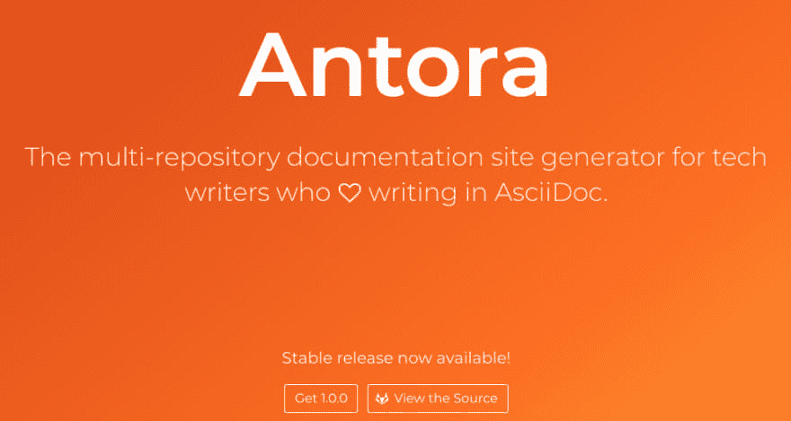
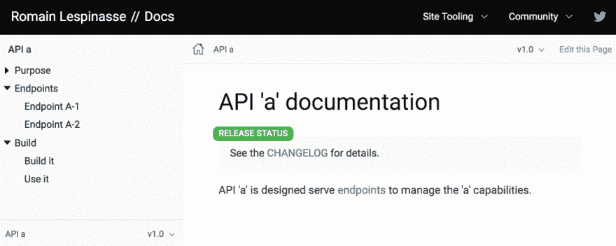

# 使用文档站点替换 wiki

> 原文:# t0]https://dev . to/free spine/replace-your-wiki-par-un-site-documentation-207k

> 嗨，这篇文章的英文版可以在 [dev.to](https://dev.to/rlespinasse/replace-your-wiki-with-a-documentation-site-3p90) 上阅读

无论您的 it 项目如何，总会有存储文档的需要。[选择使用](https://fr.wikipedia.org/wiki/Wiki) [wiki](https://fr.wikipedia.org/wiki/Wiki) 在企业中相当普遍。

例如，您是这些程序中的一个程序的开发人员，您的项目文档是否由易于访问和编辑的 wiki 管理？

如果你看看这个 wiki 的内容，你可能会发现:

*   含有章节`à documenter`的页面，
*   包含错误信息的页面，
*   珍贵的页面，
*   只对一个团队或另一个团队有用的页面，
*   包含有关未来发展的文档的页面。

因此，您想知道如何帮助处理不同项目的人员。

此时，`documentation as code`原则似乎是您需要的解决方案。

## 你踏上了以文献为典的冒险之路

将文档和代码与程序源一起查看是有趣的。
您要用专门的文档项目替换当前 wiki，并允许您对这些更改进行`code review`。
但这仅解决了部分问题，您只将 wiki 页面替换为其他格式的文件，例如:

*   le 格式[降价](https://daringfireball.net/projects/markdown/syntax)，
*   格式 [Asciidoc](http://www.methods.co.nz/asciidoc/) 。

`Markdown`格式由于其简单易懂的语法，是最常用的格式之一，尤其是在 github 或 gitlab 等站点。但是，格式太简单，无法进行更深入的文档记录。

格式`Asciidoc`更有趣，它使您的文档更具表达性。
相关工具 [Asciidoctor](https://asciidoctor.org/) 带来了[的有用功能](https://asciidoctor.org/docs/asciidoc-writers-guide/)，以及与 [plantuml](http://plantuml.com/) 的图表生成等集成。

因此，您选择在每个项目中以 **Asciidoctor** 的形式编写文档。
这样您就可以随相关代码一起交付更新的文档。

即使您的程序由一组项目及其各自的文档组成，您仍希望保留一个站点以供访问。

Asciidoctor 背后的人最近向开源社区开放了一个汇总文档站点生成器:“t1]antora 稳定版本(“T0”)。

[](https://res.cloudinary.com/practicaldev/image/fetch/s--9imfnskl--/c_limit%2Cf_auto%2Cfl_progressive%2Cq_auto%2Cw_880/https://thepracticaldev.s3.amazonaws.com/i/y0hrwcftoqua8lruudtr.png)

## 您使用 Antora / Asciidoctor 创建新的文档站点

安东拉生成的场地是由三个元素组成:

*   包含文档的项目，
*   设置文献网站生成的[**【play book】**](https://docs.antora.org/antora/1.0/playbook/)，
*   定义站点视觉的[**【ui】**](https://docs.antora.org/antora/1.0/playbook/configure-ui/)(默认设置适用)。

为了供 Antora 使用，一个项目必须遵守一个[文件结构](https://docs.antora.org/antora/1.0/component-structure/)

```
./docs
├── antora.yml
└── modules
    └── ROOT
        ├── _attributes.adoc
        ├── nav.adoc
        └── pages
            ├── _attributes.adoc
            └── index.adoc 
```

Enter fullscreen mode Exit fullscreen mode

### 你把文件作为代码放在你的项目上

因此，您可以在以下位置执行此操作:

*   沃斯 API([API A](https://github.com/rlespinasse/api-a)， [api B](https://github.com/rlespinasse/api-b) ， [api C](https://github.com/rlespinasse/api-c) )，
*   你的工具([构建工具](https://github.com/rlespinasse/buildtools))，
*   发展指南([指南](https://github.com/rlespinasse/guidelines))。

格式为“`Asciidoctor`”的文档位于“`docs`”文件夹中。

> 不必将此树用于仅作为文档项目的“`guideline`”。

### 准备生成您的文档站点

因此，您创建了一个特定项目，用于存储 **playbook** 。

```
site:
  title: "Romain  Lespinasse  //  Docs"
  start_page: guidelines::index
  url: https://rlespinasse.github.io/docssite
content:
  sources:
  - url: https://github.com/rlespinasse/api-a.git
    branches: master
    tags: v*
    start_path: docs
  - url: https://github.com/rlespinasse/api-b.git
    branches: master
    tags: v*
    start_path: docs
  - url: https://github.com/rlespinasse/api-c.git
    branches: master
    tags: v*
    start_path: docs
  - url: https://github.com/rlespinasse/buildtools.git
    branches: master
    tags: v*
    start_path: docs
  - url: https://github.com/rlespinasse/guidelines.git
    branches: master
ui:
  bundle:
    url: https://gitlab.com/antora/antora-ui-default/-/jobs/artifacts/master/raw/build/ui-bundle.zip?job=bundle-stable
    snapshot: true
  output_dir: ui-bundle
  supplemental_files: ./supplemental-ui
output:
  dir: ./docs 
```

Enter fullscreen mode Exit fullscreen mode

[播放手册](https://docs.antora.org/antora/1.0/playbook/playbook/) `site.yml`的内容定义如下:

*   [网站本身的](https://docs.antora.org/antora/1.0/playbook/configure-site/)相关信息——即使通过`site:`也是如此，
*   [内容](https://docs.antora.org/antora/1.0/playbook/configure-content-sources/)通过`content:`的定义，
*   乐[主题杜地点](https://docs.antora.org/antora/1.0/playbook/configure-ui/)途经`ui:`，
*   [层代档案](https://docs.antora.org/antora/1.0/playbook/configure-output/)通过`output:`。

官方文件并未提及它，因为它是一个“T2”的开发仍处于试验阶段，但您可以将导航栏配置为通过“`supplemental-ui/partials/`”中的“`header-content.hbs`”文件添加有用的链接。

> 在“[”antora default ui“](https://gitlab.com/antora/antora-ui-default/tree/master/src/partials)”中还有其他模板文件可供替换。

## 生成并部署新的文档站点

您可以通过此[指南](https://docs.antora.org/antora/1.0/install/install-antora/)安装 antora，也可以通过`docker run -v `pwd`:/antora --rm antora/antora --stacktrace site.yml`命令(其中 **site.yml** 为播放手册)使用图像对接程序

《播放手册》将文件夹设置为“`docs`”以提供您的新文档站点。

[](https://res.cloudinary.com/practicaldev/image/fetch/s--NUZ2f2sm--/c_limit%2Cf_auto%2Cfl_progressive%2Cq_auto%2Cw_880/https://thepracticaldev.s3.amazonaws.com/i/oe53z1s841okkznvw79m.png)

例如，要在 Github 上访问它，可以通过项目的 Github Pages 进行部署。

[](https://res.cloudinary.com/practicaldev/image/fetch/s--F1fAI3v5--/c_limit%2Cf_auto%2Cfl_progressive%2Cq_auto%2Cw_880/https://thepracticaldev.s3.amazonaws.com/i/el2qpoqq8tgfty9fto32.png)

平台将自动处理在 https://free spine . github . io/dossite 上展示“`/docs`”文件夹的内容。

## 你让别人分享新的文献网站

现在，方案工作人员可以很容易地添加、创建和维护与每个项目有关的文件。访问所有这些页面的新文档站点。

网站 [docs.antora.org](https://docs.antora.org) 自己使用──甚至项目`Antora`。

> 感谢、[【安托万·梅龙】](https://twitter.com/AMeausoone)、[【休伯特·萨伯林】](https://twitter.com/hsablonniere)、[【tanguy baud rin】](https://twitter.com/TanguyBAUDRIN)、[【托尼·普鲁斯特】](https://twitter.com/chezTone)对 l 的复习

本文首先在 [lemag.sfeir.com](https://lemag.sfeir.com) 上发表。