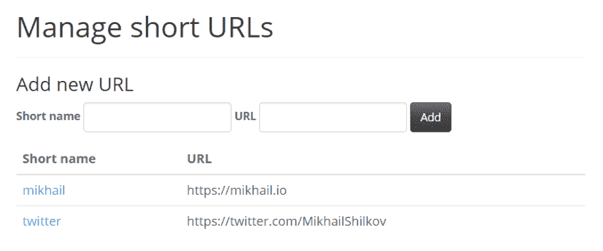
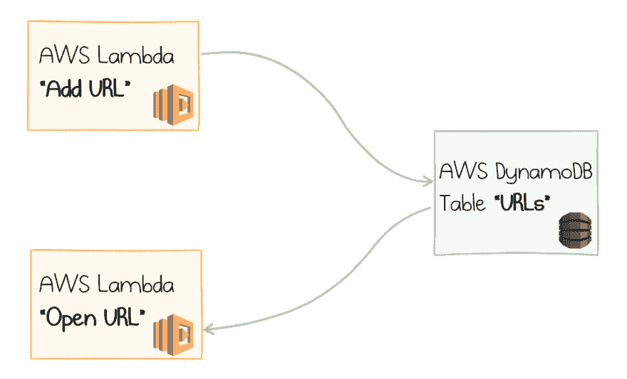
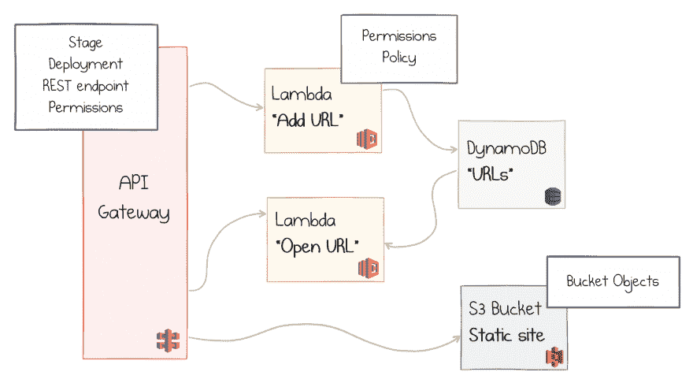
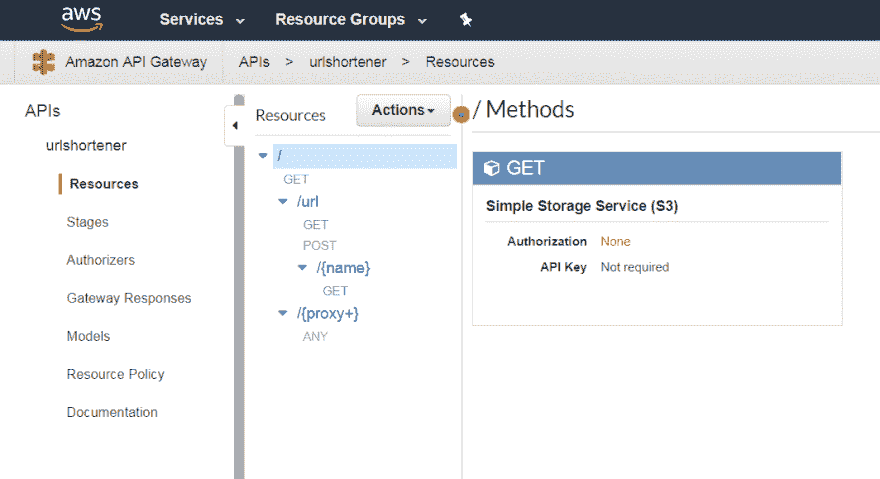
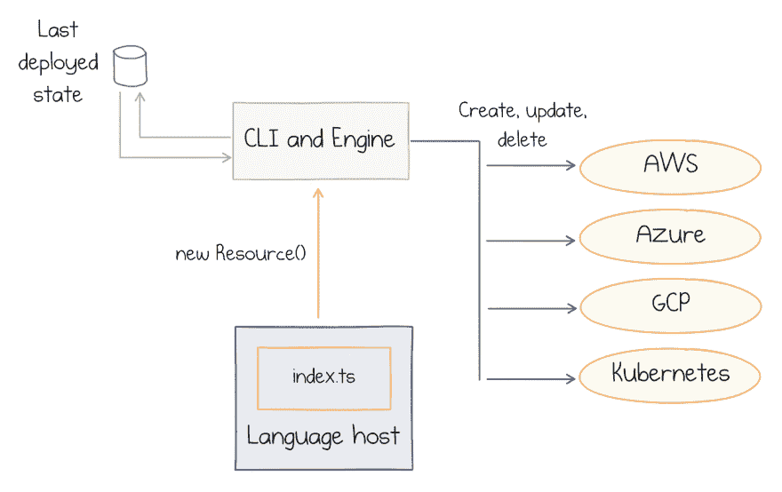
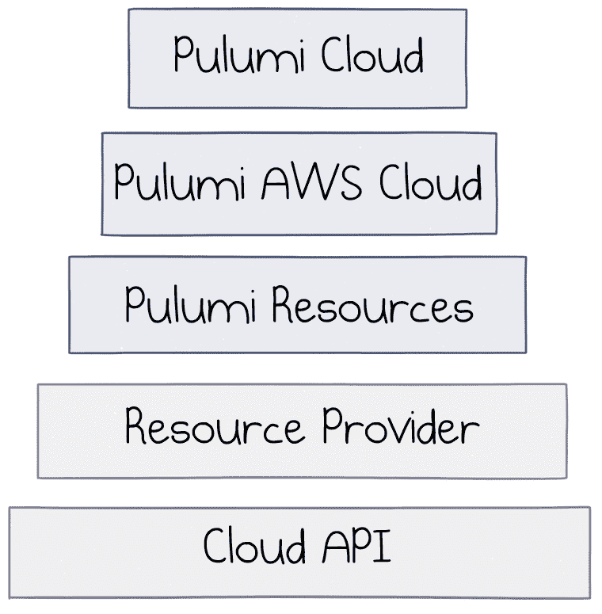

# 从 YAML 到 TypeScript:开发者对云自动化的看法

> 原文：<https://dev.to/mikhailshilkov/from-yaml-to-typescript-developers-view-on-cloud-automation-1d0m>

托管云服务、云原生和无服务器应用的兴起带来了新的可能性和挑战。越来越多来自软件开发过程的实践，如版本控制、代码审查、持续集成和自动化测试，被应用到云基础设施自动化中。

大多数现有工具建议以基于文本的标记格式定义基础设施，YAML 是最受欢迎的。在本文中，我正在为使用真正的编程语言(如 TypeScript)提供一个例子。这种变化使得更多的软件开发实践适用于基础设施领域。

## 样本应用

举一个具体的例子更容易说明问题。在这篇文章中，我定义了一个 URL Shortener 应用程序，一个 tinyurl.com 或 bit.ly 的基本克隆。

[](https://res.cloudinary.com/practicaldev/image/fetch/s--iM11B_Uk--/c_limit%2Cf_auto%2Cfl_progressive%2Cq_auto%2Cw_880/https://mikhail.io/2019/02/from-yaml-to-typescript-developers-view-on-cloud-automation/url-shortener.png)

<figcaption>URL Shortener sample app</figcaption>

现在，每当访问者访问应用程序的基本 URL+一个现有的别名时，他们都会被重定向到完整的 URL。

这个应用程序描述起来很简单，但包含了足够多的移动部件，可以代表一些现实世界的问题。另外，web 上有许多现有的实现可供比较。

## 无服务器网址缩写

我是无服务器架构的大力支持者:云应用的风格是无服务器功能和托管云服务的结合。它们开发起来很快，运行起来毫不费力，而且成本很低，除非应用程序有很多用户。然而，即使是无服务器应用程序也必须处理基础设施，如数据库、队列和其他事件源和数据目的地。

我的例子将使用亚马逊 AWS，但这也可能是微软 Azure 或谷歌云平台。

所以，要点是在 Amazon DynamoDB 中以键值对的形式存储具有短名称的 URL，并使用 AWS Lambdas 来运行应用程序代码。这是最初的草图:

[](https://res.cloudinary.com/practicaldev/image/fetch/s--eo6J2OgX--/c_limit%2Cf_auto%2Cfl_progressive%2Cq_auto%2Cw_880/https://mikhail.io/2019/02/from-yaml-to-typescript-developers-view-on-cloud-automation/lambda-dynamodb.png)

<figcaption>URL Shortener with AWS Lambda and DynamoDB</figcaption>

当有人决定添加一个新的 URL 时，顶部的 Lambda 会收到一个事件。它从请求中提取名称和 URL，并将它们作为一项保存在 DynamoDB 表中。

每当用户导航到一个短 URL 时，底部的 Lambda 就会被调用。该代码根据请求的路径读取完整的 URL，并返回一个带有相应位置的 301 响应。

下面是 JavaScript 中`Open URL` Lambda 的实现:

```
const aws = require('aws-sdk');
const table = new aws.DynamoDB.DocumentClient();

exports.handler = async (event) => {
  const name = event.path.substring(1);

  const params = { TableName: "urls", Key: { "name": name } };
  const value = await table.get(params).promise();

  const url = value && value.Item && value.Item.url;
  return url 
    ? { statusCode: 301, body: "", headers: { "Location": url } }
    : { statusCode: 404, body: name + " not found" };
}; 
```

那是 11 行代码。我将跳过`Add URL`函数的实现，因为它非常相似。考虑第三个函数来列出 UI 的现有 URL，我们可能会得到总共 30-40 行 JavaScript 代码。

那么，我们如何部署应用程序呢？

在我们这么做之前，我们应该意识到上面的图片过于简化了:

*   AWS Lambda 不能直接处理 HTTP 请求，所以我们需要在它前面加上 AWS API 网关。
*   我们还需要为 UI 提供一些静态文件，我们将把这些文件放入 AWS S3，并用相同的 API 网关代理它。

以下是更新后的图表:

[](https://res.cloudinary.com/practicaldev/image/fetch/s--s7WTWm5D--/c_limit%2Cf_auto%2Cfl_progressive%2Cq_auto%2Cw_880/https://mikhail.io/2019/02/from-yaml-to-typescript-developers-view-on-cloud-automation/apigateway-lambda-dynamodb-s3.png)

<figcaption>API Gateway, Lambda, DynamoDB, and S3</figcaption>

这是一个可行的设计，但是细节更加复杂:

*   API Gateway 是一个复杂的庞然大物，需要适当配置阶段、部署和 REST 端点。
*   需要定义权限和策略，以便 API Gateway 可以调用 Lambda，Lambda 可以访问 DynamoDB。
*   静态文件应该转到 S3 桶对象。

因此，实际的设置需要在 AWS 中配置几十个对象:

[](https://res.cloudinary.com/practicaldev/image/fetch/s--4ne1CQDo--/c_limit%2Cf_auto%2Cfl_progressive%2Cq_auto%2Cw_880/https://mikhail.io/2019/02/from-yaml-to-typescript-developers-view-on-cloud-automation/apigateway-lambda-dynamodb-s3-details.png)

<figcaption>All cloud resources to be provisioned</figcaption>

我们如何完成这项任务？

## 配置基础设施的选项

供应云应用程序有多种选择，每一种都有其利弊。让我们快速浏览一下可能性列表，以了解这种情况。

## AWS Web 控制台

像任何其他云一样，AWS 有一个[网络用户界面](https://console.aws.amazon.com)来配置其资源:

[](https://res.cloudinary.com/practicaldev/image/fetch/s--1hw17SEl--/c_limit%2Cf_auto%2Cfl_progressive%2Cq_auto%2Cw_880/https://mikhail.io/2019/02/from-yaml-to-typescript-developers-view-on-cloud-automation/aws-web-console.png)

<figcaption>AWS Web Console</figcaption>

这是一个不错的起点——适合做实验，找出可用的选项，跟随教程，也就是探索。

然而，它并不特别适合团队开发的长期不断变化的应用程序。手动点击的部署很难以精确的方式重现，这很快就变成了可维护性问题。

## AWS 命令行界面

[AWS 命令行界面](https://aws.amazon.com/cli/) (CLI)是从命令提示符管理所有 AWS 服务的统一工具。你把电话写成这样

```
aws apigateway create-rest-api --name 'My First API' --description 'This is my first API'

aws apigateway create-stage --rest-api-id 1234123412 --stage-name 'dev' --description 'Development stage' --deployment-id a1b2c3 
```

最初的体验可能不像在浏览器中点击按钮那样流畅，但巨大的好处是您可以*重用您曾经编写的*命令。您可以通过将许多命令组合成连贯的场景来构建脚本。因此，您的同事可以从您创建的相同脚本中受益。您可以通过参数化脚本来提供多个环境。

坦率地说，我从未这样做过，原因有几个:

*   CLI 脚本对我来说太强制性了。我要描述的是“如何”做事，而不是我最终想要得到的“什么”。
*   更新现有资源似乎没有什么好故事。我是否为每个变更编写小的增量脚本？我是否必须永远保留它们，并在每次需要新环境时运行完整的套件？
*   如果脚本运行中途出现故障，我需要手动将所有东西修复到一致的状态。这很快就会变得很乱，我不想练习这个过程，尤其是在制作中。

为了克服这样的限制，发明了**期望状态配置** (DSC)的概念。在这种模式下，首先描述基础设施的理想布局，然后工具负责从头开始提供基础设施，或者将所需的更改应用到现有环境中。

哪个工具为 AWS 提供了 DSC 模型？有很多军团。

## AWS 云的形成

[AWS CloudFormation](https://aws.amazon.com/cloudformation/) 是亚马逊提供的第一方工具，用于期望的状态配置管理。云形成模板使用 YAML 来描述 AWS 的所有基础设施资源。

以下是 AWS 博客[提供的一个私有网址缩写示例](https://aws.amazon.com/blogs/compute/build-a-serverless-private-url-shortener/)的片段:

```
Resources:
  S3BucketForURLs:
    Type: "AWS::S3::Bucket"
    DeletionPolicy: Delete
    Properties:
      BucketName: !If [ "CreateNewBucket", !Ref "AWS::NoValue", !Ref S3BucketName ]
      WebsiteConfiguration:
        IndexDocument: "index.html"
      LifecycleConfiguration:
        Rules:
          -
            Id: DisposeShortUrls
            ExpirationInDays: !Ref URLExpiration
            Prefix: "u"
            Status: Enabled 
```

这只是一个很短的片段:完整的例子由 317 行 YAML 组成。这比我们在应用程序中拥有的实际 JavaScript 代码多了一个数量级！

CloudFormation 是一个强大的工具，但是要掌握它需要相当多的学习。此外，这是 AWS 特有的:你不能将技能转移给其他云提供商。

如果有一个通用的 DSC 格式不是很好吗？认识一下 Terraform。

## 地形

HashiCorp Terraform 是一个开源工具，用于在声明性配置文件中定义基础设施。它有一个可插拔的架构，所以该工具支持所有主要的云甚至混合场景。

基于文本的自定义地形`.tf`格式用于定义配置。模板语言非常强大，一旦你学会了它，你就可以为不同的云提供商使用它。

以下是来自 [AWS Lambda 短 URL 生成器](https://github.com/jamesridgway/aws-lambda-short-url)的片段示例:

```
resource "aws_api_gateway_rest_api" "short_urls_api_gateway" {
  name        = "Short URLs API"
  description = "API for managing short URLs."
}
resource "aws_api_gateway_usage_plan" "short_urls_admin_api_key_usage_plan" {
  name         = "Short URLs admin API key usage plan"
  description  = "Usage plan for the admin API key for Short URLS."
  api_stages {
    api_id = "${aws_api_gateway_rest_api.short_urls_api_gateway.id}"
    stage  = "${aws_api_gateway_deployment.short_url_api_deployment.stage_name}"
  }
} 
```

这一次，完整的示例是大约 450 行文本模板。有没有办法减少基础设施定义的规模？

是的，通过提高抽象层次。使用 Terraform 的模块，或者使用其他更专业的工具，都是可能的。

## 无服务器框架和 SAM

[无服务器框架](https://serverless.com/)是一款专注于无服务器应用的基础设施管理工具。它跨云提供商工作(AWS 支持是最强的)，并且只公开与构建具有云功能的应用程序相关的特性。

好处是它更简洁。该工具再次使用 YAML 来定义模板，下面是来自[无服务器 URL shorter](https://github.com/danielireson/serverless-url-shortener)示例的片段:

```
functions:
  store:
    handler: api/store.handle
    events:
      - http:
          path: /
          method: post
          cors: true 
```

特定于领域的语言产生了一个更短的定义:这个例子有 45 行 YAML + 123 行 JavaScript 函数。

然而，这种简洁性也有其不利的一面:一旦你偏离了相当“单薄”的黄金路径——云函数和不完整的事件源列表——你就必须退回到更通用的工具，比如 CloudFormation。一旦您的环境包含了底层的基础设施工作或一些基于容器的组件，您就会再次陷入使用多种配置语言和工具的困境。

亚马逊的 [AWS 无服务器应用模型](https://docs.aws.amazon.com/serverless-application-model/index.html) (SAM)看起来非常类似于无服务器框架，但被定制为特定于 AWS。

这是最后的游戏吗？我不这么认为。

## 基础设施定义工具的期望属性

那么，在浏览现有景观时，我们学到了什么？完美的基础设施工具应该:

*   提供**可重复的**部署结果
*   可**脚本化**，即定义完成后无需人工干预
*   定义**期望状态**而不是实现它的确切步骤
*   支持**多个云提供商**和混合场景
*   从使用相同的工具定义任何类型的资源的意义上来说，是通用的
*   简洁和**简洁**以保持可读性和易管理性
*   ~~使用基于 YAML 的格式~~

不，我划掉了最后一项。YAML 似乎是这类工具中最流行的语言(我甚至还没有接触过 Kubernetes！)，但我不确定它对我是否有效。YAML 有很多缺点，我只是不想用它。

你有没有注意到我一次都没有提到过代码中的**基础设施？好了，我们开始吧(来自[维基百科](https://en.wikipedia.org/wiki/Infrastructure_as_code)):**

> 基础设施即代码(IaC)是通过机器可读的定义文件，而不是物理硬件配置或交互式配置工具来管理和配置计算机数据中心的过程。

难道不应该称之为“作为定义文件的基础设施”，或者“作为 YAML 的基础设施”吗？

作为一名软件开发人员，我真正想要的是“作为实际代码的基础设施，你知道，程序的东西”。我想用我已经知道的同一种语言。我想留在同一个编辑器中。我想在打字时获得智能感知**自动补全**。当我输入的语法不正确时，我想看看**编译错误**。我想重用我已经拥有的**开发技能**。我想提出**抽象**来概括我的代码并创建**可重用组件**。我想**利用开源社区**来创造比我更好的组件。我想**将代码和基础设施**结合在一个代码项目中。

如果你同意我的观点，请继续阅读。你在普鲁米那里得到了一切。

## 电池组

[Pulumi](https://pulumi.io/) 是一个使用真正的编程语言构建基于云的软件的工具。他们支持所有主要的云提供商，还有 Kubernetes。

Pulumi 编程模型也支持 Go 和 Python，但我将在本文的其余部分使用 TypeScript。

在制作 URL 缩短器的原型时，我解释了基本的工作方式，并说明了好处和一些权衡。如果你想跟着做，[安装 Pulumi](https://pulumi.io/quickstart/install.html) 。

## 普鲁米如何工作

让我们开始在 TypeScript 中定义我们的 URL shortener 应用程序。我安装了`@pulumi/pulumi`和`@pulumi/aws` NPM 模块，这样我就可以启动程序了。要创建的第一个资源是 DynamoDB 表:

```
 import * as aws from "@pulumi/aws";

    // A DynamoDB table with a single primary key
    let counterTable = new aws.dynamodb.Table("urls", {
        name: "urls",
        attributes: [
            { name: "name", type: "S" },
        ],
        hashKey: "name",
        readCapacity: 1,
        writeCapacity: 1
    }); 
```

我使用`pulumi` CLI 来运行这个程序，以便在 AWS 中提供实际的资源:

```
> pulumi up
 Previewing update (urlshortener):

     Type                   Name             Plan
 +   pulumi:pulumi:Stack    urlshortener     create
 +    aws:dynamodb:Table    urls             create

Resources:
    + 2 to create

Do you want to perform this update? yes
Updating (urlshortener):

     Type                   Name             Status
 +   pulumi:pulumi:Stack    urlshortener     created
 +    aws:dynamodb:Table    urls             created

Resources:
    + 2 created 
```

CLI 首先显示将要进行的更改的预览，当我确认后，它将创建资源。它还创建了一个**栈**——应用程序所有资源的容器。

这段代码看起来像是创建 DynamoDB 表的命令，但实际上不是。如果我继续将`readCapacity`更改为`2`，然后重新运行`pulumi up`，会产生不同的结果:

```
> pulumi up
 Previewing update (urlshortener):

     Type                   Name             Plan
     pulumi:pulumi:Stack    urlshortener        
 ~   aws:dynamodb:Table     urls             update  [diff: ~readCapacity]

Resources:
    ~ 1 to update
    1 unchanged 
```

它会检测到我所做的确切更改，并建议进行更新。下图说明了 Pulumi 的工作原理:

[](https://res.cloudinary.com/practicaldev/image/fetch/s--p-RLYGDz--/c_limit%2Cf_auto%2Cfl_progressive%2Cq_auto%2Cw_880/https://mikhail.io/2019/02/from-yaml-to-typescript-developers-view-on-cloud-automation/how-pulumi-works.png)

<figcaption>How Pulumi works</figcaption>

红色方块中是我的程序。Pulumi 的语言主机理解 TypeScript，并将代码翻译成内部引擎的命令。因此，该引擎构建了一个要供应的资源树，这是基础设施的理想状态。

最后一次部署的最终状态保存在存储中(可以在 pulumi.com 后端或磁盘上的文件中)。然后，引擎将系统的当前状态与程序的期望状态进行比较，并根据向云提供商发出的创建-更新-删除命令来计算增量。

## 帮助的类型

现在我可以继续编写定义 Lambda 函数的代码了:

```
// Create a Role giving our Lambda access.
let policy: aws.iam.PolicyDocument = { /* Redacted for brevity */ };
let role = new aws.iam.Role("lambda-role", {
    assumeRolePolicy: JSON.stringify(policy),
});
let fullAccess = new aws.iam.RolePolicyAttachment("lambda-access", {
    role: role,
    policyArn: aws.iam.AWSLambdaFullAccess,
});

// Create a Lambda function, using code from the `./app` folder.
let lambda = new aws.lambda.Function("lambda-get", {
    runtime: aws.lambda.NodeJS8d10Runtime,
    code: new pulumi.asset.AssetArchive({
        ".": new pulumi.asset.FileArchive("./app"),
    }),
    timeout: 300,
    handler: "read.handler",
    role: role.arn,
    environment: { 
        variables: {
            "COUNTER_TABLE": counterTable.name
        }
    },
}, { dependsOn: [fullAccess] }); 
```

你可以看到复杂性增加了，代码长度也增加了。然而，现在我开始从使用类型化编程语言中获得真正的好处:

*   我在其他对象的参数定义中使用了对象。如果我拼错了他们的名字，我不会得到运行时失败，但编辑器会立即显示错误消息。
*   如果我不知道我需要提供哪些选项，我可以去类型定义那里查找(或者使用 IntelliSense)。
*   如果我忘记指定一个强制选项，我会得到一个明确的错误。
*   如果输入参数的类型与我传递的对象的类型不匹配，我又会得到一个错误。
*   我可以在我的程序中使用像`JSON.stringify`这样的语言特性。事实上，我可以参考和使用任何 NPM 模块。

你可以在这里看到 API 网关[的代码。看起来太啰嗦了吧？此外，我只完成了一半，只定义了一个 Lambda 函数。](https://github.com/mikhailshilkov/fosdem2019/blob/master/samples/1-raw/index.ts#L60-L118)

## 可复用组件

我们可以做得更好。下面是同一个 Lambda 函数的改进定义:

```
import { Lambda } from "./lambda";

const func = new Lambda("lambda-get", {
    path: "./app",
    file: "read",
    environment: { 
       "COUNTER_TABLE": counterTable.name
    },
}); 
```

这不是很美吗？只有必要的选择留了下来，而所有的机器都不见了。嗯，它并没有完全消失，它一直隐藏在一个*抽象*的后面。

我定义了一个名为`Lambda`的自定义组件:

```
export interface LambdaOptions {
    readonly path: string;
    readonly file: string;

    readonly environment?:  pulumi.Input<{
        [key: string]: pulumi.Input<string>;
    }>;    
}

export class Lambda extends pulumi.ComponentResource {
    public readonly lambda: aws.lambda.Function;

    constructor(name: string,
        options: LambdaOptions,
        opts?: pulumi.ResourceOptions) {

        super("my:Lambda", name, opts);

        const role = //... Role as defined in the last snippet
        const fullAccess = //... RolePolicyAttachment as defined in the last snippet

        this.lambda = new aws.lambda.Function(`${name}-func`, {
            runtime: aws.lambda.NodeJS8d10Runtime,
            code: new pulumi.asset.AssetArchive({
                ".": new pulumi.asset.FileArchive(options.path),
            }),
            timeout: 300,
            handler: `${options.file}.handler`,
            role: role.arn,
            environment: {
                variables: options.environment
            }
        }, { dependsOn: [fullAccess], parent: this });
    }
} 
```

接口`LambdaOptions`定义了对我的抽象很重要的选项。类`Lambda`从`pulumi.ComponentResource`派生，并在其构造函数中创建所有子资源。

一个很好的效果是可以在`pulumi`预览中看到结构:

```
Previewing update (urlshortener):

     Type                                Name                  Plan
 +   pulumi:pulumi:Stack                 urlshortener          create
 +     my:Lambda                         lambda-get            create
 +       aws:iam:Role                    lambda-get-role       create
 +       aws:iam:RolePolicyAttachment    lambda-get-access     create
 +       aws:lambda:Function             lambda-get-func       create
 +     aws:dynamodb:Table                urls                  create 
```

`Endpoint`组件简化了 API 网关的定义(参见[来源](https://github.com/mikhailshilkov/fosdem2019/blob/master/samples/2-components/endpoint.ts)):

```
const api = new Endpoint("urlapi", {
    path: "/{proxy+}",
    lambda: func.lambda
}); 
```

该组件对客户端隐藏了复杂性——如果抽象选择正确的话。组件类可以在多个地方、几个项目中、跨团队等被重用。

## 标准件库

事实上，Pulumi 团队提出了许多在原始资源之上构建抽象的高级组件。来自`@pulumi/cloud-aws`包的组件对于无服务器应用程序特别有用。

以下是完整的 URL shortener 应用程序，包含 DynamoDB 表、Lambdas、API 网关和基于 S3 的静态文件:

```
import * as aws from "@pulumi/cloud-aws";

// Create a table `urls`, with `name` as primary key.
let urlTable = new aws.Table("urls", "name");

// Create a web server.
let endpoint = new aws.API("urlshortener");

// Serve all files in the www directory to the root.
endpoint.static("/", "www");

// GET /url/{name} redirects to the target URL based on a short-name.
endpoint.get("/url/{name}", async (req, res) => {
    let name = req.params["name"];
    let value = await urlTable.get({name});
    let url = value && value.url;

    // If we found an entry, 301 redirect to it; else, 404.
    if (url) {
        res.setHeader("Location", url);
        res.status(301);
        res.end("");
    }
    else {
        res.status(404);
        res.end("");
    }
});

// POST /url registers a new URL with a given short-name.
endpoint.post("/url", async (req, res) => {
    let url = req.query["url"];
    let name = req.query["name"];
    await urlTable.insert({ name, url });
    res.json({ shortenedURLName: name });
});

export let endpointUrl = endpoint.publish().url; 
```

这里最酷的是 AWS Lambdas 的实际*实现代码*是[与*资源定义*交织在一起的](https://blog.pulumi.com/lambdas-as-lambdas-the-magic-of-simple-serverless-functions)。代码看起来非常类似于 Express 应用程序。AWS 被定义为类型脚本λ。所有都经过强类型和编译时检查。

值得注意的是，目前这种高级组件只存在于 TypeScript 中。人们可以用 Python 或 Go 创建他们的定制组件，但是没有可用的标准库。Pulumi 的人们正在积极地试图找到一种方法来弥补这个差距。

## 避免厂商锁定？

如果仔细观察前面的代码块，您会注意到只有一行是特定于 AWS 的:`import`语句。剩下的就是命名了。

我们也可以去掉那个:只需将 import 改为`import * as cloud from "@pulumi/cloud";`,并将`aws.`处处替换为`cloud.`。现在，我们必须转到堆栈配置文件，并在那里指定云提供商:

```
config:
  cloud:provider: aws 
```

这足以使应用程序再次工作！

当谈到严重依赖托管云服务(包括无服务器应用程序)的云架构时，供应商锁定似乎是许多人的一大担忧。虽然我不一定有这些顾虑，也不确定通用抽象是否是正确的方法，但 Pulumi Cloud library 可以成为探索的一个方向。

下图展示了 Pulumi 提供的抽象级别的选择:

[](https://res.cloudinary.com/practicaldev/image/fetch/s--uNfgWsuM--/c_limit%2Cf_auto%2Cfl_progressive%2Cq_auto%2Cw_880/https://mikhail.io/2019/02/from-yaml-to-typescript-developers-view-on-cloud-automation/pulumi-layers.png)

<figcaption>Pulumi abstraction layers</figcaption>

在云提供商的 API 和内部资源提供商之上工作，您可以选择以最大的灵活性使用原始组件，或者选择加入更高级别的抽象。在同一个程序中混合搭配也是可能的。

## 基础设施为实码

为现代云设计应用程序意味着利用多个云服务，这些云服务必须进行配置才能很好地协同工作。基础设施作为代码的方法几乎是在团队环境中和长期内保持此类应用程序管理可靠性的一个需求。

应用程序代码和支持基础设施变得越来越融合，因此软件开发人员负责定义这两者是很自然的。下一个合乎逻辑的步骤是对软件和基础设施使用相同的语言、工具和实践。

Pulumi 在几种流行的通用编程语言中将云资源公开为 API。开发人员可以直接转移他们的技能和经验，以比以往更高效的方式定义、构建、组合和部署现代云原生和无服务器应用。