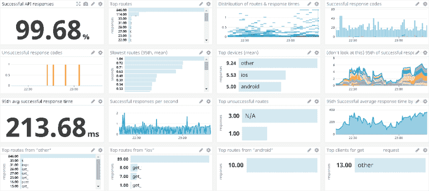
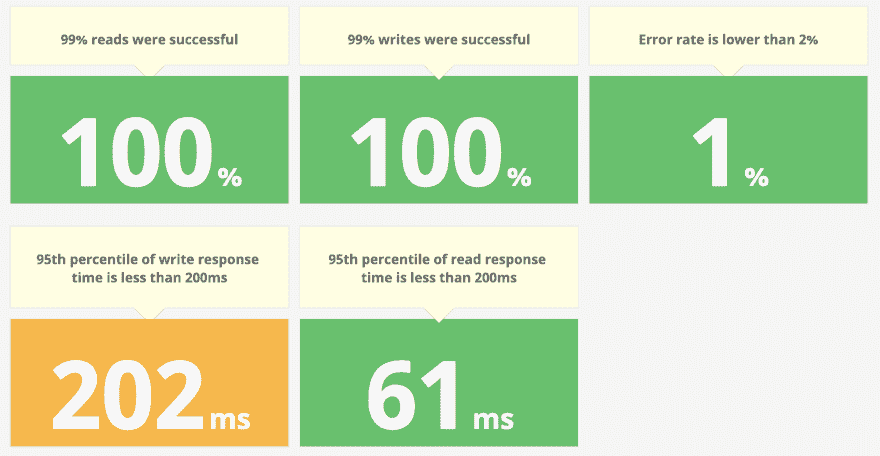

# 追踪一个指标为我打开了一个全新的世界

> 原文：<https://dev.to/donis/tracking-one-metric-opened-a-whole-new-world-for-me-eeb>

在跟踪了一个指标之后，我现在知道了关于我的 API 的这些事情:

*   发出了多少成功的请求
*   哪些端点最常用
*   我的 API 在某些时候的负载有多重
*   不成功响应的数量以及它们是什么代码
*   哪些端点速度较慢
*   顶级 API 客户端设备
*   服务器的性能
*   API 响应时间的各种缩减(按客户端、按端点)
*   每秒请求数
*   顶级错误端点

它看起来像这样:

[](https://res.cloudinary.com/practicaldev/image/fetch/s--8WdF5s6G--/c_limit%2Cf_auto%2Cfl_progressive%2Cq_auto%2Cw_880/https://donis.github.io/asseimg/posts/2019-02-20-monitoring/example-overview-afe7c7bb-30c4-4888-bfc5-ee94af1a1d2a.PNG)

这是信息的源泉！看看那些漂亮的图表💖

怎么会？我跟踪的获取所有上述信息的唯一指标由下面的 PHP 代码表示:

```
 $metric->duration('api.response', [
        'route' => $request->getAttribute('route'),
        'code' => $response->getStatusCode(),
        'client-agent' => $request->getAttribute('client-agent'),
        'successful' => $response->getStatusCode() < 400 ? 'true' : 'false',
        'environment' => 'production',
        'webserver' => 'web-1'
    ], $request->getAttribute('startTime')); 
```

看起来简单，实现起来很快？是的，但我会试着解释这一切意味着什么。

如果你对 SRE(站点可靠性工程)略知一二，你可能已经明白，它涵盖了成功监控的主要“黄金信号”——延迟、流量和错误率。

## 免责声明

我不是一个好作家，也不是一个好老师，但我希望有人会发现这很有用。如果你能抽出几分钟写一些反馈——积极的或消极的——这将有助于我的学习，谢谢！

我使用 [Datadog](https://www.datadoghq.com/) 作为一种度量服务，因为它是一种受管理的 SaaS，非常好用，我也很了解它。我是顾客，不隶属于他们。我在文章的最后提到了一些替代服务。

PHP 只是一个例子，同样的事情也可以很容易地用其他语言来完成。

我只关注一个 API，但可能性是无限的，以此为灵感。

本文中没有实现细节，我将尝试在最后链接到参考资料来帮助您。

## 为什么我希望我的团队和我的雇主采用指标？

我曾经认识到，假设是所有糟糕决策的根源。项目的大小无关紧要——度量揭示了一个全新的可见层，并允许避免假设。对我来说——要做出一个好的决定，决定如何区分我的工作的优先次序，在哪里首先归还技术债务，或者我的项目的哪些部分更容易改变——非常重要的是，我手中有一些数据作为基础。我想知道部署新版本的代码后会发生什么。它会破坏响应吗？它会让每个人都慢下来吗？想知道我发布的这个新功能有没有用！不是吗？这给了我一种成就感——“是的，这行得通，任务完成了，我可以继续前进了！”。

如果我的雇主没有某种形式的自动化部署，拥有度量标准将是更频繁的特性交付和自动化部署的第一步。这是一个即时反馈循环——部署发生了，指标显示了一堆 500，ups，回滚启动了，没有更多 500，每个人都很高兴。客户甚至可能会把这段不工作的时间当成一个小问题。我不喜欢客户给我在呼叫中心的同事打电话，告诉他们我负责的项目没有成功。这意味着我工作失败了！拥有指标有助于我和我的团队在工作中取得成功。

一旦我不得不遵守只在特定时间或特定日期部署的规则，我讨厌这些规则！周五不部署，16:00 后不部署-听起来熟悉吗？这都是因为恐惧和不确定性，如果有什么东西坏了，客户将无法联系到任何人，系统将暂停，直到第二天早上，或者更糟，在周末。当我有指标时——我有关于系统健康状况的即时反馈回路。如果我在周五 17:00 部署的更改破坏了某些东西，我只需恢复，再次部署，看到我的应用程序环境指标是绿色的，然后过一个愉快的周末。这种即时反馈循环让我可以更频繁地部署，并将那些愚蠢的规则扔进垃圾桶。

警告，强烈意见。如果团队，或者我的雇主，对他们所负责的事情没有任何度量标准，他们就失去了控制。也许有一种控制的错觉，但它是由假设、客户的某种反馈和直觉创造的。在没有任何数据支持决策的情况下，你如何专注于公司发展中最重要的事情？

我曾经遇到过这样的情况——我们的团队花了好几个月的时间来构建这个出色的特性，项目经理很兴奋，所有者也很兴奋和兴奋。但是没有“小步骤”的概念，没有 MVP 或 A/B 测试，来实际验证这个想法是否值得投资。完成后，部署它，并高兴它的工作，我们拍了拍对方的背，并继续致力于下一个大功能，我们统治世界。几个月后，我们的项目得到了一些度量，所以我们终于可以看到我们大肆宣传和努力工作的特性是如何被实际使用的！令我们瞠目结舌的是——它完全被遗忘了，没有顾客关心它。我们是盲目的，以为一切都很好。

## 人不可貌相

拥有度量标准有一个很大的问题。很容易让他们进来，把数据绘制成可爱的图表，但他们可能会对你撒谎。这里有一个例子——我认为我们的 API 客户端设备是这样划分的——60%是 Android，30%是 iOS，剩下的 10%是桌面。当我得到指标时，它向我展示了一个完全不同的画面，60%是桌面，30%是 iOS，10%是 Android。我惊讶地发现，它与我的假设和收集的知识如此不同。

经过更深入的分析，我明白了并不是所有的客户端都同等地进行 API 调用。我必须确保我得到了这个特殊的图表，并从更具体的数据中绘制出来——通过得到一个 API 端点，我很确定，所有平台调用它的次数都是相同的。在那之后，我得到了正确的信息，作为一个新的问题，为什么会有这么大的不同？

给几天，最好是几周的时间让指标流入是非常重要的。它给了我一整个跨度的不同时间框架来分析和解释数据，发现奇怪的信息，如设备百分比。我可以看出工作日和周末使用，白天和晚上使用的区别。当我有疑问时，我可以和我的同事一起验证我所看到的，拥有一组更大的数据有助于我们双方理解趋势。如果你认为你将根据你将收集的指标作出一些决定，在作出重大决定之前，一定要与其他来源的数据(如果你有的话)和同行仔细核对你所看到的，并调整图表以反映现实。

关于如何在图表上绘制数据有不同的方法，Datadog 有关于它的好文章。例如，您可以将响应时间绘制为平均值，但实际上，您有非常快的端点和一些非常慢的端点。这些离群值会产生一种“还好”的错觉。如果你把第 95 个百分位数或者那些离群值从图表中完全排除，只为他们制作单独的图表，这将反映真实的生活情况。

## 表现

我打赌你有一个问题，特别是如果你在一个更大的项目上工作——它将如何影响被监控的项目的性能？我给 Datadog 发送的最多的数据是大约一百个不同的指标，每个请求至少有 5-8 个标签。Datadog 代理建立在 [statsd 项目](https://github.com/statsd/statsd)之上，该项目使用 UDP 网络工作，UDP 网络不如 TCP 可靠，但速度极快。火&基本上忘记了。在后台，在 Datadog 的情况下，有一个代理正在运行，它聚合信息并以可定制的时间间隔将其发送到服务器。这对请求性能的影响可以忽略不计。

当度量的数量增加时——代理可能需要单独的 CPU 内核来处理所有的聚合，所以如果确实有大量的度量被发送，您可能需要一个更强大的 CPU 实例。

在指标发送和显示在图表上之间肯定有延迟。它不是很大，比如 15-30 秒左右，只有在样本流量非常低的情况下才会令人讨厌。

## data dog 的替代品

有许多很棒的工具可以帮助你开始度量！很久很久以前，我使用过 cacti，Zabbix，我运行过 ELK stack 和 Graphite + Grafana 设置。但是最近，我爱上了数据狗。这是一项托管服务，安装速度非常快，您可以在几分钟内发送指标。它也不太贵，但是如果使用得当，价值是巨大的！如果这不符合你的条件，这里有一些可供探索和选择的选择:

*   普罗米修斯 + [格拉夫纳](https://grafana.com/) -我知道[拉斐尔·多姆斯](https://twitter.com/rdohms)谈到过
*   监控的鼻祖之一
*   [石墨](https://graphiteapp.org/)(与[格拉法纳](https://grafana.com)一起)
*   [Librato 又名网络安全管理软件产品阿波罗](https://www.appoptics.com/)
*   [InfluxDB & TICK 栈](https://www.influxdata.com/)

可能还有更多，但是，唉，我只知道这么多。

## SRE 怎么样？

网站可靠性工程是一个非常大的话题，我找到的最好的阅读资源是谷歌。他们发明了它。他们的 SRE 书籍帮了大忙。为了支持本文，第[章服务水平目标](https://landing.google.com/sre/sre-book/chapters/service-level-objectives/)是必读内容。它帮助我了解我应该如何使用从指标中收集的数据。服务水平目标和服务水平指标听起来像是胡言乱语，但是如果定义正确，它们提供了我的系统的最佳概览。

我总是试图设定这样的目标，从屏幕上看一眼就能描述我的 API 有多健康。在下面的仪表板示例中，即使没有阅读标题，您也可以看到这里有些地方开始出错了。

[](https://res.cloudinary.com/practicaldev/image/fetch/s--7ry0PUeY--/c_limit%2Cf_auto%2Cfl_progressive%2Cq_auto%2Cw_880/https://donis.github.io/asseimg/posts/2019-02-20-monitoring/Screenshot2019-02-20at20-08614b38-64c1-4a30-941b-36f2b1e65b28.32.10.png)

如果系统大得多，SLIs 可以聚合到更小的盒子中，但也可以在不同的团队之间分开。当然，我假设贵公司的多个团队负责不同的大领域。因此，你可以有支付仪表板，订单仪表板，内容仪表板和类似的，每一个都将监测自己的 SLIs 最重要的事情，将说，如果他们的系统部分是健康的或不健康的。

我喜欢这些屏幕！我们每个团队都有一个监视器，他们所有人都有一个这样的仪表板，用于他们负责的系统。在办公室里走动，我可以看到谁有问题，我不应该在哪里介入快速聊天，但也许我应该提供我的帮助。

## 报警，报警，报警！

我有指标，我有定义的 SLIs，我所缺少的是消除我的[警报疲劳](https://en.wikipedia.org/wiki/Alarm_fatigue)从所有无用的“web1 上的 CPU 负载> 60%”或“网络速率是> 85MB/s！”。我们的一些警报每天都会被触发多次，它们会自行修复。在发出的 26 个监控警报中，有 26 个已经自行解决，没有一个影响我的系统。如果你忽略了一个警报-这不是一个警报，停止发射它。

通过使用我在本文开始时定义的同一个指标，我定义了一些 sli 来恰当地代表我的终端用户正在经历的事情。我在屏幕上看到黄框和红框，所以也许这些也应该是在晚上叫醒我的警报？

是啊！如果我的 SLIs 不满意，警报将进入我的团队 slack 频道。我相信这是一个难得的机会，也是一个重要的行动依据。如果事情真的发生了——例如，成功读取率低于 70%,错误率增加到 10%以上——那么它会 ping 到[page duty 服务](https://www.pagerduty.com/),然后它会唤醒某人对此采取行动。

## 小力气，大胜利

这个指标让我对我正在做的事情有了一个非常不同的视角。它很容易就开始了——一些包依赖项和几行代码覆盖了项目的最大范围——HTTP 请求。

我对我的 API 是如何被使用的以及它在生产中的表现有了大量的了解。

我找到了一种简单的方法来定义基本服务水平目标*和*并主动监控它们。

我从松弛的通道中摆脱了警报疲劳，用代表终端用户问题的警报来代替它们。

我爱它，我非常强烈地建议尝试同样的。

## 链接&资源

[Datadog 监控&分析服务](https://www.datadoghq.com/)

[谷歌 SRE 图书关于 SLOs 的章节](https://landing.google.com/sre/sre-book/chapters/service-level-objectives/)

[谷歌上关于 SRE 的视频](https://www.datadoghq.com/videos/solving-reliability-fears-with-service-level-objectives/)

[数据狗关于监控的系列文章 101](https://www.datadoghq.com/blog/monitoring-101-collecting-data/)

[关于如何在 Datadog 中绘制数据图表的文章](https://www.datadoghq.com/blog/timeseries-metric-graphs-101/)