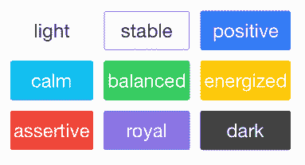
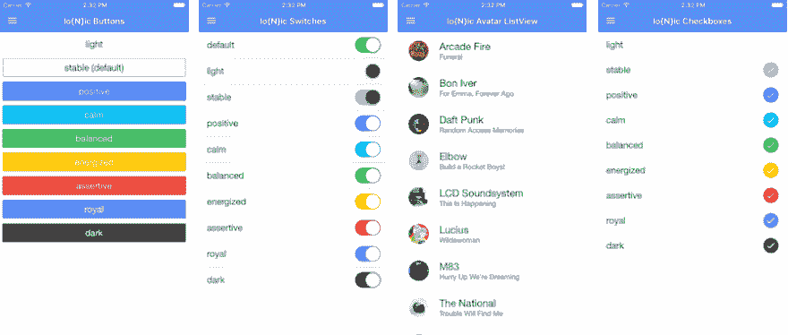

# 为 NativeScript 创建 Ionic 主题

> 原文：<https://dev.to/progress/creating-an-ionic-theme-for-nativescript-jo7>

世界各地的混合应用开发者都非常了解 Ionic 框架提供的强大功能和美妙之处。Ionic 使得创建具有本地外观和感觉的混合移动应用程序变得容易。然而，对于许多场景，越来越需要提供真正的本地解决方案。因此，显然可以利用 Ionic 的 CSS 组件来为 [NativeScript](https://www.nativescript.org/) 添加一些风格，这是 Progress 的开源框架，用于使用 JavaScript 开发真正的原生跨平台应用。

## 但是 CSS 不就是为 Web 打造的吗？

谁不怀念`<font face='Verdana' color='green'>Hello World!</font>`的日子？那是什么？没人吗？许多年前，CSS 引入了一种新的范式，提供了一种(相对)简单的方法来为我们的 web 属性开发和维护一致的样式。虽然它也不是没有批评者——因此兴起了[萨斯](http://sass-lang.com/)和[少](http://lesscss.org/)——CSS 仍然是我们设计网站和混合移动应用的方式。

这就是为什么当 NativeScript 团队需要实现一种方式来设计应用程序时，CSS 是一个明确的选择。对于身兼多职的开发人员来说，没有什么比在学习新技术时能够重用现有技能更好的了。通过实现 CSS 的子集，NativeScript 开发人员可以使用 CSS 选择器作为类型、类和 id，还可以使用 CSS 属性，如`margin`、`padding`、`color`、`border-width`等等。

> 查看一下 NativeScript 文档，获得支持的 CSS [选择器](https://docs.nativescript.org/ui/styling#supported-selectors)和[属性](https://docs.nativescript.org/ui/styling#supported-properties)的列表。

默认情况下，NativeScript 为 iOS 和 Android 生成真正的原生 UI 元素。无意冒犯苹果和谷歌，但是开箱即用，原生应用程序并不都那么漂亮！但是由于 NativeScript CSS 实现，我们可以做很多事情。

## 爱奥尼亚的美丽和天生的力量

虽然 Ionic 最出名的是一个混合应用程序框架，但它也因其 CSS 组件和华丽的调色板而闻名:

[](https://res.cloudinary.com/practicaldev/image/fetch/s--MUa1QKLr--/c_limit%2Cf_auto%2Cfl_progressive%2Cq_auto%2Cw_880/https://raw.githubusercontent.com/rdlauer/articles/master/nativescript/ionic-nativescript/ionic-colors.png)

将这与一个与 Angular 或 Vue.js 一起工作的 JavaScript 框架结合起来，很容易理解为什么 Ionic 和 [Kendo UI](http://www.telerik.com/kendo-ui) 在 web 和移动开发中很受欢迎。

进行本地化的优势是显而易见的，所以我们最好的选择是利用一个框架，让我们利用我们已经拥有的技能来创建原生应用程序。输入 NativeScript:

NativeScript 是一个强大的 JavaScript 框架，允许您使用您已经知道的技能(JavaScript/TypeScript、CSS、XML for markup 以及可选的 Angular 或 Vue.js)来构建应用程序。

> 想开始使用 NativeScript 吗？查看[入门指南](http://docs.nativescript.org/start/getting-started)。

当我们能够将 Ionic 和 NativeScript 的精华结合起来时，这种情况就不必非此即彼了！

[](https://res.cloudinary.com/practicaldev/image/fetch/s--YEYMgR-y--/c_limit%2Cf_auto%2Cfl_progressive%2Cq_auto%2Cw_880/https://raw.githubusercontent.com/rdlauer/articles/master/nativescript/ionic-nativescript/ionic-examples.png)

## Ionic+native script = Io { N } IC

还有什么比将 Ionic 的美丽与 NativeScript 的强大相结合更好的方式来让现有的 web 和混合开发人员看到迁移到原生技术是多么容易呢！因此，一个受 Ionic 启发的针对 NativeScript 的 CSS 主题诞生了！

例如，简单地使用简单的 CSS 类定义如下:

```
 .slider-balanced {
        background-color: #33cd5f;
    }

    .tns-ionicon-large {
        font-family: "Ionicons";
        font-size: 26;
    } 
```

Enter fullscreen mode Exit fullscreen mode

...并将它们应用到类似这样的 NativeScript UI 元素:

```
 <label text="balanced" class="input-label" />
    <grid-layout columns="24, *, 30" rows="auto">
        <label text="&#xf272;" col="0" class="tns-ionicon-large" />
        <slider value="50" maxValue="100" minValue="0" col="1" class="slider-balanced"/>
        <label text="&#xf26a;" col="2" class="tns-ionicon-large right" />
    </grid-layout> 
```

Enter fullscreen mode Exit fullscreen mode

...我们在设备上获得了完全风格化的原生 UI 元素，并使用了 Ionic 的字体图标:

[](https://res.cloudinary.com/practicaldev/image/fetch/s--n6l8fuhi--/c_limit%2Cf_auto%2Cfl_progressive%2Cq_auto%2Cw_880/https://raw.githubusercontent.com/rdlauer/articles/master/nativescript/ionic-nativescript/ionic-slider.png)

## 比特

**你可以在 GitHub 上找到[完整回购。](https://github.com/rdlauer/nativescript-ionic)**当然，它是开源的，所以请随意下载、投诉和/或投稿！

虽然您会发现附带的`app.css`文件故意显得冗长，但您可能会惊讶地发现，使用您今天已经知道的 CSS 技术，您可以用很少的代码来设计一个原生应用程序。尽情享受吧！