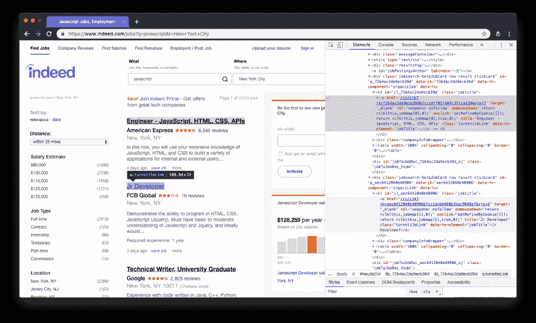
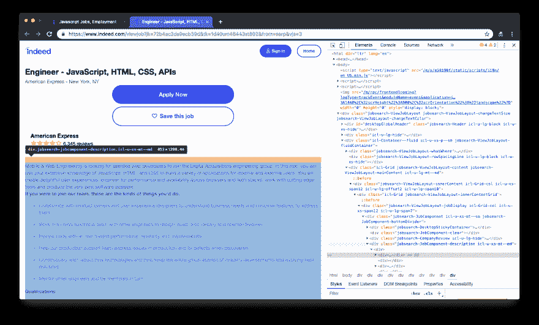
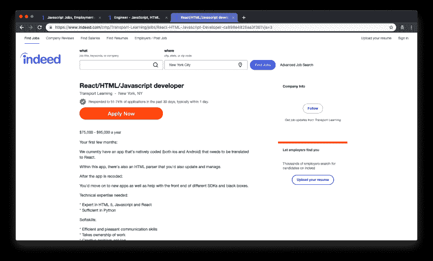

# 使用 Python 进行 Web 抓取演练

> 原文：<https://dev.to/awwsmm/web-scraping-walkthrough-with-python-85c>

# 第一步

*网页抓取*是从网页的源代码中提取数据的过程，而不是通过该网页所有者公开的 API。起初这可能有点棘手，但它允许你轻松地从网上提取和组织大量信息，而不必手动复制和粘贴*任何东西*。

今天为了做一些基本的网络抓取，我将使用 Python 库`BeautifulSoup`。如果你以前没有用过这个软件包，你需要安装它。最简单的方法是使用 Python 包管理器`pip`。首先，通过安装一个库来检查你的机器上是否有`pip`:

```
$ pip install beautifulsoup4 
```

Enter fullscreen mode Exit fullscreen mode

如果你有 Python 但是没有`pip`(如果上面抛出一个错误)，使用[在这里找到的指令](https://pip.readthedocs.io/en/stable/installing/)自行安装`pip`。macOS 和大多数 Linux 发行版默认自带 Python，但如果你在 Windows 上，需要安装 Python，[试试官网](https://www.python.org/downloads/windows/)。

自 2020 年 1 月 1 日起，Python 2.7 已被弃用，所以最好还是使用 Python 3(如果你还没有的话)。我还没有 Python 3(因为不久前我刚在工厂重置了我的 Mac 电脑)，所以我先用 T2 的这些指令 T3 来安装它，这些指令本质上可以归结为 T4

```
$ brew install python 
```

Enter fullscreen mode Exit fullscreen mode

现在，我们可以检查 Python 2 和 Python 3 是否都已安装，以及`pip`是否与 Python 3:
一起安装

```
$ python --version
Python 2.7.10

$ python3 --version
Python 3.7.2

$ pip --version
-bash: pip: command not found

$ pip3 --version
pip 19.0.2 from /usr/local/lib/python3.7/site-packages/pip (python 3.7) 
```

Enter fullscreen mode Exit fullscreen mode

最后，让我们用`pip3` :
得到`BeautifulSoup`

```
$ pip3 install beautifulsoup4 
```

Enter fullscreen mode Exit fullscreen mode

注意，此时，您可以使用带有`python3`命令的“普通”Python 解释器，或者您可以通过安装
来使用功能更丰富的 [IPython](https://ipython.org/index.html)

```
$ pip3 install ipython 
```

Enter fullscreen mode Exit fullscreen mode

在本教程中，我将使用 IPython。

# 初步研究

我做这个项目的动机是，我想根据[甚至](https://www.indeed.com/)和类似网站上的招聘信息，创建一个特定领域特定级别开发人员的“平均档案”。虽然做这样的事情有点复杂，可能会涉及到一些[正则表达式](https://dev.to/awwsmm/the-power-of-regular-expressions-30in)，但一个好的起点是简单地看看某项技术在招聘信息中出现的频率:被提及次数越多=越重要，对吗？

`BeautifulSoup`允许您按类型、`id`、`class`等访问页面的 XML / HTML 标签。例如，你可以提取所有的`<a>`标签，或者用特定的`class`获取所有`<p>`标签的文本。因此，为了以常规方式提取数据，我们需要剖析我们想要抓取的页面的结构。让我们从搜索纽约市的 JavaScript 开发人员开始:

[](https://res.cloudinary.com/practicaldev/image/fetch/s--tthj6wMy--/c_limit%2Cf_auto%2Cfl_progressive%2Cq_auto%2Cw_880/https://thepracticaldev.s3.amazonaws.com/i/v8o6rb5rmsxhgz26km5n.png)

请注意此网页的 URL:

> [https://www.indeed.com/jobs?q=javascript+developer&l =纽约+纽约+城市](https://www.indeed.com/jobs?q=javascript+developer&l=New+York+City)

如果我们转到结果的第二页，它会变成:

> [https://www.indeed.com/jobs?q=javascript+developer&l =纽约+纽约+城市& start=10](https://www.indeed.com/jobs?q=javascript+developer&l=New+York+City&start=10)

...第三页的结果是:

> [https://www.indeed.com/jobs?q=javascript+developer&l =纽约+纽约+城市& start=20](https://www.indeed.com/jobs?q=javascript+developer&l=New+York+City&start=20)

对，所以每页有 10 个结果，第一页之后的每一页在 URL 中都有一个额外的参数:`&start=...`，其中`...`是 10 的正倍数。(事实证明，我们可以将`&start=0`附加到第一页的 URL，它会返回相同的结果。)好，我们知道如何访问结果页面...下一步是什么？我们检查一下第一个结果页面的结构如何:

[](https://res.cloudinary.com/practicaldev/image/fetch/s--AKCN4Yxw--/c_limit%2Cf_auto%2Cfl_progressive%2Cq_auto%2Cw_880/https://thepracticaldev.s3.amazonaws.com/i/ge56r0i6gx9nbrror5w2.png)

我注意到的一件事是，每个招聘广告的链接似乎都有一个`onmousedown`，它的变化是可以预测的。第一个是

```
onmousedown="return rclk(this,jobmap[0],0);" 
```

Enter fullscreen mode Exit fullscreen mode

...第二个是

```
onmousedown="return rclk(this,jobmap[1],0);" 
```

Enter fullscreen mode Exit fullscreen mode

...诸如此类。我敢打赌，我们可以将所有带有包含“`return rclk(this,jobmap[`”的`onmousedown`的`<a>`标签拉出来，这将为我们提供该页面上列出的所有工作的所有链接。现在让我们把它放在后面的口袋里，打开这些广告中的一个——让我们看看是否能找出这些页面中的工作规范:

[](https://res.cloudinary.com/practicaldev/image/fetch/s--FVHvbDFw--/c_limit%2Cf_auto%2Cfl_progressive%2Cq_auto%2Cw_880/https://thepracticaldev.s3.amazonaws.com/i/t8hfvbytdrsk2v3phb7v.png)

看起来广告的主体包含在一个带有`class="jobsearch-JobComponent-description"`的`<div>`中。这听起来像是一个非常具体的`div`。我将继续假设每一页都是一样的，但是你可以检查一下。所以现在我们知道了我们想要访问的 URL 的结构，如何在那些页面上找到工作广告的链接，以及广告的文本包含在那些子页面中的什么地方，我们就可以构建一个 web 抓取脚本了！

# 建筑铲运机

让我们从搜索页面开始。我们的 URL 看起来会像:

```
https://www.indeed.com/jobs?q=javascript&l=New+York+City&start= 
```

Enter fullscreen mode Exit fullscreen mode

...但是我们需要在末尾追加一个 10 的非负倍数。在 Python 中，一个简单的方法是创建一个`range`循环:

```
In [91]: for pageno in range(0,10): 
    ...:     search = "https://www.indeed.com/jobs?q=javascript&l=New+York+City&start=" + str(10*pageno) 
    ...:     print(search) 
    ...:                                                                                                                                           
https://www.indeed.com/jobs?q=javascript&l=New+York+City&start=0
https://www.indeed.com/jobs?q=javascript&l=New+York+City&start=10
https://www.indeed.com/jobs?q=javascript&l=New+York+City&start=20
...
https://www.indeed.com/jobs?q=javascript&l=New+York+City&start=90 
```

Enter fullscreen mode Exit fullscreen mode

看起来不错！注意，我们必须用 Python 的`str()`方法将整数转换成字符串。

我们真正想做的是访问这些页面并提取它们的内容。我们可以用 Python 的`urllib`模块来实现——特别是`urllib.request.urlopen()`(仅限[Python 3](https://docs.python.org/2/library/urllib.html))。然后，我们可以通过简单地调用`BeautifulSoup`构造函数来解析带有`BeautifulSoup`的页面。为了测试这一点，让我们暂时将循环范围缩小到一页，并用`soup.prettify()` :
打印该页的内容

```
In [100]: for pageno in range(0,1): 
     ...:     search = "https://www.indeed.com/jobs?q=javascript&l=New+York+City&start=" + str(10*pageno) 
     ...:     url = urllib.request.urlopen(search) 
     ...:     soup = BeautifulSoup(url) 
     ...:     print(soup.prettify()[:500]) 
     ...:                                                                                                                                          
<!DOCTYPE html>
<html dir="ltr" lang="en">
 <head>
  <meta content="text/html;charset=utf-8" http-equiv="content-type"/>
  <script src="/s/a3599cf/en_US.js" type="text/javascript">
  </script>
  <link href="/s/97464e7/jobsearch_all.css" rel="stylesheet" type="text/css"/>
  <link href="http://rss.indeed.com/rss?q=javascript&amp;l=New+York+City" rel="alternate" title="Javascript Jobs, Employment in New York, NY" type="application/rss+xml"/>
  <link href="/m/jobs?q=javascript&amp;l=New+York+City" m 
```

Enter fullscreen mode Exit fullscreen mode

我使用[字符串切片](https://stackoverflow.com/questions/663171/is-there-a-way-to-substring-a-string)对输出进行了修整，将其限制在 500 个字符以内(该页面的源代码相当长)。您可以在这个简短的片段中看到我们最初的搜索:`q=javascript&amp;l=New+York+City`。

太好了！所以，这似乎是可行的。现在让我们使用`select()`来抓取该页面上的所有招聘广告链接。请记住，我们正在寻找所有带有包含“T3”的“T2”的“T1”标签。我们必须使用一种特殊的语法来达到那个结果，请看下面:

```
In [102]: for pageno in range(0,1): 
     ...:     search = "https://www.indeed.com/jobs?q=javascript&l=New+York+City&start=" + str(10*pageno) 
     ...:     url = urllib.request.urlopen(search) 
     ...:     soup = BeautifulSoup(url) 
     ...:      
     ...:     for adlink in soup.select('a[onmousedown*="return rclk(this,jobmap["]'): 
     ...:         subURL  = "https://www.indeed.com" + adlink['href'] 
     ...:         print(subURL) 
     ...:                                                                                                                                          
https://www.indeed.com/rc/clk?jk=43837af9ab727a8b&fccid=927356efef1f3075&vjs=3
https://www.indeed.com/rc/clk?jk=6511fae8b53360f1&fccid=f057e04c37cca134&vjs=3
https://www.indeed.com/company/Transport-Learning/jobs/React-HTML-Javascript-Developer-ca898e4825aa3f36?fccid=6b6d25caa00a7d0a&vjs=3
...
https://www.indeed.com/rc/clk?jk=9a3a9b4a4cbb3f28&fccid=101a2d7616184cc8&vjs=3 
```

Enter fullscreen mode Exit fullscreen mode

我们将“[https://www.indeed.com](https://www.indeed.com)”附加到每个链接的开头，因为在页面的源代码中，所有的`href`都是相对的。如果我们抓取其中一个链接(比如第三个)并将其粘贴到浏览器中，我们应该有希望得到一个招聘广告:

[](https://res.cloudinary.com/practicaldev/image/fetch/s--MOv8rZHf--/c_limit%2Cf_auto%2Cfl_progressive%2Cq_auto%2Cw_880/https://thepracticaldev.s3.amazonaws.com/i/8zltt83scic4smzp30rw.png)

...看起来不错！好吧，接下来呢？嗯，我们想再次用`BeautifulSoup`打开这些子页面并解析源代码。但是这一次，我们想要寻找带有包含`jobsearch-JobComponent-description`的`class`的`<div>` s。因此，让我们再次使用字符串切片，打印第一个，比如说，每个页面的 50 个字符，只是为了确保所有这些 URL 都工作:

```
In [103]: for pageno in range(0,1): 
     ...:     search = "https://www.indeed.com/jobs?q=javascript&l=New+York+City&start=" + str(10*pageno) 
     ...:     url = urllib.request.urlopen(search) 
     ...:     soup = BeautifulSoup(url) 
     ...:      
     ...:     for adlink in soup.select('a[onmousedown*="rclk(this,jobmap"]'): 
     ...:         subURL  = "https://www.indeed.com" + adlink['href'] 
     ...:         subSOUP = BeautifulSoup(urllib.request.urlopen(subURL)) 
     ...:         print(subSOUP.prettify()[:50]) 
     ...:                                                                                                                                          
<html dir="ltr" lang="en">
 <head>
  
   Ne
<html dir="ltr" lang="en">
 <head>
  
   Re
<html dir="ltr" lang="en">
 <head>
  
   Re
...
<html dir="ltr" lang="en">
 <head>
  
   Ni 
```

Enter fullscreen mode Exit fullscreen mode

又来了，太好了！目前一切正常。接下来要做的事情是尝试提取每个广告的正文。让我们在`select()`中使用相同的`*=`语法，我们以前在这些子页中使用它来寻找`<div>`，这些子页有一个包含`jobsearch-JobComponent-description` :
的`class`属性

```
In [106]: for pageno in range(0,1): 
     ...:     search = "https://www.indeed.com/jobs?q=javascript&l=New+York+City&start=" + str(10*pageno) 
     ...:     url = urllib.request.urlopen(search) 
     ...:     soup = BeautifulSoup(url) 
     ...:      
     ...:     for adlink in soup.select('a[onmousedown*="rclk(this,jobmap"]'): 
     ...:         subURL  = "https://www.indeed.com" + adlink['href'] 
     ...:         subSOUP = BeautifulSoup(urllib.request.urlopen(subURL)) 
     ...:          
     ...:         for desc in subSOUP.select('div[class*="jobsearch-JobComponent-description"]'): 
     ...:             print(desc.get_text()[:50]) 
     ...:                                                                                                                                          
Impact

Ever wondered how Amazon offers the Earth'
Mobile & Web Engineering is looking for talented w
Job Description

We are looking for a talented Fro
$75,000 - $95,000 a yearYour first few months:We c
Michael Kors is always interested in hearing from 
Facebook's mission is to give people the power to 
$70,000 - $80,000 a yearWe Make Websites are the g
InternshipApplications are due by June 27, 2019 at
Job Overview:

UI Developer should have a very goo
* THIS IS A REMOTE POSITION *

At Dental Intellige 
```

Enter fullscreen mode Exit fullscreen mode

`BeautifulSoup.select()`返回与我们提供的搜索参数相匹配的 HTML / XML 标签。我们可以用括号符号从那些标签中提取属性(如在`adlink['href']`中)，我们可以用`get_text()`提取包含在开始和结束标签中的文本(例如，在`<p>`和`</p>`之间)，如我们上面所做的。`subSOUP.select()`语句返回一个由`<div>`标签组成的列表，其中的`class`属性包含子串“`jobsearch-JobComponent-description`”，然后我们使用一个`for ... in`循环来获取列表中的每个`<div>`(只有一个)并打印包含在`<div>`中的文本...`</div>`同`get_text()`。

结果就是这个乱糟糟的文字列表。这没有任何意义，因为我们只在 50 个字符后就切断了每个描述。但是现在我们有了全功能的工作广告刮板！我们只需要想出如何处理这些结果来完成我们的任务。

# 整理你的网页

最简单的方法就是列出我们感兴趣的关键词。我们来看看各种 JavaScript 框架的流行程度。怎么样:

```
frameworks = ['angular', 'react', 'vue', 'ember', 'meteor', 'mithril', 'node', 'polymer', 'aurelia', 'backbone'] 
```

Enter fullscreen mode Exit fullscreen mode

...这可能是一个好的开始。如果你熟悉像这样处理文本数据，你会知道我们必须将所有内容都转换成小写，以避免“反应”和“反应”之间的歧义，我们必须删除标点符号，这样我们就不会将“角度”和“角度”视为两个独立的事物，我们可以使用`split()`轻松地将这些文本拆分成空格上的记号。我们先把每个广告的文字拆分一下，把每个单词都转换成小写，看看我们的单词列表是什么样子:

```
In [110]: for pageno in range(0,1): 
     ...:     search = "https://www.indeed.com/jobs?q=javascript&l=New+York+City&start=" + str(10*pageno) 
     ...:     url = urllib.request.urlopen(search) 
     ...:     soup = BeautifulSoup(url) 
     ...:      
     ...:     for adlink in soup.select('a[onmousedown*="rclk(this,jobmap"]'): 
     ...:         subURL  = "https://www.indeed.com" + adlink['href'] 
     ...:         subSOUP = BeautifulSoup(urllib.request.urlopen(subURL)) 
     ...:          
     ...:         for desc in subSOUP.select('div[class*="jobsearch-JobComponent-description"]'): 
     ...:             words = desc.get_text().lower().split()[:50] 
     ...:             for word in words: 
     ...:                 print(word) 
     ...:                                                                                                                                          
mobile
&
web
engineering
is
looking
for
talented
web
developers
to
join
the
digital
acquisitions
engineering
group.
... 
```

Enter fullscreen mode Exit fullscreen mode

...诸如此类。我们来挑出一些怪异的:

```
group.
role,
summary:
recoded:you'd
limitless.we
react.within 
```

Enter fullscreen mode Exit fullscreen mode

...对，所以我们必须在空格上分开，还有`.`、`,`和`:`。在列表的其他地方，我们有:

```
2.0-enabled 
```

Enter fullscreen mode Exit fullscreen mode

当然，这将会因为在`.`分裂而受损，但我认为这里的收益大于成本。我们也有很多像
这样的连字符单词

```
blue-chip
data-driven,
hyper-personalized,
go-to
team-based
e-commerce 
```

Enter fullscreen mode Exit fullscreen mode

...因此，我们可能不应该分裂的连字符或破折号。然而我们有一两个

```
trends/development
qa/qc 
```

Enter fullscreen mode Exit fullscreen mode

...所以我们也想在`/`分开。最后，我们对诸如
这样的错别字无能为力

```
analystabout
part-timeat
contractlocation:
yearyour 
```

Enter fullscreen mode Exit fullscreen mode

...目前，所以我们将不得不离开这些。为了使这个解决方案更加健壮，我们希望在多个分隔符上进行分割，而不仅仅是空格字符。所以我们需要 Python 的正则表达式库`re` :

```
In [110]: import re

In [111]: for pageno in range(0,1): 
     ...:     search = "https://www.indeed.com/jobs?q=javascript&l=New+York+City&start=" + str(10*pageno) 
     ...:     url = urllib.request.urlopen(search) 
     ...:     soup = BeautifulSoup(url) 
     ...:      
     ...:     for adlink in soup.select('a[onmousedown*="rclk(this,jobmap"]'): 
     ...:         subURL  = "https://www.indeed.com" + adlink['href'] 
     ...:         subSOUP = BeautifulSoup(urllib.request.urlopen(subURL)) 
     ...:          
     ...:         for desc in subSOUP.select('div[class*="jobsearch-JobComponent-description"]'): 
     ...:             words = re.split("[ ,.:/]", desc.get_text().lower())[:50] 
     ...:             for word in words: 
     ...:                 print(word) 
     ...:                                                                                                                                          
impact

ever
wondered
how
amazon
offers
the
earth's
biggest
selection
and
still
... 
```

Enter fullscreen mode Exit fullscreen mode

没错。那么现在我们有哪些怪胎？

```
earth's

customers?
$75
000
-
$95
000
(both
ios
and
android)
facebook's
$70
000
-
$80
000
11
59pm
* 
```

Enter fullscreen mode Exit fullscreen mode

所以，还是有一些边缘情况。容易修复的方法包括从单词中删除尾随的`'s`，并在分隔符列表中添加`?`、`(`和`)`(以及空白字符，如`\n`、`\t`和`\r`)。(很明显，再快速浏览一下就会发现我们应该将`!`添加到分隔符列表中。)我们也可以忽略只有一个字符或更少的单词。解决时间(晚上 11:59)和薪水(70，000-80，000 美元)的问题要复杂一些，这里不做介绍。现在，我们就忽略这些。所以让我们来看看我们改进的刮刀:

```
In [121]: for pageno in range(0,1): 
     ...:     search = "https://www.indeed.com/jobs?q=javascript&l=New+York+City&start=" + str(10*pageno) 
     ...:     url = urllib.request.urlopen(search) 
     ...:     soup = BeautifulSoup(url) 
     ...:      
     ...:     for adlink in soup.select('a[onmousedown*="rclk(this,jobmap"]'): 
     ...:         subURL  = "https://www.indeed.com" + adlink['href'] 
     ...:         subSOUP = BeautifulSoup(urllib.request.urlopen(subURL)) 
     ...:          
     ...:         for desc in subSOUP.select('div[class*="jobsearch-JobComponent-description"]'): 
     ...:             words = re.split("[ ,.:/?!()\n\t\r]", desc.get_text().lower())[:50] 
     ...:             for word in words: 
     ...:                 word = word.strip() 
     ...:                 if word.endswith("'s"): 
     ...:                     word = word[:-2] 
     ...:                 if len(word) < 2: 
     ...:                     continue 
     ...:                 print(word) 
     ...: 
```

Enter fullscreen mode Exit fullscreen mode

漂亮！现在，我们能用它做什么呢？

# 见解

让我们将单词添加到词典中，而不是简单地打印单词列表。每当我们遇到一个新单词时，我们可以将它添加到我们的字典中，初始值为 1，每当我们遇到一个以前见过的单词时，我们可以递增它的计数器:

```
In [123]: counts = {} 
     ...:  
     ...: for pageno in range(0,1): 
     ...:     search = "https://www.indeed.com/jobs?q=javascript&l=New+York+City&start=" + str(10*pageno) 
     ...:     url = urllib.request.urlopen(search) 
     ...:     soup = BeautifulSoup(url) 
     ...:      
     ...:     for adlink in soup.select('a[onmousedown*="rclk(this,jobmap"]'): 
     ...:         subURL  = "https://www.indeed.com" + adlink['href'] 
     ...:         subSOUP = BeautifulSoup(urllib.request.urlopen(subURL)) 
     ...:         print("Scraping: " + subURL + "...") 
     ...:          
     ...:         for desc in subSOUP.select('div[class*="jobsearch-JobComponent-description"]'): 
     ...:             words = re.split("[ ,.:/?()\n\t\r]", desc.get_text().lower())[:50] 
     ...:             for word in words: 
     ...:                 word = word.strip() 
     ...:                 if word.endswith("'s"): 
     ...:                     word = word[:-2] 
     ...:                 if len(word) < 2: 
     ...:                     continue 
     ...:                 if word in counts: 
     ...:                     counts[word] += 1 
     ...:                 else: 
     ...:                     counts[word] = 1 
     ...:  
     ...: print(counts) 
     ...:                                                                                                                                          
Scraping: https://www.indeed.com/company/CypressG/jobs/Newer-Javascript-Framework-Developer-5a17b0475e76de26?fccid=dc16349e968c035d&vjs=3...
Scraping: https://www.indeed.com/company/Transport-Learning/jobs/React-HTML-Javascript-Developer-ca898e4825aa3f36?fccid=6b6d25caa00a7d0a&vjs=3...
Scraping: https://www.indeed.com/rc/clk?jk=a0727d28799f1dff&fccid=5d5fde8e5925b19a&vjs=3...
...
Scraping: https://www.indeed.com/rc/clk?jk=b084048e6a1b2727&fccid=5d5fde8e5925b19a&vjs=3...
{'$80': 1, '000': 8, '$250': 1, 'yeari': 1,... 
```

Enter fullscreen mode Exit fullscreen mode

我给用户添加了一个“刮擦”回显，这样我们就可以确定我们的脚本正在进行。请注意，结果字典是没有顺序的！如果我们想按值排序，有几种不同的方法可以做到这一点，但最简单的方法可能是把它变成一个元组列表，翻转键和值，这样我们就可以很容易地按键排序(特定单词出现的次数):

```
word_freq = [] 

for key, value in counts.items(): 
word_freq.append((value,key)) 

word_freq.sort(reverse=True) 
```

Enter fullscreen mode Exit fullscreen mode

我们按`reverse=True`排序，所以它是从高到低排序的，最常见的单词在列表的顶部。我们来看看结果:

```
[(19, 'to'), (13, 'and'), (12, 'the'), (11, 'for'), (9, 'of'), (9, 'is'), (6, 'we'), (6, 'in'), (6, '000'), (5, 'you')] 
```

Enter fullscreen mode Exit fullscreen mode

当然，我们之所以要挑出具体的词(像“有棱角的”、“有反应的”等。)是因为我们会得到一堆无用的填充词(像“to”、“and”等。)不然。让我们定义一个“好”字的列表，对照列表检查我们的`word`，只计算我们关心的那些。最后，我还将去掉我们用于调试的`[:50]`片段，并将我的搜索扩展到结果的前 100 页。下面是最终的剧本:

```
In [127]: counts = {} 
     ...: frameworks = ['angular', 'react', 'vue', 'ember', 'meteor', 'mithril', 'node', 'polymer', 'aurelia', 'backbone'] 
     ...: max_pages = 100 
     ...: ads_per_page = 10 
     ...: max_ads = max_pages * ads_per_page 
     ...:  
     ...: for pageno in range(0, max_pages): 
     ...:     search = "https://www.indeed.com/jobs?q=javascript&l=New+York+City&start=" + str(ads_per_page * pageno) 
     ...:     url = urllib.request.urlopen(search) 
     ...:     soup = BeautifulSoup(url) 
     ...:     this_page_ad_counter = 0 
     ...:      
     ...:     for adlink in soup.select('a[onmousedown*="rclk(this,jobmap"]'): 
     ...:         href = adlink['href'] 
     ...:         subURL  = "https://www.indeed.com" + href 
     ...:         subSOUP = BeautifulSoup(urllib.request.urlopen(subURL)) 
     ...:         ad_index = this_page_ad_counter + pageno*ads_per_page 
     ...:         print("Scraping (" + str(ad_index + 1) + "/" + str(max_ads) + "): " + href + "...") 
     ...:         this_page_ad_counter += 1 
     ...:          
     ...:         for desc in subSOUP.select('div[class*="jobsearch-JobComponent-description"]'): 
     ...:             words = re.split("[ ,.:/?()\n\t\r]", desc.get_text().lower()) 
     ...:             for word in words: 
     ...:                 word = word.strip() 
     ...:                 if word.endswith("'s"): 
     ...:                     word = word[:-2] 
     ...:                 if word.endswith(".js"): 
     ...:                     word = word[:-3] 
     ...:                 if word.endswith("js"): 
     ...:                     word = word[:-2] 
     ...:                 if len(word) < 2: 
     ...:                     continue 
     ...:                 if word not in frameworks: 
     ...:                     continue 
     ...:                 if word in counts: 
     ...:                     counts[word] += 1 
     ...:                 else: 
     ...:                     counts[word] = 1 
     ...:  
     ...: word_freq = []  
     ...:   
     ...: for key, value in counts.items():  
     ...:     word_freq.append((value,key))  
     ...:       
     ...: word_freq.sort(reverse=True) 
     ...:  
     ...: print(word_freq) 
     ...:                                                                                                                                          
Scraping (1/1000): /rc/clk?jk=72b4ac2da9ecb39d&fccid=f057e04c37cca134&vjs=3...
Scraping (2/1000): /company/Transport-Learning/jobs/React-HTML-Javascript-Developer-ca898e4825aa3f36?fccid=6b6d25caa00a7d0a&vjs=3...
Scraping (3/1000): /rc/clk?jk=9a3a9b4a4cbb3f28&fccid=101a2d7616184cc8&vjs=3...
... 
```

Enter fullscreen mode Exit fullscreen mode

我做了一些小的美学上的改变...你能看到他们在哪里吗？我也确保移除”。js”或“js ”,这样它们就不会被认为是独立的东西。我从脚本中删除了“幻数”10，并把它放在一个描述性变量(`ads_per_page`)中。此外，我创建了一个变量(`max_pages`)，该变量表示我应该只查看 100 页的结果，因此，我将总共查看在纽约地区的 Indeed 上发布的 1000 个最近的“Javascript”广告。

这要花点时间，所以我去喝点咖啡再回来...

* * *

...那么，结果是什么样的呢？

```
[(556, 'react'), (313, 'angular'), (272, 'node'), (105, 'vue'), (45, 'backbone'), (36, 'ember'), (4, 'polymer')] 
```

Enter fullscreen mode Exit fullscreen mode

所以，在刮出的 1000 个广告中，有 556 个提到了“react”，313 个提到了“angular”，等等。从一个快速脚本中获得了相当多的洞察力！

# 申请

通过更多的工作，这可以变成一个网站/应用程序，在那里寻找工作的开发人员(或任何人)可以找到平均要求是什么(“...56%的广告要求体验*反应*……”)，平均工资是多少(”...$55,000 +/- $2,000...")，并以这些平均值为基准。这种工具在薪资谈判中非常有用，或者在试图决定学习什么新技术/语言来推进你的职业生涯时非常有用。通过跟踪广告发布日期和丢弃陈旧信息(比如说，超过一周)，数据可以保持最新。

这些信息对雇主来说也很有用，可以让他们更好地了解某些职位、经验水平等的薪资水平。事实上，这只是第一步，但这种搜集可以很容易地扩展到多个招聘网站。

这个原型只花了一个 Python 经验有限的人几个小时的工作。我可以想象，一个小团队可以在短短几周内完成并运行这个应用程序。想法？有人知道类似的事情吗？