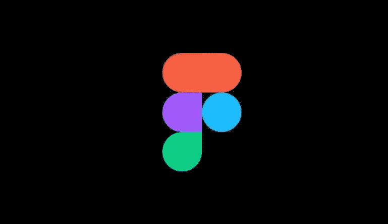
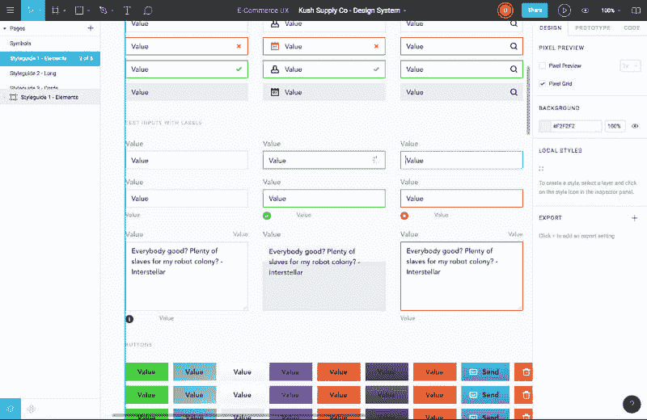
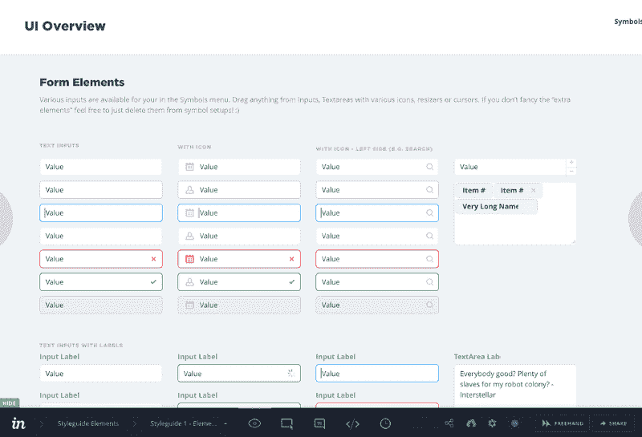
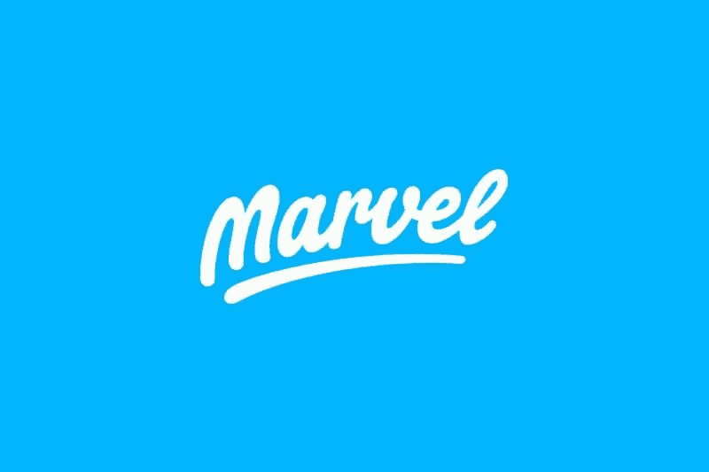
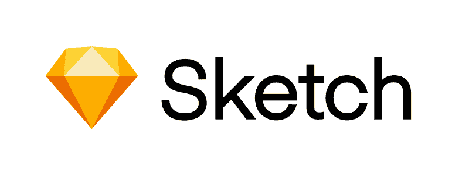
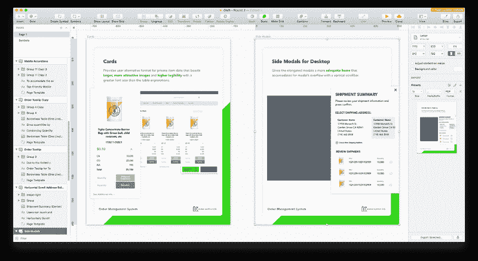
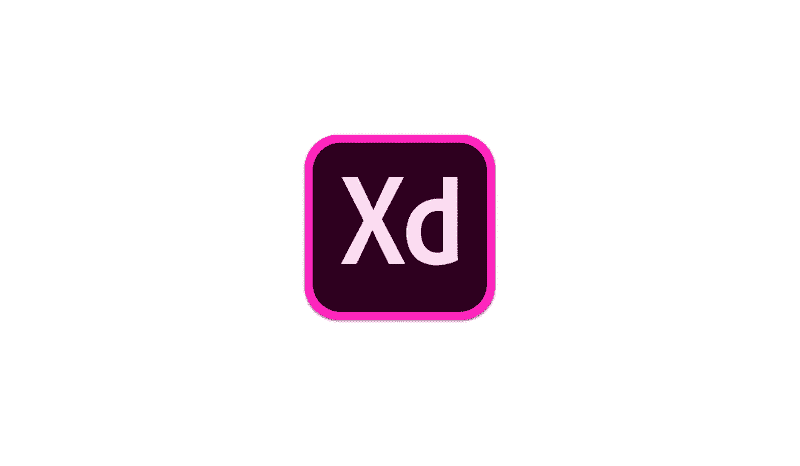
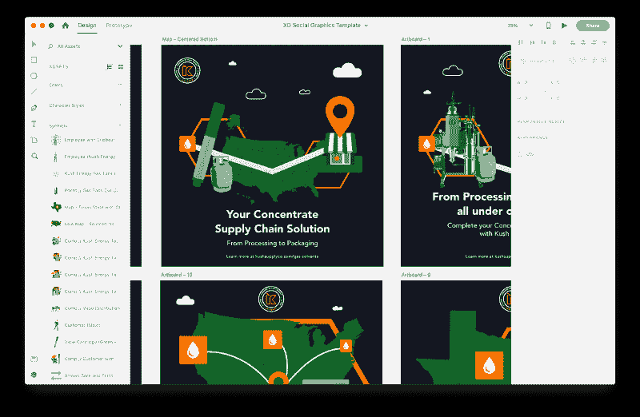

# 2019 年设计协作工具

> 原文：<https://dev.to/whoisryosuke/design-collaboration-tools-in-2019-474d>

### 最近，我和一个新团队一起做了一个 UX/UI 项目，任务是选择一个设计协作工具，我们将使用它来创建和协作实体模型和原型。该团队由几个不使用设计工具的不同部门和使用 Sketch 的第三方设计工作室组成。

逛了一圈之后，我发现 **Figma、Invision、漫威、Adobe XD 和 Sketch** 都有团队想要的功能:草图导入、基于云的设计、原型和协作。

### 我的过程🎨

这些是我在探索每个应用程序并把它们放入标准 UI 工作时做的笔记。

对于每个应用/服务，我试图**导入一个利用嵌套符号的草图文件**。这测试了每个应用程序如何公平地导入组件，以及转换的质量。我还试图**创建原型**来了解这个工具集的范围。除此之外，我只是简单地浏览了一下每个应用程序，*就像我作为一名设计师在日常工作中通常会做的那样，在*四处闲逛。

### 让设计审议开始吧！🧐

* * *

### [图](#figma)

就整体性能、功能和价格而言，这是最好的。它满足了我们的所有需求，可以在 Mac 和 Windows 上运行，在导入草图文件等操作上做得相当好，共享组件系统非常棒。

除了一些小问题(和缺少插件)，Figma 的设计浏览器工具在设计方面远不如 Sketch 强大，但对于大多数基本任务来说已经足够了。

*   **最优惠价格**特色功能。
*   **除 SVG** 外，无法导出到 Sketch/XD。您可以导入带有符号的草图文件(成为 Figma 组件)，但是如果不失去嵌套组件/样式的所有功能(如动态更改按钮的颜色/文本)，您就无法导出这些“组件”。一旦你去了 Figma，你就再也回不去了(无论是好是坏)。
*   **草图导入并不*完美*** ，需要我调整/修复我花时间在草图中精心制作的设计(只是为了让文本溢出并改变大小)。使草图导入变得不那么有用，因为我觉得我宁愿直接在 Figma 中设计，以避免在翻译中的损失。
*   **草图导入确实工作**令人惊讶，尽管**和导入符号作为组件** ( *这里或那里有 bugs】)。结果是，现在任何人都可以在浏览器中访问整个组件库，无需 Mac 或草图即可制作原型。*
*   用户界面有点混乱。您可以单击组件的单个部分，但是如果不将组件恢复到组/层，您就不能四处移动它们。这不是问题，因为 Sketch 是同样的方式，要求您直接编辑“符号”或组件(而不是它的“实例”)。问题是 Figma 允许我点击嵌套在组件中的东西(这对于改变颜色来说是半方便的)，但是当你不能容易地辨别什么是组件或者不是组件时(特别是嵌套在 30 层之下并且在侧边栏中看不到父组件层)，这就令人沮丧了。
*   **画板(或“画框”)令人讨厌*😡****一旦定义了画板，如果不相应地调整子元素的大小，就无法调整它的大小。在 Sketch 和 Illustrator 中，您可以选择禁用此功能。然而，在 Figma 中，您被迫将画板包装在新的画板中，调整其大小，然后“取消”较小的嵌套画板。这种变通方法是可行的，但是当它是一种如此频繁使用的操作时，会花费太多的时间和精力。*

 *

### 特性

*   草图导入(非 100%)
*   原则可以导入 Figma 原型
*   实时协作
*   样机研究
*   设计系统管理
*   在移动设备上实时预览(使用 Figma Mirror)
*   网络界面，桌面应用
*   可重复使用的组件(符号)
*   文本样式/文档颜色

### 定价💰

*   免费的 3 个项目，2 个编辑器
*   15 美元/编辑/mo
*   45 美元/编辑/mo —组织级设计系统

### 视觉

价格高，但有很多不同的产品和集成(如草图工艺)。很棒的原生应用。

*   ***最高*价格🤑💸**
*   **奇妙的移动应用**体验**在旅途中勾画创意和界面**，优于所有其他竞争对手。成了我为电影献计献策的人。
*   **草图导入效果很好。在设计系统中没有大量嵌套符号的笨拙转换。**
*   Invision Studio 中的原型制作比草图更强大**，但与类似原理的东西不相上下。**
*   **Design system manager** 创建一个可由 Studio 和 Sketch 访问的库，允许跨所有文件同步和使用符号——创建一个真实的单一来源(用于设计)。非常漂亮，这是许多设计师试图完成的事情。唯一的限制是不像 Figma，Invision 不导出到代码，所以如果你还必须维护一个编码组件库，它就不是真正的“唯一的真实来源”。

### 特性

*   草图导入
*   实时协作
*   样机研究
*   设计系统管理
*   在移动设备上实时预览(使用 Invision 应用程序)
*   Web 界面、桌面+本地应用

### 定价💰

*   1 个项目免费
*   15 美元/月— 3 个原型
*   25 美元/月—无限制
*   99 美元/月— 5 名团队成员

### 漫威

更喜欢他们的 iOS 应用程序，而不是整体服务。基于浏览器的设计工具不如其他工具(Sketch、Figma 等)丰富，并且不支持单个文件的符号/组件。甚至[漫威博客上关于创建风格指南的文章](https://blog.marvelapp.com/creating-maintaining-marvel-style-guide-sketch/)也没有展示他们如何将复杂的草图文件与他们自己的服务集成在一起。

*   **一个*小*贵**的*有限*功能集(与竞争对手相比)。
*   基本原型，但不如 Principle 或 Invision Studio 高级。
*   **原生 iOS 应用非常好用。**在顶级 UX/用户界面设计应用中，我轻松位居第二。让绘制形状变得非常容易(这是 vision 可以借鉴的地方)。唯一的缺点是有限的画布大小，这迫使你进入移动应用程序的分辨率。这里没有桌面/平板 UI 草图。
*   **基于网络的设计工具是一个加号**，允许在任何地方设计。
*   **像 Figma 一样将设计导出到代码**。
*   **良好的协作工具。**不像 Invision 那么充实，但至少是你所需要的(指出并谈论设计中的东西——没有注释)。
*   **来自移动应用的草图在基于网络的设计工具中无法工作**，这使得从线框/lofi 到高保真实体模型变得不可能👎
*   **单个项目/设计没有符号或组件🤯🙅‍♂️** 只有“共享资产”，即充当全球设计系统。虽然它不能像 Invision DSM 一样导出或同步到草图。
*   **草图插件允许将**与原型/热点的漫威同步。

### 特性

*   草图导入
*   与基本符号的协作
*   样机研究
*   使用漫威手机应用程序的草图工具
*   在移动设备上实时预览(使用漫威应用程序)
*   全球共享的资产/组件
*   Web 界面+原生应用

### 定价💰

*   一个用户，一个项目免费
*   16 美元/月—无限制
*   48 美元/月—团队

### 草图云

人们很容易忘记 Sketch 本身现在是一个全功能的原型工具，有一个可以共享设计的云。

### 特性

*   样机研究
*   带注释的协作(基本点和注释，无注释)。
*   在移动设备上实时预览(使用草图镜像)
*   仅用于编辑的桌面应用程序
*   可重复使用的组件(符号)
*   全局共享符号库(组件)
*   文本样式/文档颜色

### 定价💰

*   免费——购买应用程序(见下文)
*   99 美元——应用程序+年度更新的一次性费用

### 土坯 XD

*   **没有嵌套符号**(像 Figma 或 Sketch)，所以当你编辑一个符号/组件时，它会影响所有其他的。这也意味着你甚至不能将符号缩放到不同的大小，所以你的按钮每次都必须是精确的高度和宽度。符号的唯一动态部分是文本，它是可编辑的。对我来说是个转折点。
*   **没有页数。**所有画板一个页面，没有浏览符号的页面(只有可滚动的侧边栏)。
*   替换一个符号会替换所有符号，所以如果你想交换一个图标，你必须手动拖动它并定位，或者用新的替换页面上该图标的每个实例。如果你需要做大量的编辑工作，这是很方便的；如果你需要交换单个元素，这是固定的。
*   **将 XD 中的任何内容复制/粘贴到 Illustrator 导出为 JPG** ，而不是 SVG 元素。您可以从 Illustrator 复制/粘贴矢量，但不能复制/粘贴回来，除非您将 XD 文件导出为 SVG 并手动导入。半理解一旦你知道 Adobe 在每个应用程序中对矢量对象使用不同的算法，仍然不能使生态系统变得简单。最好的情况是使用 Adobe 的库来导入 Illustrator 文件(就像画板的 EPS)，允许您在两者之间同步更改。

### 特性

*   样机研究
*   可嵌入的原型(用于投资组合/网站)
*   可重复使用的组件(符号)
*   文本样式/文档颜色
*   仅用于编辑的桌面应用程序
*   使用 Adobe XD 应用程序在移动设备上实时预览
*   支持草图文件(包括符号)

### 定价💰

*   9.99 美元/月—个人计划

### 但是谁赢了？🥊

🥇一如既往，这取决于你需要什么。 **Figma 确实是最好的一体化解决方案**，拥有基于云的设计和原型制作工具，价格最低，功能最多。然而，Figma 中的原型制作是受*限制的*，如果你的用例涉及复杂的 UI 动画/过渡，像**原理**或 **Invision Studio** 可能更合适。

🥈 **Sketch** 紧随其后，它是一个完整的设计和原型制作解决方案，只是受到 MacOS 的独占性和与 Principle/Studio 相比有限的原型制作工具的限制。

> 💩Adobe XD 是最令人失望的，它有这么多的功能(很棒的用户界面，草图导入，Adobe 生态系统)——但事实上，符号不是那么动态，甚至没有*可伸缩性(而且没有页面！*😵_)_ 是一个巨大的游戏破坏者。让你的按钮成为一个符号，却不能让它变得更宽，这简直就是坏掉了。我无法让自己集中使用它，因为我知道工作流会被这一个缺失的特性所固有地限制。

### 我的赢家？🙌

我决定使用**草图**作为大多数项目和简单原型的主要设计工具，使用**原理**作为复杂原型的主要设计工具，如果我需要与多名设计师/团队成员在更高层次上合作，则使用**图玛**。而对于在旅途中素描，我又不能撼动 **Invision iOS app** 。

Cheers 🍻 

Ryo

* * *

**参考文献**:

*   [素描 App](https://www.sketchapp.com/)
*   [草图云](https://www.sketchapp.com/docs/sketch-cloud/)
*   [漫威 App](https://marvelapp.com/)
*   [在草图中创建和维护漫威风格指南](https://blog.marvelapp.com/creating-maintaining-marvel-style-guide-sketch/)
*   [视觉应用](https://invisionapp.com/)
*   [图](https://figma.com/)
*   [Adobe XD](https://f//www.adobe.com/products/xd.html)
*   [成帧器](https://framer.com/)*