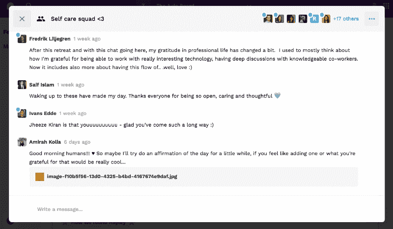
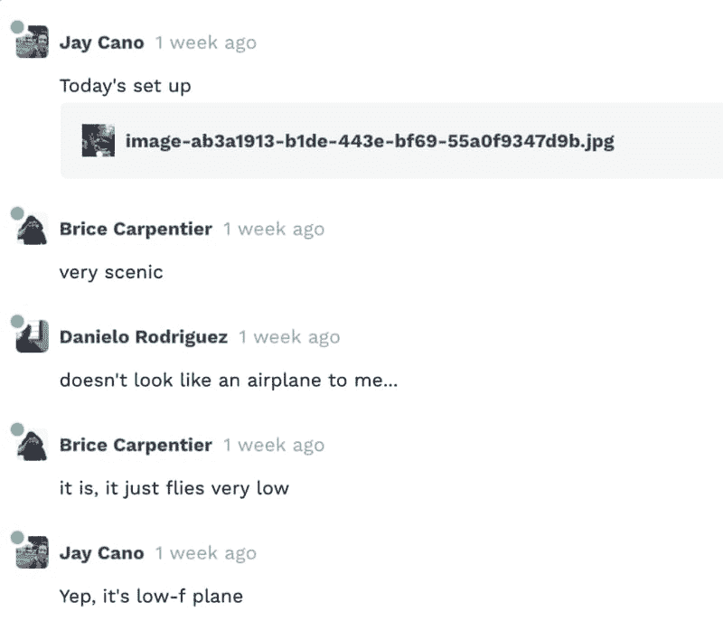
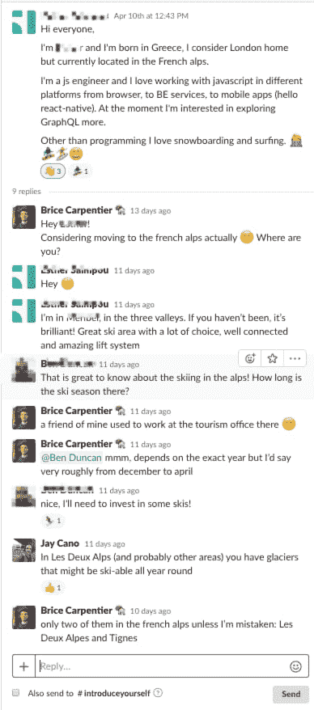
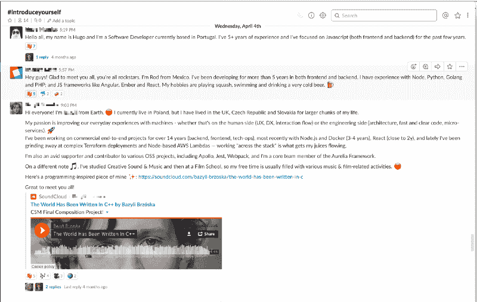
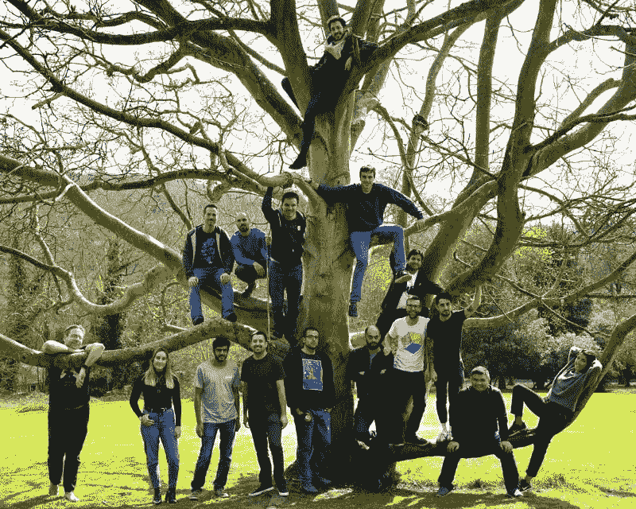

# 13 个哭泣的工程师:一种遥远的关怀文化

> 原文：<https://dev.to/aula/13-crying-engineers-a-remote-culture-of-care-3f2j>

在 Aula，我们的工程团队可能不像其他团队那样直言不讳地表达我们的感受。

然而，两周前，我参与了一件不可思议的事情:我的 14 名工程同事(包括我们的首席技术官奥利弗)泪眼汪汪地站成一圈，分享他们对彼此的欣赏以及对我们事业的承诺。

作为一个完全远程的团队，我们中的许多人以前从未见过面。我们中的一些人见过一次。

这是一个巨大的个人转折点。尽管地处偏远，我们的工程团队还是彼此建立了深厚的关爱关系。作为一个建立交流平台的公司，在数字空间培养学生之间的社区，这也验证了我们的使命:“这是可能的！”。

以下是我们为在来自 10 个国家的工程师组成的远程工程团队中培养尊重和关爱的无我文化而做的 3 件事:

## 1。为护理创造异步空间

互相关心不是附加的。当它存在时，它就被编织到你如何合作的结构中。

在聊天中，有时会忘记承认对方是人类。我们鼓励每个人都积极地这样做——甚至是“早上好！”在一天开始的时候，没有要求会创造奇迹。

我们还通过与自我保健相关的话题和与工作无关的笑话，创建了致力于脆弱、温暖和感激的空间。这些空间的目的是让我们现有的同事感到“安全”，并不断提醒我们建立信任和关怀是重要的。

<figure>

<figcaption>Fredrik sharing some care for his team members in an internal chat group focused on self-care.</figcaption>

</figure>

<figure>

<figcaption>Low-quality jokes are welcome 🤓</figcaption>

</figure>

## 2。雇佣无名英雄

人们需要安全感，才能变得脆弱，并相互关心。建立一个安全场所的最好方法是:不要雇佣自大的人。

然而，在意周围人的人有时会害羞，有时会紧张，有时不善于给人留下深刻印象，为什么他们“值得”成为公司的一部分。这对我们如何招聘有两个重要影响。

首先，我们大部分的面试都是异步进行的。

异步面试消除了很多不必要的压力，这些压力会让害羞的候选人表现不佳。另外，它反映了我们的工作方式，所以这是一个更好的测试。

你可能会认为异步通信会使人们更难判断他们是否充满关怀。以下是一些不敢苟同的截图:

<figure>

<figcaption>Example of chitchat in our interviewing Slack channel.</figcaption>

</figure>

<figure>

<figcaption>Interviewees making friends during the interview process.</figcaption>

</figure>

我们在 Slack 中的异步面试过程让候选人在面试之外与几名 Aula 工程师相处融洽。

其次，我们致力于创建一个筛选潜在技能的面试流程，而不是像你简历上的品牌名称或自信这样最明显的代理。

作为面试的一部分，所有工程候选人都会花时间使用我们的技术堆栈构建一个小应用程序。

这样做也有不好的一面:我们不得不放弃那些拥有出色简历的候选人，而其他公司由于候选人简历上的品牌名称，将面试流程缩短至 1-2 次同步面试。这意味着候选人不愿意花 6 个小时写代码来面试我们。我们的目标是在面试过程中缩短周转时间，但严格的测试仍然需要候选人的时间。

但也有一个真正的好处:我们可以雇佣那些不在大型科技公司关注范围内的优秀人才。我们可以满怀信心地报价。我们认为这是一个竞争优势。

点击此处了解更多关于我们面试流程的信息——这是公开的:

[Aula 的异步工程面试](https://www.notion.so/bce436a4230c4f0d8b19bc717232d289)

## 3。花点时间面对面交流

远程工作并不意味着你们永远见不到对方。但是在一起的时间都是为了建立感情。

<figure>

<figcaption>Our development team</figcaption>

</figure>

粘合显然不是一件晦涩难懂的事情；我们的工程团队花了一周时间集中精力全面迁移到 Lambda。围绕将我们聚集在一起的技术挑战开会是一种很好的方式。

在我们今年春天的静修中，我们也尝试了一些奇怪而有趣的事情:一个欣赏会。

我们抽出时间给所有团队成员写了一封感谢信，然后轮流与大家分享。在最初的尴尬之后，我们释放了大量的脆弱和对彼此的关心。我们的团队从未像现在这样准备好一起创造不可思议的东西。

我们在招人！如果这是你想要工作的地方，请查看我们的公开招聘职位。

PS。我渴望听到其他团队如何建立关爱文化并确保心理安全。