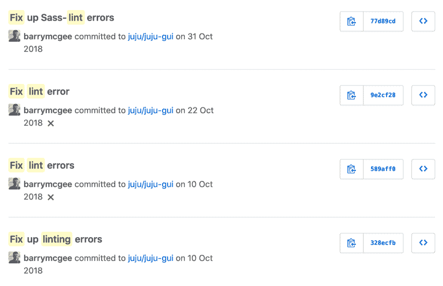
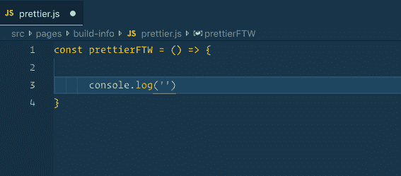

# 用更漂亮的来格式化你的代码

> 原文：<https://dev.to/barrymcgee/formatting-your-code-with-prettier-4b16>

多年来，我花了相当多的时间盯着我的代码编辑器，试图判断屏幕顶部的花括号是否与屏幕底部的花括号对齐。

这样做的原因是为了确保我的代码整洁和一致，从而更容易维护——无论是在以后由我自己还是由其他人来维护。

我也天生爱整洁——杂乱会让我紧张。我喜欢整洁的桌子、整洁的房子、整洁的汽车和整洁的花园。每样东西都有它的位置，每样东西都应该在它的位置。如果它不[给我快乐](https://www.youtube.com/watch?v=WvyeapVBLWY)——它就被扔进垃圾箱！

## 皮棉万物

随着前端开发在本世纪初迅速成熟，linters 变得越来越流行。我们有 [JShint](https://jshint.com/) ，它演变成了用于 Javascript 的 [Eslint](https://eslint.org/) 和用于 Sass 文件的 [Scsslint](https://github.com/brigade/scss-lint) ，后者后来被 [Sasslint](https://github.com/sasstools/sass-lint) 取代。

HTML linters 也来了又去，但社区似乎从来没有围绕一个解决方案。这可能部分是因为 HTML 现在很少以孤立的`.html`文件编写——它通常是围绕各种风格的模板标签来实现内容的动态填充。

所以，在某种程度上，这很棒。因为这些 linters 试图满足所有人的所有需求，所以他们提供了看似无限的配置选项。这样做的好处是你可以说服你的 linter 检查你的代码，以确保它和你自己检查的完全一样。拥有大量配置选项的缺点是每个项目的设置都可能非常不同，即使在小团队中也是如此。这不可避免地意味着，尽管尽了最大努力，当提交一个拉请求时，您还是会因为绊倒 linter 而破坏您的构建。提示一个布满“*Fix linter*”提交消息的 git 日志。

这些 linters 中的许多还混合了风格问题和代码有效性问题。例如，Eslint 可以被配置为标记不正确的缩进(风格问题)，还可以标记重复的`const`声明(有效性问题)。

因此，用`--fix`选项在代码库上运行 Eslint 不仅会格式化你的代码，还可能用*重写*它。虽然这是对您对测试套件的信心的极好测试，但这也是指数风险的练习。

## 更漂亮的另类

输入[更漂亮的](https://prettier.io/)。根据他们自己的定义，Prettier 是“一个固执己见的代码格式化程序”，支持广泛的语言，包括 HTML、CSS、JS、JSX、Yaml 甚至 HTML。与 Eslint 不同，它不关心代码的有效性，只关心格式。它与大多数编辑器集成在一起，可以在文件保存时被触发，对我来说，这就像一个小精灵跳进来清理我的代码！

更漂亮的可以在[中与 Eslint](https://prettier.io/docs/en/eslint.html) 一起工作，它有能力[忽略](https://prettier.io/docs/en/ignore.html)你想要保留的代码块或整个文件，并且可以被设置为作为[预提交钩子](https://prettier.io/docs/en/precommit.html)或[构建步骤](https://prettier.io/docs/en/cli.html)运行。

尽管相对来说还是个新人，但 Prettier 已经被许多流行的代码库所采用，并且已经可以和脸书、Paypal 和 Webpack 相提并论了。Prettier 是由核心贡献者开发的，所以不出所料，这些团队也强烈推荐它。

Prettier 的使命宣言的核心是它提供的相对较少的配置选项。Prettier 固执己见是有原因的——你和你的团队应该停止争论代码格式相对琐碎的方面，集中精力为你的用户提供价值。

也就是说，他们已经为[提供了一些选项](https://prettier.io/docs/en/options.html)，比如制表符宽度，以防止非常两极分化的格式选择成为固执己见的团队采用的绊脚石。

采用更漂亮的将会在你的代码库之间引入一致性，使新的开发者更容易加入，从你的生活中消除格式错误，并确保你永远不必争论琐碎的代码格式意见——有什么不喜欢的呢？

## 处理拒绝

好吧，所以有些事情人们不会喜欢。在确信了 prettle 的魔力之后，我努力让 Canonical 的开发团队采用它，相当多的开发人员最初对此表示怀疑，因为有些人认为 prettle 可能有点过于固执己见。

我给提倡漂亮的人的一个可靠的建议是，在你的代码库中运行漂亮，并把它作为一个[草案拉请求](https://github.blog/2019-02-14-introducing-draft-pull-requests/)。这将确保你的团队成员讨论的是对你的代码库的实际影响，而不是对你的代码库的理论影响，这可能是非常不同的。

在提出我的第一个案例后，我从开发伙伴那里收到了很多反馈，这些反馈指向了一个特定的代码块，并表达了一种观点，即如何更漂亮地运行它会使它变得更难看，而不是更漂亮。

在某些情况下，我不能不同意，但在其他情况下，我个人更喜欢 Prettier 格式化后的代码。这就是症结所在——情人眼里出西施。

代码的漂亮与否完全是主观的，这就是为什么格式化的争论一开始就有分歧。漂亮的力量不在于它能让所有的代码对所有的人都漂亮——而是它消除了争论这种主观意见的机会，让你和你的团队能把精力放在更重要的事情上。

你也可以忘记早上，中午和晚上眯着眼看花括号。✨