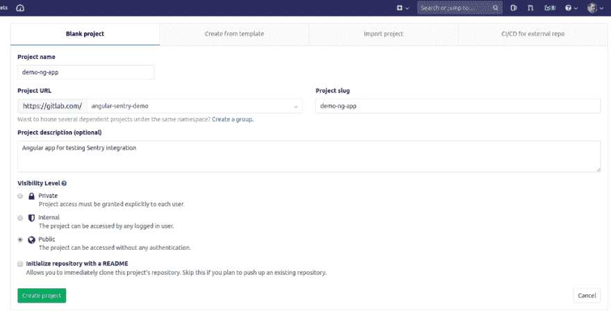
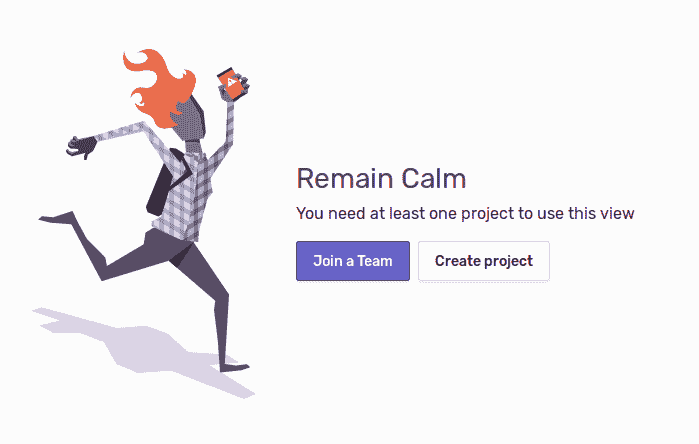
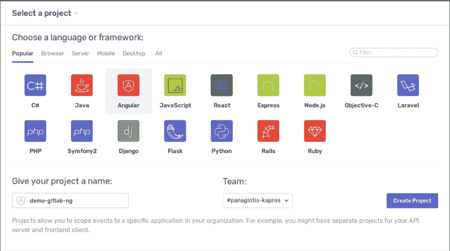

# 使用 GitLab CI 向 Sentry 提供 Angular 的源代码

> 原文：<https://dev.to/kapros/make-angular-s-source-code-available-to-sentry-with-gitlab-ci-2ngj>

<figure>[](https://res.cloudinary.com/practicaldev/image/fetch/s--Y4Uc4yWI--/c_limit%2Cf_auto%2Cfl_progressive%2Cq_auto%2Cw_880/https://cdn-images-1.medium.com/max/1024/1%2A3I5cszV_0FUDtgaO_Z1oIA.jpeg) 

<figcaption>来源:[pixabay.com](https://pixabay.com/en/gummib%C3%A4rchen-fruit-gums-bear-359950/)</figcaption>

</figure>

在 [COVIS](https://twitter.com/COVIS_GmbH) 我们已经使用 [GitLab](https://about.gitlab.com/) 、 [Sentry](https://sentry.io/welcome/) 和 [Angular](https://angular.io/) 一段时间了。直到最近，为 Angular 应用程序构建必要的源地图文件并让它们对 Sentry 可用还不是很简单。如果没有源映射文件，异常的堆栈跟踪就不是很有用。

在本帖中，我们将了解如何:

1.  将 Sentry 与 GitLab 集成
2.  设置 GitLab CI 管道，将 Angular 应用程序部署到 GitLab 页面
3.  扩展我们的管道，以建立源地图文件，并上传到哨兵

注意:这是我的第一篇帖子，所以请温和一点，我期待你的反馈😊。我们将在这篇文章中使用 SaaS 版本的哨兵。你必须在 GitLab 和 Sentry 上创建账户(免费层也可以)。

### 简介

现在很难想象没有 git 编写一个应用程序。 [GitLab](https://about.gitlab.com/) 是一个完整的 DevOps 工具，可以作为源代码库、持续集成和持续交付工具。GitLab 去年因为 [#movetogitlab](https://about.gitlab.com/2018/06/03/movingtogitlab/) 的事情变得非常受欢迎(顺便说一句，我也喜欢 GitHub)。

Sentry 是一个工具，在我们的应用程序投入生产后，它可以提供帮助。它提供了一套丰富的[功能](https://sentry.io/features/)，用于收集、识别和理解可能出现的问题。

但是 Angular 应用程序是用 TypeScript 编写的，我们的源代码被编译、缩小、丑化，现在要理解我们记录的异常堆栈跟踪并找出错误是什么变得非常困难！

在本帖中，我们将看到如何创建一个构建过程，使我们能够在 Sentry 的异常堆栈跟踪中看到原始的 TypeScript 源代码。

### 集成哨兵和 GitLab

我们将从创建一个新的 GitLab 组和存储库开始。然后，我们将创建我们的 Sentry 项目，并实现 Sentry 项目和 GitLab 存储库之间的集成。

在 GitLab 上，从顶部菜单点击**组**，点击绿色按钮**新建组**。我们将把我们的小组命名为*【角形哨兵演示】*

一旦组被创建，点击绿色按钮**新建项目**。我们将把我们的项目命名为*“demo-ng-app”*

<figure>[](https://res.cloudinary.com/practicaldev/image/fetch/s--fux45ZTR--/c_limit%2Cf_auto%2Cfl_progressive%2Cq_auto%2Cw_880/https://cdn-images-1.medium.com/max/1024/1%2A4P2a1aO2rmJRzd-PUcOLZg.png) 

<figcaption>创建 GitLab 项目</figcaption>

</figure>

现在让我们创建一个新的哨兵项目。导航到[https://sentry.io/signup](https://sentry.io/signup/)并创建一个帐户(如果您还没有)。一旦你有了自己的账户，点击*“创建项目”*按钮。我们将我们的项目命名为*“demo-git lab-ng”，并选择 Angular SDK:*

[](https://res.cloudinary.com/practicaldev/image/fetch/s--JN9VJsRy--/c_limit%2Cf_auto%2Cfl_progressive%2Cq_auto%2Cw_880/https://cdn-images-1.medium.com/max/699/1%2As7IBK7zqIdZhB3Uy650iaw.png)

<figure>[](https://res.cloudinary.com/practicaldev/image/fetch/s--FEqEyNlw--/c_limit%2Cf_auto%2Cfl_progressive%2Cq_auto%2Cw_880/https://cdn-images-1.medium.com/max/1024/1%2AS4pg8KfUDRalTvZ1ZW2DOA.png) 

<figcaption>dempSentry 项目创建</figcaption>

</figure>

一旦您的项目准备就绪，快速入门示例代码将会呈现给您，显示您的项目的 DSN。DSN 是最重要的，因为它告诉 SDK 将事件发送到哪里。你可以在 Sentry 的“项目设置”的“客户端密钥”部分找到项目的 DSN。我们将在稍后配置 SDK 时使用 DSN。

太好了！现在让我们执行与 GitLab 的集成。请遵循哨兵手册中的步骤 1-9:

[GitLab](https://docs.sentry.io/workflow/integrations/global-integrations/gitlab/)

👍我们已经成功整合了 GitLab 和 Sentry！现在让我们继续创建我们的示例角度应用程序。

### 设置 GitLab CI 管道，将 Angular 应用程序部署到 GitLab 页面

我们现在将创建一个新的 Angular 应用程序并安装 Sentry SDK。这将允许我们从应用程序中捕获异常，但是是在生成的代码上。在最后一节，我们将改变这一点。

#### 新建 Angular app

我们将使用 [Angular CLI](https://cli.angular.io/) :
的 ng new 命令创建我们的应用程序

```
ng new demo-ng-app
cd demo-ng-app 
```

然后，我们将把生成的应用程序添加到 GitLab 存储库中:

```
git remote add origin git@gitlab.com:angular-sentry-demo/demo-ng-app.git
git push -u origin master 
```

#### 给 Angular 添加哨兵 SDK

让我们在新创建的应用程序上安装 Sentry SDK。我们将遵循指令

```
npm i -S [@sentry/browser](http://twitter.com/sentry/browser) 
```

现在，我们将按照 Sentry 文档中的说明配置 SDK:

[角度](https://docs.sentry.io/platforms/javascript/angular/)

**注意** : Sentry 文档足够智能，可以为您提供带有您自己的 DSN 的片段。

就是这样！现在任何未处理的异常将被发送到哨兵！但是这是怎么发生的呢？上面的代码片段实现了 Angular 的 ErrorHandler 类，它为集中式异常处理提供了一个钩子。在 handleError 方法中，在我们重新抛出异常之前，使用 captureException()方法将异常发送给 Sentry。如果您想了解更多信息，请查看以下两个链接:

*   [角度](https://angular.io/api/core/ErrorHandler)
*   [捕捉事件](https://docs.sentry.io/error-reporting/capturing/?platform=browser#capturing-errors--exceptions)

现在是向哨兵发出第一个例外的时候了。我们将实现一个引发异常简单按钮: