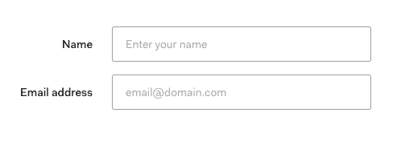
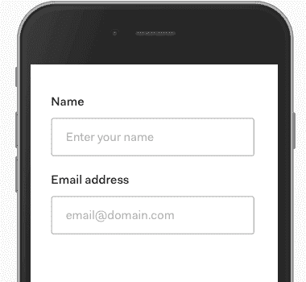

# 化合物。组件和上下文

> 原文：<https://dev.to/siddharthkp/29-compoundcomponents-and-context-5b0h>

> 这个帖子是几周前在[我的简讯](https://sid.studio/newsletter)上发的，只是说。
> 
> 这是关于[写好组件](https://sid.studio/component-api)的一系列帖子的一部分

今天，我们来谈谈表格。

你可能已经读过很多关于表单中状态管理的文章，这不是其中之一。相反，我想谈谈表单的设计和 API。

[](https://res.cloudinary.com/practicaldev/image/fetch/s--SgjWhdk4--/c_limit%2Cf_auto%2Cfl_progressive%2Cq_auto%2Cw_880/https://sid.studio/blog/29/label-on-left.png)

这里发生了很多事情，但首先让我向您展示 API。

```
<Form layout="label-on-left">
  <Form.Field label="Name">
    <TextInput type="text" placeholder="Enter your name" />
  </Form.Field>

  <Form.Field label="Email">
    <TextInput
      type="email"
      placeholder="email@domain.com"
    />
  </Form.Field>
</Form> 
```

让我们来看看每一个组件，并对它们进行细分:

### 表格

它从一个`Form`组件开始，表面上它是一个附加了类的基本表单元素。无论你放什么进去它都会呈现出来。

```
function Form(props) {
  return <form className="form">{props.children}</form>
}

render(<Form layout="label-on-left">...</Form>) 
```

它还接受一个`layout` prop，这对于空间不足的用例非常有用。

[](https://res.cloudinary.com/practicaldev/image/fetch/s--bOaNMVK5--/c_limit%2Cf_auto%2Cfl_progressive%2Cq_auto%2Cw_880/https://sid.studio/blog/29/label-on-top-phone.png)T3】

```
<Form layout="label-on-top">...</Form> 
```

这将改变标签的对齐方式(从右到左)和边距的工作方式。

不过，表单并不控制其内部内容的宽度和边距。这是表单域要处理的。

虽然`Form`确实需要向下传达这个布局信息。

最简单的方法是传递`props`中的布局，但是因为表单的内容是动态的(由使用该表单的开发人员决定)，我们无法控制这一点。

这就是上下文 API 的用武之地。

```
/* Create a new context */
const LayoutContext = React.createContext()

function Form(props) {
  /*
    Wrap the children in a context provider
    with the value based on props
  */
  return (
    <form className="form">
      <LayoutContext.Provider
        value={{ layout: props.layout }}
      >
        {props.children}
      </LayoutContext.Provider>
    </form>
  )
}

export default Form
export { LayoutContext } 
```

现在一个表单域可以使用这个上下文并获得`layout`的值

### 表单字段

`FormField`组件在呈现您放入其中的任何内容(比如文本输入)之前添加一个`label`。

```
function Field(props) {
  return (
    <div className="form-field">
      <label {...props}>{props.label}</label>
      {props.children}
    </div>
  )
} 
```

除此之外，它还为 layout 添加了一个类——这个类来自我们在`Form`中创建的上下文。

```
/* Get the layout consumer */
import { LayoutContext } from './form'

/*
  Use the consumer to get access to the
  context - it uses the render prop API

  We pass this as the class to the form field
*/
function Field(props) {
  return (
    <LayoutContext.Consumer>
      {context => (
        <div className={`form-field ${context.layout}`}>
          <label {...props}>{props.label}</label>
          {props.children}
        </div>
      )}
    </LayoutContext.Consumer>
  )
} 
```

React 16.8+的`useContext`钩子使得语法更容易理解

```
/* Get the layout consumer */
import { LayoutContext } from './form'

function Field(props) {
  /*
    Grab the context from the useContext hook
    which accepts the context variable as the input
  */
  const context = useContext(LayoutContext)

  return (
    <div className={`form-field ${context.layout}`}>
      <label {...props}>{props.label}</label>
      {props.children}
    </div>
  )
} 
```

如果你很好奇，可以查看这里的 CSS:

```
.form-field.label-on-left {
  max-width: 625px;
  display: flex;
  align-items: center; /* align vertically */
}
.form-field.label-on-left label {
  text-align: right;
  width: 175px;
  margin-right: 25px;
}

.form-field.label-on-top {
  width: 100%;
  display: block; /* instead of flex*/
}
.form-field.label-on-top label {
  text-align: left; /* instead of right */
  margin-bottom: 25px; /* instead of margin-right */
} 
```

### 形态。场？

我想谈的最后一个细节是组件的这种笨拙的点语法。

因为表单`Field`总是与`Form`一起使用，所以对用户来说，将它们组合在一起是有意义的。

一种方法是从同一个文件中导出它:

```
/* form.js */
import Field from './field'

function Form(props) {
  /* ... */
}
export default Form

export { Field } 
```

现在，用户可以将它们一起导入:

```
import Form, { Field } from 'components/form'

render(
  <Form>
    <Field>...</Field>
  </Form>
) 
```

我们可以通过在`Form`组件本身上附加`Field`来做一点小小的改进。

```
/* form.js */
import Field from './field'

function Form(props) {
  /* ... */
}

Form.Field = Field
export default Form 
```

这段代码可以工作，因为 React 组件是 javascript 对象，您可以在这个对象上添加额外的键。

这对用户来说意味着当他们导入`Form`时，他们会自动获得`Field`。

```
import Form from 'components/form'

render(
  <Form>
    <Form.Field>...</Form.Field>
  </Form>
) 
```

我真的很喜欢这个 API，因为它让`Form`和`Form.Field`之间的联系变得很明显。

##### 注意:你必须将上下文移动到一个不同的文件中，以避免循环依赖循环。

点语法和上下文的结合使我们的`Form`组件变得智能，同时保持它的可组合性。

希望这对你的旅程有帮助

（同 suddenionosphericdisturbance）电离层的突然骚扰

* * *

[](https://sid.studio/newsletter)