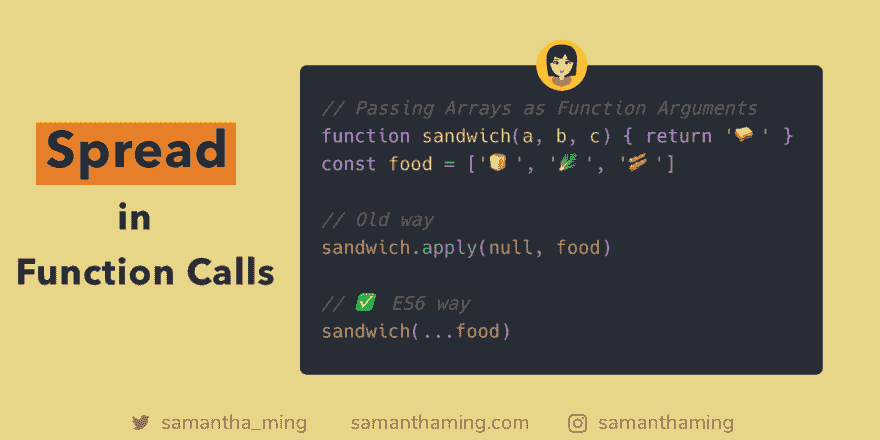

# 将数组作为函数参数传递

> 原文：<https://dev.to/samanthaming/passing-arrays-as-function-arguments-4gcm>

[](https://res.cloudinary.com/practicaldev/image/fetch/s--5LQ8Bt74--/c_limit%2Cf_auto%2Cfl_progressive%2Cq_auto%2Cw_880/https://thepracticaldev.s3.amazonaws.com/i/vxdkaze7iavdew1ua4y9.png)

如果你想把一个数组传递给一个变量函数。您可以使用 ES6 spread 将数组转换成参数列表。耶，这么多的清洁和没有无用的零从旧的申请方式👏

```
function sandwich(a, b, c) { 
  console.log(a) // '🍞'
  console.log(b) // '🥬'
  console.log(c) // '🥓'
}

const food = ['🍞', '🥬', '🥓'];

// Old way
sandwich.apply(null, food);

// ✅ ES6 way
sandwich(...food); 
```

## 配合`Math`功能使用

使用`Math`函数可以非常方便地将数组转换成参数列表。

### 例:求最大数

假设您想使用`Math.max()`函数找到最大的数字。

```
const largest = Math.max(5, 7, 3, 4);

console.log(largest); // 7 
```

但很少会传入单个的值。更有可能的情况是，您希望找到数组中的最大元素。所以现在的问题是，如何将一个值数组传递给一个接受单个参数而不是数组的函数？

这太可怕了:

```
const numbers = [5, 7, 3];

// 🤮 Yuck!
Math.max(numbers[0], numbers[1], numbers[2]);

// ❌ And this won't work
Math.max(numbers); // NaN 
```

幸运的是，我们可以使用 ES6 的扩展操作符！

```
const numbers = [5, 7, 3];

// 😍 Much Better!
Math.max(...numbers); // 7 
```

这里`spread`所做的是获取数组元素，并将其展开或解包成变量函数的参数列表。

```
const numbers = [5, 7, 3];

console.log(...numbers); // 5 7 3 
```

### 用非开发术语解释`spread`

如果你觉得这个传播的东西仍然令人困惑。也许让我试着用[俄罗斯套娃](https://en.wikipedia.org/wiki/Matryoshka_doll)来解释一下。所以我喜欢把这个阵列想象成俄罗斯套娃。传播的作用是:

1.  它将嵌套的娃娃拆开(展开)成单个的娃娃。
2.  现在你有了所有这些单独的玩偶(参数)来很好地放置在你的展示柜(功能)中。

不确定这个解释有没有帮助？如果有，请留下评论，我将开始以这样有趣的方式解释编程概念😆

## 传递多个数组作为函数参数

另一个超级传播是组合数组。

```
const one = [1,2,3];
const two = [4,5,6];

const merged = [...one, ...two];
// [ 1, 2, 3, 4, 5, 6 ] 
```

所以我们可以使用这个超级能力来传递多个数组作为函数参数💪

```
const one = [1,2,3];
const two = [4,5,6];

Math.max(...one, ...two); // 6 
```

对于那些热衷于此的人，想知道你是否可以传入 3 个数组。嗯，你打赌！就像精力充沛的兔子，它不停地跑啊跑....(本帖非劲量 lol 赞助。但这是可以改变的，让我振作起来。我想要一些赞助资金😂)

```
const one = [1,2,3];
const two = [4,5,6];
const three = [2,100,2];

Math.max(...one, ...two, ...three); // 100 
```

## 什么是一元函数？

所以你可能注意到我使用了术语*多元*函数。计算机科学的人可能听说过这个术语。但是对于像我一样的其他酷蜜蜂来说😝，可能不是那么熟悉。可变函数是接受无限或可变数量的参数的函数。而`Math.max()`函数就是那些变量函数中的一个。

## 资源

*   [MDN Web Docs - Spread 语法](https://developer.mozilla.org/en-US/docs/Web/JavaScript/Reference/Operators/Spread_syntax)
*   [DWB -传播算子的 6 大用途](https://davidwalsh.name/spread-operator)
*   [在 JavaScript 中把数组扩展成参数](http://2ality.com/2011/08/spreading.html)
*   [JavaScript.info - Spread](https://javascript.info/rest-parameters-spread-operator)
*   [堆栈溢出——在 JavaScript 中传递一个数组作为函数参数](https://stackoverflow.com/questions/2856059/passing-an-array-as-a-function-parameter-in-javascript)
*   [粉碎杂志-如何使用 ES6 参数和参数](https://www.smashingmagazine.com/2016/07/how-to-use-arguments-and-parameters-in-ecmascript-6/)

* * *

**感谢阅读❤**
问好！[insta gram](https://www.instagram.com/samanthaming/)|[Twitter](https://twitter.com/samantha_ming)|[脸书](https://www.facebook.com/hisamanthaming) | [媒体](https://medium.com/@samanthaming) | [博客](https://www.samanthaming.com/blog)