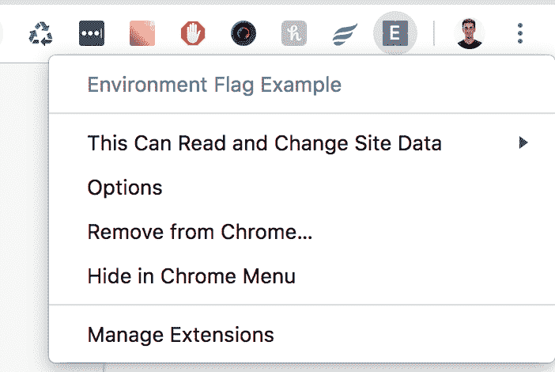
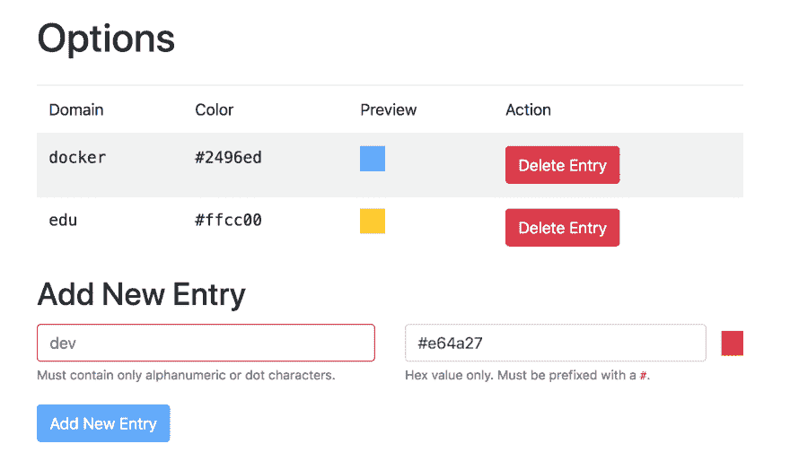
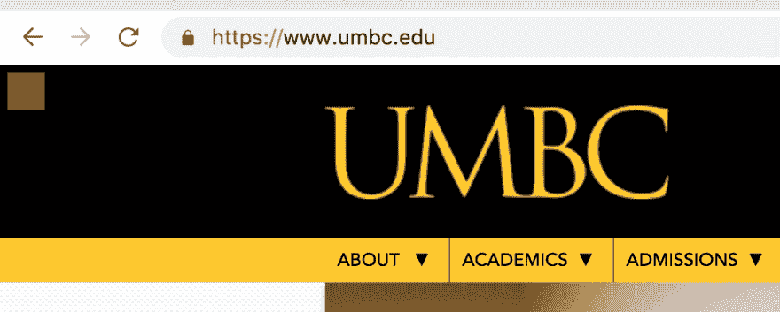

# 构建一个简单的 Chrome 扩展

> 原文：<https://dev.to/michaeldscherr/building-a-simple-chrome-extension-1mal>

我决定进行我的第一次实验。我的同事提出了一个非常简单的想法，所以我决定试一试。

# 功能需求

创建一个`Chrome Extension`,它会在页面的左上角输出一个彩色小方块，提醒你正在使用哪种类型的`domain (i.e. .dev, .stage)`。这些`domains`和`colors`将在`Options Page`上管理。

## 选项页

应该在一个`Options Page`上管理`environments`和它们对应的`color`，允许您添加/删除任意数量的条目。

## 活动标签页

小方块应该只出现在与用户在`Options Page`上添加的条目相匹配的`domains`上。

方块的背景颜色将反映当前条目。

# 入门

*我本来是跟着[这个教程](https://developer.chrome.com/extensions/getstarted)入门的。*

每个扩展名都需要有一个`manifest.json`。要获得完整的选项列表，请访问他们的官方文件。

下面是一个`manifest.json`的简单例子。

```
{  "name":  "Environment Flag Example",  "version":  "1.0",  "description":  "Environment Flag Example Extension",  "manifest_version":  2,  "background":  {},  "permissions":  [],  "options_page":  "",  "content_scripts":  []  } 
```

Enter fullscreen mode Exit fullscreen mode

## 值得注意的设置

### 后台脚本

[文档](https://developer.chrome.com/extensions/background_pages)

> 扩展是基于事件的程序，用于修改或增强 Chrome 浏览体验。事件是浏览器触发器，例如导航到新页面、移除书签或关闭标签。扩展在其后台脚本中监控这些事件，然后根据指定的指令做出反应。

我们将使用`background scripts`向`onInstalled`事件添加一个`event listener`。

这将允许我们在安装`extension`时运行代码。我们将使用这个`event`为`Options Page`添加一些默认条目。

```
{  "background":  {  "scripts":  ["background.js"],  "persistent":  false  }  } 
```

Enter fullscreen mode Exit fullscreen mode

*为什么`persistent`被标记为`false?`正如文档所述:*

> 保持后台脚本持续活动的唯一情况是扩展使用 chrome.webRequest API 来阻止或修改网络请求。webRequest API 与非持久后台页面不兼容。

### 权限

[文档](https://developer.chrome.com/extensions/declare_permissions)

> *使用最多的铬。* APIs，您的扩展或应用程序必须在清单的“权限”字段中声明其意图。*

例如，如果你想使用 Chrome 的[存储 API](https://developer.chrome.com/apps/storage) ，你必须申请`storage`的许可。

```
{  "permissions":  ["storage"]  } 
```

Enter fullscreen mode Exit fullscreen mode

### 选项页

[文件](https://developer.chrome.com/extensions/options)

这个条目会告诉 Chrome 你想用哪个`html`文件作为你的`Extension`的`Options Page`。

```
{  "options_page":  "options/options.html"  } 
```

Enter fullscreen mode Exit fullscreen mode

您可以通过点击`Extension`下拉菜单中的`Options`来访问该页面。

[](https://res.cloudinary.com/practicaldev/image/fetch/s--DYMl6Pxx--/c_limit%2Cf_auto%2Cfl_progressive%2Cq_auto%2Cw_880/https://res.cloudinary.com/michaeldscherr/image/upload/v1549736115/Dev.to/Posts/Simple%2520Chrome%2520Extension/options-menu-item.png)

### 内容脚本

[文件](https://developer.chrome.com/content_scripts.html)

> 内容脚本是在网页环境中运行的文件。通过使用标准文档对象模型(DOM ),它们能够读取浏览器访问的网页的细节，对它们进行更改，并将信息传递给它们的父扩展。

本质上，您希望在给定页面上实际运行的任何脚本都需要利用这个`api`。在我们的例子中，我们将在`active tab`的左上角注入一个彩色方块。

```
"content_scripts":  [  {  "matches":  ["<all_urls>"],  "js":  ["content/content.js"]  }  ] 
```

Enter fullscreen mode Exit fullscreen mode

我还建议观看关于[内容脚本和隔离世界](https://www.youtube.com/watch?v=laLudeUmXHM)的视频，以便更好地了解幕后发生的事情。

我们还需要更新我们的权限来使用`activeTab` :

```
{  "permissions":  ["storage",  "activeTab"]  } 
```

Enter fullscreen mode Exit fullscreen mode

## 完成`manifest.json`

```
{  "name":  "Environment Flag Example",  "version":  "1.0",  "description":  "Environment Flag Example Extension",  "manifest_version":  2,  "permissions":  ["storage",  "activeTab"],  "background":  {  "scripts":  ["background.js"],  "persistent":  false  },  "options_page":  "options/options.html",  "content_scripts":  [  {  "matches":  ["<all_urls>"],  "js":  ["content/content.js"]  }  ]  } 
```

Enter fullscreen mode Exit fullscreen mode

# 让我们得到编码

我的 [github repo](https://github.com/michaeldscherr/chrome-extension-environment-flag) 中有完整的代码库。

对于纯粹主义者来说，我做了一个不依赖的[分支。](https://github.com/michaeldscherr/chrome-extension-environment-flag/tree/no-dependencies)

## 安装

安装一个开发扩展已经有了很好的记录，所以我不会在这里重复。

继续前进，跟随[他们的官方文件](https://developer.chrome.com/extensions/getstarted)。

## 后台脚本

我们要做的第一件事是使用 chrome 的[存储 api](https://developer.chrome.com/apps/storage) 设置一些默认数据。

对于本教程，您需要了解的两种方法是:

```
chrome.storage.sync.set({ key: value }, function() {
  console.log('Value is set to ' + value);
});

chrome.storage.sync.get(['key'], function(result) {
  console.log('Value currently is ' + result.key);
}); 
```

Enter fullscreen mode Exit fullscreen mode

一旦`storage`操作完成，每个方法的`second parameter`就是一个`callback function`。我们将在`Vue`中利用这一点来更新内部状态。

让我们打开`background.js`，添加一个事件，当扩展为`installed` :

```
// background.js

chrome.runtime.onInstalled.addListener(function() {
  /**
   * lets add a default domain
   * for our options page
  */
  chrome.storage.sync.set(
    {
        config: [
            {
                domain: 'docker',
                color: '#2496ed',
            },
        ],
    },
    null
  );
} 
```

Enter fullscreen mode Exit fullscreen mode

在上面的代码中，我们执行了以下操作:

1.  给`storage object`添加一个名为`config`的新键
2.  对于以`docker`结尾的域名，在`config`中增加一个`entry`

## 选项页

对于我的技术栈，我决定用 [Bootstrap 4](https://getbootstrap.com/docs/4.0/getting-started/introduction/) 、 [Vue JS](https://vuejs.org/) 、 [Webpack](https://webpack.js.org/) 、& native [ES6 Javascript](https://www.javascript.com/) 。我选择这些是因为我用起来很舒服，但是你也可以自由选择你自己的。

> 出于本教程的目的，我不会过多解释 Vue，因为它是一个实现细节，不需要构建扩展。
> 
> *对于一个无依赖的实现，[检查这个分支](https://github.com/michaeldscherr/chrome-extension-environment-flag/tree/no-dependencies)。*

`options.html`页面很简单:

```
<!DOCTYPE html>
<html lang="en">
  <head>
    <meta charset="UTF-8" />
    <meta content="width=device-width, initial-scale=1.0" name="viewport" />
    <meta content="ie=edge" http-equiv="X-UA-Compatible" />
    Environment Flag Options
    <link
      crossorigin="anonymous"
      href="https://stackpath.bootstrapcdn.com/bootstrap/4.1.3/css/bootstrap.min.css"
      integrity="sha384-MCw98/SFnGE8fJT3GXwEOngsV7Zt27NXFoaoApmYm81iuXoPkFOJwJ8ERdknLPMO"
      rel="stylesheet"
    />
  </head>
  <body>
    <main>
      <div class="container  py-5">
        <div class="col-sm-8  offset-sm-2">
          <div id="app"></div>
        </div>
      </div>
    </main>
    <script src="../dist/options.bundle.js"></script>
  </body>
</html> 
```

Enter fullscreen mode Exit fullscreen mode

在我们继续之前，请继续查看[选项文件夹](https://github.com/michaeldscherr/chrome-extension-environment-flag/tree/master/options)。这是一个非常标准的应用程序。

让我们回顾一些值得注意的`Vue`代码。`Options.vue`是利用`chrome api`的大部分神奇之处。

```
// options/Options.vue

{
    data() {
        return {
            /**
             * empty array to be used to store
             * the chrome storage result
             */
            config: [],
        };
    },
    mounted() {
        /**
         * once the component mounts
         * lets call the storage api
         * and request our `config` key
         * 
         * on our callback, lets call a method
         * to set our internal state
         */
        chrome.storage.sync.get(['config'], this.setConfig);
    },
    methods: {
        setConfig(storage) {
            /**
             * set our internal state
             * with the result from the
             * chrome api call
             */
            this.config = storage.config;
        },
    },
} 
```

Enter fullscreen mode Exit fullscreen mode

在上面的代码中，我们执行了以下操作:

1.  为名为`config`的键设置内部状态，并将其分配给空的`array`
2.  在`mounted()`方法中，我们从`storage api`请求密钥`config`
3.  在`callback function`上，我们调用一个叫做`this.setConfig`的方法
4.  `setConfig()`将我们的内部状态分配给从`chrome api`返回的内容

我们有两种方法来改变`chrome storage state` :

```
{
    deleteEntry(index) {
        /**
         * remove the entry at a specific index
         * from our internal state
         */
        this.config.splice(index, 1);

        /**
         * update the chrome storage api
         * with the new state
         */
        chrome.storage.sync.set(
            {
                config: this.config,
            },
            null
        );
    },
    addEntry(entry) {
        /**
         * add an entry to our internal state
         */
        this.config.push(entry);

        /**
         * update the chrome storage api
         * with the new state
         */
        chrome.storage.sync.set(
            {
                config: this.config,
            },
            null
        );
    },
} 
```

Enter fullscreen mode Exit fullscreen mode

实现这些方法后，最终的`Options Page`看起来像这样:

[](https://res.cloudinary.com/practicaldev/image/fetch/s--tW94oZH---/c_limit%2Cf_auto%2Cfl_progressive%2Cq_auto%2Cw_880/https://res.cloudinary.com/michaeldscherr/image/upload/v1550340324/Dev.to/Posts/Simple%2520Chrome%2520Extension/options-page-final.png)

我知道，这没什么特别的…但这不是重点。出去玩吧！你会注意到我添加了一个`edu`域，如果你愿意，现在就添加。

## 内容脚本

既然我们已经有了一个带有到`add / delete entries`的方法的`Options Page`，现在让我们实现将出现在有效域左上角的小方块。

为此，我们需要使用我们之前讨论过的`content script`。让我们继续打开`content/content.js`文件。

```
// content/content.js

/**
 * lets first request the `config` key from
 * the chrome api storage
 */
chrome.storage.sync.get(['config'], ({ config }) => {
  /**
   * lets see if the `window.location.origin`
   * matches any entry from our
   * options page
   */
  let match = config.find((entry) => {
    let regex = RegExp(`${entry.domain}\/?$`);

    return regex.test(window.location.origin);
  });

  /**
   * if no match, don't do anything
   */
  if (!match) return;

  /**
   * lets create the style attribute
   * by building up an object
   * then using join to combine it
   */
  let node = document.createElement('div');
  let nodeStyleProperties = {
    'background-color': match.color,
    height: '25px',
    left: '5px',
    opacity: 0.5,
    'pointer-events': 'none',
    position: 'fixed',
    top: '5px',
    width: '25px',
    'z-index': '999999',
  };
  let nodeStyle = Object.entries(nodeStyleProperties)
    .map(([key, value]) => {
      return `${key}: ${value}`;
    })
    .join('; ');

  /**
   * apply the style to the node
   * and a class flag (doesn't do anything)
   */
  node.setAttribute('style', nodeStyle);
  node.setAttribute('class', 'chrome-extension-environment-flag');

  /**
   * append the node to the document
   */
  document.body.appendChild(node);
}); 
```

Enter fullscreen mode Exit fullscreen mode

## 结论

现在，当我转到一个`edu`域时，我会在左上角看到以下内容:

[](https://res.cloudinary.com/practicaldev/image/fetch/s--VaIEkjQR--/c_limit%2Cf_auto%2Cfl_progressive%2Cq_auto%2Cw_880/https://res.cloudinary.com/michaeldscherr/image/upload/v1550340821/Dev.to/Posts/Simple%2520Chrome%2520Extension/umbc-homepage.png)

我希望这篇教程至少让你对 Chrome 扩展感兴趣。我们只是触及了表面。出于任何目的，请随意使用我的回购中的任何代码。