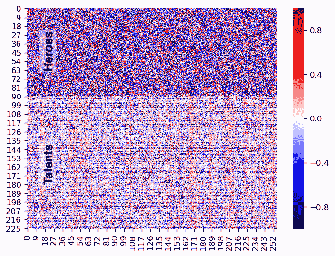

# 预测 MOBA 比赛结果

> 原文：<https://dev.to/vrinek_94/predicting-moba-match-results-575a>

在完成了深度学习的 Coursera 专业课程后，我想选择一个足够简单的机器学习项目来深入研究。我想要一些足够简单的表达方式和一些我能理解的东西。

所以我决定预测我最喜欢的 MOBA 的比赛结果。

# 目录

1.  [问题](#the-problem)
2.  [多一点上下文](#a-little-more-context)
3.  [数据集](#the-dataset)
4.  [训练模型](#training-the-model)
5.  [初步结果](#initial-results)
6.  [清洗数据](#cleaning-data)
7.  [更新数据后的结果](#later-results-with-clean-data)
8.  [有人才培训和无人才培训之间的差异(或缺乏差异)](#difference-between-training-with-and-without-talents)
9.  我们学到了什么？
10.  [接下来的步骤](#next-steps)

# 问题

## 预测人才效力

我决定特别关注一个模式，“Aral”，一个为玩家随机挑选英雄的休闲模式，玩家可以从中挑选一些天赋。目标是摧毁对方的基地，同时保持自己的基地不动。

简单来说，我想回答以下问题:

哪种天赋给了我赢得特定比赛的最大机会？

“特定比赛”被定义为已经从两个队中选出的英雄的花名册。

# 多一点上下文

[https://www.youtube.com/embed/hLTeeAIM4lw](https://www.youtube.com/embed/hLTeeAIM4lw)

## 什么是 MOBA

一个 MOBA，[多人在线战斗竞技场](https://en.wikipedia.org/wiki/Multiplayer_online_battle_arena)，是一个由 DOTA、[古人防御](https://en.wikipedia.org/wiki/Defense_of_the_Ancients)、魔兽争霸 3 的 mod 普及(甚至可能起源)的视频游戏流派。

mod 如此受欢迎，以至于衍生出了相当多的后续游戏，最著名的是 [DOTA 2](https://en.wikipedia.org/wiki/Dota_2) 和[英雄联盟](https://en.wikipedia.org/wiki/League_of_Legends)。在移动端，虚荣和[英勇竞技场](https://en.wikipedia.org/wiki/Arena_of_Valor)已经相当成功，就我个人而言，缺乏一个好的 PC 设置，我蜂拥至这些移动端。

游戏类型有点像这样:

*   地图上有两个团队
*   每个队都有一个基地和一些防御设施
*   第一个摧毁对方基地的队伍获胜

## 什么是英雄

在比赛开始前，每个玩家必须选择他们的英雄。每个英雄都有与众不同的特质和能力。它们在移动速度、攻击速度、伤害输出、防御、特殊能力、被动特征等方面有所不同。

比如我在虚荣上玩的最多的英雄是[莱拉](https://www.vainglorygame.com/heroes/lyra/)。她是一个拥有治疗和保护魔法的法师。她有一个远程基础攻击，可以减慢目标的速度，但不太像个人防御机制。

她通常的角色是队长之一，这基本上意味着她最擅长支持其他英雄发挥他们的最佳水平，并让他们活着。

[https://www.youtube.com/embed/5URpZoYn9a8](https://www.youtube.com/embed/5URpZoYn9a8)

## 什么是能力

虚荣中的每个英雄有 1 点额外津贴和 3 点能力。

这种特殊待遇通常与他们的基本攻击相联系。例如，莱拉的特长，**原理奥秘**，在她的基础攻击上增加第二击，使其更加强大并减缓她的目标。

这些技能通常由玩家激活以提供一个效果，并且有冷却时间，可能还有一些费用(比如法力、耐力、怒气等)。

例如，莱拉有三种能力:

*   帝国印记:她在地上刻下一个印记，治疗盟友并伤害敌人
*   明亮壁垒:她竖起一个泡泡，阻止敌人使用基于移动的技能
*   神秘通道:她在两点之间创造了一条传送隧道

基本攻击，津贴和能力是英雄影响他们的环境和比赛进程的主要方式。

## 什么是天赋

在虚荣的选择模式中，即阿拉尔和闪电战，玩家可以为他们的英雄选择 3 种天赋中的一种。这些天赋对于每个英雄来说都是独一无二的，并且影响着他们的英雄的玩法。

例如，莱拉的才能如下:

*   双发导弹:用她基础攻击的减速效果换取更多伤害
*   移动堡垒:让她的泡泡跟随她，而不是停留在她施放的地方
*   Gythian Ward :授予一个小屏障并清除其周围盟友的所有减益效果

这些天赋通常是优势和劣势之间的交易。它们也可以升级以提高效率。

[https://www.youtube.com/embed/lM8MF6WlAG8](https://www.youtube.com/embed/lM8MF6WlAG8)

# 数据集

我的数据包括已经进行的比赛及其结果。

## 三热向量为组队作文

为了模拟每个团队的英雄组成，我最终使用了一个*三热向量*。(我不知道这是不是真的)

### 什么是三热？

一个**独热向量**是一个向量(vector 本质上是一个有序的数字列表),其中所有的值都是 0，并且只有**其中一个**是 1。它看起来有点像这样:

```
vector = [0, 0, 0, 1, 0, 0, 0, 0, 0] 
```

三热向量背后的想法是，它类似于一热向量，但有三个位置设置为 1，而不是只有一个。这使得表示一组 3 个唯一值成为可能。看起来是这样的:

```
vector = [0, 1, 0, 1, 1, 0, 0, 0, 0] 
```

另一种解释方式是用类型理论。在这种情况下，独热向量可以表示一个枚举，而三热向量可以表示恰好三个枚举的唯一集合。

### 为什么三热？

在我们的例子中，一个团队的花名册只能包含一个英雄。例如，不可能有一个由两个 Lyras 和一个 Idris 组成的团队。

另外，英雄在队伍中是没有顺序的。

这允许我们用一个三热向量来表示一个团队的名单，向量的大小是可用英雄的数量(在撰写本文时是 45)。

## 天赋异禀——热矢

当决定如何构建数据集中的英雄天赋时，我有几个选择。

由于每个英雄有 3 个天赋(稀有，史诗，传奇)，我可以选择一个 **softmax 3** 激活输出节点。我决定不这么做，因为当时对于一个模型来说，学习所有的关联感觉太复杂了。

另一种方法是将输出再次建模为 softmax，但是包括所有英雄的所有天赋(总共 135 个)。这也是次优的，因为总会有 132 个天赋是玩家无法获得的。

相反，我用了一个在 Coursera 课程中学到的技巧。我将人才列表放入输入中，并要求模型预测给定一个选定人才的可能结果。这样，我每次都必须做出 3 个预测来回答我的问题“哪种天赋？”。

因此，我最终将天赋表示为一个 45x3+1=136 个位置(45 个英雄 x 每个 3 个天赋+1 个“没有选择天赋”)的一键向量。请注意，玩家有可能没有解锁他们选择的英雄的任何天赋。在这种情况下,“未选择人才”位置将被翻转为“开”。

旁注:仔细想想，人才向量上的“没有选择人才”位置可能会被删除。我必须做一两个实验来验证这一点。

## 标记实验(tanh，sigmoid，softmax)

对于标签，我不知道如何建模，所以我做了一些实验。

<colgroup><col class="org-left"> <col class="org-left"></colgroup> 
| 值范围 | 输出层激活函数 |
| --- | --- |
| (-1, 1) | 双曲正切 |
| (0, 1) | 乙状结肠的 |
| 2x(0，1) | softmax |

在上述方法中，`softmax`方法产生了最好的结果(通过验证集的准确性来衡量)，所以我坚持使用它。差别很小，我只能猜测这部分是由于 Tensorflow(我正在使用的 Keras 后端)的优化方式。

## 把它们都放在一起

为了从一场比赛中生成输入，我选择了这场比赛，并为每个英雄定义了:

*   **我的团队**作为三热载体
*   **其他团队**作为三热向量
*   **我的天赋**作为一个热门向量
*   **裁决**从英雄的角度看是一个从 1(赢)到-1(输)的数字

并堆叠向量以产生 226 大小的向量。

例如，下面是一个预堆叠的数据条目:

```
{  "matchID":  "ab137e32-e381-11e8-a4e9-02b7582ce766",  "x":  {  "ours":  [  0,  0,  0,  0,  0,  0,  0,  0,  0,  0,  0,  0,  0,  0,  0,  0,  0,  1,  0,  0,  0,  0,  0,  0,  0,  0,  0,  0,  0,  1,  0,  0,  0,  0,  0,  0,  0,  0,  0,  0,  0,  0,  1,  0,  0  ],  "theirs":  [  0,  0,  0,  0,  0,  0,  0,  0,  0,  0,  0,  0,  0,  0,  0,  0,  0,  0,  0,  0,  0,  1,  0,  0,  0,  0,  0,  0,  0,  0,  0,  0,  0,  1,  0,  0,  0,  0,  1,  0,  0,  0,  0,  0,  0  ],  "myTalents":  [  0,  0,  0,  0,  0,  0,  0,  0,  0,  0,  0,  0,  0,  0,  0,  0,  0,  0,  0,  0,  0,  0,  0,  0,  0,  0,  0,  0,  0,  0,  0,  0,  0,  0,  0,  0,  0,  0,  0,  0,  0,  0,  0,  0,  0,  0,  0,  0,  0,  0,  0,  0,  0,  0,  0,  0,  0,  0,  0,  0,  0,  0,  0,  0,  0,  0,  0,  0,  0,  0,  0,  0,  0,  0,  0,  0,  0,  0,  0,  0,  0,  0,  0,  0,  0,  0,  0,  1,  0,  0,  0,  0,  0,  0,  0,  0,  0,  0,  0,  0,  0,  0,  0,  0,  0,  0,  0,  0,  0,  0,  0,  0,  0,  0,  0,  0,  0,  0,  0,  0,  0,  0,  0,  0,  0,  0,  0,  0,  0,  0,  0,  0,  0,  0,  0,  0  ]  },  "y":  1  } 
```

这代表了具有 Inara、Petal 和 Varya 的“我们的”团队与具有 Kinetic、Ringo 和 Skaarf 的“他们的”团队之间的匹配。被选中的人才是花瓣的“反弹”和判决是我们(花瓣)的团队获胜。

因为我们从一个英雄/玩家的角度编译每个数据条目，所以我们最终每场比赛有 6 个条目(2 个队 x 3 个英雄)。

## 获取匹配的 API

为了编译我的数据集，我使用了 [Vainglory API](https://developer.vainglorygame.com) 。它有一个方便的端点[来获取最新的比赛](https://vainglory-gamelocker-documentation.readthedocs.io/en/master/matches/matches.html)，然后[有另一个端点来获取比赛的遥测数据](https://vainglory-gamelocker-documentation.readthedocs.io/en/master/telemetry/telemetry.html)(包括为每个英雄选择的天赋)。通过一套运行在远程虚拟机上的小脚本，我每天可以获得大约 30k 个数据条目。

## 为什么是 ScaleWay VM

最初，我将数据直接提取到我的笔记本电脑上。这很快就过时了，因为我经常让笔记本电脑进入睡眠状态，所以在获取时间表中产生了间隙。

为了继续获取数据，我通过 ScaleWay 得到了[一个便宜的虚拟机。每月 2 美元，便宜得不能再便宜了，它允许我全天候获取数据并编译我的数据集。](https://www.scaleway.com/pricing/#anchor_starter)

## 拆分为培训/开发/测试

为了开始训练，我将数据集分成 3 部分:

1.  10k 测试集，在所有训练完成后用于评估模型。
2.  10k 开发集(有时也称为验证集)，在每个训练时段使用，以评估训练进度。
3.  剩下的作为训练集，用来训练模型。

# 训练模特

我所有的代码都可以在 https://gitlab.com/gademo/vainglory-stats 找到。代码对事物的位置做了一些假设。请随意分叉和编辑并运行您自己的实验。

## Why Keras

在这一点上，我选择了 [Keras](https://vainglory-gamelocker-documentation.readthedocs.io/en/master/matches/matches.html) ,因为我想更多地关注训练和发展模型的过程，而不是优化它的细节。Keras 允许我用很少几行代码定义和训练一个模型:

```
# a few imports... 
X = Input(shape=(n_x,))
Y = Dense(1024, activation=relu)(X)
Y = Dropout(0.1)(Y)
Y = Dense(256, activation=relu)(Y)
Y = Dropout(0.1)(Y)
Y = Dense(n_y, activation=softmax)(Y)

model = Model(inputs=X, outputs=Y)

model.compile('Adam')
model.fit(
    X_train, Y_train, # the training set
    epochs=num_of_epochs,
    validation_data=(X_dev, Y_dev) # the dev set ) 
```

使用上面的代码片段，Keras 将训练模型并打印有用的指标，如每个时期的准确性和损失。

完整的培训脚本可以在 Gitlab 上找到[。](https://gitlab.com/gademo/vainglory-stats/blob/master/floyd-scripts/train.py)

## 为什么是 FloydHub

与编译数据集一样，我也想将我的笔记本电脑与训练模型分离开来。FloydHub 是实现这一点的一个非常简单的方法。设置帐户并安装 CLI 后，训练模型非常简单:

```
floyd run --data vrinek/datasets/casual-aral:casual_aral "python train.py" 
```

这个`--data`参数来自于之前将编译后的数据集上传到 FloydHub:

```
floyd data init vrinek/casual-aral # one time setup
floyd data upload                  # every time the dataset updates (about daily) 
```

这里值得一提的是，FloydHub 免费提供几个小时的 CPU 和 GPU 使用时间，还可以购买更多。

# 初步结果

## 结果准确率 99%

因此，我有我的数据集，我洗牌，分裂成训练/开发/测试集，让我的训练脚本训练模型。

经过一些实验，我能够用两个隐藏层的神经网络达到 99%的准确率(在测试集上测量):1024 个 ReLU 单元和 256 个 ReLU 单元。每个单元后面都有一个 10%的下降层。

用 Keras 编写时，整个模型看起来是这样的:

```
X = Input(shape=(n_x,))
Y = Dense(1024, activation=relu)(X)
Y = Dropout(0.1)(Y)
Y = Dense(256, activation=relu)(Y)
Y = Dropout(0.1)(Y)
Y = Dense(n_y, activation=softmax)(Y) 
```

## 胜利让位于怀疑

对于这类问题来说，99%的准确率有点奇怪。对于第一次做研究的人来说更奇怪。

仔细看看结果，我注意到对于一个固定的花名册，改变天赋只会影响大约 5%的结果。这不是我所期待的。

为了验证这一点，我重新训练了这个模型，这次没有天赋。我意识到去掉输入数据中的人才部分不会改变结果，准确率保持在 99%。

怀疑加剧...🤔

## 在训练集和开发/测试集中都存在匹配

再深入一点，我意识到打乱数据集是一个错误。因为每个匹配结果都用 6 个不同的数据条目表示，所以混洗数据集最终会将每个匹配的数据分散到训练集、开发集和测试集中。

换句话说，我是在用我用来训练模型的相同数据来验证我的模型。

# 清理数据

很明显，我的下一步是收拾这个烂摊子。

## 断言

我的首要任务是引入一些断言，这样这种情况就不会再发生了(我习惯了 TDD，所以这对我来说绝对有意义)。

```
training_set_ids = set([match['matchID'] for match in training_set])
dev_set_ids = set([match['matchID'] for match in dev_set])
test_set_ids = set([match['matchID'] for match in test_set])

# Assert that the three sets do not overlap assert(len(training_set_ids & dev_set_ids) == 0)
assert(len(training_set_ids & test_set_ids) == 0)
assert(len(dev_set_ids & test_set_ids) == 0) 
```

## 省略洗牌

显然，有了这些线，我的训练脚本失败了，这只能证实我之前的观察。解决这个问题的最简单的方法是省略对我的数据的混洗(并且将集合的大小调整为 6 的倍数)。

## 将数据视为时间序列

我并不特别乐意省略对数据的洗牌。我试图和我的橡皮鸭伙伴讨论这个问题，我回忆说，当一个模型被训练成一个时间序列的数据(例如气象或金融)时，数据不会被打乱。在这些情况下，考虑到过去的*，模型能够预测*的未来*是很重要的。*

 *在这种情况下，论点是相当薄弱的。每场比赛都与之前的比赛非常独立。它依赖于参加比赛的球员以前的比赛，但是我们的模型不是为了适应这种知识而建立的。

然而，这场辩论足以让我休息一会儿，降低安全转移数据的优先级。现在不洗牌就够了。

# 后来的结果有了干净的数据

## 对比基线准确率为 50%

在训练集上重新训练模型(这次有 500，000 个数据条目，大约 83，000 个匹配)，结果相当糟糕:

*   Dev set 精度徘徊在 **56%** 左右(假设“选择一个随机数”基线算法将成功达到 50%)
*   开发机组损失稳步增长，而列车机组损失减少

# 训练有无人才之间的差异

我还比较了在有天赋和没有天赋的情况下训练模型的结果:

*   [https://www.floydhub.com/vrinek/projects/vainglory-stats/31](https://www.floydhub.com/vrinek/projects/vainglory-stats/31)是人才培养的典范
*   [https://www.floydhub.com/vrinek/projects/vainglory-stats/30](https://www.floydhub.com/vrinek/projects/vainglory-stats/30)也是一样的模式，没有人才培养

在 dev 集上，精确度的差异是微不足道的。即使在训练集上，当将人才添加到数据集时，似乎也没有任何好处(80%对 79.3%)。

## 第一层人才的贡献

为了验证人才的贡献水平，我将第一层的权重绘制为热图:

[](https://res.cloudinary.com/practicaldev/image/fetch/s--6YUcOx47--/c_limit%2Cf_auto%2Cfl_progressive%2Cq_auto%2Cw_880/https://i.imgur.com/opRFwZm.png)

有了这种可视化，很容易就能发现不同之处。Y 轴上的 0-89 代表英雄特征权重，90-225 代表天赋权重。平均来说，看起来英雄特有的特征比天赋更适合极端权重。

一些随机抽样的结果证实了这一点。选择一个数据条目并改变选择的人才通常会影响产值高达 5%。

# 我们学到了什么？

最后，我研究这个问题的动机更多的是为了获得自上而下的机器学习问题的实践经验，而不是实际解决问题。

那么，我学到了什么？

## 关于问题

模特没学到多少东西。这可能意味着几件事:

### 模型的架构无法适应数据

这是有可能的。尽管同样的架构能够记住所有的匹配，我怀疑一个更复杂的模型会有多大的好处。

### 数据不够

很有可能。现在，有 60 万个数据条目，我们有 10 万个匹配。这可能是这个问题的一个小数据集。

解决这个问题的显而易见的方法是收集更多的数据。鉴于我有一个小虚拟机不知疲倦地收集数据，这应该是一个时间问题。

### 不同的特性组合会改善结果

作为一个活跃的虚荣玩家，我对这个主题有一点“专家”知识。一场比赛的结果会受到球队阵容(每支球队的英雄)的影响，但这并不是唯一的影响因素。其他因素可能是:

1.  **玩家体验**

    当涉及到一场比赛的判决时，最重要的因素之一是相关球员的经验。虚荣很大程度上是一个基于技能的游戏。

    虚荣的 API 暴露了玩家技能水平的数据，但是为了简单起见，它没有包含在模型中。

2.  **球员体能**

    可以说，一个球员在特定时间或特定条件下表现最佳。这些可能包括一天中的时间(如果在晚上 2 点玩会很累)，网络连接速度(滞后会影响玩家的性能和精神稳定性)，甚至是在玩游戏时弹出的通知(尤其是如果玩家不小心点击了一个通知)。

    这不是虚荣的 API 所拥有的(或者很容易拥有的)数据，所以这里的要点是我们的模型不能预测这一点。也许我们可以通过某种方式推断出来。

3.  **天赋等级**

    我前面提到过，天赋是有层次的。一个 1 级和 10 级的天赋可能会以不同的方式影响结果。

4.  **玩家 AFK**

    有时候一个球员会失控。有时机器人会接管(如果游戏能识别这种行为)，其他时候英雄会出现在地图上。在这两种情况下，预计团队的机会会恶化。

    虚荣的 API 有这方面的信息，它可以很容易地整合到我们的数据中。

5.  **玩家-英雄兼容性/体验**

    换句话说，“当这个玩家扮演这个特定的英雄时，他有多好？”。直到最近，虚荣还没有提供这方面的数据。这可以通过检查一个玩家与该英雄的历史比赛来推断，但这是一个独立的问题。

    不过最近，虚荣开始记录一种“英雄 XP”栏，在比赛结束后填满。这可能是英雄/玩家兼容性的一个足够好的代理。

## 关于数据卫生

模型学习的唯一途径就是通过数据。如果训练集没有与开发集和测试集充分分离，那么模型就不会一般化。

缺乏概括是我的问题，但它以一种不同于我预期的方式表现出来:我没有看到训练和开发集错误之间的巨大差异，而是在我最可能看不到的地方看到了完美的分数。

# 下一步

## 更多数据

就像我之前提到的，我会继续收集更多的数据。一旦我达到 120 万记录(20 万场比赛)，我会再试一次。我确实希望开发集的精度不会提高太多，但我也希望训练集的精度会更接近开发集的精度。这是因为模型将被迫对所有这些数据进行更多的归纳。

我还将尝试在另一个维度上扩展数据集:添加更多要素。这需要考虑关注哪些特性以及如何对它们建模。

## 申请

这个实验的预期最终结果将是构建一个应用程序，作为 web 服务来服务这个模型。我已经确定了一些有用的技术来完成这项工作(例如 [tensorflow-js](https://js.tensorflow.org) )，我打算在等待数据集自行收集的同时尝试一下。*