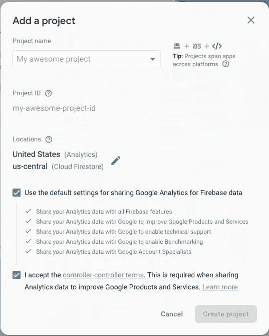
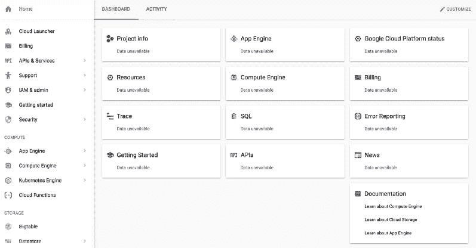
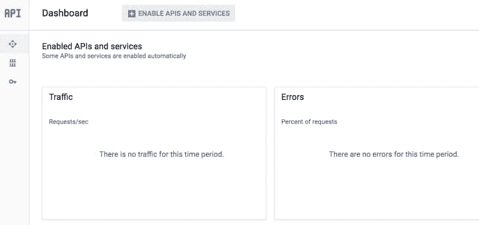
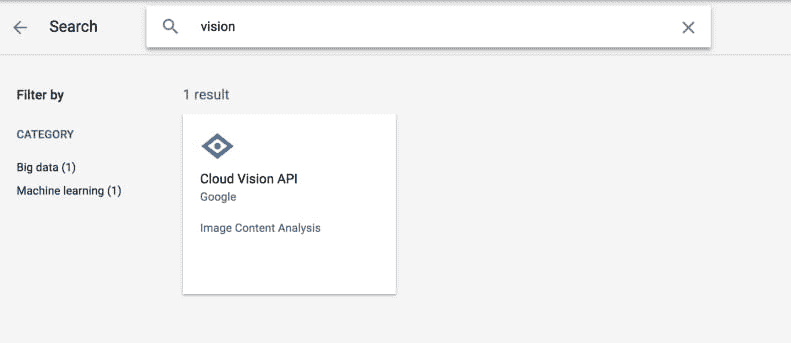
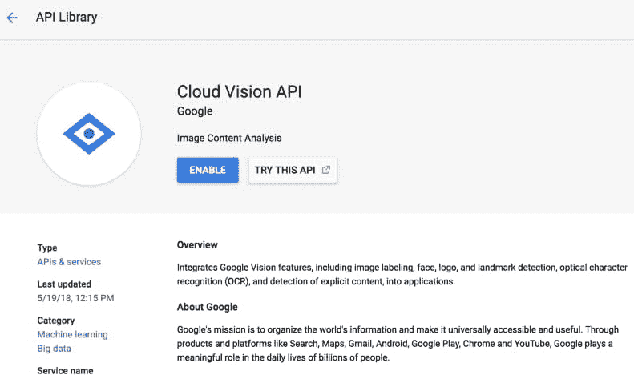

# 使用 Google Vision API 创建 React 原生图像识别应用程序

> 原文：<https://dev.to/jscrambler/create-a-react-native-image-recognition-app-with-google-vision-api-526>

**这篇文章最初由 Aman Mittal** 发表在 [Jscrambler 博客](https://blog.jscrambler.com/create-a-react-native-image-recognition-app-with-google-vision-api/?utm_source=dev.to&utm_medium=referral)上。

Google Cloud Vision API 是一种机器学习工具，可以通过预先训练的 API 模型，将作为输入提供的图像的细节分类到数千种不同的类别中。它通过一个 API 提供这些预训练的模型，并且类别被检测为图像中的单个对象。

在本教程中，您将学习如何将 Google Cloud Vision API 集成到 React 原生应用程序中，并利用实时 API。你可以在[这个 GitHub repo](https://github.com/JscramblerBlog/google-vision-rn-demo) 里面找到完整的代码。

## 安装世博

如果你不熟悉 Expo，这个教程可以是一个很好的开始。基本上，Expo 提供了一套工具，可以轻松地创建和发布 React 本地应用程序。早些时候，React Native 有一个名为`create-react-native-app`的东西，它现在与 Expo-Cli 合并，是构建 React Native 应用程序的官方方式。

要创建您的 React 本机应用程序，您需要将 Expo 安装为一个全局 npm 模块。

```
npm install -g expo-cli 
```

一旦 Expo 的命令行界面安装在您的本地开发环境中，您必须运行下面的命令来生成一个项目。

```
expo-cli init google-vision-rn-demo 
```

它会问你使用哪个模板；选择选项**空白模板**而不是标签页模板。出于演示目的，我们的应用程序中只需要一个屏幕。在最后一步，系统会提示您输入项目的名称——只需输入名称并按回车键。然后，它将开始安装依赖项。

创建项目后，遍历项目目录。如果您需要此设置的任何帮助，请参考 [Expo 文档](https://docs.expo.io/versions/v32.0.0/workflow/configuration/)。

## 设置 Firebase

在本节中，我们将建立一个新的 Firebase 项目。它将为我们提供数据库和后端服务，我们不必为这个教程编写自己的后端，因此节省了时间，并专注于我们需要学习的内容。为简单起见，出于演示目的，我们将公开 Firebase 项目数据。

访问 [Firebase](https://console.firebase.google.com/) 并用您的 Google ID 登录。登录后，点击一个新项目并输入名称。最后，点击**创建项目**按钮。

<center></center>

下一步是确保我们设置了 Firebase 数据库规则，允许我们通过应用程序上传图像文件。从 Firebase 控制台的左侧菜单中，打开`Database`选项卡，然后选择`Rules`并按如下方式进行修改。

```
service cloud.firestore {
 match /databases/{database}/documents {
   match /{document=**} {
     allow read, write;
   }
 }
} 
```

我们需要在 React 本地应用程序中安装 Firebase SDK。从您的终端运行以下命令。

```
npm install -S firebase 
```

现在，创建一个名为`config`的文件夹，并在其中创建一个名为`environment.js`的新文件。这个文件将包含引导程序和我们的应用程序挂钩 Firebase 所需的所有密钥。

```
//environment.js
var environments = {
  staging: {
    FIREBASE_API_KEY: 'XXXX',
    FIREBASE_AUTH_DOMAIN: 'XXXX',
    FIREBASE_DATABASE_URL: 'XXXX',
    FIREBASE_PROJECT_ID: 'XXXX',
    FIREBASE_STORAGE_BUCKET: 'XXXX',
    FIREBASE_MESSAGING_SENDER_ID: 'XXXX',
    GOOGLE_CLOUD_VISION_API_KEY: 'XXXX'
  },
  production: {
    // Warning: This file still gets included in your native binary and is not a secure way to store secrets if you build for the app stores. Details: https://github.com/expo/expo/issues/83
  }
};

function getReleaseChannel() {
  let releaseChannel = Expo.Constants.manifest.releaseChannel;
  if (releaseChannel === undefined) {
    return 'staging';
  } else if (releaseChannel === 'staging') {
    return 'staging';
  } else {
    return 'staging';
  }
}
function getEnvironment(env) {
  console.log('Release Channel: ', getReleaseChannel());
  return environments[env];
}
var Environment = getEnvironment(getReleaseChannel());
export default Environment; 
```

`X`是你必须填写的每个键的值。现在忽略键`GOOGLE_CLOUD_VISION_API_KEY`的值，因为我们将在下一节回到它。可以在 Firebase 控制台上获得相应键的其他值。你可以通过访问 Firebase 控制台获得这些值，然后点击左侧菜单栏中`Project Overview`旁边的齿轮图标，最后转到`Project settings`部分。在 Expo 中有很多方法可以让你在部署应用程序或者在 GitHub 这样的网站上上传代码时不必发布你的密钥。我们建议的第一步是将这个文件添加到`.gitignore`中。

然后在`config`目录中创建另一个名为`firebase.js`的文件。我们将在主应用程序中使用这个文件来发送上传图像到 Firebase 存储器的请求。另外，请注意，我们在其中导入了`environment.js`来访问 Firebase 键。

```
// firebase.js
import * as firebase from 'firebase';

firebase.initializeApp({
  apiKey: Environment['FIREBASE_API_KEY'],
  authDomain: Environment['FIREBASE_AUTH_DOMAIN'],
  databaseURL: Environment['FIREBASE_DATABASE_URL'],
  projectId: Environment['FIREBASE_PROJECT_ID'],
  storageBucket: Environment['FIREBASE_STORAGE_BUCKET'],
  messagingSenderId: Environment['FIREBASE_MESSAGING_SENDER_ID']
});

export default firebase; 
```

## 获取谷歌云视觉 API 密钥

要使用谷歌云平台服务，你需要一个 Gmail 账户。一旦你通过 Gmail ID 登录，你就可以访问[谷歌云控制台](https://console.cloud.google.com/)。下一步是创建一个新项目。

[](https://res.cloudinary.com/practicaldev/image/fetch/s--Cz3W0Khl--/c_limit%2Cf_auto%2Cfl_progressive%2Cq_auto%2Cw_880/https://blog.jscrambler.com/conteimg/2019/02/jscrambler-blog-create-react-native-image-recognition-app-google-vision-api-dashboard.jpg)

从下拉菜单中点击`select a project`，然后点击`click new project`。输入你的项目名称，然后点击`Create`。一旦您创建了项目，我们将再次回到主控制台页面，然后需要选择我们新创建的项目。

这个过程的下一步是获取您的 API 密钥。这可以通过点击控制台并移动到`Dashboard`部分并在该部分下选择`Enable APIs and Services`来实现。

[](https://res.cloudinary.com/practicaldev/image/fetch/s--GankQ5-D--/c_limit%2Cf_auto%2Cfl_progressive%2Cq_auto%2Cw_880/https://blog.jscrambler.com/conteimg/2019/02/jscrambler-blog-create-react-native-image-recognition-app-google-vision-api-enable-api.jpg)

然后在搜索中输入**视觉**，如下图所示，然后点击`Vision API`。

[](https://res.cloudinary.com/practicaldev/image/fetch/s--3zhuXo06--/c_limit%2Cf_auto%2Cfl_progressive%2Cq_auto%2Cw_880/https://blog.jscrambler.com/conteimg/2019/02/jscrambler-blog-create-react-native-image-recognition-app-google-vision-api-vision.jpg)

最后，点击下面的`Enable`

[](https://res.cloudinary.com/practicaldev/image/fetch/s--5AzSywY5--/c_limit%2Cf_auto%2Cfl_progressive%2Cq_auto%2Cw_880/https://blog.jscrambler.com/conteimg/2019/02/jscrambler-blog-create-react-native-image-recognition-app-google-vision-api-enable-1.jpg)

为了完成启用 Vision API 服务的过程，您需要向您的 Google Cloud Platform 帐户添加计费信息(如果您还没有这样做的话)。

您在仪表板中的 URL 将如下所示:`https://console.cloud.google.com/apis/dashboard?project=FIREBASE-PROJECT-ID&folder&organizationId`。一旦你进入下面的屏幕，点击左侧菜单中的`Credentials`部分，如果没有新的 API 键，点击`Create Credentials`按钮，然后点击`API Key`，创建一个新的 API 键。

[](https://res.cloudinary.com/practicaldev/image/fetch/s--PBWvpuAq--/c_limit%2Cf_auto%2Cfl_progressive%2Cq_auto%2Cw_880/https://blog.jscrambler.com/conteimg/2019/02/jscrambler-blog-create-react-native-image-recognition-app-google-vision-api-credentials.jpg)

一旦创建了 API 密匙，就应该将它添加到密匙`GOOGLE_CLOUD_VISION_API_KEY`的文件`environment.js`中。

就是这样。API 的设置已经完成。我们现在可以继续开发应用程序本身了。

## 构建 App

首先，我们需要安装一个名为`uuid`的 npm 包，为将要上传到 Firebase 存储服务的映像创建一个独特的 blob。运行命令`npm install --save uuid`。接下来，打开`App.js`，把你能找到的[的代码粘贴到](https://github.com/JscramblerBlog/google-vision-rn-demo/blob/master/App.js)这里。

注意，大部分访问和上传到 Firebase 的源代码都来自于[一个使用 Expo 和 Firebase 的例子](https://github.com/expo/firebase-storage-upload-example)。我们将在下面解释连接和运行 Firebase 的关键点。首先，让我们从了解`uploadImageAsync`在做什么开始。

```
async function uploadImageAsync(uri) {
  const blob = await new Promise((resolve, reject) => {
    const xhr = new XMLHttpRequest();
    xhr.onload = function() {
      resolve(xhr.response);
    };
    xhr.onerror = function(e) {
      console.log(e);
      reject(new TypeError('Network request failed'));
    };
    xhr.responseType = 'blob';
    xhr.open('GET', uri, true);
    xhr.send(null);
  });

  const ref = firebase
    .storage()
    .ref()
    .child(uuid.v4());
  const snapshot = await ref.put(blob);

  blob.close();

  return await snapshot.ref.getDownloadURL();
} 
```

如上面的代码片段所示，`uploadImageAsync`函数通过在`uuid`的帮助下创建唯一的图像 ID 或 blob 来上传图像。它还使用`xhr`向 Firebase 存储器发送上传图像的请求。我们还在`App`组件中定义了一个默认状态，并请求用户允许使用相机胶卷或图库或从设备的相机中拍照，如下面的代码片段所示。

```
state = {
    image: null,
    uploading: false,
    googleResponse: null
  };

  async componentDidMount() {
    await Permissions.askAsync(Permissions.CAMERA_ROLL);
    await Permissions.askAsync(Permissions.CAMERA);
 } 
```

我们的`App component`中的`Button`将图像发布到 Google 的云视觉 API。

```
<Button
  style={{ marginBottom: 10 }}
  onPress={() => this.submitToGoogle()}
  title="Analyze!"
/> 
```

当用户按下按钮`Analyze`时，`submitToGoogle`方法发送请求并与 API 通信以获取结果。

```
submitToGoogle = async () => {
   try {
     this.setState({ uploading: true });
     let { image } = this.state;
     let body = JSON.stringify({
       requests: [
         {
           features: [
             { type: "LABEL_DETECTION", maxResults: 10 },
             { type: "LANDMARK_DETECTION", maxResults: 5 },
             { type: "FACE_DETECTION", maxResults: 5 },
             { type: "LOGO_DETECTION", maxResults: 5 },
             { type: "TEXT_DETECTION", maxResults: 5 },
             { type: "DOCUMENT_TEXT_DETECTION", maxResults: 5 },
             { type: "SAFE_SEARCH_DETECTION", maxResults: 5 },
             { type: "IMAGE_PROPERTIES", maxResults: 5 },
             { type: "CROP_HINTS", maxResults: 5 },
             { type: "WEB_DETECTION", maxResults: 5 }
           ],
           image: {
             source: {
               imageUri: image
             }
           }
         }
       ]
     });
     let response = await fetch(
       "https://vision.googleapis.com/v1/images:annotate?key=" +
         Environment["GOOGLE_CLOUD_VISION_API_KEY"],
       {
         headers: {
           Accept: "application/json",
           "Content-Type": "application/json"
         },
         method: "POST",
         body: body
       }
     );
     let responseJson = await response.json();
     console.log(responseJson);
     this.setState({
       googleResponse: responseJson,
       uploading: false
     });
   } catch (error) {
     console.log(error);
   }
 };
} 
```

Vision API 使用 HTTP Post 请求作为 REST API 端点，对请求中发送的图像执行数据分析。这是通过 URL `https://vision.googleapis.com/v1/images:annotate`完成的。为了认证每个请求，我们需要 API 密钥。这个 POST 请求的主体是 JSON 格式的。比如:

```
{  "requests":  [  {  "image":  {  "content":  "/9j/7QBEUGhvdG9...image contents...eYxxxzj/Coa6Bax//Z"  },  "features":  [  {  "type":  "LABEL_DETECTION",  "maxResults":  1  }  ]  }  ]  } 
```

您可以为每个类别更改`maxResults`的值。来自 Vision API 的响应也是 JSON 格式。

```
"labelAnnotations":  Array  [  Object  {  "description":  "water",  "mid":  "/m/0838f",  "score":  0.97380537,  "topicality":  0.97380537,  },  Object  {  "description":  "waterfall",  "mid":  "/m/0j2kx",  "score":  0.97099465,  "topicality":  0.97099465,  },  Object  {  "description":  "nature",  "mid":  "/m/05h0n",  "score":  0.9594912,  "topicality":  0.9594912,  }  ] 
```

上述结果可以在终端上从 Expo 日志中查看。通过下面在 iOS 模拟器上做的一个简短演示，你可以看到这个应用程序是如何工作的。

<center></center>

如果您访问 Firebase 中的存储部分，您会注意到每个图像都以 base64 二进制字符串的名称存储。

[](https://res.cloudinary.com/practicaldev/image/fetch/s--1RzoPe4P--/c_limit%2Cf_auto%2Cfl_progressive%2Cq_auto%2Cw_880/https://blog.jscrambler.com/conteimg/2019/02/jscrambler-blog-create-react-native-image-recognition-app-google-vision-api-files.jpg)

如果你有一个真实的设备，只需下载 Expo 客户端，扫描二维码，然后你就可以尝试应用程序内的`Take a photo`功能。

## 结论

在本教程中，我们向您展示了如何集成 Firebase 存储服务，以及如何将机器学习 API(如 Google 的 Vision API)与 React Native 和 Expo 应用程序结合使用。

有问题可以直接发微博到[@ amani se](https://twitter.com/amanhimself)问作者。