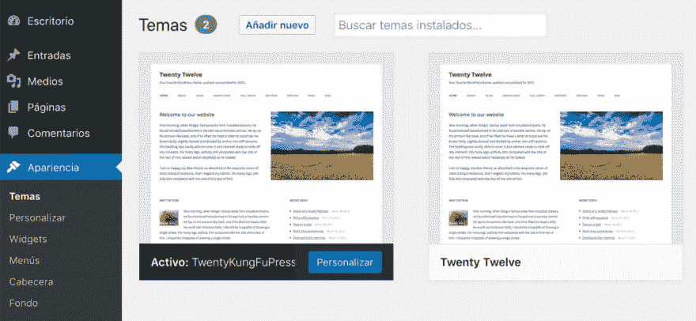
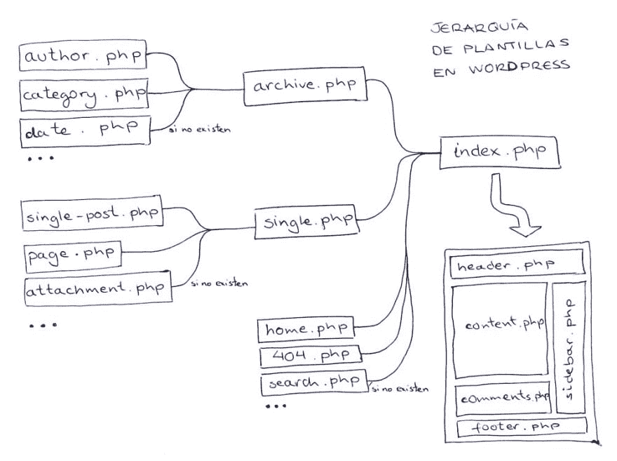
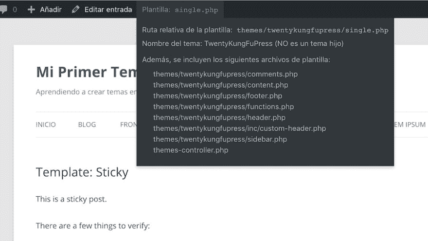

# 解构 WordPress 主题了解它是如何工作的

> [https://dev . to/juananuiz/解构-un 主题-WordPress-to-understand-how-works-2b 38](https://dev.to/juananruiz/deconstruyendo-un-tema-de-wordpress-para-entender-como-funciona-2b38)

从小我就喜欢拆东西看它们是怎么工作的，我记得五六岁的时候妈妈把床头柜上的闹钟弄坏了。这是一个非常现代的闹钟，黄色的塑胶闹钟和两个铃，中间有一个小锤子。闹钟只好把它扔进垃圾桶，但看到它的内脏，我感到很兴奋，整个下午我都在操纵齿轮。

计算机系统也是一样:我喜欢看里面的东西，看看它们是如何工作的。刚开始，因为我不知道，所以我只是出去玩玩，看看什么是重要的，什么不是那么重要。

对于此练习，我建议您安装 WordPress twentwelve 主题。你会用手指的角打破主题。**！**

## 准备测试主题

首先，您将在不到 10 秒钟的时间内了解如何创建主题。从文件浏览器中安装主题 twentytwelve，在“**”WP _ content/themes“**”内搜索主题文件夹，并在同一目录中以不同名称复制主题。打开位于您复制并重命名的文件夹中的文件 **style.css** ，并将第二行中的名称改为其他名称，在我的情况下，我将把它放在转到控制面板，打开**外观** > **主题。**你有一个新话题！

现在，让我们做一些类似于我的手表。在 **wp_content/themes** 内创建一个空文件夹，您可以将其命名为候车室。浏览到 tweykups 主题中的所有文件所在的文件夹，或者您命名的文件夹，然后将其中的所有文件和目录移动到您刚刚创建的文件夹中。转到主题管理屏幕查看发生了什么。您肯定会收到一条消息，说明当前主题已损坏，WP 已返回到默认主题，这样您的访问者就不会被留空。

至少需要一个主题才能运行，例如文件**【index . PHP】**和**【style . CSS】**，请从候车室重新打开主题。现在主题不会出错，但是当你去查看网站时，你会发现类似这样的错误:*错误:不可预料的错误:调用未定义的函数 twelve _ content _ nav()*

这是因为主题中内置的函数调用无法加载，很可能是因为我们没有将文件“**functions . PHP**”包括在协议中，我们可以将该文件包括在内，也可以从“**index . PHP]T3]中删除函数调用因为我们选择的主题做得很好，所以很容易识别它们，因为它们都是以**tweetwelve 开头的。**目前我们只会发现一两个，所以我们可以简单地评论一下。重新加载站点，现在应该可以看到页眉、页脚甚至侧栏。主题起作用了！  但缺少内容**

这很可能是因为缺少一个名为 **content.php** 的文件，该文件负责显示每个条目或页面的内容，您可以在 Twelve 中直接在根文件夹中找到，在较现代的主题中可能会隐藏得更深一些，例如**模板中好吧，你现在要做什么？将文件复制到相应的文件夹中，现在您应该可以查看内容。**

函数调用错误可能再次出现，因为没有任何内容，请转到“**content . PHP”和“**”对函数调用进行注释。如果现在一切顺利，你应该可以看到内容、边栏等。

∞就是一切看起来都很丑！如果是真的，那么继续前进的话，现在从等候室复制**【footer . PHP】**、**【functions . PHP】**和**【header . PHP】**，重新打开浏览器，你的一切努力都会得到回报，错误开头为】

忘恩负义！，他想要更多的文件，他抱怨一个在文件夹 **inc** 中，所以为了不再听他的话，他把整个文件夹复制到你的主题中(只有两三个文件)。

马上！这已经是一个话题了，只是边栏的内容影响着它，走着那个‘t0’sidebar . PHP’。

并且，由于我们添加了功能。php 我们可以删除在**索引. php** 和 **content.php** 中放置的注释。你会看到现在显示的是条目的日期，还有一些额外的东西是由 **function.php.** 中定义的功能所负责的

如果你进入一页或一个条目(post)，你会看到它似乎工作正常，但如果你仔细观察，你会发现盒子没有出现来发表评论，所以你还添加了文件 **comment.php.** 我想这并没有解决任何问题。？

因为我们实际上迫使 WP 使用一个模板(即“t0”index . PHP【t1])来显示网站的所有内容(范围、条目、页面、搜索、类别等)，但大多数主题都包含专门针对我们所处理的每种内容类型的页面

*   完整条目以**单. php** 显示，
*   含有**页. php** 的页，
*   使用**搜索. php** 进行搜索，
*   具有**类别. php** 等的类别

这里有一个简单的 WPO 模板层次结构图，让您以图形方式看到我告诉您的内容，如果您想要完整的最新版本的访问[【WPO 层次结构】](https://wphierarchy.com/)

如果你现在复印 **single.php** 你会看到评论已经出现在条目中，但你真的可以知道哪个模板在任何时候都使用 WP 吗？登录博客时出现的顶栏上有一个不错的插件，就是显示当前视图模板的插件[显示当前模板](https://es.wordpress.org/plugins/show-current-template/)，如果您单击模板名称，还会提供有关模板路径和正在使用的子模板的信息。

从控制面板安装，并查看添加我们从主题中删除的其馀模板: **page.php** 、 **search.php** 、 **category.php** 、 **archive.php** 等。现在，您将看到如何加载条目、页面、类别等。这样你就可以发现，虽然 WP 喜欢在最后有很多模板，但它只满足于一个:* *index.php **

## 是我们所做的这一切破坏的道德准则吗？

作为 WordPress 开发人员(或至少作为功夫出版社的学习者)，你应该失去那种触摸和打破那些不太熟练的用户所拥有的东西的恐惧。在主题开发过程中，您通常会打开对 PHP 的调用，忘记在行尾加上分号，错误地调用函数，或者意外删除了某些文件。你必须习惯于处理和解决这些情况，甚至一些客户或朋友可能会带着一个损坏的 WP 设施来找你，他不敢碰，以免再造成破坏。该你收拾残局了。如果你已经有练习，你会表现得更安全和冷血。

记住不要在生产系统上做这些极端的做法，在没有什么可失去的地方使用当地测试设施。如果您在现实生活中遇到类似情况，请首先记住备份所有文件和数据库。如果站点没有响应，您将没有任何插件，所以您需要知道如何备份 WP 而不使用插件。