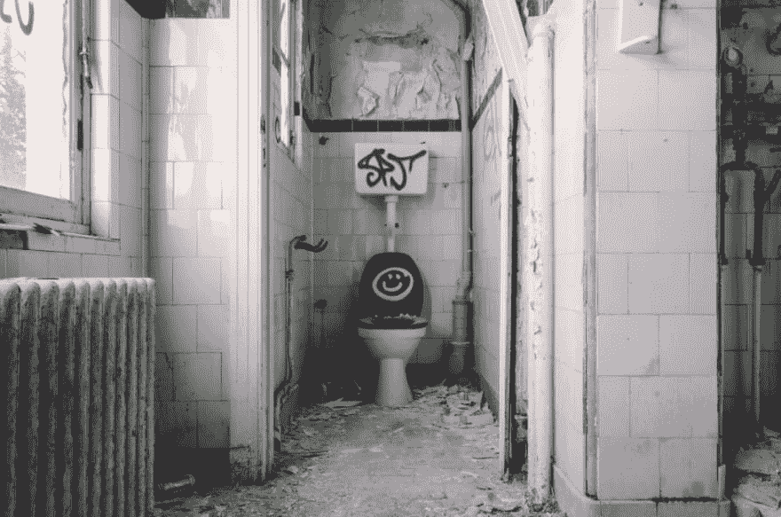

# 厕所空闲:一个通过 Slack 通知你的 Rails 应用

> 原文：<https://dev.to/runtime-revolution/toilet-vacant-a-rails-app-which-notifies-you-via-slack-3omf>

 

<figcaption>照片由 [Gabor Monori](https://unsplash.com/@gabor?utm_source=medium&utm_medium=referral) 于 [Unsplash](https://unsplash.com?utm_source=medium&utm_medium=referral)</figcaption>

每天都有你需要上厕所的时候。你从椅子上站起来，开始走向一扇门，门上画着一位绅士或女士，并希望门是空的。如果你的祈祷灵验了，你可以进去做你该做的事。

但是在这里，在我们的办公室，有时你会看到人们(包括我)在办公室里走来走去。他们不是因为健康而散步。不。他们走路是因为他们在找一个空的厕所。有时，在最糟糕的情况下，他们会回到自己的地方，而不做他们的生意。

这在我身上发生了很多，它真的磨我的齿轮(在这里插入彼得格里芬梅梅)！

如果有一种方法可以在 Slack 上通知我们厕所空了…

### **解**

这篇文章的真正目的不是提出一个复杂的解决方案来检查一个真正的厕所是否是空的。它将向您展示如何以一种有趣的方式在您的 Rails 应用程序上使用 Slack 的 Webhooks API。

完整的应用程序可在[https://github.com/jpac-run/toilet-vacant-app](https://github.com/jpac-run/toilet-vacant-app)获得，你可以查看应用程序的工作情况。有一个自述文件，说明如何运行它。正因为如此，对于某些部分我就不赘述了。您需要的唯一突出的需求是创建一个 Slack 应用程序，并允许传入的 Webhooks。你可以在这个链接中看到:【https://api.slack.com/incoming-webhooks[。](https://api.slack.com/incoming-webhooks)

好了，现在来看一些代码。

您知道该怎么做:创建一个新的 Rails 应用程序，并将 httparty 和 dotenv-rails gems 添加到您的 Gemfile 中。

使用 index 方法创建一个 ToiletsController，并将其设置为 routes.rb 中的应用程序根。

在应用程序根文件夹中，创建一个名为. env 的文件。该文件用于存储您的环境变量。

在您完成了上面提到的 Slack Incoming Webhooks 链接中的步骤之后，您现在将有一个特殊的 URL 来通过 API 发送消息，我们将把它和通道名称一起存储在一个. env 文件中，如下所示: