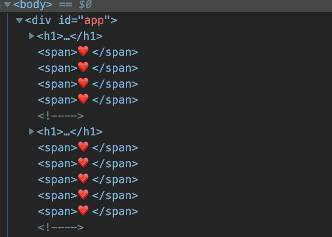

# 初学者实用 Vue.js(第 4 部分)

> 原文：<https://dev.to/marinamosti/hands-on-vuejs-for-beginners-part-4-324l>

欢迎回来！🤩

上次我们用`v-if`和`v-show`进行了条件渲染。这次我们将学习如何遍历数组和对象，并为其中的每一项创建一个元素。我们还会应用一些之前学过的概念。

# v-for

`v-for`是 *Vue.js* 的基本指令之一，一旦你理解了它是如何工作的，你可以在你的应用中构建的扩展将呈指数级增长。

`v-for`简单来说就是一个`for`循环。如果您还不知道这是什么意思，for 循环是一段代码，它对一个组中的每个元素执行一次，而这个组通常是一个`Array`或`Object`。

我们今天要从一张白纸开始，这样我们做的每一件事都有一个明确的目标。这里有一份我们基本`index.html`文件的副本，供您复制并粘贴到您的编辑器中。

```
<html>

<head>
  Vue 101
</head>

<body>
  <div id="app">

  </div>

  <script src="https://cdn.jsdelivr.net/npm/vue/dist/vue.js"></script>

  <script>
    const app = new Vue({
      el: '#app',
      data: {

      },
      methods: {

      }
    });
  </script>
</body>

</html> 
```

Enter fullscreen mode Exit fullscreen mode

让我们首先创建一个简单的列表，一个数组，我们可以循环输出它的内容。我们将在我们的`data`对象中创建一个属性，名为*游戏*。请随意将标题更改为您个人的最爱🙃🎮

```
data: {
  games: [
    'Super Mario 64',
    'The Legend of Zelda Ocarina of Time',
    'Secret of Mana',
    'Super Metroid'
  ]
}, 
```

Enter fullscreen mode Exit fullscreen mode

厉害！现在我们已经设置好了数组，让我们创建一个简单的元素来显示它。为了举例，现在让我们保持简单。

```
<div id="app">
  <ul>
    <li>Game title here</li>
  </ul>
</div> 
```

Enter fullscreen mode Exit fullscreen mode

好，看起来不错！现在我们必须告诉 *Vue* 我们想要在`<ul>`中输出尽可能多的`<li>`元素来循环我们的整个数组。

在其他语言中，甚至在普通的 JavaScript 中，您可能习惯于做类似于下面的事情:

```
<?php foreach ($game in $games): ?>
  <li><?php echo $game; ?></li>
<?php endforeach; ?> 
```

Enter fullscreen mode Exit fullscreen mode

其中循环*包围了*它将要输出或打印的元素。

在 *Vue* 中，我们在想要循环的元素上声明了我们的`v-for`指令。对您的`<li>`进行这些更改，我们将在之后分析它们。

```
<ul>
  <li v-for="game in games">{{ game }}</li> </ul> 
```

Enter fullscreen mode Exit fullscreen mode

让我们来看看。

1.  `v-for`是直接加到`<li>`上的，而不是我们之前看到的`<ul>`。上面写着:“对于我的`games`数组中的每一个`game`，请在这些`<ul>`标签中创建一个新的`<li>`。
2.  注意，`games`是我们之前用数组在`data`中添加的属性，所以我们必须使用这个变量名。
3.  变量`game`(单数)是我们自己定义的，我们可以用`item`、`game`、`title`或者任何我们喜欢的名字。但是一定要明白这个`*game* in games`是你在循环中使用的变量。
4.  最后，在我们的`<li>`标签中，我们正在输出我们的`game`变量的内容，所以当循环为我们的每个游戏运行时，它将把字符串输出到`<li>`。

在浏览器中运行您的应用程序，您应该会看到您的项目列表被输出到屏幕上。

# 上升一个档次

到目前为止，一切顺利吗？`v-for`其实是一个很简单的概念，这个例子超级无聊。那么，我们把事情变得复杂一点，让我们的数组包含一些对象，并在我们的列表中应用一些`v-if`怎么样？

首先，让我们用一些更有趣的数据更新我们的`games`属性。

```
data: {
  games: [
    { name: 'Super Mario 64', console: 'Nintendo 64', rating: 4 },
    { name: 'The Legend of Zelda Ocarina of Time', console: 'Nintendo 64', rating: 5 },
    { name: 'Secret of Mana', console: 'Super Nintendo', rating: 4 },
    { name: 'Fallout 76', console: 'Multiple', rating: 1 },
    { name: 'Super Metroid', console: 'Super Nintendo', rating: 6 }
  ]
}, 
```

Enter fullscreen mode Exit fullscreen mode

一如既往，请随意使用您自己喜欢的标题。PS。《超级银河战士》的评分 6 不是错别字，就是那么好——而且我是有偏见的。😬还有，贝塞斯达，你应该感到羞耻。*咳*反正。

如果你在这个时候运行你的应用程序，它不会特别中断，但是它会以字符串格式输出对象，这不是很好。事实上，我们将完全重写我们的`<ul>`方法，并使用一个`<div>`来输出我们的信息。(别担心，还是会很丑的)。

更新你的`<div id="app">` :

```
<div id="app">
  <div v-for="game in games">
    <h1>{{ game.name }} - <small>{{ game.console }}</small></h1>

    <span v-for="star in game.rating">❤️</span>

    <div v-if="game.rating > 5">Wow, this game must be <b>REALLY</b> good</div>
  </div>
</div> 
```

Enter fullscreen mode Exit fullscreen mode

WOAH。好吧，也许不是，但是不要担心，你已经知道你需要了解这里正在发生的一切。

1.  `div v-for="game in games"`老样子，我们将循环我们的`games`数组道具，并将每个游戏存储在`game`变量中。
2.  `h1`。好了，那么`game`是一个对象，它依次持有自己的属性，*名称*，*控制台*和*等级*。在`<h1>`中，我们将输出游戏的名称:`game.name`。还有控制台:`game.console`。正如您现在所看到的，`v-for`并不局限于像我们之前看到的`li`那样只输出一个元素，实际上您可以根据需要输出任意多的 HTML。
3.  嵌套的`v-for`。所以在`span`元素中，我们实际上有一个嵌套的`v-for`循环(这样做完全没问题)，除了有一点不同，我们没有循环一个数组或一个对象。我没有骗你，可能只是隐瞒了一些信息——比如，你可以实际上循环一个数值(在这种情况下`game.rating`，循环将从`1`开始计数，直到达到评级值。简单？
4.  最后，`v-if`。如果满足条件，我们将在循环*中输出一个`<div>`标签，因此当且仅当当前游戏的评分大于 5。猜猜是哪个？*

继续在您的浏览器中再次运行，您会发现不用担心 CSS 的神奇之处。

# 不需要包装 DIV 怎么办？

如果您发现自己制作了一堆`<div>`元素来包装您的`v-for`循环，有一个特殊的 HTML 标签可以帮助您。`<template></template>`

例如，如果你去掉包装`<div>`并把它换成`<template>`，看看你的开发人员控制台，你会发现`<h1>`和`<span>`元素没有被任何东西包装。

[](https://res.cloudinary.com/practicaldev/image/fetch/s--5TcKU4m1--/c_limit%2Cf_auto%2Cfl_progressive%2Cq_auto%2Cw_880/https://thepracticaldev.s3.amazonaws.com/i/8h8b3svfc8a2prnjs8dy.png)

`<template>`是特殊的，因为 *Vue* 会把它当作一个包装元素，但是当我们执行它的时候，它不会被呈现到 HTML 中，所以你可以安全地使用它为循环逻辑地包装一堆其他元素，而不会影响你的标记。

# 关键属性

我特意留到最后的最后一件事。`:key`属性。

当你用`v-for` *遍历元素时，Vue.js* 不知道如何跟踪元素的反应性，因为它不能“区分”一个对象和另一个对象。这对你来说意味着，因为 *Vue* 不能这样做，它将重新呈现这个循环创建的页面的整个部分。在我们的例子中，它是一个非常小的部分，对性能的影响可能是最小的，但是您应该记住这一点——并且按照最佳实践来做。

现在，我们如何使用它？

`:key`需要一些字符串来“命名”或“跟踪”元素，所以我们需要给它一个惟一的标识符。在我们的`games`的例子中很简单，我们可以做:

```
<div v-for="game in games" :key="game.name"> 
```

Enter fullscreen mode Exit fullscreen mode

我很确定我们不会在这个列表中有两次相同的游戏，所以这是非常安全的。如果你有来自数据库的数据，那么在这里使用一个`id`也是*理想的*。

如果你对错综复杂的`:key`感到好奇，你可以看看文档。[关键文件](https://vuejs.org/v2/guide/list.html#key)

事实上，既然您已经学习了这么多，我再怎么强调熟悉文档的重要性也不为过。Vue.js 的文档非常好，代码示例非常清晰，文档团队做了出色的工作来保持它们的更新和清晰——向所有人大声欢呼。

# 最终代码

这是最后的代码，以防万一。

```
<html>

<head>
  Vue 101
</head>

<body>
<div id="app">
  <div v-for="game in games" :key="game.name">
    <h1>{{ game.name }} - <small>{{ game.console }}</small></h1>

    <span v-for="star in game.rating">❤️</span>

    <div v-if="game.rating > 5">Wow, this game must be <b>REALLY</b> good</div>
  </div>
</div>

  <script src="https://cdn.jsdelivr.net/npm/vue/dist/vue.js"></script>

  <script>
    const app = new Vue({
      el: '#app',
        data: {
          games: [
            { name: 'Super Mario 64', console: 'Nintendo 64', rating: 4 },
            { name: 'The Legend of Zelda Ocarina of Time', console: 'Nintendo 64', rating: 5 },
            { name: 'Secret of Mana', console: 'Super Nintendo', rating: 4 },
            { name: 'Fallout 76', console: 'Multiple', rating: 1 },
            { name: 'Super Metroid', console: 'Super Nintendo', rating: 6 }
          ]
        }
    });
  </script>
</body>

</html> 
```

Enter fullscreen mode Exit fullscreen mode

# 挑战

如果你愿意接受挑战，这一次你会得到一个挑战。在输出游戏等级的`<span>`中添加一个`@click`监听器，并通过点击这个独特游戏的每一次`1`来增加等级。你已经知道了实现这个目标所需要的一切😉。

提示:您需要将正在循环的`game`传递给 click 函数，并检查它。

祝你好运！