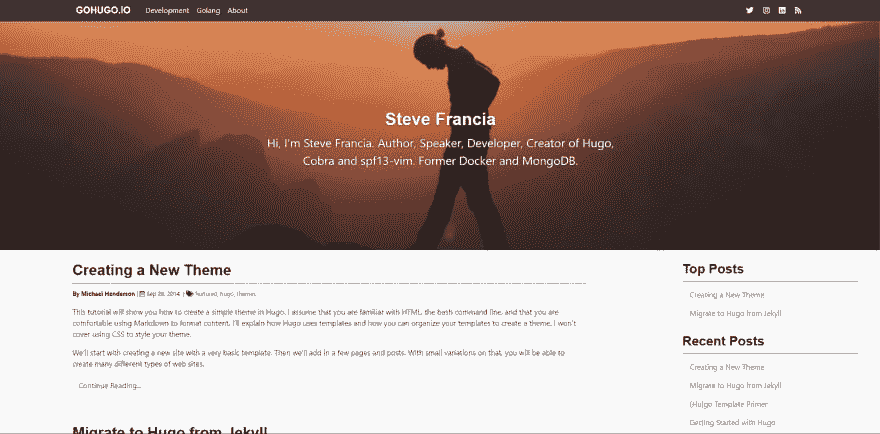

# 如何用 Hugo 创建博客和作品集:从 A 到 Z

> 原文：<https://dev.to/priteshusadadiya/how-to-create-blog-and-portfolio-with-hugo--from-a-to-z-25jl>

很久以前我就想开一个博客，用我自己的自定义域名来管理它。说实话，我是一个懒惰的博客写手——我只是偶尔写写。

最初我想在 Wordpress 上建立我的博客，但是在 VPS 服务器上配置和托管一个博客(不管多么便宜)，需要每月定期维护。

此外，保持服务器最新以避免任何风险、备份等...只是看起来额外的工作，我真的不想做。

另一种选择是在 Blogger 上开设博客，并重定向到自定义域名。这看起来也不对，因为外部对谷歌的依赖。(如果他们喜欢的话，他们可以在没有任何警告的情况下删除你的博客。不管他们实际上做还是不做，但他们可以)

由于技术背景和我的求知欲，我转向了静态站点生成器。我听说过一些关于雨果的好事情，所以想为什么不试一试。

Hogo 是一个很好的选择，因为它有 Github 页面支持，我可以用 Github 免费托管全部内容。

## 在本地设置 Hugo 服务器。

* * *

#### 安装 Hugo

有一整节专门针对不同环境的安装[详细说明](https://gohugo.io/getting-started/installing/)。

#### 选择主题

浏览了一些主题后(主题太多了)，我决定选[剪影-雨果](https://github.com/mattbutton/silhouette-hugo)。

#### 创建一个新的项目模板并派生一个主题。

```
hugo new site <SITENAME>
cd <SITENAME>/themes
git clone https://github.com/mattbutton/silhouette-hugo.git 
```

Enter fullscreen mode Exit fullscreen mode

#### 将主题添加到项目的配置文件中。

```
cd..
echo 'theme = "silhouette-hugo"' >> config.toml 
```

Enter fullscreen mode Exit fullscreen mode

#### 本地启动 Hugo 服务器

```
Hugo server 
```

Enter fullscreen mode Exit fullscreen mode

一旦 Hugo 启动，就可以在`http://localhost:1313`预览网站

#### 更改站点数据

转到你的项目主目录的 config.toml 文件，在那里你可以改变你的站点配置数据，如 baseurl，站点标题，社会链接等...

## 使用一些 CSS 来稍微改变主题的外观和感觉。

导航到/主题/剪影-Hugo/资产/css

styles.css 文件位于此处。您可以通过编辑该文件来更改主题的样式。

#### `From this`

[](https://res.cloudinary.com/practicaldev/image/fetch/s--y91Ny6El--/c_limit%2Cf_auto%2Cfl_progressive%2Cq_auto%2Cw_880/https://raw.githubusercontent.com/mattbutton/silhouette-hugo/master/github-content/screenshot-home.jpg)

#### `To this`

[](https://res.cloudinary.com/practicaldev/image/fetch/s--_9XSmB5E--/c_limit%2Cf_auto%2Cfl_progressive%2Cq_auto%2Cw_880/https://thepracticaldev.s3.amazonaws.com/i/6q17msggnil8p8iixemv.png)

> 我犯了一个愚蠢的错误，编辑了原来的主题，并用这个添加了我自己的 css。

### 从我的错误中吸取教训，记下这一点，当你使用第三方库/主题时，永远不要编辑原始文件。相反，创建您自己的新文件并引用它。

我最喜欢 hugo 的一点是 html 页面的即时变化，无需任何刷新。你可以在网站上看到数据的变化，只要你改变/添加 css 属性。]

由于用 HUGO 创建的网站将是静态网站，Github 为静态网站提供免费托管，我们将使用 [Github 页面](https://help.github.com/articles/what-is-github-pages/)。

## 创建一个 Github 存储库，并在本地机器上克隆它

我们需要做的第一件事是在 GitHub 上创建 2 个项目存储库。将你的第一个资源库命名为你的网站目录`YourProjectNanme`(你在本地机器上创建的项目)，将第二个资源库命名为**<your username>. github . io**。这个存储库将包含用 Hugo 创建的静态内容。

现在，将这些回购文件下载到您的本地机器上

```
cd <YourProjectNanme>
git clone https://github.com/YOUR-USERNAME/YOUR-REPOSITORY.git
cd YourUserName.github.io
git clone https://github.com/YOUR-USERNAME/YourUserName.github.io.git 
```

Enter fullscreen mode Exit fullscreen mode

用下面的命令
初始化你的`<YourProjectNanme>`文件夹

```
git init 
```

Enter fullscreen mode Exit fullscreen mode

与`remote`和`add`
进行远程回购

```
git remote add origin https://github.com/YOUR-USERNAME/YourProjectName.git
git pull origin master 
```

Enter fullscreen mode Exit fullscreen mode

## 编辑配置文件

在我们提交我们的更改之前，我们需要编辑`config.toml`(位于您的项目‘your Project name’的根目录中)并更改基本 URL。

```
baseurl = "https://YourUserName.github.io" // Change YourUserName with your GIthub Username 
--- OR ---
baseurl = "https://MySpecialDomainName.com" // Custom Domain Name 
```

Enter fullscreen mode Exit fullscreen mode

## 生成静态内容

现在让我们用 Hugo
生成静态内容

```
hugo -d ../YourUserName.github.io 
```

Enter fullscreen mode Exit fullscreen mode

现在将我们的 Hugo 代码推送到 github 库

```
cd YourProjectName
git add .
git commit -m "your message"
git push origin master 
```

Enter fullscreen mode Exit fullscreen mode

并将静态内容推送到 github

```
cd YourUserName.github.io
git add .
git commit -m "your message"
git push origin master 
```

Enter fullscreen mode Exit fullscreen mode

# 配置自定义域

为了在我们的 gitthub 页面中使用自定义域，我们必须为我们的域配置`A`记录(您可以在 DNS 提供商的帮助下完成这项工作)

添加下面的 IP 地址作为一个`A`记录在你的域上。

```
185.199.108.153
185.199.109.153
185.199.110.153
185.199.111.153 
```

Enter fullscreen mode Exit fullscreen mode

有两种方法可以将自定义域添加到我们项目中。

1.  在项目的根目录下创建一个 CNAME 文件
2.  使用 github 项目报告中的`Settings`选项，并添加一个自定义域。

##### 我们将采用选项 2

打开 github 项目报告 **YourUserName.github.io** 并导航至设置页面。向下滚动直到你看到 **GitHub 页面**部分，那里会有一个添加自定义域名的选项。

添加您的自定义域，然后单击保存按钮。还有另一个复选框`Enforce HTTPS`。检查它(它将提供一个加密层，您的站点将通过`HTTPS`被查看)。

如果您使用的是`www`子域，那么您可能无法选中`Enforce HTTPS`复选框。
我还收到了一个自定义域名的[隐私错误，我通过更改 DNS 记录解决了这个问题。](https://dev.to/priteshusadadiya/privacy-error-with-custom-domain-in-and-github-pages-2ll2)

我已经添加了 CNAME 记录(您可以使用 DNS 提供商添加)

```
www CNAME priteshusadadiya.com 
```

Enter fullscreen mode Exit fullscreen mode

上面的问题是，我将我的`www`子域重定向到我的 apex(主)域。

我通过将我的 CNAME 记录改为
解决了这个问题

```
www CNAME YourUserName.github.io // add your github.io url here 
```

Enter fullscreen mode Exit fullscreen mode

#### Github 在自定义域上生成 HTTPS 证书大约需要 48 小时，所以您可能需要等待。

### 结束

##### 注:

我记录了整个过程，以防将来需要。也许这对你也有用。

快乐编码。

<sup>最初发表在我的[自己的](https://www.priteshusadadiya.com/)博客上。</sup>

[使用 Hugo 静态站点生成器](https://www.priteshusadadiya.com/post/creatingablog/) 
[创建博客，在 Github 页面上托管 Hugo 站点，并自定义域名](https://www.priteshusadadiya.com/post/hosting-on-github-custom-domain/)