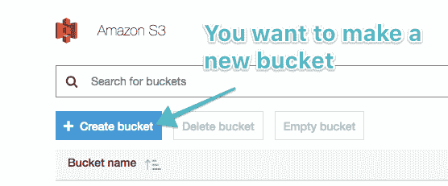
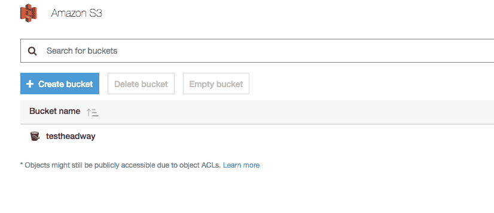
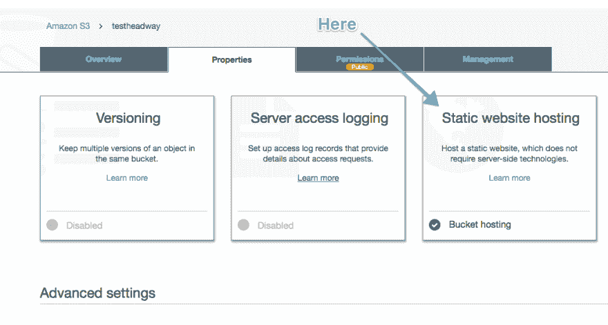
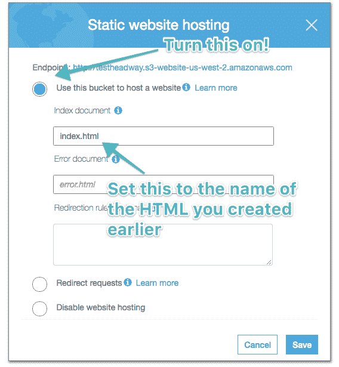
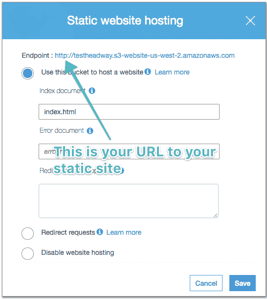
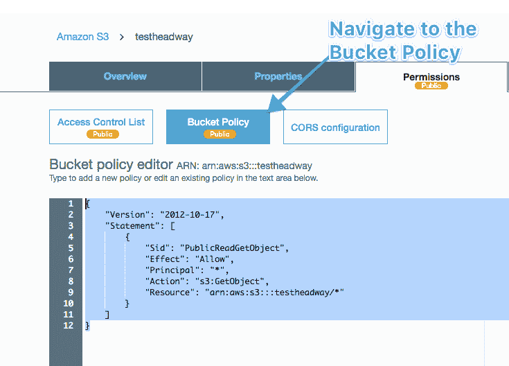
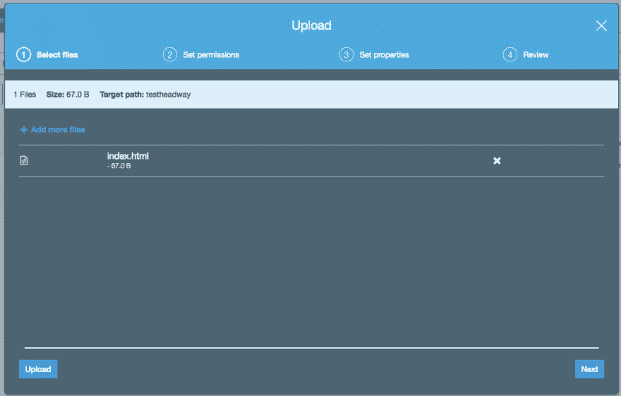

# 在亚马逊 S3 上建立一个简单的静态网站

> 原文：<https://dev.to/headwayio/build-a-simple-static-site-on-amazon-s3-1nld>

*本文原载于 [Headway 的博客](https://http://headway.io/blog/deploy-static-s3/)*

今天我将带你一步一步地学习如何使用亚马逊 S3 建立一个简单的静态网站。有时候，一个成功的网站只需要一点 HTML 和 CSS。事实上，开发一个没有完整 web 框架的网站通常会更快。

## 什么是静态站点？

静态站点是一个网站，它是 HTML 和其他资产的集合，并不从 web 框架获得服务。然而，一个静态网站绝不是没有交互性的。

静态部分指的是当用户浏览你的网站时，HTML 和其他资源被提供给浏览器的方式。没有 web 框架*为浏览器动态提供*这些资产，网站加载，然后使用 JavaScript 与其他 web 服务器和 API 交互。

**静态的超酷网络应用示例:**

[Mint:预算追踪器&策划者](https://www.mint.com/)
T3】Dropbox

## 使用静态站点的价值是什么？

HTML 和 CSS 是你开始一个简单的静态网站所需要的。

静态站点不需要 web 服务器提供服务。您不需要托管 web 框架所需的基础设施。开发一个没有完整 web 框架的网站会更有效率。

您还受益于关注点的分离，您的前端就是这样，在您的视图中，没有模板语言或模型上的调用方法。您只需处理前端，无需担心后端。

## 构建你的第一个静态站点的步骤:

1.  构建一个小小的 HTML
2.  将 HTML 上传到 AWS S3 存储桶
3.  让桶变得可访问和公开
4.  添加一些 JS 和 CSS，让你的“静态”网站大放异彩！

## HTML 文件入门

最简单的方法是创建一个 HTML 文件。传统上这被称为 index.html，但命名并不太重要。您可以指示 web 服务器提供您想要的任何 HTML 文件。

```
<!DOCTYPE html>
<html>
  <body>
    Hello World!
  </body>
</html> 
```

现在你有了一些基本的 HTML，你需要在某个地方提供它。最简单的选择之一是简单地将 HTML 文件上传到 AWS 上的 S3 桶中。

## 在 AWS 上创建新的时段

首先，前往 AWS 上的 S3 控制台。您需要添加一个新铲斗。

[](https://res.cloudinary.com/practicaldev/image/fetch/s--NgWE5woV--/c_limit%2Cf_auto%2Cfl_progressive%2Cq_auto%2Cw_880/https://thepracticaldev.s3.amazonaws.com/i/x466wgx57kgfujhqj7ou.png)

对于这个例子，我刚刚创建了一个名为“testheadway”的公共存储桶先别担心设置。只需点击即可创建桶。

## 编辑斗技主持能力

接下来，您需要为 bucket 打开托管静态网站的功能。单击存储桶进行编辑。

[](https://res.cloudinary.com/practicaldev/image/fetch/s--chSQYdY2--/c_limit%2Cf_auto%2Cfl_progressive%2Cq_auto%2Cw_880/https://thepracticaldev.s3.amazonaws.com/i/h6qvd6u6voljpxby5mrg.png)

一旦我们进入了该存储桶的编辑视图，就可以转到该存储桶的“Properties”选项卡。

[](https://res.cloudinary.com/practicaldev/image/fetch/s--ruK0WfsQ--/c_limit%2Cf_auto%2Cfl_progressive%2Cq_auto%2Cw_880/https://thepracticaldev.s3.amazonaws.com/i/x9ieyldmddsf3302r0a0.png)

然后点击进入静态网站托管卡。

[](https://res.cloudinary.com/practicaldev/image/fetch/s--GSZdRsHV--/c_limit%2Cf_auto%2Cfl_progressive%2Cq_auto%2Cw_880/https://thepracticaldev.s3.amazonaws.com/i/57lem9q9as68rjnpo19e.png)

现在选择“使用这个桶来托管一个网站”,并添加您的索引文档的名称。这几乎总是会成为您的 index.html，它应该与您之前创建的文档的名称相匹配。

[](https://res.cloudinary.com/practicaldev/image/fetch/s--xCVv3QTD--/c_limit%2Cf_auto%2Cfl_progressive%2Cq_auto%2Cw_880/https://thepracticaldev.s3.amazonaws.com/i/waibd5r95bu3u2euhllz.png)

如果你问我，这很容易！

现在，一旦这个被打开，你应该看到你的 S3 桶的一个端点。这是用于访问您新创建的静态网站的 URL。

[](https://res.cloudinary.com/practicaldev/image/fetch/s--Uw8YOvEV--/c_limit%2Cf_auto%2Cfl_progressive%2Cq_auto%2Cw_880/https://thepracticaldev.s3.amazonaws.com/i/23g71gflydfwnir0mjsp.png)

## 编辑桶权限

您需要再调整一些设置才能公开访问此 S3 存储桶。存储桶权限需要允许每个人从您的存储桶中获取对象。因为基本策略可能如下所示。只需确保将“资源”更新为您的 S3 存储桶的名称。

注意:这不安全，也不建议用于生产就绪的静态站点。向 AWS 安全专家寻求推荐的存储桶权限。

```
{
  "Version": "2012-10-17",
  "Statement": [
    {
      "Sid": "PublicReadGetObject",
      "Effect": "Allow",
      "Principal": "*",
      "Action": "s3:GetObject",
      "Resource": "arn:aws:s3:::yourbucketname/*"
    }
  ]
} 
```

将以下内容复制并粘贴到标题为“权限”的存储桶策略中。

下一步是单击存储桶策略。

[](https://res.cloudinary.com/practicaldev/image/fetch/s--A2W8YhF6--/c_limit%2Cf_auto%2Cfl_progressive%2Cq_auto%2Cw_880/https://thepracticaldev.s3.amazonaws.com/i/557pl0jox06618nw19lx.png)

现在，您需要保存 getObject 策略。AWS 将警告您，您正在向您的 bucket 中的对象授予公共访问权限。该策略仅允许人们访问您的桶中的对象，这是您所希望的，因为人们将访问您的 index.html。

如果你现在去那个网址，你会看到一个巨大的 404。

这是意料之中的，你还没有上传你的 index.html 文件。

[](https://res.cloudinary.com/practicaldev/image/fetch/s--9vY0JHp6--/c_limit%2Cf_auto%2Cfl_progressive%2Cq_auto%2Cw_880/https://thepracticaldev.s3.amazonaws.com/i/g4bohtc000bqb9aao08y.png)

## 上传 index.html

下一步是上传你的 index.html。

[](https://res.cloudinary.com/practicaldev/image/fetch/s--bBWCvg1H--/c_limit%2Cf_auto%2Cfl_progressive%2Cq_auto%2Cw_880/https://thepracticaldev.s3.amazonaws.com/i/bpiw1o2obqjr1miy3ixw.png)

此时，如果您返回到 bucket URL，您应该会看到浏览器中呈现的 HTML。

恭喜你，你已经有了一个由 AWS 托管的基本网站！

这里有一些方法，你可以用一些 CSS 和 JS 轻松地扩展网站。

同样，直接提供 HTML 也很容易，在应用程序中添加一些 CSS 也同样容易。

将一个名为 styles.css 的新文件粘贴到您的目录中。像其他静态站点生成器一样，您可以通过引用 HTML 中的 css 来为您的 HTML 添加一些基本样式。

**你的 HTML 现在应该看起来像:**

```
<!DOCTYPE html>
<html>
  <head>
    <link href="https://fonts.googleapis.com/css?family=Roboto" rel="stylesheet">
    <link rel="stylesheet" href="styles.css">
  </head>
  <body>
    <div class='center'>
      <h1>
        Hello World!
      </h1>
    </div>
  </body>
</html> 
```

**现在你可以给 styles.css 样式表添加一些样式，比如:**

```
h1 {
  font-family: 'Roboto', sans-serif;
}
.center {
  width: 100%;
  display: flex;
  flex-direction: row;
  align-items: center;
  justify-content: center;
} 
```

现在你只需要从 S3 桶中删除 index.html 文件，上传这两个文件，你应该有一个最小风格的网站启动并运行。

它应该看起来像这样:

[](https://res.cloudinary.com/practicaldev/image/fetch/s--ibgGe121--/c_limit%2Cf_auto%2Cfl_progressive%2Cq_auto%2Cw_880/https://thepracticaldev.s3.amazonaws.com/i/bx624dk86zkomnqj1pzl.png)

## 使用 jQuery 添加新元素

到目前为止，所有这些都是在没有 Javascript、没有 web 服务器或应用服务器的情况下完成的。你如何与你的小应用程序之外的世界互动？嗯，你需要添加一些 JavaScript 来实现这一点。但是，这也很简单。只需更新 HTML 以引入一些 JavaScript，您将使用 jQuery 快速获取一些天气信息并显示在您的静态站点上。

你只有三个文件。相当容易和简单，但非常强大。

```
<!DOCTYPE html>
<html>
  <head>
    <link href="[https://fonts.googleapis.com/css?family=Roboto](https://fonts.googleapis.com/css?family=Roboto)" rel="stylesheet">
    <link rel="stylesheet" href="styles.css">
    <script src="[http://code.jquery.com/jquery-latest.min.js](http://code.jquery.com/jquery-latest.min.js)" type="text/javascript"></script>
    <script src="weather.js" type="text/javascript"></script>
  </head>
  <body>
    <div class='center'>
      <h1>
        Hello World!
      </h1>
      <button id='weather_button' class='basic_button'>
        Get my Weather
      </button>
      <div class='error'>
      </div>

      <div class='weather'>
          <div class='city-name text'>
          </div>
          <div class='weather-main text'>
          </div>
          <div class='description text'>
          </div>
      </div>
    </div>
  </body>
</html> 
```

**你稍微完整的 CSS:**

```
h1 {
  font-family: 'Roboto', sans-serif;
}

.center {
  width: 100%;
  display: flex;
  flex-direction: column;
  align-items: center;
  justify-content: center;
}

.text {
  margin-top: 30px;
  font-family: 'Roboto', sans-serif;
}

.basic_button {
  font-family: 'Roboto', sans-serif;
  font-size: 18;
  margin-top: 30px;
  width: 300px;
  height: 45px;
  border-radius: 4px;
  background-color: #44AAB5
} 
```

一些 JS 与天气 API 交互，让你的静态站点更有趣。

```
$(document).ready(function() {
  $("#weather_button").click(function(e) {
    console.log(e)
    e.preventDefault();
    $.ajax({
      type: "POST",
      data: 'json',
      url: 'https://api.openweathermap.org/data/2.5/weather?zip=98229,us&appid=useyourownopenweathermapkeyplease',
      success: function(result) {
        console.log(result)
        $( ".city-name" ).text(result.name);
        $(".weather-main").text(
          result.weather &&
          result.weather[0] &&
          result.weather[0].main
        )
        $(".description").text(
          result.weather &&
          result.weather[0] &&
          result.weather[0].description
        )
      },
      error: function(result) {
        console.log('error', result)
        $(".error").text(result.error)
      }
    });
  });
}); 
```

在这里检查最终产品，它毕竟不是静态的😉:

[参见“测试进度”网站](http://testheadway.s3-website-us-west-2.amazonaws.com/)

React 的单页面应用程序(SPA)也是如此。如果你想在 S3 托管你的 SPA，你需要做的就是构建你的 React 应用，然后将所有静态资产(HTML、JS、CSS 文件)添加到你的 S3 桶中。

如果您从一个`create-react-app`应用程序构建您的 SPA，那么已经有一个构建命令来构建您的应用程序。

**你需要跑:**

`npm run build`

这将构建您的静态资产，并将它们编译到应用程序的构建目录中。

您将把构建目录的内容上传到 S3 桶，而不是上传一个 HTML 文件。

`my-react-directory/build`

现在，当你的 React 应用程序找到你的 index.html 时，它就会挂载。

## 构建静态站点相对于动态站点的优势

在当今时代，有许多方法可以构建 web 应用程序，其中之一就是托管一个静态站点，并让它与您的后端进行交互。

虽然以这种方式构建网站肯定有挑战，但也有很多积极的方面，包括分离前端和后端之间的关注点，更容易支持多个客户端，以及更好地支持现代 JavaScript SPA。

总的来说，这是一个关于如何从一个静态网站构建一个完整的示例应用程序的快速概述，这个静态网站可以很容易地、很便宜地托管在亚马逊 S3 上。

如果您对静态网站有任何疑问，或者我们可以帮助您建立 SPA、静态网站，或者帮助您将静态网站部署到亚马逊 S3，请告诉我，我们很乐意提供帮助。

## 静态站点建设推荐资源

**部署 create React 应用程序**:

[脸书 Github -创建 React 应用程序:部署](https://facebook.github.io/create-react-app/docs/deployment)

**静止地点发电机:**
[盖茨比](https://www.gatsbyjs.org/)
[雨果](https://gohugo.io/)
[杰基尔](https://jekyllrb.com/)

**托管静态网站的地方:**
[GitHub 页面](https://pages.github.com/)
[Netlify](https://www.netlify.com/)
[AWS S3](https://aws.amazon.com/s3/)