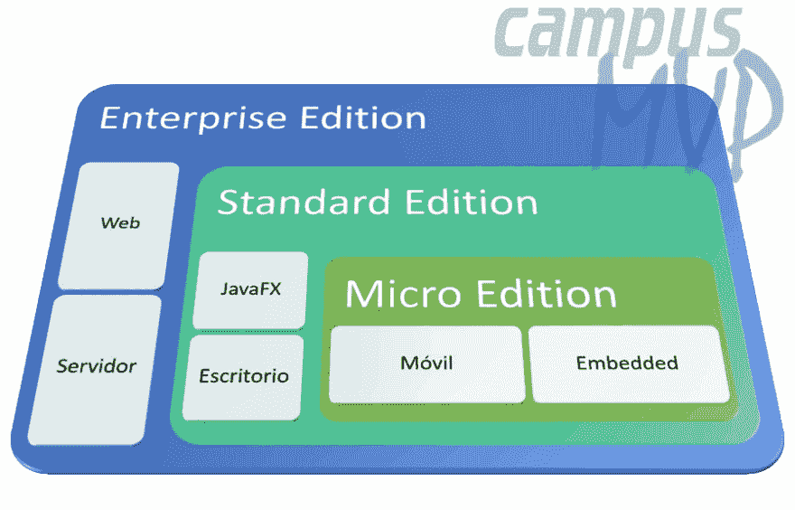

# 解密 Java:语言、平台、版本、实作-我...。

> [https://dev . to/campus MVP/解密-java 语言-平台-版本-实施-5dpj](https://dev.to/campusmvp/descifrando-java-lenguaje-plataforma-ediciones-implementaciones-5dpj)

Java 语言用于编程可以在不同平台(包括 Java 平台本身的不同版本)上运行的应用程序。此功能适用于 Microsoft Windows、Apple OS X 和 GNU/Linux 等较广泛的操作系统，以及 Solaris 等其他使用较少的操作系统。

> 实际上，标准 Java 应用程序编译后，可以在任何有 Java 运行时环境(JRE)版本(称为“t0”【Java 运行时环境】的系统上运行。也可以为不同的平台编译。

有必要在 Java 平台的许多不同部分之间进行区分:

*   JRE(*Java runtime environment*:其目的是提供运行 Java 应用程序所需的环境。JRE 包括 Java 虚拟机或 JVM(“T2”)，负责执行 *[【字节代码】](https://es.wikipedia.org/wiki/Bytecode)* Java，以及提供平台上定义的服务的库。
*   JDK ( *Java 开发工具包*:是用于执行该应用程序开发的精确工具包。此 JDK 是 JRE 的超集，可添加 Java 编译器等工具。它采用 Java 源代码并生成一种独立于操作系统和硬件的对象代码格式*字节代码*。

下图直观地说明了不同 Java 平台组件之间的关系(单击放大):

JDK 提供的工具和 JRE 提供的服务将主要取决于所使用的 Java 版本。

## Java 平台版本

Java 平台的配置主要影响它提供的服务、它所嵌入的附加工具，以及不太明显的方面，例如 JVM 的工作方式。根据[目前的 Oracle 文件](http://www.oracle.com/technetwork/java/index.html)我们可以区分以下四个 Java 平台:

*   Java SE:被称为*标准版*是 Java 平台最流行的版本。它包括构建桌面应用程序所需的元素，包括或不包括图形用户界面、文件系统访问、网络通信、并发和其他基本服务。

*   JavaFX:JavaFX 最初是 Java SE 的替代方案，用于开发 RIA 类型的项目(“t0”【rich internet applications】)，其核心更轻、更易于部署，利用 GPU 实现 3D 加速功能，高级图形和动画制作服务，以及简化的用户界面设计机制 JavaFX 从该平台版本 7 开始就是 Java SE 的一部分。

*   Java EE:这是 Java 平台的*企业版*，旨在开发将在应用服务器上运行的软件解决方案。ee edition 在 Java SE 功能中添加了用于管理数据库中对象持久性、允许远程调用方法、创建 web 用户界面应用程序等的服务。

*   Java ME:这个版本的平台，*micro edition*着重于创建将在资源有限的系统上运行的程序，如手机、家用电器和家用设备，或 Rasperry Pi 等嵌入式环境的设备。

> 注:Java SE、EE、ME、JVM 和 Java 的其他部分实际上是各种平台元素的服务和操作模式的抽象规范。我们将会发现这些规范的多个实现。例如， [HotSpot](http://www.oracle.com/technetwork/articles/javase/index-jsp-136373.html) 是 JVM 的 Oracle 实作，存在与 OpenJDK 或 IBM 相同规格的替代实作。

通常，除非我们有更具体的开发需求，否则我们将始终从 Java SE 开始，然后安装其他平台，以防我们需要标准版中没有的服务。

## Java 和操作系统

要在操作系统上运行 Java 开发的应用程序，该操作系统需要特定的平台实现。

除了实施每个 Oracle 平台(可视为正式平台或参考平台，可用于多个系统)之外，我们还可以找到其他替代方案:

*   [OpenJDK](http://openjdk.java.net/) 是一个由 Oracle 支持的组织，其目标是维护 Java 平台的开源版本，为多个 GNU/Linux 发行版提供 Java SE。
*   如果要在 Windows 或 OS X 等其他系统上使用 OpenJDK，我们可以使用“[Zulu”](https://www.azul.com/products/zulu/)。
*   IBM 还为 GNU/Linux 及其多个大型机操作系统和 UNIX 派生操作系统(如 AIX 和 z/OS)提供了自己的 Java 平台实施，称为“[”。](https://www.ibm.com/developerworks/java/jdk/index.html)

> 注:Oracle 的 Java SE 实现基于 OpenJDK 代码，因此这两个变体共享功能相同的内核。

*   如果我们的目标是为嵌入式设备(如 Smart TV 或 Raspberry Pi 类型的设备)开发，我们将为此找到 Java 平台的特定版本。其中一个例子是 Oracle 本身的 Java SE 和 Java ME 的嵌入式版本。也源自 OpenJDK，正在为 iOS、Android 和 Windows Mobile 开发 Java SE 版本。
*   Android 是一个运行 Java 应用程序的特殊操作系统，因为它包含一个名为 [ART (Android RunTime)](https://source.android.com/devices/tech/dalvik/index.html) 的自身运行环境，而不是相应的 JRE 实现。Android 应用程序是使用 Java se JDK 开发的，但代码随后会针对 ART 进行编译。

希望这有助于您明确 Java、Java 平台、其组件及其不同实现之间的区别。

> 在校园博客上发布原文 [por **Francisco Charte**](https://www.campusmvp.es/recursos/post/Descifrando-Java-lenguaje-plataforma-ediciones-implementaciones.aspx)