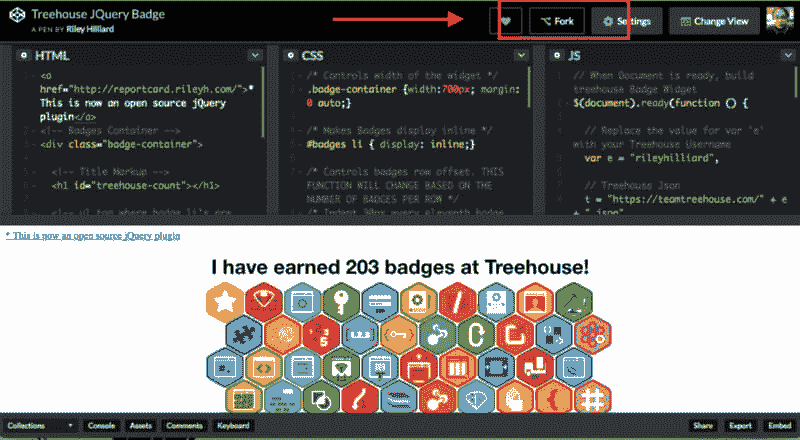
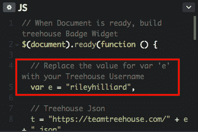
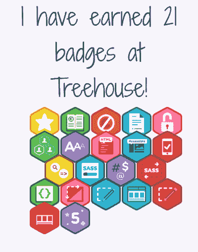

# 将树屋徽章小部件添加到站点

> 原文：<https://dev.to/carmenwright/adding-treehouse-badges-widget-to-site-ifp>

*我最初于 2017 年 4 月 21 日在 Codette Club 的 [Medium](https://medium.com/codetteclub/adding-treehouse-badges-widget-to-site-bea56078158) 账号*上发布了这篇文章

自从我当地的图书馆免费提供树屋课程后，我就爱上了它，一直没有放弃。我喜欢课程的结构，当你完成课程时收到的徽章是让我对学习感到兴奋的有形证明。

树屋徽章系统的缺点是没有明确的方法在非 WordPress 网站上展示成就。在寻找了一段时间来显示它们之后，我找到了 Riley Hilliard 的[树屋小工具](http://rileyh.com/treehouse-badges-widget)。我喜欢徽章的蜂窝效果，以及他如何分解代码，这样你就可以随心所欲地定制它(评论万岁！).

这个小部件的缺点是无法将其插入到您的站点中。我按照[成绩单](http://reportcard.rileyh.com/)上的说明做了，但是那些没用，我也不是成绩单小工具的粉丝。

花了几天时间，对代码做了几次修改，但我终于弄明白了。通过一些修改，使其更适合移动设备，您可以立即拥有自己的树屋徽章小部件。

**在【CodePen】**([https://codepen.io/rileyhilliard/pen/BovGu](https://codepen.io/rileyhilliard/pen/BovGu))上分叉原来的树屋小部件。
* *注**:我已经试着复制粘贴到一个新的笔里了，但是不行。

**通读 HTML、CSS 和 JS 面板中的代码。**你需要将用户名替换为与你的树屋账户关联的用户名。

**导出 CodePen 项目**或者可以直接从项目中复制粘贴。如果您选择这样做，您需要创建一个新的。js 文件。

**转移。js 文件添加到项目的 JS 文件夹中。**

在 HTML 中，**新建一个。container div** 保存新的小部件代码。将小部件代码粘贴到 div 中。

对于我的代码，我调用 div。因为我在 Bootstrap 中工作，无论如何都需要添加一个. row。

将 CSS 代码复制并粘贴到主 CSS 文件中。

在关闭标签之前，在 HTML 底部添加 JS 脚本链接。

此时，**JS 文件应该已经链接了**。

我试图在

and before all the other JS script. It didn’t work. Since my knowledge of JavaScript is still limited, I’m putting this step here in case another newbie comes across this.

剩下的就是**修改 CSS** 以确保代码对于移动设备来说是间隔开的。在修改 CSS 的时候，我发现移动版的大小不如桌面版统一。

我修改了一下，发现还是不喜欢。我把原始代码粘了回去，发现它看起来不太可靠，因为我有很多徽章，当我有更多徽章时，我会再试一次。

*我要衷心感谢[赖利·希利亚德](https://twitter.com/rileyhSD)首先制作了树屋小工具。*