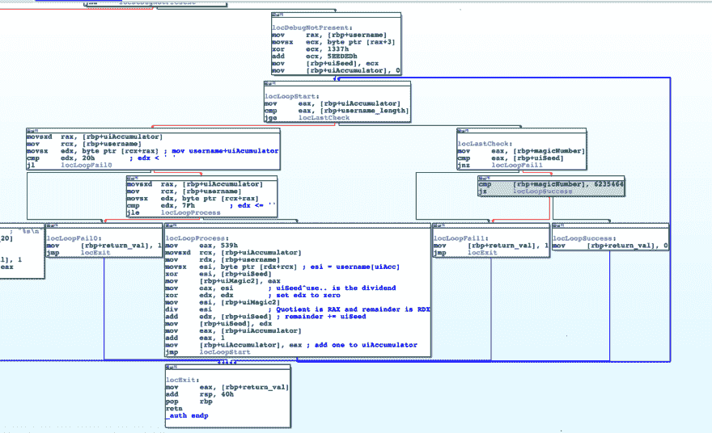

# 不管是不是 Keygenme

> 原文：<https://dev.to/nuculabs_dev/keygenme-or-not-39i0>

[](https://res.cloudinary.com/practicaldev/image/fetch/s--kRlK2RoB--/c_limit%2Cf_auto%2Cfl_progressive%2Cq_auto%2Cw_880/https://thepracticaldev.s3.amazonaws.com/i/9jdv3bdvu19j2k0ccqhg.png)

不管是不是 Keygenme，这是我在 root-me.org 上发现的一个可爱的反向挑战。([这里](https://www.root-me.org/en/Challenges/Cracking/MachO-x64-keygenme-or-not))需要用户名和激活码。我特别喜欢这个挑战，并决定就此写一篇博文。这个挑战的难点在于，你可以不用写任何代码就能解决它，因此就有了“Keygenme 与否”这个名字。

如果你想解决这个挑战，但是你被卡住了，你绝对应该再试一次，因为解决它非常容易。如果你想看 keygen 代码和我对这个挑战的想法，请回来。让我们想象一下，这实际上是一个有用的程序，但却没有很好地实现保护。该计划 KMN 是注册到用户'根-我. org '和将只与他们的关键工作。使用用户名和密钥的任何其他组合都不会使程序运行，即使它们是有效的。

让我们看看 KMN 是如何认证用户的，它获取用户名和密钥，然后调用 _auth 函数。在 _auth 函数返回之后，程序通过将 _auth 的返回值与零进行比较来检查身份验证是否成功。如果 _auth 的返回值是非零的任何其他值，则认证失败。

```
__text:0000000100000D81                 call    _auth 
__text:0000000100000D86                 cmp     eax, 0 
```

Enter fullscreen mode Exit fullscreen mode

我们不应该修补 cmp 指令，让程序做它的“事情”，因为 _auth 设置了一些我们稍后需要的内部状态。现在，我希望你精通倒车，因为我会跳过一些细节。唯一让我感兴趣的部分是从用户名导出应用程序密钥的循环。我对这部分进行了逆向工程，并在本文中发布了 C 代码。

如果我们查看 locLastCheck，我们可以看到用户名“root-me.org”的应用程序密钥是硬编码的，要获得该标志，您只需向 KMN 提供它。

我们可以通过将 jz 指令传递到 jmp 来避免硬编码的用户名约束，这样程序将检查应用程序密钥是否正确，并且不管用户名是什么，它都将工作。为了构建一个 keygen，我们必须完全删除 locLastCheck，只打印计算出的 uiSeed。

下面是我为 keygen 编写的代码:

```
/*
 * Keygen for the "KeygenMe or Not" challenge.
 * */
#include <stdio.h>
#include <stdlib.h>
#include <string.h>
#include <stdbool.h> 
void exit_error(char * e) {
    fprintf(stderr, "%s\n", e);
    exit(EXIT_FAILURE);
}

void auth(char * username, unsigned magicNumber) {
    unsigned username_length = strnlen(username, 32);
    unsigned uiSeed = (username[3] ^ 0x1337) + 0x5EEDED;
    unsigned uiAccumulator = 0;

    while(true) {
        if (uiAccumulator >= username_length) {
            /* I've commented the check from below in order to get the uiSeed. This is the keygen, basically */

            // if (magicNumber != uiSeed) {
            //     exit_error("magicNumber is not equal to uiSeed");
            // }

            /* I guess the block from below gives the title "Keygenme or Not" to this challenge. */

            // if (magicNumber == 6235464) {
            //     printf("Solution found!\n");
            // }

            printf("Solution found: %u\n", uiSeed);
            break;
        } else {
            /* Checks wheter username is a character between a ' '(space) and ''(empty) */
            if (username[uiAccumulator] < 0x20 || username[uiAccumulator] > 0x7F) {
                exit_error("err: username[uiAccumulator] < 0x20 || username[uiAccumulator] < 0x7F");
            } else {
                unsigned dividend = username[uiAccumulator] ^ uiSeed;

                uiSeed += dividend % 0x539;

                uiAccumulator += 1;
            }
        }
    }
}

int main(int argc, char *argv[], char *envp[]) {
    if (argc < 3) {
        auth("root-me.org", 6235464);
    } else {    
        auth(argv[1], atoi(argv[2]));
    }
    return EXIT_SUCCESS;
} 
```

Enter fullscreen mode Exit fullscreen mode

以及证明修补后的二进制文件实际上可以使用有效的激活密钥:

```
➜  Desktop ./macho_patched
.username.
dnutiu
.activation key.
6232821
Authenticated! You can use this password to valid8
5;@PO-d{bEN~ 
```

Enter fullscreen mode Exit fullscreen mode

感谢您的阅读，节日快乐！

[推特](https://twitter.com/denisnutiu) | [多福拉](https://m.do.co/c/22f012126c25)