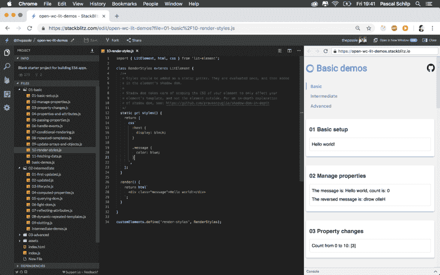
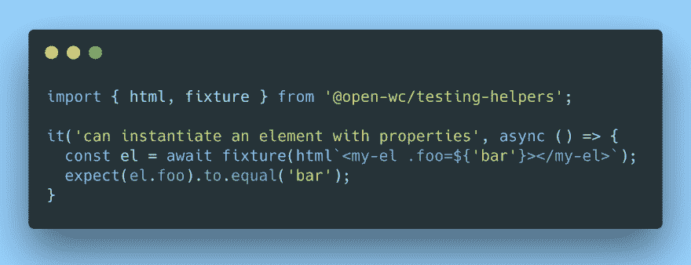
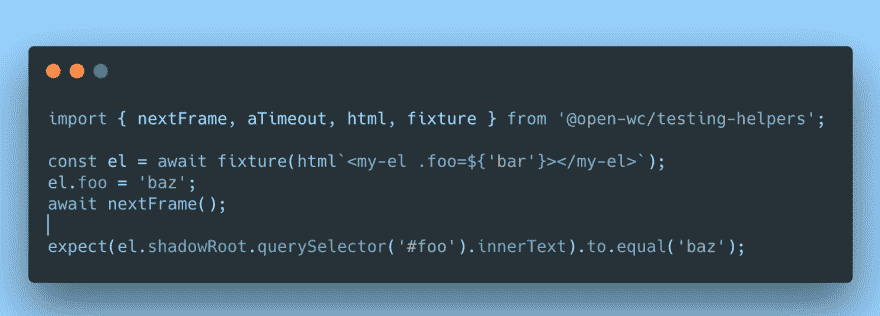
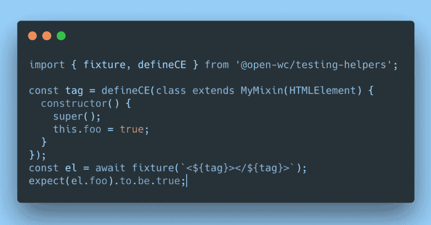
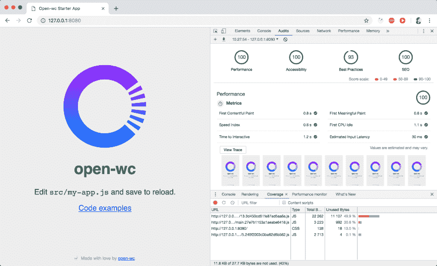

# 宣布开放 Web 组件

> 原文：<https://dev.to/open-wc/announcing-open-web-components-5h7>

[](https://res.cloudinary.com/practicaldev/image/fetch/s--aepbfHcC--/c_limit%2Cf_auto%2Cfl_progressive%2Cq_auto%2Cw_880/https://raw.githubusercontent.com/open-wc/open-wc/master/docs/.vuepress/public/hero.png)

# 宣布开放-wc

## 打开 Web 组件推荐

大家好！👋

我们是一群开源和 web 组件爱好者。我们认为我们的目标是为每个人提供一个强大的、经过实战检验的创建和共享开源 web 组件的设置。

许多 web 开发人员都经历过可怕的“Javascript 疲劳”。根据我们的建议，我们希望您能享受到几乎所有事情都有一个众所周知的默认解决方案所带来的宁静。从 IDE 到 CI，open-wc 已经覆盖了您。

我们希望 web 组件开发对每个人来说都是可访问和可接近的，不管你的背景或以前的经验如何。因此，我们的建议旨在易于使用，随时准备使用，并提供我们都渴望的 web 组件开发各个方面的“它只是工作”的开发人员体验。

我们坚信接近浏览器标准将是对你的代码最好的长期投资。它是我们所有推荐的基础，这意味着有时我们不会推荐一个受欢迎的特性或功能。这也意味着我们可以更快地采用和推荐新的浏览器标准。

## 为什么要 Web 组件

在过去的几年中，基于组件的 web 应用程序开发模型得到了普及，JavaScript 社区也随着各种库和方法的出现而蓬勃发展。网络原生组件模型的标准化工作于 2012 年在谷歌开始，经过几年的开放开发，于 2019 年在所有主要浏览器上成功实现。在撰写本文时，超过 10%的页面视图包含 web 组件。

我们相信 web 组件为可重用性、互操作性和封装等问题提供了基于标准的解决方案。此外，我们相信使用浏览器的本地组件模型将增加应用程序的寿命。web 有着非常强大的向后兼容性传统，因为标准团体一直在尽力维护遗留的 API。

在`open-wc`你会找到开始开发 web 组件可能需要的任何东西。

## 发展中

在我们的[开发](https://open-wc.org/developing/)部分，你会找到任何你需要知道的关于写代码的事情；从实用的代码演示，到可访问性，到 mixins，到教程和博客帖子。

我们有各种各样的交互式演示来帮助您快速开始编写代码:

[](https://open-wc-lit-demos.stackblitz.io/)

如果您想先了解更多关于 web 组件的知识，我们推荐以下博客文章，为您开始开发 web 组件打下坚实的基础:

*   让我们构建 Web 组件吧！本尼·鲍尔斯
*   Pascal Schilp 的《Web 组件:从零到英雄》

## 测试

我们不仅为 Karma、Browserstack 和 Wallaby 提供了[测试设置](https://open-wc.org/testing/testing-karma.html),我们还提供了一组测试助手来帮助您:

### 制作夹具:

[](https://res.cloudinary.com/practicaldev/image/fetch/s--LU06e7HS--/c_limit%2Cf_auto%2Cfl_progressive%2Cq_auto%2Cw_880/https://i.imgur.com/ettoUME.png)T3】

```
CAPTION: code snippet
import { html, fixture } from '@open-wc/testing-helpers';

it('can instantiate an element with properties', async () => {
    const el = await fixture(html`<my-el .foo=${'bar'}></my-el>`);
    expect(el.foo).to.equal('bar');
} 
```

Enter fullscreen mode Exit fullscreen mode

### 比较 DOM:

[](https://res.cloudinary.com/practicaldev/image/fetch/s--zYu6cHBv--/c_limit%2Cf_auto%2Cfl_progressive%2Cq_auto%2Cw_880/https://i.imgur.com/pjGezjL.png)T3】

```
CAPTION: code snippet
import { html, fixture } from '@open-wc/testing-helpers';

it('has the following dom', async () => {
    const el = await fixture(`<div><!-- comment --><h1>${'Hey'} </h1>  </div>`);
    expect(el).dom.to.equal('<div><h1>Hey</h1></div>');
}); 
```

Enter fullscreen mode Exit fullscreen mode

### 管理计时:

[](https://res.cloudinary.com/practicaldev/image/fetch/s--xWFI4-LB--/c_limit%2Cf_auto%2Cfl_progressive%2Cq_auto%2Cw_880/https://i.imgur.com/iyE0IKf.png)T3】

```
CAPTION: code snippet
import { nextFrame, aTimeout, html, fixture } from '@open-wc/testing-helpers';

const el = await fixture(html`<my-el .foo=${'bar'}></my-el>`);
el.foo = 'baz';
await nextFrame();

expect(el.shadowRoot.querySelector('#foo').innerText).to.equal('baz'); 
```

Enter fullscreen mode Exit fullscreen mode

### 定义多个自定义元素:

[](https://res.cloudinary.com/practicaldev/image/fetch/s--Kgf1AOVT--/c_limit%2Cf_auto%2Cfl_progressive%2Cq_auto%2Cw_880/https://i.imgur.com/lHUO7BO.png)T3】

```
CAPTION: code snippet
import { fixture, defineCE } from '@open-wc/testing-helpers';

const tag = defineCE(class extends MyMixin(HTMLElement) {
    constructor() {
        super();
        this.foo = true;
    }
});
const el = await fixture(`<${tag}></${tag}>`);
expect(el.foo).to.be.true; 
```

Enter fullscreen mode Exit fullscreen mode

## App 启动器

许多开发人员都经历过经常被描述为“JavaScript 疲劳”的情况，即必须跟上 JavaScript 生态系统中每一项新技术的压倒性感觉。JavaScript 工具可能有一个令人生畏的学习曲线，并且配置起来常常令人沮丧。什么是合适的工具？我应该使用哪些工具？这些工具是如何工作的？

我们的建议旨在减轻你一些痛苦的设置，让你可以直接跳到有趣的部分；发展。因此，如果你想直接进入开发，用一个强大的设置，利用最好的浏览器标准，我们的 [open-wc-app-starter](https://github.com/open-wc/open-wc-starter-app) 可能适合你！

[](https://github.com/open-wc/open-wc-starter-app)

现场演示[这里](https://open-wc-starter-app.netlify.com/)。

我们的 open-wc-app-starter 将为您提供完整的配置，包括以下功能:

*   **模块分辨率**
*   **自动模块类型选择**
*   **HTML、JS 和 CSS 精简**
*   **es2015 和 es5 输出**
    *   使用[web pack-babel-multi-target-plugin](https://www.npmjs.com/package/webpack-babel-multi-target-plugin)，我们的构建输出了你的应用的 es5 和 es2015 版本。使用 [nomodule 技巧](https://jakearchibald.com/2017/es-modules-in-browsers/)，我们可以在现代浏览器上提供 es2015 代码，在旧浏览器上提供 es5 代码(特别是 IE11)。这大大减少了你的应用程序在现代浏览器上的大小。
*   **无再生器运行时/转换时**
*   **按用途聚合填充**
    *   根据浏览器支持和使用情况添加语言填充。这导致你的应用程序的初始捆绑包变得非常小。
*   **语法和 JavaScript API**
    *   我们的配置只支持标准的 javascript 语法和浏览器 API。如果第 3 阶段的提议增加了重要价值，并且易于支持，不会造成重大性能损失，我们会予以支持。我们支持的一些建议是:
        *   动态导入
        *   import.meta.url
*   **用 Karma 测试套件**
*   **林挺与埃斯林特，更漂亮，更忠诚**

你可以在这里找到更多关于我们`open-wc-app-starter` [的文档。我们努力提供最好的、用户友好的设置，您的反馈对我们来说非常有价值，所以如果您觉得缺少什么或有任何反馈，请随时在我们的回购上提出问题。](https://github.com/open-wc/open-wc-starter-app)

## 又多又多

其他建议包括介于两者之间的任何事情:[林挺](https://open-wc.org/linting/)，[演示](https://open-wc.org/demoing/)，[建筑](https://open-wc.org/building/)，[出版](https://open-wc.org/publishing/)和[自动化](https://open-wc.org/automating/)。我们也有一队[发电机](https://open-wc.org/developing/generator)来即插即用您当前项目中的任何设置。

如果您有兴趣了解更多关于我们的理念和我们建议的基本原理，您可以在这里这样做。

我们的目标是帮助您尽可能快速、轻松地进行设置。如果您觉得我们的推荐遗漏了什么，请随时联系我们。请注意，我们的建议和最佳实践可能会随着时间的推移而发生变化。

## 加入对话！

我们希望听到您的任何反馈或问题。您可以通过以下方式联系我们:

*   如果您有任何问题或反馈，请随时在我们的 [Github](https://github.com/open-wc/open-wc) 上提出问题。

*   您也可以在 [#open-wc](https://polymer.slack.com/messages/CE6D9DN05) 通道的聚合物松弛部分找到我们。
    你可以通过访问[这个链接](https://join.slack.com/t/polymer/shared_invite/enQtNTAzNzg3NjU4ODM4LTkzZGVlOGIxMmNiMjMzZDM1YzYyMzdiYTk0YjQyOWZhZTMwN2RlNjM5ZDFmZjMxZWRjMWViMDA1MjNiYWFhZWM)加入 Polymer slack。

*   您可以在: [open-wc](https://open-wc.org) 找到我们的建议和文档。

你也可以在推特上找到我们中的一些人:[本尼普](https://twitter.com/PowersBenny)，[达克莫尔](https://twitter.com/daKmoR)，[帕索](https://twitter.com/passle_)

🚽由 [open-wc](https://github.com/open-wc/open-wc) 用爱制造。