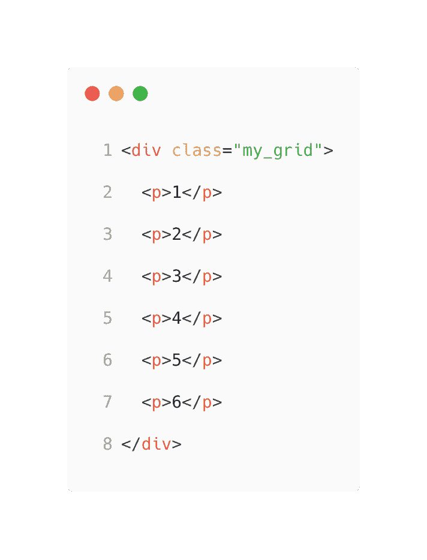
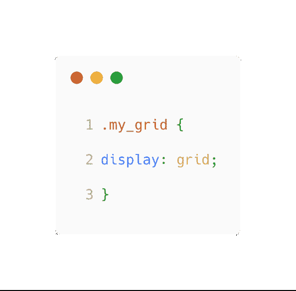
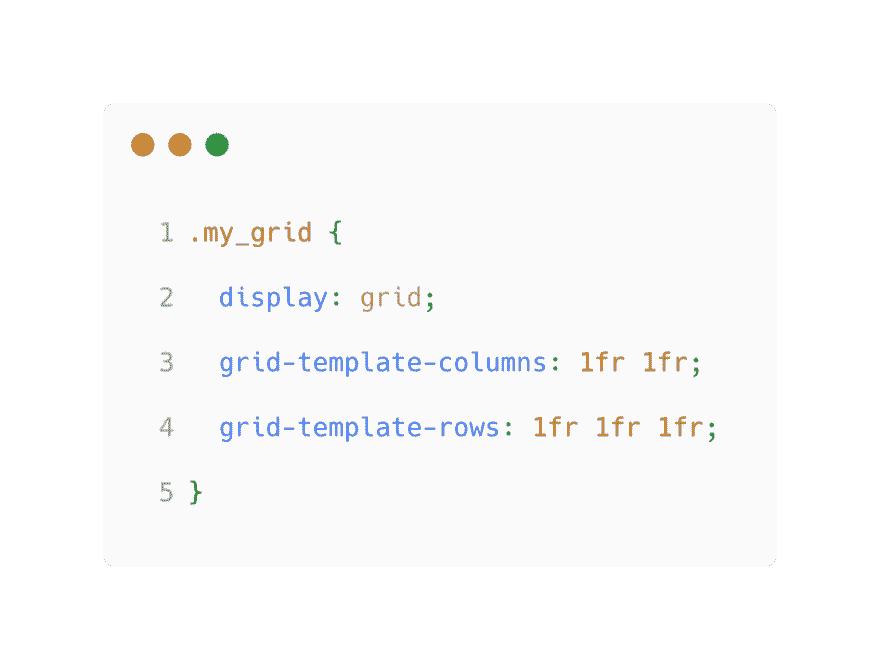
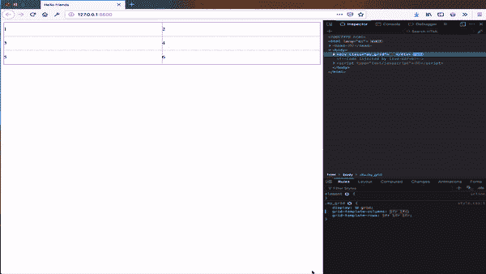
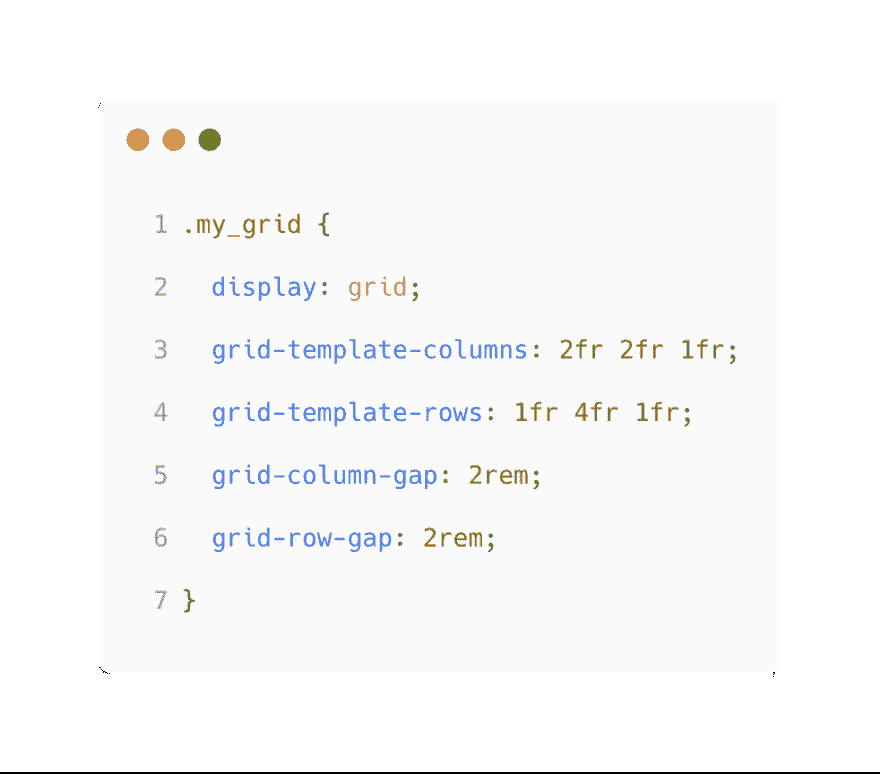
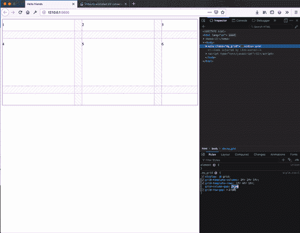

# CSS 网格快速介绍

> 原文：<https://dev.to/amp_agency/quick-intro-to-css-grid-36cc>

CSS Grid 是一个天赐的答案，它解决了多年来开发人员在网页上布置网格时遇到的所有麻烦。我们不再需要处理表格和浮动——我们现在有了这个惊人的二维布局工具，它允许我们控制行和列的所有方面，同时。你可以用 CSS 网格做很多事情，在[的右手](https://labs.jensimmons.com/)中，它看起来就像魔术一样。因此，对于我的所有初级开发人员来说，这篇文章是为你而写的，他们希望放弃他们宝贵的引导框架，需要一堂 CSS 网格的速成课。让我们从学习两个关键术语开始:

#### 网格容器

设置网格的第一步是定义网格容器。一个网格容器，容纳并创建你的网格。该容器设置网格格式上下文，并管理其直接子元素的间距、大小和对齐方式。

#### 网格项

网格项目是网格容器的直接子容器。网格容器中的任何元素都被视为网格项目。

### 构建出一个网格

我们将从创建和设置网格容器开始。在我们的 HTML 文档中，让我们创建一个包含六个段落元素的 **div** 元素，并给它一个类名 **my_grid** 。
 
现在在我们的 CSS 中，我们可以使用 **display** 属性将**‘my _ grid’**类设置为网格容器。

#### 列和行

让我们定义一些列和行——为此，我们可以使用以下 CSS 属性: **grid-template-columns** 和 **grid-template-rows** 。我将定义两列和三行，并将它们的所有宽度和高度设置为 **1fr** 就像这样
 
对于那些可能不知道的人来说，新的 **fr 单位**代表小数单位。通过将 **grid-template-columns** 设置为 **1fr 1fr** ，我在我的网格中创建了两列，并告诉它们占用一个可用空间的小数单位。

这是我们目前为止的网格结果。

我们可以简单地通过调整行/列的宽度或者添加更多的行/列来改变我们的网格。

#### 排水沟

檐槽是网格的行和列之间的空间或间隙。为了定义你的槽，我们可以使用**网格-列-间隙**和**网格-行-间隙**。

或者，你可以单独使用**网格间隙**。使用 **grid-gap** 你可以给它两个值——第一个是行间距值，第二个是列间距值。

### 继续前进

简单的事情，不是吗？如果您喜欢阅读这篇关于 CSS 网格的简介，我强烈建议您继续学习。CSS Tricks 有一个[惊人的指南](https://css-tricks.com/snippets/css/complete-guide-grid/)你可以学习掌握网格。Jen Simmons 也在[上发表了一篇关于学习 CSS 网格的文章](http://jensimmons.com/post/feb-27-2017/learn-css-grid)。非常感谢 Dev.to 上的开发者 [Max](https://dev.to/steelwolf180) ，他在发布了这个 post - [Grid Garden](https://cssgridgarden.com/) 之后向我展示了另一个很棒的资源，这是一个学习 CSS 网格的很棒的交互方式。

尽情享受吧，朋友们！