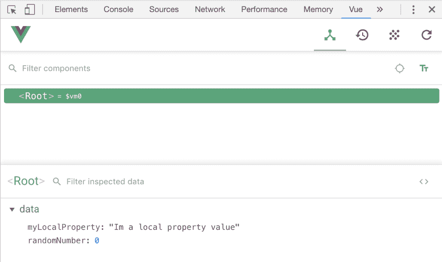

# 初学者实用 Vue.js(第 3 部分)

> 原文：<https://dev.to/marinamosti/hands-on-vue-for-beginners-part-3-2pd6>

欢迎回来！上次我们听了我们的第一个用户事件和对这些事件做出反应的方法。今天你将学习**指令**和条件渲染。

# 简单的 if-else

无论使用何种框架，任何程序员掌握的最重要的工具之一就是条件呈现。根据条件或值显示或隐藏部分应用程序的能力是开始了解这一点的好地方，也是了解 Vue **指令**的好地方。

我们将继续建立在我们以前的例子。如果你已经失去了它或者只是在追赶，这里是我们目前所拥有的:

```
<html>
    <head>
        Vue 101
    </head> 
    <body>
        <h1>Hello!</h1>
        <div id="app">
          <p>My local property: {{ myLocalProperty }}</p>
          <hr>
          <button @click="buttonClicked">Click me</button>
        </div> 
        <script src="https://cdn.jsdelivr.net/npm/vue/dist/vue.js"></script> 
        <script>
          const app = new Vue({
            el: '#app',
            data: {
              myLocalProperty: 'Im a local property value'
            },
            methods: {
              buttonClicked() {
                const newText = 'The new value is: ' + Math.floor( Math.random() * 100 );

                this.myLocalProperty = newText;
              }
            }
          });
        </script>
    </body> </html> 
```

Enter fullscreen mode Exit fullscreen mode

到目前为止，我们已经成功地将我们的本地属性输出到我们的应用程序中，并且还听到了用户在一个简单按钮上的点击。

让我们更进一步，了解我们的条件渲染。

让我们改变我们的按钮点击，使它们产生一个随机数，就像我们一直在做的那样，但不是输出一个连接的字符串，我们将切换显示结果的几个`<p>`元素。

这将需要一些重构，所以首先让我们改变我们的`buttonClicked`方法，只计算这个新数字，我们将把它存储在一个名为`randomNumber`的新属性中。

```
<script>
  const app = new Vue({
    el: '#app',
    data: {
      myLocalProperty: 'Im a local property value',
      randomNumber: 0 // 1
    },
    methods: {
      buttonClicked() {
        this.randomNumber = Math.floor(Math.random() * 100); // 2
      }
    }
  });
</script> 
```

Enter fullscreen mode Exit fullscreen mode

让我们快速浏览一下。

1.  我们已经添加了一个新的本地属性`randomNumber`，默认值将是 0。
2.  我们删除了旧代码，不再使用先前字符串中的随机值，而是将它临时存储在我们的`randomNumber` prop 中。

我们希望根据我们的`randomNumber`计算结果显示/隐藏内容，所以我们有两个新的`<p>`元素。只有当`randomNumber`大于或等于 50 时才会显示。另一个会显示是否小于 50。

```
<div id="app">
  <p>My local property: {{ myLocalProperty }}</p>
  <hr>
  <button @click="buttonClicked">Click me</button>
  <hr>
  <!-- 1 -->
  <p v-if="randomNumber >= 50">randomNumber is >= 50!</p>

  <!-- 2 -->
  <p v-else>Sorry, randomNumber is only <b>{{ randomNumber }}</b></p>
</div> 
```

Enter fullscreen mode Exit fullscreen mode

我们为 clary 和 separation 添加了一个`<hr>`，然后添加了两个`<p>`元素。
让我们详细看看每一个。

第一，`v-if="randomNumber >= 50"`。所以，`v-if`是一个 Vue **指令**。不要太在意这个术语的定义，它只是意味着它是一个“特殊”的值，我们可以把它放在 Vue 知道如何阅读和解释的 HTML 元素中。事实上，您之前已经使用过**指令**。还记得`v-on:click`和`@click`吗？那些也是指令！

撇开理论不谈，`v-if`告诉 Vue 到**只有**显示这个元素，如果我们在里面声明的条件是**真**。在这种情况下，“Vue:仅当且仅当`randomNumber`大于或等于 50 时才显示此`<p>`元素”。

第二，无论何时你有一个`v-if`指令，你都可以有一个 **else** case。但是注意，`v-else` **只有**对直接跟随持有`v-if`(或者第三个选项`v-else-if`)的元素起作用。正如您从任何 if - else 语句中所期望的那样，带有`v-else`的元素将在第一次不为**真**的任何其他情况下呈现。非此即彼。

继续重新加载您的`index.html`并点击按钮几次。你会看到`<p>`标签是根据`randomNumber`的值被动渲染的。

# v-if 和 v-show

如果你好奇在点击的时候打开你的开发工具，你会注意到一件非常重要的事情。`v-if`不是一个`display: block/hidden` css 开关，它实际上是在我们的条件值改变时呈现或销毁元素。如果你想有一个可见切换**指令**，继续尝试切换第一个`v-if`为`v-show`，看看会发生什么！

您可能会注意到，具有`v-else` **声明性**的块不再显示。这是因为`v-show`是独行侠，只会独自行动。那么使用`v-show`有什么好处呢？

当使用`v-if`时，你可能要考虑性能成本，因为 Vue 必须重新渲染 DOM(不要担心它会很聪明地添加/删除哪些部分)，但这是一个比应用/删除 css `display`属性更广泛的任务。

一句话:如果你打算只切换应用程序的小/中部分几次，比如菜单栏，`v-if`通常会做到这一点。但是如果你要切换标签式屏幕，或者你的页面的大块，那么`v-show`在性能方面可能会更便宜，因为你的标记不会每次都被重写。

(注:在我们继续之前，将指令设置回`v-if`，否则你会得到控制台错误，因为下面的`v-else`是不成对的。)

# 开发工具

如果你希望知道一种方法来计算出哪个值被随机分配到我们的`>= 50`条件的`randomNumber`中，而不需要用我们信任的`{{ }}`在`<p>`标签中呈现它，那么 Vue 有一个很棒的工具来完成这项工作。

继续安装 [Chrome Vue Devtools](https://chrome.google.com/webstore/detail/vuejs-devtools/nhdogjmejiglipccpnnnanhbledajbpd?hl=en) 或 [Firefox Vue Devtools](https://addons.mozilla.org/en-US/firefox/addon/vue-js-devtools/) 。

因为我们中的一些人可能会使用`file://`协议直接在我们的浏览器上打开文件，如果你在 chrome 中没有看到为你工作的扩展。请首先遵循这些说明:

```
"To make it work for pages opened via file:// protocol, you need to check "Allow access to file URLs" for this extension in Chrome's extension management panel."

Right-click the Vue icon on the extensions toolbar, click on manage extensions and then toggle the allow access switch. 
```

Enter fullscreen mode Exit fullscreen mode

一旦你将它们添加到你最喜欢的浏览器风格中，继续打开它们(通过“检查”或通过浏览器菜单打开你的开发工具，然后导航到开发窗格上的“Vue”标签)当你在你的`index.html`页面上时，你会注意到有相当多的好东西可以玩。

您应该看到的屏幕是这样的:
[](https://res.cloudinary.com/practicaldev/image/fetch/s--YeFMzZXW--/c_limit%2Cf_auto%2Cfl_progressive%2Cq_auto%2Cw_880/https://thepracticaldev.s3.amazonaws.com/i/y259bn17x0ocdxk8p5yg.png)

你会注意到右上方有一个工具栏，上面有一些图标，我们在看 **Vuex** 时会看到这些图标，现在你可以放心地忽略它们。

然而，这个屏幕中最重要的是组件树。dev 工具将允许你检查你为一个页面创建的每一个组件，它的属性(数据),以及稍后当我们看状态管理时它们如何与它交互。(如果现在这没有意义，请不要担心)。

点击`<Root>`组件，您会看到:

[](https://res.cloudinary.com/practicaldev/image/fetch/s--pxcCjtRP--/c_limit%2Cf_auto%2Cfl_progressive%2Cq_auto%2Cw_880/https://thepracticaldev.s3.amazonaws.com/i/6iiipk8xvm5amsfl3090.png)

注意我们的两个本地属性，`myLocalProperty`和`randomNumber`。
点击几次你的`<button>`,看看开发者工具如何通过显示`randomNumber`值的变化来做出响应。

[](https://res.cloudinary.com/practicaldev/image/fetch/s--iUJWsILS--/c_limit%2Cf_auto%2Cfl_progressive%2Cq_auto%2Cw_880/https://thepracticaldev.s3.amazonaws.com/i/okttb4bc6qiblkin2cjt.png)

现在，这可能看起来不是很令人印象深刻，但是当我们开始构建一个真实世界的应用程序，或者甚至在你的实际工作项目中，这个工具将是你的第一信息来源，所以一定要花些时间来玩它！

例如，本地存储的一个巧妙之处在于，您可以手动修改值来测试应用程序的不同状态。将鼠标悬停在您想要修改的属性上，您会看到一个编辑按钮，以及(在数字属性的情况下)一个+和-按钮来增加或减少值。

[](https://res.cloudinary.com/practicaldev/image/fetch/s--ejItqX7c--/c_limit%2Cf_auto%2Cfl_progressive%2Cq_auto%2Cw_880/https://thepracticaldev.s3.amazonaws.com/i/jiyj1v122ghzmeya7to1.png)

# 结论

有了我们已经介绍过的基础:设置、事件、属性和条件渲染，现在你就有了开始创建一些真正有趣的反应式应用程序的基础。然而，这仅仅是触及了 Vue 的表面，从这里开始，它只会变得更加有趣。

请继续关注第 4 部分！