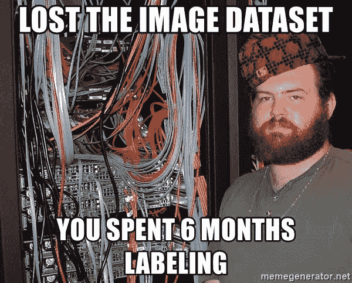

# 从 0 到数百万用户扩展机器学习—第 2 部分

> 原文：<https://dev.to/aws/scaling-machine-learning-from-0-to-millions-of-userspart-2-371p>

### 从 0 到百万用户的机器学习扩展——第二部分

#### 培训:EC2、EMR、ECS、EKS 还是 SageMaker？

在第一部分中，我们脱离了笔记本电脑，决定在虚拟机上部署我们的预测服务。通过这样做，我们讨论了一些有助于初始可伸缩性的简单技术……并有望减少手动操作。从那以后，尽管由于缺乏高可用性而出现了一些生产上的小问题，生活还是相当不错的。

然而，流量很快开始增加，数据堆积，更多的模型需要训练，等等。技术和商业风险越来越高，让我们面对现实吧，当前的架构很快就会被淹没。时间到了:在本帖中，我们将重点关注**对大量机器**进行扩展训练。

<figure>[](https://res.cloudinary.com/practicaldev/image/fetch/s--DeiK7AFq--/c_limit%2Cf_auto%2Cfl_progressive%2Cq_auto%2Cw_880/https://cdn-images-1.medium.com/max/560/0%2A0OcxdRHpzI3An9BQ) 

<figcaption>两百…和五十…六…个 GPU！！！是啊。</figcaption>

</figure>

> 这是一个固执己见的系列，记得吗？也是基于我和现实生活中的客户交谈时听到的，而不是理想中的客户。现实往往是丑陋的，只有科技潮人(和高层管理人员)认为它看起来和你读到的那篇花哨的文章一模一样；)
> 
> 特别感谢摇滚福音传道者艾比·富勒、杰里·哈格罗夫、阿德里安·洪斯比、布伦特·兰斯顿和伊恩·马辛汉的建议和想法。

### **放大就搞定了……对吧？**

是也不是，是的，使用大型服务器进行训练和预测可以是一个**短期解决方案**。Amazon EC2 有大量的[实例类型](https://aws.amazon.com/ec2/instance-types/)可供选择，它所要做的就是[停止](https://docs.aws.amazon.com/cli/latest/reference/ec2/stop-instances.html)你的实例，[改变实例类型](https://docs.aws.amazon.com/cli/latest/reference/ec2/modify-instance-attribute.html)，然后[再次启动](https://docs.aws.amazon.com/cli/latest/reference/ec2/start-instances.html)它。

> 从现在开始你应该只使用 API。当谈到扩展技术和运营时，任何 GUI 中的手动工作都是反基督的。

不，因为这只是一个临时的解决方案:

*   使用更大的实例是可以的，直到**没有更大的实例**。然后呢？
*   也很有可能**您的工作负载不会很好地扩展**，并且不会充分利用额外的硬件(RAM、CPU 内核、I/O 等)。).微不足道的性能提升不值得额外花费。
*   最重要的是，扩大规模只会推迟不可避免的事情。继续这样做，你最终只会得到一个更大的问题需要解决。

本着避免过度设计的精神，扩展几次是可以的，但是如果监控一直指向不可逾越的可扩展性厄运之墙，我会建议您**早一点行动，而不是晚一点**:事情线性扩展，直到它们停止，并且您不想知道当指数开始上升时会发生什么！

### 缩放出去

当谈到训练机器学习(ML)模型时，最高要求实际上非常简单:

*   **为您的数据集提供可靠、可扩展的存储**。
*   **弹性计算集群**，可以在许多不同的配置(硬件、框架等)中按需启动。).
*   **尽可能少的运营:** ML 才是你应该关注的，因为 ML 就是把你的原始数据转化为收入/利润/改善客户体验的东西。

> “那不是完整的名单！我们希望完全控制，不被锁定，低成本，高性能…以及其他一切，无论是什么”。是的，是的，我们会到达那里:)

### 储存

让我们来解决这个问题:**你的数据会被送到亚马逊 S3** 。任何其他选择都需要防弹理由(试试我吧！).吞吐量？那么，你现在可以在 EC2 和 S3 T3 之间达到 25 千兆位/秒的速度了。现在应该够了。可扩展性？高可用性？保安？没有行动？成本？检查。

[闸门打开了 EC2 实例增加了网络带宽|亚马逊网络服务](https://aws.amazon.com/blogs/aws/the-floodgates-are-open-increased-network-bandwidth-for-ec2-instances/)

> 在这一点上，你的团队中任何想出“基于这个超级酷的开源项目的高性能存储集群”的人都应该被重物击打头部，直到他们停止移动。对于浪费时间、将项目置于风险之中和过度工程化的行为毫不留情。

<figure>[](https://res.cloudinary.com/practicaldev/image/fetch/s--Ifdl-qfU--/c_limit%2Cf_auto%2Cfl_progressive%2Cq_auto%2Cw_880/https://cdn-images-1.medium.com/max/600/0%2ARsLrN3NR8QTSY7g0.jpg) 

<figcaption>因为“doc 不清楚”和“bug 发生在每个人身上”。</figcaption>

</figure>

好了，那么计算机选项呢？**亚马逊 EC2？亚马逊 EMR？集装箱服务？亚马逊 SageMaker？**

> 规模战争已经开始。

### 亚马逊 EC2

我们的旅程从 EC2 开始，所以在那里继续下去会很有诱惑力。这是一个足够好的理由吗？

正如在[第一部分](https://dev.to/juliensimon/scaling-machine-learning-from-0-to-millions-of-users-part-1-3lb5)中讨论的那样， [**深度学习 AMI**](https://aws.amazon.com/machine-learning/amis/) 让你的生活简单多了。里面挤满了经过 AWS 优化的开源工具和库([tensor flow 1.11 上的 11x 加速](https://aws.amazon.com/about-aws/whats-new/2018/10/chainer4-4_theano_1-0-2_launch_deep_learning_ami/?nc1=h_ls)，有人吗？或者也许[线性扩展到 256 个 GPU](https://aws.amazon.com/about-aws/whats-new/2018/11/tensorflow-scalability-to-256-gpus/)？). [**Horovod**](https://github.com/uber/horovod) ，一个流行的分布式训练库[也包含在](https://docs.aws.amazon.com/dlami/latest/devguide/tutorial-horovod-tensorflow.html)中。所有这些都将使建立高效、分布式的培训集群变得更加容易。

一些约束可能会阻止您使用由 AWS 维护的 AMI:需要特定的操作系统供应商、许可限制、必须跨不同的提供商运行相同的构建，等等。不幸的是，你必须自己设置一切。不要低估这项任务:随着新版本的发布，您将不得不一次又一次地做这项工作。即使有了自动化，那也永远不会是熄灯操作。

无论您使用哪种 AMI，设置培训集群都意味着:

1.  引发了一堆实例，
2.  挑选一个作为领导者，并建立分布式培训。这通常包括列出集群中其他机器的主机名/ IP 地址。
3.  开始训练，
4.  一旦训练完成，获取训练好的模型并保存在亚马逊 S3。
5.  关闭训练集群。

相当多的工作，然后，这可能是为什么你们大多数人经历了第 1 步和第 2 步一次，**运行集群 24/7** ，从来没有到第 5 步…和这，女士们，先生们，这是我在这里使用 EC2 的主要关注。**除非你自动化所有这些**(用 [AWS CloudFormation](http://aws.amazon.com/cloudformation) 、 [Terraform](https://www.terraform.io) 、CLI 脚本等。)，**你会浪费一吨钱**。上面的某个人会很快给你的预算设定一个上限，这意味着你最终可能会得到一个固定大小的集群，需要被多个开发人员/团队分时使用……当然，有人会开发一个漂亮的内部网页面来预订集群上的时间段。恭喜你，你重新发明了大型机！

<figure>[](https://res.cloudinary.com/practicaldev/image/fetch/s--kONp4dbR--/c_limit%2Cf_auto%2Cfl_progressive%2Cq_auto%2Cw_880/https://cdn-images-1.medium.com/max/590/0%2AmkO2AvthJStvlArN) 

<figcaption>Resnet-50 训练 3… 2… 1…</figcaption>

</figure>

> 不要笑。我遇到过一个非常大的——在其他方面也很出色的——人工智能公司管理着数百个这样的物理 GPU 服务器。不幸的是，我敢肯定一些客户在 EC2 上也是这样做的…如果你被困在那里，请联系我们，我们可以帮助你！

当然，也许你的 DevOps 团队很友好地提供了**一个全唱全跳的集群供应脚本**，每个开发人员都可以运行它来获得他们自己的培训集群(给他们买很多啤酒:这很少发生)。这是坚持 EC2 培训的充分理由吗？

也许吧。EC2 上的成本优化技术是众所周知的:[预约实例](https://aws.amazon.com/ec2/pricing/reserved-instances/)、[现场实例](https://aws.amazon.com/ec2/spot/)等。这样做可能会抵消额外的 DevOps 成本。只有你能发现，而且你绝对应该知道。

> 如果你没有时间或技能来实现自动化和成本优化，我会重新考虑在 EC2 上大规模运行培训工作。

### **亚马逊 EMR**

[亚马逊 EMR](http://aws.amazon.com/emr) 在 ML 讨论中？嗯，是的: [TensorFlow](https://docs.aws.amazon.com/emr/latest/ReleaseGuide/emr-tensorflow.html) 和 [Apache MXNet](https://docs.aws.amazon.com/emr/latest/ReleaseGuide/emr-mxnet.html) 是 EMR 发行版的一部分，当然 [Spark MLlib](https://spark.apache.org/mllib/) 也包括在内。EMR 支持[计算优化实例](https://docs.aws.amazon.com/emr/latest/ManagementGuide/emr-supported-instance-types.html) (c5 和 p3)，所以看起来我们拥有了我们需要的一切。

以下是在 EMR 上运行培训工作的几个好理由:

*   您已经将 EMR 用于其他任务，具有可靠的自动化(按需集群、[步骤](https://docs.aws.amazon.com/emr/latest/ManagementGuide/emr-work-with-steps.html)等)。)和成本优化([现货实例](https://docs.aws.amazon.com/emr/latest/ManagementGuide/emr-instance-purchasing-options.html)！).
*   您的数据需要大量的 ETL，Hive / Spark 非常适合这一点。为什么不在一个地方运行所有的东西？
*   Spark MLlib 拥有您需要的算法。
*   你在某处读到有一个针对 Spark 的 SageMaker SDK，所以这可能是未来的另一个选择。

和**同样好的不做的理由**:

*   您没有时间或技能来自动化和优化成本。基于 GPU 的 EMR 集群以按需价格全天候运行，无负载
**   你既没有使用 TensorFlow，Apache MXNet，也没有使用 Spark MLlib。是的，您可以向您的集群安装额外的软件包，但是这是额外的工作。*   您的 ETL 和 ML 作业有**冲突的实例需求**。假设他们分别在 8 辆 *r5.4xlarge* 和 2 辆 *p3.8xlarge* 上训练跑得最好。你如何妥协？这是一个艰难的决定，您可能最终会选择一个对 ETL 和培训都不是最佳的实例类型…或者创建一个专用的 GPU 集群(另一个需要管理和担心的集群)。*

 *我对此有着复杂的感觉:在一个现有的集群上堆积一些 ML 我会觉得很好，但是**除非它是 100%基于 Spark MLlib，否则扩展它感觉不太好**。

### 集装箱服务

在第 1 部分的[中，我建议你将代码容器化以解决部署问题。显然，这也将在部署到 Docker 集群时带来好处，无论是在](https://dev.to/juliensimon/scaling-machine-learning-from-0-to-millions-of-users-part-1-3lb5) [**亚马逊 ECS**](http://aws.amazon.com/ecs) 还是 [**亚马逊 EKS**](http://aws.amazon.com/eks) 上。

你可以在 Docker 容器中**运行任何工作负载**，并且你可以**将它从你的笔记本转移到你的生产环境中**而没有任何限制(至少我是这么听说的)。当在 AWS 上运行时，可以通过自动伸缩、保留实例、点实例等来压缩成本。哇哦。

从培训的角度来看，容器给了你充分的灵活性来使用任何开源库，甚至是你自己的定制代码。所有流行的 ML/DL 库都提供了**基础镜像**，你可以直接运行，也可以定制，这些都会节省你很多时间。

由于自动扩展现在支持[混合实例类型](https://aws.amazon.com/blogs/aws/new-ec2-auto-scaling-groups-with-multiple-instance-types-purchase-options/)、**，不同的实例类型可以在同一个集群中共存。**因此，您可以轻松地向任何集群添加计算优化实例，并在那里安排您的 ML/DL 培训。当然，如果您认为更有意义的话，您也可以创建一个专用的培训集群。

最后但并非最不重要的是， **GPU 实例**在两种服务上都受支持，并有 **GPU 优化的 ami**来引导(nvidia-docker，nvidia 驱动程序等)。

#### 亚马逊 ECS 上的培训

为了最小化培训时间和成本，您需要确保培训作业运行在最合适的实例类型上**(比如说 *c5* 或 *p3* )。Amazon ECS 允许您在[任务定义](https://docs.aws.amazon.com/AmazonECS/latest/developerguide/task_definitions.html)中添加[位置约束](https://docs.aws.amazon.com/AmazonECS/latest/developerguide/task-placement-constraints.html)。下面是我们如何要求 ECS 只在 *p3* 实例上调度这个任务。** 

```
"placementConstraints": [
    {
        "expression": "attribute:ecs.instance-type =~ p3.\*",
        "type": "memberOf"
    }
] 
```

Enter fullscreen mode Exit fullscreen mode

我们还可以更进一步，这要归功于一个新功能，让 [**将特定数量的 GPU**](https://docs.aws.amazon.com/AmazonECS/latest/developerguide/ecs-gpu.html)固定到给定的任务，例如:

```
{ "containerDefinitions": [ 
    { "resourceRequirements" : [ 
       { "type" : "GPU", "value" : _"_2" }
      ],
    },
   ... 
} 
```

Enter fullscreen mode Exit fullscreen mode

#### 亚马逊 EKS 上的培训

你几乎可以在 EKS 做同样的事情。这篇不错的博文将带您了解向现有集群添加 *p3* worker 节点、定义 GPU 驱动的 pod 以及在集群上启动它的整个过程。

[使用亚马逊 EKS |亚马逊网络服务在 P3 和 P2 EC2 实例上运行 GPU 加速的 Kubernetes 工作负载](https://aws.amazon.com/blogs/compute/running-gpu-accelerated-kubernetes-workloads-on-p3-and-p2-ec2-instances-with-amazon-eks/)

#### 集装箱服务为 ML/DL 培训，是还是不是？

> 如果你属于那种宁愿吃冰冻大便也不愿意用自制的容器来装任何东西的野蛮的超北方部落，你已经下定决心了，不是吗？；)

<figure>[](https://res.cloudinary.com/practicaldev/image/fetch/s--Nx8yEtxN--/c_limit%2Cf_auto%2Cfl_progressive%2Cq_auto%2Cw_880/https://cdn-images-1.medium.com/max/474/0%2AtDaTZrUsPZkBpkpE) 

<figcaption>是的，很短一段时间。然后你被挖出了内脏。嗯。</figcaption>

</figure>

如果需要的话，**我不会担心将容器服务扩展到大量节点** (ECS 被设计为[线性扩展到 1000 多个节点](https://www.allthingsdistributed.com/2015/07/under-the-hood-of-the-amazon-ec2-container-service.html))。然而，你应该再次非常担心你的能力**扩展 ops** (容器、集群等)。)和**管理成本**。

如果你在一个码头车间工作，那里有另一个团队正在管理集群，为你提供敏捷、自动化和经济高效的方式来供应集群。这可能就像提交一个 TensorFlow 脚本，然后让 CI/CD 管道将它自动部署到集群一样简单。ML 开发人员和数据科学家没有太多额外的工作。

现在，如果你生活在一个你不得不在你实际的 ML 工作之上构建和操作集群的世界，那就不再是一个令人兴奋的提议了。管道工程、大额账单、火灾、硫磺……你知道这个故事。

让我们看看用 Horovod 设置和管理大型分布式培训工作:这里是[文档](https://github.com/uber/horovod/blob/master/docs/running.md)。一旦你想好了一切( [Docker](https://github.com/uber/horovod/blob/master/docs/docker.md) 、 [Kubeflow](https://github.com/kubeflow/kubeflow/blob/master/kubeflow/openmpi/) 、 [MPI 操作符](https://github.com/kubeflow/mpi-operator/)、 [Helm Chart](https://github.com/kubernetes/charts/tree/master/stable/horovod/) 和 [FfDL](https://github.com/IBM/FfDL/tree/master/etc/examples/horovod/) ，下面是如何在 4 台各有 4 个 GPU 的机器上运行训练作业:

```
$ mpirun -np 16 \
    -H server1:4,server2:4,server3:4,server4:4 \
    -bind-to none -map-by slot \
    -x NCCL\_DEBUG=INFO -x LD\_LIBRARY\_PATH -x PATH \
    -mca pml ob1 -mca btl ^openib \
    python train.py 
```

Enter fullscreen mode Exit fullscreen mode

不要误会我的意思:Docker、Kubernetes、Horovod 等都是令人印象深刻的项目，但如果你坚持自己设置和维护一切(或者如果 Hyperborean Harald 嘲笑这是“唯一合适的方法”)，你应该知道你正在步入什么，因为你将整天使用它。

> 这是你真正需要的吗？也许是，也许不是。**请拿定主意。**

### 亚马逊 SageMaker

还有一个选择:亚马逊 SageMaker。我在以前的帖子和谈话中详细讨论过它(从这里的[开始](https://dev.to/juliensimon/talk-from-notebook-to-production-with-amazon-sagemaker-4de8)了解最近的概况)，作为这一系列服务中最新的一个，我把它留到了最后，看看它在培训大型工作方面比以前的选项有什么改进。

快速提醒:

*   SageMaker 中的所有活动都是由一个**高层** [**Python SDK**](https://github.com/aws/sagemaker-python-sdk) 驱动的。
*   培训基于按需、完全托管的实例。**零点**基建工作。定点实例不可用。
*   可以使用 [**AWS 维护的内置算法**](https://docs.aws.amazon.com/sagemaker/latest/dg/algos.html) 和 [**优化框架**](https://docs.aws.amazon.com/sagemaker/latest/dg/frameworks.html) (与深度学习 AMI 中的相同)，以及 [**自定义算法**](https://docs.aws.amazon.com/sagemaker/latest/dg/your-algorithms.html) 来训练模型。
*   分布式培训是内置的。**调零**设置。
*   大量的**例子**在[这里](https://github.com/awslabs/amazon-sagemaker-examples)。

例如，下面是你如何**训练一个张量流模型**。首先，把你的数据放在亚马逊 S3(希望已经有了)。然后，配置您的培训作业:传递您的代码、实例类型、实例数量。最后，调用 *fit()* 。

```
from sagemaker.tensorflow import TensorFlow

tf\_model = TensorFlow(entry\_point='model.py',
                             role=role,
                             framework\_version='1.12.0',
                             training\_steps=1000, 
                             evaluation\_steps=100,
                             train\_instance\_count=2,
                             train\_instance\_type='ml.c4.xlarge')

tf\_model.fit(inputs) 
```

Enter fullscreen mode Exit fullscreen mode

就是这样。**这至少是 10x (100x？)比 EC2 或 containers** 使用的任何自动化代码都要少。

和锁定？嗯，没有:你可以自由地**使用你的 TensorFlow 代码，并在其他任何地方**运行它。

#### EC2 还是 SageMaker？

与 EC2 相比， **SageMaker 让你不用管理任何基础设施**，可能还有很多框架容器。当您处理几个实例时，这可能没什么大不了的，但是当您开始扩展到几十个或几百个实例，运行各种不同的作业时，这是肯定的。

一旦训练完成，SageMaker 还会自动终止训练集群。

> **你永远不会为培训支付过高的费用**。

是的，SageMaker 实例比 EC2 实例更贵。然而，如果你考虑到更少的运营和自动终止，如果差距没有明显缩小，我真的会感到惊讶。

> 总拥有成本才是最重要的。

#### EMR 还是 SageMaker？

如前所述，除非你坚持使用 Spark MLlib，否则我看不到任何令人信服的理由来大规模使用 EMR 进行培训。不过，如果你问自己这个问题，你可能已经在使用电子病历了...那么两个都怎么样呢？碰巧的是，SageMaker 还包括一个 [Spark SDK](https://github.com/aws/sagemaker-spark) 。我以前讨论过这个话题。

*   [用 Sagemaker 混合 Spark？](https://medium.com/@julsimon/mixing-spark-with-sagemaker-d30d34ffaee7)
*   [Apache Spark 和 Amazon SageMaker，无限的分析宝石](https://medium.com/@julsimon/apache-spark-and-amazon-sagemaker-the-infinity-gems-of-analytics-8bd780b07243)

简而言之就是:分别关注。

> **Spark 用于大规模 ETL** ， **SageMaker 用于大规模培训**。

#### 集装箱服务还是 SageMaker？

有无数的技术细节将这两种方法分开，但最终，我认为选择确实归结为**工程文化**和**关注**。

一些团队确信**自己做所有的事情会为公司创造价值**(在某些情况下，确实如此)，而其他一些团队宁愿**依靠托管服务来尽可能快地迭代**。一些团队对**把所有鸡蛋放在一个篮子里感觉更好**(“我们在 Docker 集群上运行所有东西”)，一些其他团队更喜欢使用**不同的服务来做不同的事情**。除了他们之外，没有人能够判断什么最适合他们的特定用例。

> 我个人的选择仍然是 SageMaker，因为与 ECS 和 EKS 不同， **SageMaker 只为机器学习而生:该团队致力于简化和优化 ML 用户的服务，并且只为 ML 用户服务**。无意冒犯 ECS 和 EKS 团队，但他们的侧重点不同，因为他们必须适应几乎所有可能的工作负载。

无论如何，这些服务都是基于容器的，如果你能在 Kubernetes 上用 Horovod 运行分布式 TensorFlow，SageMaker SDK 将会轻而易举！试一试，让我知道你的想法。

第二部分到此结束。在下一篇文章中，我们将从框架的角度讨论优化训练。接下来还有很多，我们甚至还没有谈到预测！

一如既往，感谢阅读。同意吗？不同意？太好了！乐意在这里或在 [Twitter](https://twitter.com/julsimon) 上讨论。*