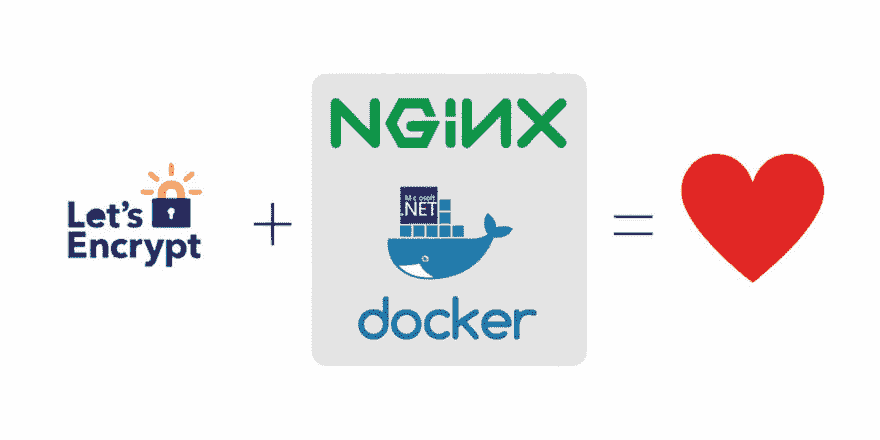

# 在 Asp.Net 核心 Docker 容器上配置 SSL

> 原文：<https://dev.to/herocod3r/configuring-ssl-on-an-aspnet-core-docker-container-1c9l>

[](https://res.cloudinary.com/practicaldev/image/fetch/s--Gt6jY22N--/c_limit%2Cf_auto%2Cfl_progressive%2Cq_auto%2Cw_880/https://thepracticaldev.s3.amazonaws.com/i/q53mh4of450sz9yctyzz.jpg)

Asp.Net 核心是一个伟大的平台，开发应用程序。拥有最好的运行时之一，以及像 C#这样强大的语言作为后盾....是的，跨平台性。只有使用它才有意义。

那么，在建立了下一个十亿美元的想法之后，接下来呢？？...它自然会被放出来供我们使用...自从……Net Core 可以运行在任何地方，只要你有相当多的选择来托管你的应用程序。但是如果你正在读这篇文章，很可能你和我一样，你想把你的应用和所有的依赖项、数据库或者甚至是你正在部署的微服务封装在一起。Docker 会是个不错的选择。获得 VPS 并完成所有必要的 docker 配置后，您就可以托管该应用程序了。但是在一个安全就是一切的世界里，你正在考虑加入 ssl 支持来增加你的机会。

好吧，那么，据说*说话是廉价的给我看看代码* lol...让我们开始吧，默认情况下，Asp.Net 核心附带一个默认的轻量级网络服务器，您可以用于 ASP.NET 核心应用程序。你可以在这里阅读更多关于红隼[的信息。](https://stackify.com/what-is-kestrel-web-server/)

虽然 Kestrel 很酷，而且大部分时间都能完成工作，但在生产环境中还不够，点击[此处](https://stackoverflow.com/questions/48077748/how-to-use-pem-certificate-in-kestrel-directly)了解更多信息

### 解:

反向代理！！，我们也可以用 Nginx 这样更成熟的网络服务器托管 ASP.NET 核心应用...嗯，不完全是主人...更像是使用 nginx 做任何事情，并将请求镜像到主 kestrel，这将允许我们配置 ssl 并享受 Nginx 的所有美妙之处。你可以在这里了解更多信息

### 配置 SSL

好了，回到正题...我们将使用 docker、certbot/letsencrypt。

#### 第一步

SSH 进入您的虚拟机，然后运行以下命令来安装 certbot

```
$ sudo apt-get update
$ sudo apt-get install software-properties-common
$ sudo add-apt-repository universe
$ sudo add-apt-repository ppa:certbot/certbot
$ sudo apt-get update
$ sudo apt-get install certbot python-certbot-nginx 
```

然后运行以下命令并按照提示为您的域安装 letsencrypt 证书

```
$ sudo certbot --nginx certonly 
```

请务必记下存储证书的路径，我们稍后会用到它。

#### 第二步

为 web 应用程序准备 docker 图像

```
FROM microsoft/dotnet:2.1-aspnetcore-runtime
WORKDIR /app
ENV ASPNETCORE_URLS http://+:5000
EXPOSE 5000
COPY . .
ENTRYPOINT ["dotnet", "ExampleApp.dll"] 
```

这里的关键是公开端口 5000，这是 nginx 将请求路由到的端口。

然后将映像推送到私有 docker 注册表。你可以从 [Treescale](treescale.com) 得到一个免费的

> 哦，也请原谅我的这种方法，我更喜欢在本地建立应用程序，只是把图像推到一个注册表，它允许更轻的文件大小。不需要将应用程序文件复制到虚拟机，对于 CI/CD，我发现这很有用。

#### 第三步

准备 docker compose 文件，是的，我们将使用 docker compose！！...我们将与 nginx 服务器一起编排 web 应用程序和任何其他依赖项，如数据库等。

所以你应该有一个名为 **docker-compose.yml** 的文件

```
version: "3"
services:
    web:
        image: repo.treescale.com/herocod3r/{sampleApp}
        expose:
            - "5000"
        depends_on:
            - mongo
    mongo:
       image: mongo:latest
       ports:
       - "27017:27017"
       volumes:
       - "/home/app/mymongo:/data/db"
       command: mongod --auth
    proxy:
        build:
            context:  ./nginx
            dockerfile: Dockerfile
        ports:
            - "80:80"
            - "443:443"
        volumes:
             - /etc/letsencrypt/:/etc/letsencrypt/
        links:
            - web 
```

**注意！**在代理服务中，我们挂载到路径 */etc/letsencrypt/* ，这样我们就可以访问证书文件。

#### 第四步

准备 nginx 配置文件和 docker 映像。创建一个名为 **nginx** 的文件夹，如上面的代理服务所示。然后创建一个名为 **nginx.conf** 的文件，并将以下内容放入其中

```
worker_processes 4;

events { worker_connections 1024; }

http {
    sendfile on;

    upstream app_servers {
        server web:5000;
    }
    server {
        listen 80 default_server;
        listen [::]:80 default_server;
        server_name {url} www.{url};
        return 301 https://www.$server_name$request_uri;
    }

    server {
        listen 443 ssl;
        ssl_certificate /etc/letsencrypt/live/{url}/fullchain.pem;
        ssl_certificate_key /etc/letsencrypt/live/{url}/privkey.pem;

        location / {
            proxy_pass         http://app_servers;
            proxy_redirect     off;
            proxy_set_header   Host $host;
            proxy_set_header   X-Real-IP $remote_addr;
            proxy_set_header   X-Forwarded-For $proxy_add_x_forwarded_for;
            proxy_set_header   X-Forwarded-Host $server_name;
        }
    }
} 
```

**注意！！**将{url}替换为我们在 certbot 中使用的注册域名。例如，如果你注册了 example.com 的*，用 example.com 的*替换{url}**

 **最后是你的代理人的文件

```
FROM nginx
COPY nginx.conf /etc/nginx/nginx.conf 
```

#### 第五步

最后，你应该有一个这样结构的文件夹

```
MyApp
    - docker-compose.yml
    nginx
      - nginx.conf
      - Dockerfile 
```

最后，您需要将 *MyApp* 文件夹复制到您的虚拟机。还要确保您已经安装了 docker 和 docker-compose。

然后 SSH 到您的虚拟机导航到 MyApp 文件夹并运行

```
docker-compose up 
```

**注意**如果你正在使用 treescale，确保你已经登录到你的 treescale 注册表，以便能够拉取网页图像

根据您的用户权限，您可能还需要在运行命令时附加 sudo。

如果一切顺利，您应该已经设置好 ssl 了，恭喜！！**