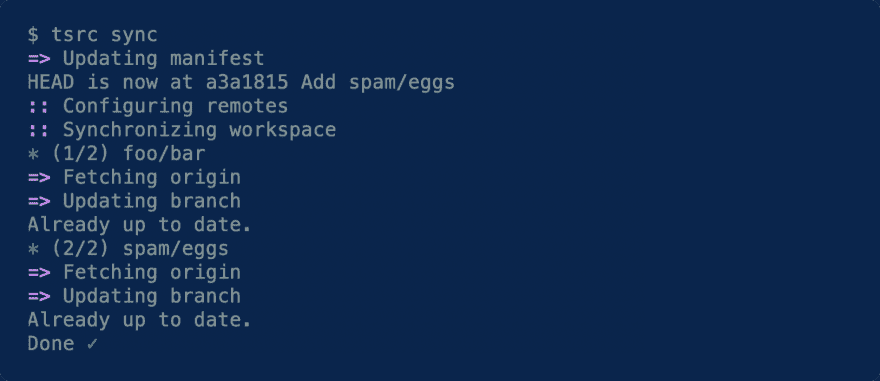

# tsrc——处理多个 git 存储库而不失去理智

> 原文：<https://dev.to/tanker/tsrc---handling-multiple-git-repositories-at-scale--eg3>

Git 已经成为主流的源代码管理器，并且是许多项目事实上的标准，包括开源和闭源项目。

然而，它不能很好地适应企业中常见的巨大代码库。

一些公司决定把所有东西都放在一个巨大的仓库里。通过这样做，他们经常以修补现有的源代码控制软件而告终，就像脸书对 Mercurial 所做的那样。

另一种方法是继续使用老式的 git:将源代码拆分到多个存储库中。

# 管理复杂性

在“多回购”的情况下，如何跟踪所有的存储库，如何在它们之间同步变更？

一种流行的方法是选择一个“主”存储库，并通过使用 git 子模块来管理其他存储库。不幸的是，并不总是能够实现这种主/从设计。此外，`git submodule`的人体工程学并不总是一样的。

# tsrc

输入 [tsrc](https://github.com/TankerHQ/tsrc) 。我们每天在[油轮](https://tanker.io)使用它来管理我们的许多资源。

[](https://res.cloudinary.com/practicaldev/image/fetch/s--0JE9HhsC--/c_limit%2Cf_auto%2Cfl_progressive%2Cq_auto%2Cw_880/https://thepracticaldev.s3.amazonaws.com/i/wvd5t83st0ndl0x79w24.png)

其核心是一个`manifest`的概念。这是一个简单的 YAML 文件，通过工作区中的相对路径(`src`)和 URL:
列出了存储库

```
repos:
  - src: foo
    url: git@gitlab.local:acme/foo

  - src: bar
    url: git@gitlab.local:acme/bar 
```

Enter fullscreen mode Exit fullscreen mode

这意味着所有的存储库都列在一个地方。

如果您有多个团队，您可能想要使用组，以便每个团队可以选择他们需要的存储库的子集。每个组都有一个名称和一个存储库列表:

```
 groups:
  first_group: 
    repos: [a, b, c]
  second_group:
    repos: [d, e] 
```

Enter fullscreen mode Exit fullscreen mode

众所周知，这种方法适用于至少 300 个不同的 git 存储库:)

# 用法

要使用 tsrc，您所要做的就是将清单本身放在 git 存储库中，然后使用下面的
命令创建一个新的工作区:

```
$  mkdir ~/work
$  cd work
$  tsrc init git@gitlab.local:acme/manifest.git 
```

Enter fullscreen mode Exit fullscreen mode

您可以使用`-g/--group`选项选择一个或多个组。

## 确保所有的库都是最新的

一旦创建了工作空间，您就可以使用`tsrc sync`一次更新所有的存储库。

*   首先更新清单本身。
*   如果清单中添加了新的存储库，则会对其进行克隆。
*   最后，更新其他存储库。

请注意，`tsrc sync`只在变化很小的情况下更新存储库。在以下情况下，tsrc 不会接触任何存储库:

*   存储库不干净
*   当地分支已从上游分出
*   没有远程跟踪分支

你可以用任何你认为合适的方式来解决这些问题。这样，就不会出现数据丢失或突发冲突的风险。tsrc 专注于正确完成简单的任务，从不尝试做聪明的事情。

最后，为了让您知道哪里需要手动干预，`tsrc sync`还会在最后
显示错误摘要:

```
$ tsrc sync
...
* (2/2) spam/eggs
=> Fetching origin
=> Updating branch
fatal: Not possible to fast-forward, aborting.
Error: Failed to synchronize workspace
* spam/eggs: updating branch failed 
```

Enter fullscreen mode Exit fullscreen mode

# 管理合并请求

另外，tsrc 还能够自动化审查工作流程，无论您使用的是 GitHub 还是 GitLab。

文档中有关于所有这些[的更多信息。](https://tankerhq.github.io/tsrc/)

# 结论

我们希望您尝试一下 tsrc，并且您会发现它是您自己项目的一个方便工具。

tsrc 开发发生在 GitHub 上[。](https://github.com/TankerHQ/tsrc)

请在评论区自由投稿、公开问题和/或给我们反馈。

PS: tsrc 是由在 tanker.io 工作的同样有才华的人用爱制造的。我们提供尽可能用户友好的开源隐私解决方案。在这里注册并乘坐它:[https://tanker.io/](https://tanker.io/)。