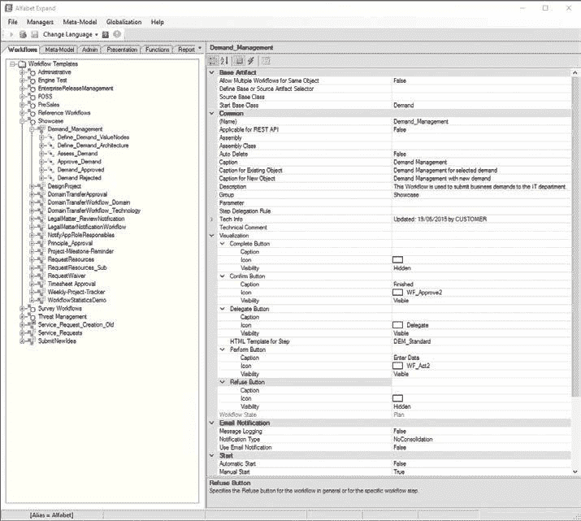
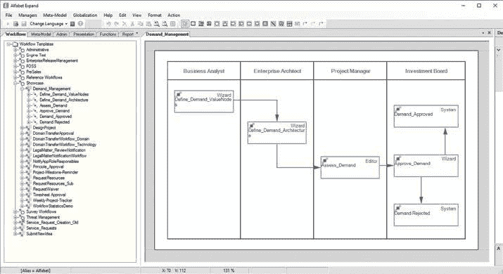
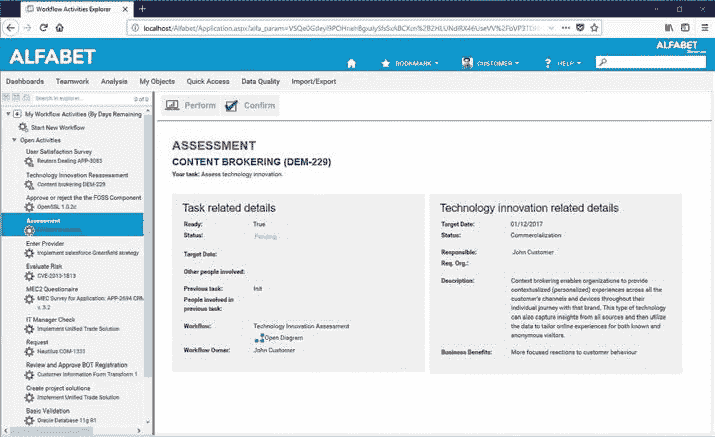

# 打造属于自己的 Alfabet 第 6 部分

> 原文：<https://dev.to/techcommunity/making-alfabet-your-own-part-6-53dc>

# 配置工作流程

| 2018 年第三期 | [ 下载 PDFT4】](http://bit.ly/2NqN03y) |
| --- | --- |

## 简介–为什么选择工作流？

业务和 IT 转型涉及许多相互关联和相互依赖的协作流程。为了解决更高层次的任务，必须执行许多(通常是不同的)活动。这些活动通常有一个特定的顺序，但是根据具体的情况，没有必要所有的活动都必须执行。不同的工作人员经常参与这些活动，这意味着他们必须进行协调。特别是对于与决策相关的活动，过程执行的文档记录非常重要。这就是为什么工作流在企业架构、IT 规划和投资组合管理中是如此重要的功能。

此外，为了保持 it 在支持业务变化方面的敏捷性，流程高效且有效地运行是至关重要的。为了使一个过程有效和高效，必须确保它以规定的方式进行(所决定的方式应该在最少的时间内产生预期的结果)。只有流程实现标准化和自动化，才能做到这一点。除了更好的协调、流程文档和更高的规划速度和准确性等明显优势之外，自动化工作流还为企业提供了其他优势:

*   **将业务和 IT 转型规则整合到整个组织中。**工作流可用于在整个组织中传播业务和 IT 规划和管理的责任，从而提高规划结果的质量，并促进利益相关方的支持。
*   **改善 IT/业务协作。**设计业务在其中发挥作用的工作流，让业务参与进来。然后，业务和 IT 部门就战略、风险、业务案例和 IT 支持以及企业转型过程中的角色和职责的表述达成共识。
*   **维护阶段闸门流程的完整性。**工作流程可确保决策时信息可用，并确保相关利益相关方参与到流程中。
*   信息流通性和准确性的证明。用于转型决策的大部分信息需要高质量的数据和高流通性。建立证明过程迫使用户思考他们所负责的数据，并为决策者(如投资组合经理或审计员)提供信心。
*   对 IT 治理的支持。提供透明性、可靠性和可追溯性，以及确保符合政策和时间表，有助于维护治理，并使 IT 跟上业务和 IT 转型流程的步伐。
*   **持续的流程改进。**流程自动化允许对流程进行绩效跟踪，并根据跟踪信息进行流程改进。

Alfabet 提供开箱即用的基本最佳实践工作流，例如用于项目规划审批、项目解决方案评估和应用淘汰的工作流。客户可以根据需要修改这些工作流，当然，也可以配置新的工作流来支持单个组织的转型实施。

## 创建工作流

工作流基于已配置的工作流模板，该模板确定了要执行的工作流步骤序列。通过动态评估的、可配置的业务规则来确定要经历的步骤的确切顺序以及负责执行任务的用户。工作流设计者定义每个工作流步骤要完成的任务，用户需要哪些视图来完成工作流步骤(例如，向导、编辑器或对象视图)，以及是否需要前置和后置条件来确定任务完成后的工作流路径。

此外，诸如发布状态的自动更新之类的动作可以被配置为由系统触发和执行。当用户负责某个工作流步骤时，当步骤完成的截止日期即将到来时，或者仅仅是因为他们应该得到通知，用户可以通过配置的或标准的电子邮件通知自动得到通知。

 

***图 1** :这里我们看到的是需求管理的工作流模板。*

图表功能可用，允许工作流设计者以图表格式配置工作流模板。这允许在配置工作流时对其进行可视化，从而简化了工作流步骤排序的任务。您可以单击图中显示的任何工作流步骤，并在表中配置其属性。它还用于显示基于模板的正在运行或已完成的工作流的当前状态和执行路径。

 

***图 2** :工作流图是交互式的，允许用户点击任何工作流步骤来找出更多信息，例如负责的用户以及步骤何时开始和结束。*

## 使用工作流

Alfabet 为用户处理他们的工作流活动提供了几个选项。标准工作流活动浏览器或管理员配置的自定义浏览器可供用户使用，作为在“我的工作流活动”功能中可视化的表格数据集的替代方案。标准工作流活动资源管理器和自定义资源管理器的优势在于，可以针对每个工作流活动自定义显示的内容。

工作流活动浏览器功能的特点是 Alfabet 中的数据设计和布局类似于已建立的电子邮件管理系统，因此用户可以更容易和有效地完成他们的工作流任务。资源管理器结构是预先配置的，不能对工作流活动资源管理器进行更改，但是在资源管理器中选择工作流活动时，右窗格中显示的数据是可配置的，并且可以为用户提供他们需要的精确数据，以便以最少的点击次数和导航到其他视图来处理手头的任务。

在 Outlook 用户熟悉的窗口视图中，工作流任务被清晰地分为“打开”、“完成”和“过期”任务。通常可用的 explorer 搜索功能可用于查找包含特定术语的活动。活动视图的重新设计提供了对当前活动的更全面的描述，例如“上一个任务”和“上一个任务的参与者”，链接到各种附加信息，例如工作流图或参与者的联系信息，以及增强的可视提示来衡量活动的相关性和重要性。此外，还描述了活动所属的对象，用户可以深入了解工作流所针对的对象的更多信息。此外，工作流设计者可以为每个标准交互分配术语和图标，例如，为每个单独的工作流步骤执行或确认。这为用户执行任务提供了更好的指导，并帮助他们衡量每项任务的重要性以及执行任务所需的时间。

 

***图 3** :工作流活动浏览器在类似于收件箱的视图中提供了打开活动的列表。图表中的按钮名称和图标是交互式的，允许用户单击任何工作流步骤来查找更多信息，例如负责的用户以及步骤开始和结束的时间。*

请继续关注我们下一集在 Alfabet 中配置报告。