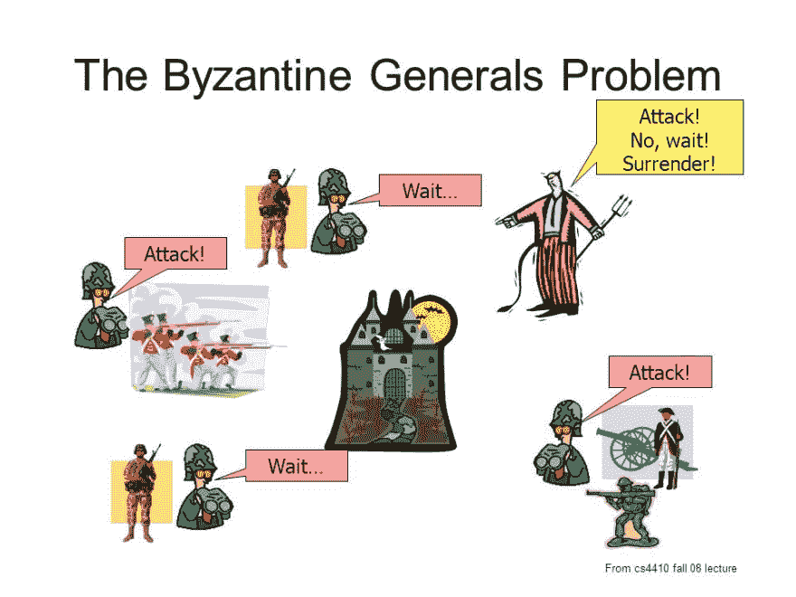
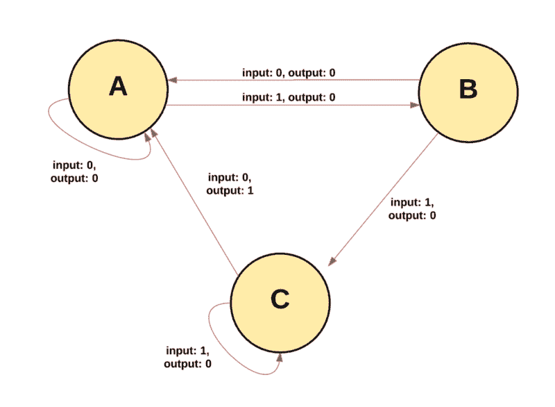
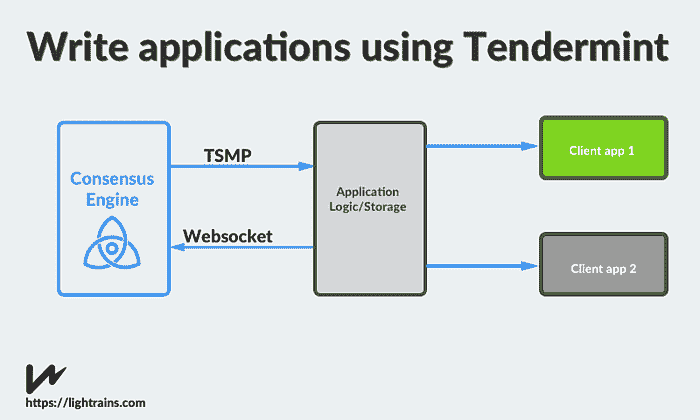
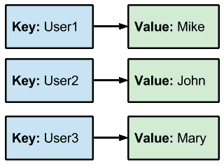

# 如何使用 Python 编写 Tendermint 应用程序

> 原文：<https://dev.to/gauthamzz/how-to-write-tendermint-applications-using-python-291a>

### 如何使用 Python，或者其他任何语言编写 Tendermint 应用程序。

<figure> 

<figcaption>来源 tendermint.com</figcaption>

</figure>

> 拜占庭容错状态机复制。或者简称区块链。

这是你打开 Tendermint 网站首先看到的东西。很可能你已经知道什么是区块链，它是驱动比特币、以太坊和其他你听说过的去中心化硬币的技术。基本前提是，人们可以用去中心化的方式来做应用，你可以用任何你喜欢的编程语言来写。也许你很困惑，所以让我们倒回去一点。

嫩薄荷速度极快。不像其他人，你可以在一秒钟内发送数千笔交易。此外，你也可以用它来建立私人区块链。

拜占庭容错状态复制机——一个很大的词，没有意义，除非你擅长分散式系统。我们把这个词拆了吧。

**拜占庭容错**

用拜占庭将军的问题来解释更好。

<figure> 

<figcaption>需要清除叛徒的将领。</figcaption>

</figure>

> 这种情况可以抽象地表述为，拜占庭军队的一群将军带着他们的部队在一个敌人的城市周围扎营。仅通过信使交流，将军们必须同意一个共同的作战计划。然而，他们中的一个或多个可能是试图迷惑其他人的叛徒。问题是找到一种算法来确保忠诚的将军们会达成一致。研究表明，仅使用口头信息，这个问题是可解的当且仅当超过三分之二的**将军是忠诚的；所以一个叛徒可以迷惑两个忠诚的将军。有了不可伪造的书面信息，任何数量的将军和可能的叛徒都可以解决这个问题。**

如果一个系统即使在某些参与者退出或敌对的情况下仍能继续运行，则称该系统为 BFT。关于共识算法，拜占庭容错通常意味着算法保证收敛，或者能够达成共识，即使存在敌对节点或者如果节点从网络中掉出等。在这个意义上，BFT 是一个共识算法的属性，而不是算法本身。

这个想法是，对于一个分散在世界各地的政党系统来说，他们彼此之间要有一个共同的协议或共识。老实说，这需要三分之二的人。

难的部分结束了，现在让我们看第二部分。

[**状态机复制**](https://en.wikipedia.org/wiki/State_machine_replication)

在计算机科学中，*状态机*指的是读取一系列输入，并基于这些输入转换到新状态的东西。

对于 Tendermint 的状态机，我们从“起源状态”开始。这类似于网络上发生任何交易之前的一张白纸。当事务被执行时，这个起源状态转换到某个最终状态。在任何时间点，该最终状态代表嫩薄荷的当前状态。

程序员定义应该容忍故障的初始状态和该状态上的一组允许的转换，并且系统确保每个复制品以相同的状态开始，并且每个复制品以相同的顺序进行相同的状态转换。这是状态机复制。

或者我们可以称它为区块链。现在让我们进入事情的细节。

### 使用 Tendermint 编写应用程序

> Tendermint 可以复制用任何编程语言编写的确定性状态机。

<figure> 

<figcaption>TSMP 现在叫 ABCI</figcaption>

</figure>

这很好，考虑到如果你想为以太坊做一个应用，你最终会学习固体。跟我赤条条的，有点棘手。

#### 从安装 Tendermint 开始

[快速入门|招标文件](https://tendermint.com/docs/introduction/quick-start.html#install)

让我们首先运行一个预构建的应用程序，然后了解如何使它成为我们自己的。我们将使用一个名为 kvstore 的应用程序。这是一个简单的应用程序，它将接受一个“键”和一个“值”并存储它。以便以后在搜索“键”时可以获得该值。非常简单的数据库应用程序。

#### 运行预建的 kvstore

Tendermint 团队已经在应用程序中构建了 kvstore 示例。你最好在我们进行的时候输入这些部分，这就是为什么我没有输入输出。