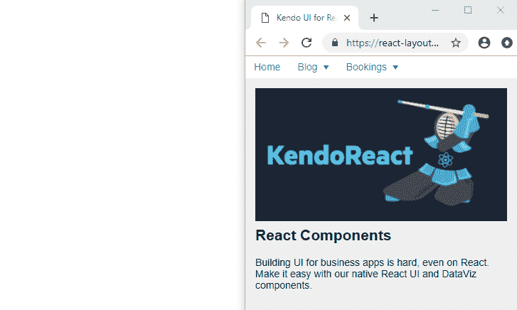
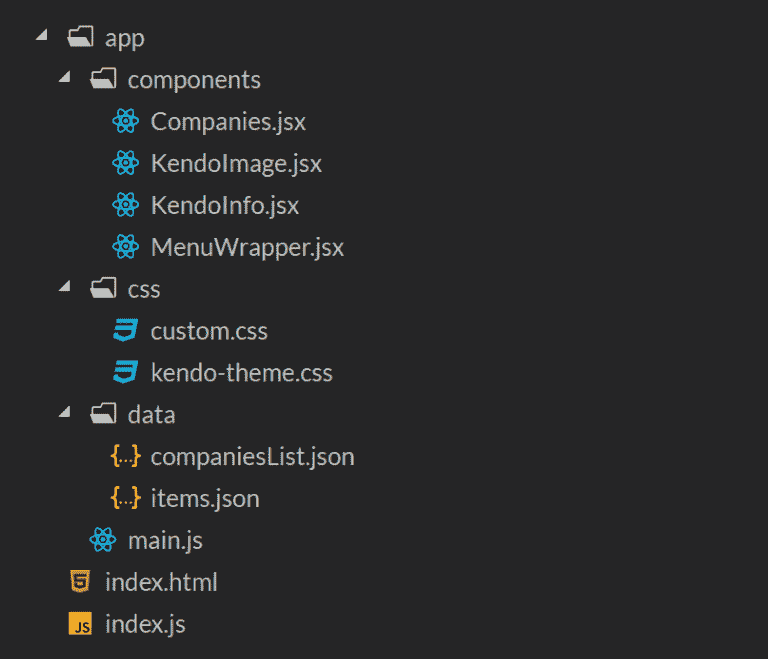

# 在 React 中创建响应网格

> 原文：<https://dev.to/progresstelerik/creating-a-responsive-grid-in-react-2h9i>

学习使用 Flexbox 创建一个响应式网格来设置 React 应用程序的基本步骤。

在我们之前的文章[在 React](https://dev.to/progresstelerik/creating-a-responsive-layout-in-react-hh6-temp-slug-4906507) 中创建响应式布局中，我们开始学习如何使用 Flexbox 和媒体查询在 React 应用程序中设置基本的响应式布局。我们使用一个 React Hooks npm 包来帮助处理断点，使用另一个包来帮助处理响应图像(图片标签)。我们还展示了 [KendoReact 菜单组件](https://www.telerik.com/kendo-react-ui/components/layout/menu/)，到最后，我们有了一个相当有响应性的演示，我们将在本文中构建它。

和 UI 没什么区别，布局需要时间和婴儿步。我们可以继续构建和工作，以重构和改进我们已经构建的内容，以及学习一些关于响应式布局的新技术，并慢慢融入这些想法。在这个应用程序中，我们应该做的下一件事是引入某种类型的响应网格。我想用另一个 npm 包来做这件事，它叫做`react-simple-flex-grid`。

我们的起点将是一个 StackBlitz 演示，它只是我们在上一篇文章中停止的演示的一个分支。如果你打算继续的话，我推荐你做一个这个演示的分支。否则，请继续阅读，并理解您可以打开我提供的任何演示，在帖子的任何停止点使用代码。我将在下面的不同地方提供几个演示。

我们的应用程序应该看起来像下面的图片:

[](https://res.cloudinary.com/practicaldev/image/fetch/s--DcOYYNt2--/c_limit%2Cf_auto%2Cfl_progressive%2Cq_66%2Cw_880/https://i.imgur.com/etEIlNo.gif)

它不会赢得任何奖项，但我们还没有真正关注外观和感觉，我们仍然在这个不断移动和调整响应的世界中获得我们的航海腿。我们已经学习了一些非常基本的布局技术。也就是说，在博客系列的这一部分中，我想着重于创建一个可以在我们的应用程序中使用的响应式网格，这样我们就不必为了使用他们的网格而引入 Bootstrap 之类的东西。

我将模拟一些东西，我们可以尝试和建立，将利用这个网格的许多断点。这个想法将是从使用我们产品的公司的标志网格。这是公司在他们的网站上做的非常标准的事情，同样的概念可以应用于许多不同的用途。我首先需要得到一些我们可以使用的标志。我会将它们上传到 imgur，这样我们就可以轻松地将它们与 StackBlitz 一起使用。我们将在一个网格中显示这些图像，在大分辨率下显示四个宽，在中等分辨率下显示三个宽，在小分辨率下显示两个宽。

我将分叉我们的演示，并开始工作，我们的第一套变化。

首先要做的是在一个`.json`文件中创建一个公司列表。在我们将徽标列表放入网格之前，我们应该首先考虑编写一些代码，将名称列表中的每个公司映射到 JSX 中的一些标记中。我们的`companyList.json`文件将简单地包含一个对象数组。每个对象都是一家公司，它有一个名称和一个图像 url。我将为每个公司上传一张图片到`imgur.com`，我们可以使用我们的形象。

添加一个`companyList.json`文件。

```
[
  { "name": "Nasa", "image": "https://imgur.com/RTFOOHR" },
  { "name": "Microsoft", "image": "https://imgur.com/yln0oYC" },
  { "name": "Phillips", "image": "https://imgur.com/ZHKnVr8" },
  { "name": "Fox", "image": "https://imgur.com/Hrzbo49" },
  { "name": "Sony", "image": "https://imgur.com/Ld5Ux3g" },
  { "name": "IBM", "image": "https://imgur.com/rg7RAdm" },
  { "name": "Toshiba", "image": "https://imgur.com/aj9vfmu" },
  { "name": "Volvo", "image": "https://imgur.com/hTkpXvw" }
] 
```

我们需要创建一个`Companies.jsx`页面。这些组件文件不必使用`.jsx`格式，它们也可以使用`.js`作为文件扩展名。当我创建一个新组件时，我通常使用`.jsx`。

```
import React from 'react';
import companyList from './companyList.json';

const Companies = () => {
  return (
    <div className="companies">
      {companyList.map(co => <div>{co.name}</div>)}
    </div>
  );
}

export default Companies; 
```

这里没有什么太复杂的，我们导入 react 和我们的公司列表。我们创建了一个功能组件，它简单地映射到公司列表，并将名称值粘贴到一个 div 中。每个公司都重复这一过程，现在我们可以考虑如何从这一步开始，为每个图像构建一个灵活的网格。

现在让我们将下面的导入添加到`main.js`页面:

```
import Companies from './Companies'; 
```

然后，我们将在剑道 UI 信息的下方显示我们的公司组件。类名为`kendo-details`的 div 现在看起来像下面的代码示例:

```
<div className='kendo-details'>
    <h2>React Components</h2>
    <p>Building UI for business apps is hard, even on React. Make it easy with our native React UI and DataViz components.</p>
    <h2>Companies Using Kendo</h2>
    <Companies />
</div> 
```

此时，如果您一直在跟进，您的演示将与下面的 StackBlitz 相匹配:

## 我们来谈谈图像

这个列表中的图像是`600 x 600 px`的，我们不想以那个分辨率显示它们，所以我想遍历这些名称以确保我们的逻辑和代码正常工作。实际上，我希望每个断点都有不同的图像，但是让我们一步一步来。这意味着 600 像素大小的图像显示在大的断点上。300 像素将是中断点以上直到大断点的图像大小。最后，我们的小图像将是 150 像素宽。

但是现在，我们可以调整它们的大小来占据它们 100%的空间。

让我们添加我们想要用于 Flexbox 网格解决方案的包:`react-simple-flex-grid`。我选择这个包是因为它易于使用。我试用了 React 的几个包，它们提供了类似的组件模型。我们将创建`<Row></Row>`和`<Col></Col>`标签，而不是创建 div。这个库虽然简单，但让我们可以做一些复杂的事情。为了创建一个网格，我们将只使用一行。在 Row 标记中，我们将为列表中的每一项重复 a Col 组件。然后我们可以为每个断点提供指令。

下面是我想如何使用他们的组件 API:

关闭默认的 12 列网格，我想要:

*   在 XSmall:每个 Col 组件将占用每行的 6 列
*   小:每个 Col 组件将占用每行的 4 列
*   中等:每个列组件将占用每行的 3 列
*   一般情况下:每个 Col 组件将占用每行的 2 列
*   At XLarge:每个 Col 组件将占用每行的 2 列

这也意味着:

*   在 XSmall:每行将有 2 个图像
*   在小:每行将有 3 个图像
*   中等:每行将有 4 个图像
*   逍遥法外:每行将有 6 个图像
*   在 XLarge:每行将有 6 个图像

为此，我们将更新映射 companyList 的 JavaScript 片段，以生成我们需要使用的由`react-simple-flex-grid`提供的组件。默认情况下，断点为:

*   XSmall: 0-767
*   小号:768-991
*   中等:992-1199
*   大号:1200-1599
*   XLarge:1600-无穷大

记住所有这些，只需浏览一下 GitHub 或 NPM 页面中的`react-simple-flex-grid`，您就会看到我们需要编写的 JSX 应该是:

```
<Row gutter={40}>
  {companyList.map(co => 
    <Col 
      xs={{ span: 6 }} sm={{ span: 4 }} md={{ span: 3 }}
      lg={{ span: 2 }} xl={{ span: 1 }}
    >{co.name}</Col>
  )}
</Row> 
```

如果我们要描述我们的网格在中等断点之上和大断点之下的样子，它应该是这样的:

[](https://res.cloudinary.com/practicaldev/image/fetch/s--RMFjJoj0--/c_limit%2Cf_auto%2Cfl_progressive%2Cq_66%2Cw_880/https://i.imgur.com/2QXWHNu.gif)

但是每列中只有文本，这看起来不像我们想要的，所以让我们添加图像。更新公司组件上的代码，以返回以下 JSX:

```
const Companies = () => {
  return (
    <Row gutter={40}>
      {(companyList).map(co => 
        <Col 
          xs={{ span: 6 }} sm={{ span: 4 }} md={{ span: 3 }}
          lg={{ span: 2 }} xl={{ span: 1 }}
        ></Col>
      )}
    </Row>
  );
} 
```

此时，如果您一直在跟进，您的演示将与下面的 StackBlitz 相匹配:

现在我们有了一个更好的页面布局方式，我想重新思考一下我们的 Flexbox 布局。我们在 CSS 中对媒体查询所做的自定义工作并不漂亮，最好是编写清晰简洁的代码，包括 CSS。当我回头看 navbar 和主要代码时，我无法想象真正理解它，除非我写了它。我也不认为我们的目标是自己为网格编写 CSS。这本身可能是一整篇文章。我们想要的是某种类型的组件，它可以抽象出构建 Flexbox 网格的细节，并使该技术在简单的 React 组件系统中可用。我从不羞于扔掉代码。所以让我们把垃圾拿出去。

我认为，通过这个新的简单网格系统，我们可以实现类似的布局，此外，我们还可以去掉以前编写的一些令人困惑的 CSS，转而使用 React Simple Flex Grid 中的行和列组件。我们将有一些 CSS 代码，它将包含一些断点，但让我们使用 React Simple Flex 网格中默认的断点。在玩了不同尺寸的屏幕后，我认为我最初的想法是在这么小的尺寸上有几个断点，这并不是我最终想要的。因此，我将删除 415 像素的断点。让我们再来看看这个网格系统的默认断点是什么。

*   XSmall: 0-767
*   小号:768-991
*   中等:992-1199
*   大号:1200-1599
*   XLarge:1600-无穷大

查看这组断点，我认为我们可以只使用两个标题图形。其中一个会显示到 768 像素。然后我们将切换到一个更小的正方形图像。我制作了两个新图像来使用:

我们的**小**图像需要 767 像素宽，这是因为在到达 768 像素的断点之前，767 像素宽将是它可以显示的最大值

我们的**中上**图像的宽度将为 300 像素，因为这似乎是我目前想要显示的最大图像。我们总是可以创建另一个图像来服务于更大的屏幕，但是为了简洁起见，让我们回到只服务于小屏幕对中屏幕和更高屏幕。

小:

[](https://res.cloudinary.com/practicaldev/image/fetch/s--pb5_XM_3--/c_limit%2Cf_auto%2Cfl_progressive%2Cq_66%2Cw_880/https://i.imgur.com/NPqmOcC.gif)

中上:

[](https://res.cloudinary.com/practicaldev/image/fetch/s--Hu9iKZne--/c_limit%2Cf_auto%2Cfl_progressive%2Cq_66%2Cw_880/https://i.imgur.com/IKbwhjG.gif)

为了节省大量繁琐的步骤，我认为使用 React Simple Flex Grid 呈现这些新变化的最佳方式是我挥舞一下魔杖，向您展示一个经过重构的更新的 StackBlitz 示例。但是我将解释我在这个重构中做了什么:

我的想法是使用我们的 React Simple Flex Grid 组件，而不是我们提出的定制 Flexbox 代码。它将清理我们的 CSS 和 HTML。我还将把剑道 UI 信息部分移到它自己的名为`KendoInfo`的组件中，就像公司有自己的组件一样。我们的`main.js`文件看起来应该相当简单。出于这个原因，我也将把响应图像放在它自己的组件中，这样它就不会扰乱 JSX。

如果需要的话，将我们的`ResponsiveImage`组件移动到一个包装器中也将允许我们传递道具给它。我们现在不会那样做，但将来会是个好主意。例如，我们可以传入一个图像数组，每个图像都有一个最小宽度。这个数据可以用来在`ResponsiveImage`组件中生成`ResponsiveImageSize`组件。但是现在，至少我们已经抽象了代码，把它移到了`main.js`文件之外，并把它隔离了。

让我们看看我们清理后的`main.js`文件现在是什么样子:

```
const App = () => {
  const checkIfMediumPlus = useMediaPredicate("(min-width: 768px)");
  return (
    <Row gutter={40}>
      <Col xs={{ span: 12 }} sm={{ span: 2 }}>
        <MenuWrapper isMediumPlus={checkIfMediumPlus} />
      </Col>
      <Col xs={{ span: 12 }} sm={{ span: 10 }} >
        <Row gutter={0}>
          <Col xs={{ span: 12 }} sm={{ span: 3 }} md={{ span: 3 }}>
            <KendoImage />
          </Col>
          <Col xs={{ span: 12 }} sm={{ span: 9 }} md={{ span: 9 }}>
            <KendoInfo />
          </Col>
          <Col span={12}>
            <Companies />
          </Col>
        </Row>
      </Col>
    </Row>
  );
} 
```

这对于任何人来说都更容易进入并理解正在发生的事情。只要他们对其他 12 列网格的工作原理有一个基本的了解，或者他们可能在过去使用过 Bootstrap 或 Foundation，这看起来就很熟悉。

至于`custom.css`文件，我所做的是设置一些断点来匹配`react-simple-flex-grid`的默认值，我费力地检查了每个断点，并为每个组件编写了一些样式。当我们提升到中等或更高时，我们也会增加文字的整体尺寸。它并不完美，但比我们之前的要好，并且在浏览文档时易于阅读和理解。

```
.navbar {
  background-color: #fff;
}
.component-responsive-image img {
  padding: 1em;
  width: 100%;
}
.kendo-info {
  padding: 1em;
}
.companyList {
  padding: 1em;
  background-color: #efefef;
}

@media screen and (min-width: 0px) {
  .component-responsive-image img {
    padding: 0;
    width: 100%;
  }
  .companyList h2, .kendo-info h2 {
    margin-top: 0;
  }
}

@media screen and (min-width: 768px) {
  .navbar {
    height: 100vh;
    padding-top: 1em;
    background-color: #efefef;
  }
  .component-responsive-image {
    height: 100%;
  }
  .component-responsive-image img {
    padding: 1em;
    max-width: auto;
    height: 100%;
  }
  .companyList {
    background-color: #fff;
  }
  .kendo-info {
    font-size: 1.25em;
  }
}

@media screen and (min-width: 992px) {
  .kendo-info {
    font-size: 1.5em;
  }
} 
```

最后，我已经将文件整理到了各自的目录中:

[](https://res.cloudinary.com/practicaldev/image/fetch/s--Xd1d7c6G--/c_limit%2Cf_auto%2Cfl_progressive%2Cq_66%2Cw_880/https://i.imgur.com/0TYzitm.gif)

## 包装完毕

这就把我们带到了这个系列的这一部分的结尾。到目前为止，在我们的第一篇文章中，我们已经讨论了如何手动使用 Flexbox，并探索了如何使用生态系统中的 React 组件来帮助我们实现响应行为，而无需手动完成所有工作。在这篇文章中，我们继续依靠生态系统来寻找一个简单易用的网格系统，这样我们就可以为其他目的创建响应性的布局和网格，如图片画廊。我希望你能感觉到你知道如何更好地做出反应。

了解这种东西如何在幕后工作总是值得的，但是，在这个时代没有理由推出自己的 Flexbox 网格-这样做一次以获得基本的理解是很好的，但有许多组件可以帮助你做到这一点。它节省了大量的时间和悲伤，如果你转向另一种解决方案，这并不难改变。

下面是我们最后的 StackBlitz 演示和这个重构练习的产品。如果我负责完全构建这个应用程序，这将是一个很好的起点，我们将有工具来帮助我们处理应用程序中的日常响应行为和布局。