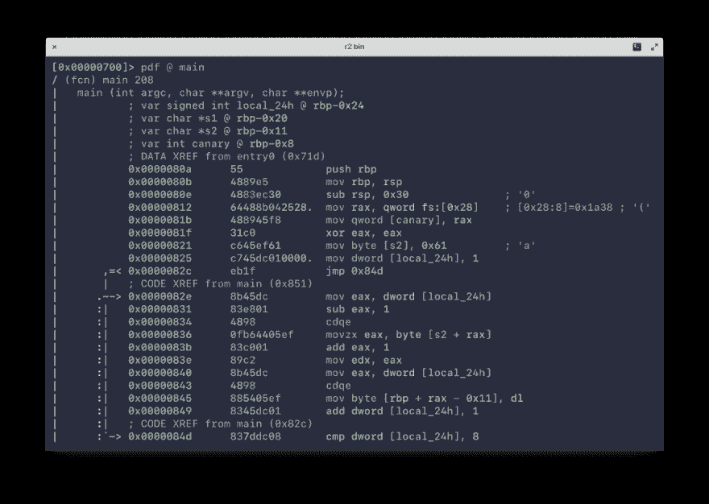
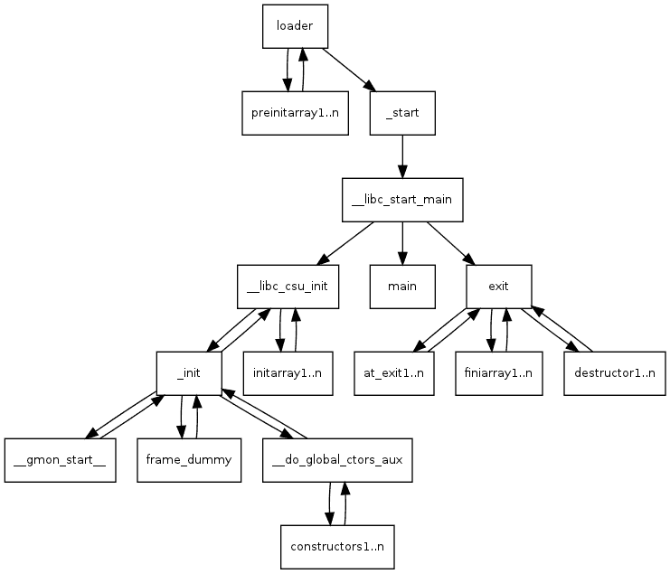

# Python 用于逆向工程#1: ELF 二进制文件

> 原文：<https://dev.to/icyphox/python-for-reverse-engineering-1-elf-binaries-1fo4>

[](https://res.cloudinary.com/practicaldev/image/fetch/s--aAHjg1Uk--/c_limit%2Cf_auto%2Cfl_progressive%2Cq_auto%2Cw_880/https://cdn-images-1.medium.com/max/1024/1%2APpKOOctJfirFZmUclzUUBA.png) 

<figcaption>那是 radare2。不，我们的脚本看起来不像这样:(</figcaption>

#### 打造自己的拆卸工具——没错——乐趣和利润

在解决复杂的逆向挑战时，我们经常使用 radare2 或 IDA 这样的成熟工具进行反汇编和调试。但是有时候你需要更深入一点，了解事情是如何进行的。

当涉及到自动化某些过程时，滚动自己的反汇编脚本会非常有帮助，并最终构建自己的自制逆向工具链。至少，这是我正在尝试的。

### 设置

顾名思义，在

之前，你需要一个 Python 3 解释器。一旦你确信无疑，你就可以在你的系统上安装一个 Python 3 解释器，运行

```
$ pip install capstone pyelftools 
```

其中 capstone 是反汇编引擎，我们将用它编写脚本，pyelftools 帮助解析 ELF 文件。

说完这些，让我们从一个基本的逆转

挑战的例子开始。

```
/\* chall.c \*/

#include <stdio.h>
#include <stdlib.h>
#include <string.h>

int main() {
   char \*pw = malloc(9);
   pw[0] = 'a';
   for(int i = 1; i <= 8; i++){
       pw[i] = pw[i — 1] + 1;
   }
   pw[9] = '\0';
   char \*in = malloc(10);
   printf("password: ");
   fgets(in, 10, stdin); // 'abcdefghi'
   if(strcmp(in, pw) == 0) {
       printf("haha yes!\n");
   }
   else {
       printf("nah dude\n");
   }
} 
```

用 GCC/Clang 编译:

```
$ gcc chall.c -o chall.elf 
```

### 脚本

首先，让我们看看二进制文件中的不同部分。

```
# sections.py

from elftools.elf.elffile import ELFFile

with open('./chall.elf', 'rb') as f:
    e = ELFFile(f)
    for section in e.iter\_sections():
        print(hex(section[’sh\_addr’]), section.name) 
```

这个脚本遍历了所有的部分，并向我们展示了它的加载位置。这在以后会非常有用。运行它给了我们

```
› python sections.py
0x238 .interp
0x254 .note.ABI-tag
0x274 .note.gnu.build-id
0x298 .gnu.hash
0x2c0 .dynsym
0x3e0 .dynstr
0x484 .gnu.version
0x4a0 .gnu.version\_r
0x4c0 .rela.dyn
0x598 .rela.plt
0x610 .init
0x630 .plt
0x690 .plt.got
0x6a0 .text
0x8f4 .fini
0x900 .rodata
0x924 .eh\_frame\_hdr
0x960 .eh\_frame
0x200d98 .init\_array
0x200da0 .fini\_array
0x200da8 .dynamic
0x200f98 .got
0x201000 .data
0x201010 .bss
0x0 .comment
0x0 .symtab
0x0 .strtab
0x0 .shstrtab 
```

其中大部分与我们无关，但这里有几个部分值得注意。的。文本部分包含我们需要的指令(操作码)。的。数据节应该在编译时初始化字符串和常量。最后是。plt 是过程链接表，而。得到了，全局偏移表。如果您不确定这些是什么意思，请阅读 ELF 格式及其内部内容。

因为我们知道。文本部分有操作码，让我们从那个地址开始反汇编二进制代码。

```
# disas1.py

from elftools.elf.elffile import ELFFile
from capstone import \*

with open('./bin.elf', 'rb') as f:
    elf = ELFFile(f)
    code = elf.get\_section\_by\_name('.text')
    ops = code.data()
    addr = code['sh\_addr']
    md = Cs(CS\_ARCH\_X86, CS\_MODE\_64)
    for i in md.disasm(ops, addr):        
        print(f'0x{i.address:x}:\t{i.mnemonic}\t{i.op\_str}') 
```

代码相当简单(我认为)。我们应该在运行
时看到这一点

```
› python disas1.py | less      
0x6a0: xor ebp, ebp
0x6a2: mov r9, rdx
0x6a5: pop rsi
0x6a6: mov rdx, rsp
0x6a9: and rsp, 0xfffffffffffffff0
0x6ad: push rax
0x6ae: push rsp
0x6af: lea r8, [rip + 0x23a]
0x6b6: lea rcx, [rip + 0x1c3]
0x6bd: lea rdi, [rip + 0xe6]
**0x6c4: call qword ptr [rip + 0x200916]**
0x6ca: hlt
... snip ... 
```

粗体的那一行对我们来说相当有趣。[rip + 0x200916]处的地址相当于[0x6ca + 0x200916]，后者的计算结果为 0x200fe0。第一次调用 0x200fe0 处的函数？这个功能是什么？

为此，我们将不得不看看**重定位**。引用 linuxbase.org[的话](http://refspecs.linuxbase.org/elf/gabi4+/ch4.reloc.html)

> 重定位是用符号定义连接符号引用的过程。例如，当程序调用一个函数时，相关的 call 指令必须在执行时将控制转移到正确的目标地址。可重定位文件必须有“重定位条目”，这是必要的，因为它们包含描述如何修改其节内容的信息，从而允许可执行和共享目标文件保存进程程序映像的正确信息。

为了尝试找到这些重定位条目，我们编写了第三个脚本。

```
# relocations.py

import sys
from elftools.elf.elffile import ELFFile
from elftools.elf.relocation import RelocationSection

with open('./chall.elf', 'rb') as f:
    e = ELFFile(f)
    for section in e.iter\_sections():
        if isinstance(section, RelocationSection):
            print(f'{section.name}:')
            symbol\_table = e.get\_section(section['sh\_link'])
            for relocation in section.iter\_relocations():
                symbol = symbol\_table.get\_symbol(relocation['r\_info\_sym'])
                addr = hex(relocation['r\_offset'])
                print(f'{symbol.name} {addr}') 
```

让我们快速浏览一下这段代码。我们首先遍历这些部分，检查它是否属于 RelocationSection 类型。然后，我们从每个部分的符号表中迭代重定位。最后，运行这个程序会得到

```
› python relocations.py
.rela.dyn:
 0x200d98
 0x200da0
 0x201008
\_ITM\_deregisterTMCloneTable 0x200fd8
**\_\_libc\_start\_main 0x200fe0**
\_\_gmon\_start\_\_ 0x200fe8
\_ITM\_registerTMCloneTable 0x200ff0
\_\_cxa\_finalize 0x200ff8
stdin 0x201010
.rela.plt:
puts 0x200fb0
printf 0x200fb8
fgets 0x200fc0
strcmp 0x200fc8
malloc 0x200fd0 
```

还记得之前在 0x200fe0 的函数调用吗？是的，这是对著名的 __libc_start_main 的调用。再次显示[linuxbase.org](http://refspecs.linuxbase.org/LSB_3.1.0/LSB-generic/LSB-generic/baselib---libc-start-main-.html)

> __libc_start_main()函数应执行执行环境的任何必要初始化，使用适当的参数调用 *main* 函数，并处理 main()的返回。如果 main()函数返回，返回值将被传递给 exit()函数。

而它的定义是这样的

```
int \_\_libc\_start\_main(int \*(main) (int, char \* \*, char \* \*), int argc, char \* \* ubp\_av, void (\*init) (void), void (\*fini) (void), void (\*rtld\_fini) (void), void (\* stack\_end)); 
```

回头看看我们的拆解

```
0x6a0: xor ebp, ebp
0x6a2: mov r9, rdx
0x6a5: pop rsi
0x6a6: mov rdx, rsp
0x6a9: and rsp, 0xfffffffffffffff0
0x6ad: push rax
0x6ae: push rsp
0x6af: lea r8, [rip + 0x23a]
0x6b6: lea rcx, [rip + 0x1c3]
**0x6bd: lea rdi, [rip + 0xe6]**
0x6c4: call qword ptr [rip + 0x200916]
0x6ca: hlt
... snip ... 
```

但这一次，在 lea 或 Load 有效地址指令处，它将某个地址[rip + 0xe6]加载到 rdi 寄存器中。[rip + 0xe6]计算结果为 0x7aa，这恰好是我们 main()函数的地址！我怎么知道？因为 __libc_start_main()，无论做什么，最终都会跳转到 rdi 处的函数，一般是 main()函数。它看起来像这样

[](https://res.cloudinary.com/practicaldev/image/fetch/s--ibi_4Oax--/c_limit%2Cf_auto%2Cfl_progressive%2Cq_auto%2Cw_880/https://cdn-images-1.medium.com/max/741/0%2AoQA2MwHjhzosF8ZH.png)

要查看 main 的反汇编，请在我们之前编写的脚本(disas1.py)的输出中查找 0x7aa。

从我们前面发现的情况来看，每个调用指令都指向一些我们可以从重定位条目中看到的函数。所以跟踪每个调用到它们的重定位给了我们这个

```
printf 0x650
fgets 0x660
strcmp 0x670
malloc 0x680 
```

把所有这些放在一起，事情开始变得有条不紊。让我在这里强调一下拆卸的关键部分。这是不言自明的。

```
0x7b2: mov edi, 0xa ; 10
0x7b7: call 0x680 ; malloc 
```

填充*pw 字符串的循环

```
0x7d0: mov eax, dword ptr [rbp - 0x14]
0x7d3: cdqe    
0x7d5: lea rdx, [rax - 1]
0x7d9: mov rax, qword ptr [rbp - 0x10]
0x7dd: add rax, rdx
0x7e0: movzx eax, byte ptr [rax]
0x7e3: lea ecx, [rax + 1]
0x7e6: mov eax, dword ptr [rbp - 0x14]
0x7e9: movsxd rdx, eax
0x7ec: mov rax, qword ptr [rbp - 0x10]
0x7f0: add rax, rdx
0x7f3: mov edx, ecx
0x7f5: mov byte ptr [rax], dl
0x7f7: add dword ptr [rbp - 0x14], 1
0x7fb: cmp dword ptr [rbp - 0x14], 8
0x7ff: jle 0x7d0 
```

这看起来像我们的 strcmp()

```
0x843: mov rdx, qword ptr [rbp - 0x10] ; \*in
0x847: mov rax, qword ptr [rbp - 8] ; \*pw
0x84b: mov rsi, rdx             
0x84e: mov rdi, rax
0x851: call 0x670 ; strcmp  
0x856: test eax, eax ; is = 0? 
0x858: jne 0x868 ; no? jump to 0x868
0x85a: lea rdi, [rip + 0xae] ; "haha yes!" 
0x861: call 0x640 ; puts
0x866: jmp 0x874
0x868: lea rdi, [rip + 0xaa] ; "nah dude"
0x86f: call 0x640 ; puts 
```

我不确定它为什么在这里使用 puts？我可能遗漏了什么；也许 printf 调用看跌期权。我可能错了。我也和 radare2 确认了那些位置其实就是字符串“哈哈是的！”和“不伙计”。

### 结论

嗯，那花了不少时间。但是我们结束了。如果你是一个初学者，你可能会觉得非常困惑，或者可能根本不明白发生了什么。这没关系。建立阅读和探索反汇编的直觉来自实践。我也不擅长。

这篇文章中使用的所有代码都在这里:[https://github.com/icyphox/asdf/tree/master/reversing-elf](https://github.com/icyphox/asdf/tree/master/reversing-elf)

现在再见，我们将在本系列的第 2 期——PE 二进制文件中再见。无论何时。

> 我是 Anirudh，计算机系本科生，专注于攻击性安全和数字取证。我在网上用“icyphox”这个名字。

#### 链接

*   [GitHub](https://github.com/icyphox)
*   [网站](https://icyphox.sh)
*   [推特](https://twitter.com/icyphox)

随时给我发邮件 [icyph0x@pm.me](//mailto:icyph0x@pm.me) 。