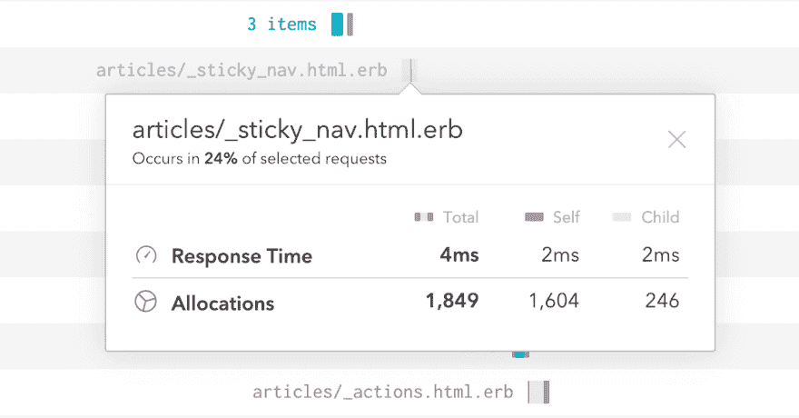
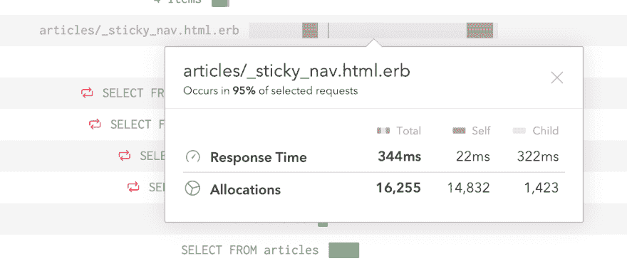

# 开发社区正在通过 Skylight 开源其性能指标

> 原文：<https://dev.to/devteam/dev-community-is-open-sourcing-its-performance-metrics-via-skylight-221m>

去年夏天，我们开源了我们的平台。

 [## dev.to 现在是开源的

### Ben Hal pern Aug 8 ' 184min read

#meta #opensource](/ben/devto-is-now-open-source-5n1)

但那只是代码。我们现在通过向社区提供我们的 Skylight 仪表板来开放更多的业务。这将有助于为每个向项目提交代码的人提供更多的上下文，也将为任何希望随着我们的发展深入了解我们的运营的人提供一个学习机会。毕竟，总有一些关于软件的内在的元设计，让人们聚集在一起谈论软件。

## T2】👉开发天窗仪表板📊

Skylight 提供了对响应时间、缓慢的查询、低效的内存分配的洞察——总体上帮助我们描绘出人们使用该平台时总体上发生了什么。

我们大量使用我们的 CDN 来实际服务我们的大部分流量，而根本不需要访问原始服务器。你可以在这里读到:

 [## 在几毫秒内渲染一个复杂的 Web 应用程序需要什么

### Ben Hal pern Aug 18 ' 174min read

#webperf #meta #cdn #webdev](/ben/what-it-takes-to-render-a-complex-webapp-in-milliseconds)

但是，随着我们添加新的功能和发展，我们有越来越多类型的请求以这样或那样的方式触及源头。这些是我们从 Skylight 收集到的见解。

## 工作原理

这是一个使用天光的例子。特别是在这个页面上，这是这篇文章的粘性边栏的性能影响(如果你在桌面设备上可以看到)

### 对快速请求

该图显示了页面的这一部分对于*快速请求*的性能。您会看到页面的这个区域有 24%的时间是被渲染的，当它被渲染时，它的性能相当好。这种情况是片段缓存的结果，因此 76%的时间是作为来自内存的存储 HTML，而不是对数据库的新查询。

### 对慢速请求

另一方面，我们可以通过检查页面运行缓慢时发生了什么来了解很多信息。这里速度慢的部分原因是因为我们更频繁地为这个区域提供冷服务，并在下面执行其他冷查询，这导致了相当大的性能损失。

优化 Rails 性能很大程度上取决于高效的查询和明智的缓存策略。

 [## Rails 中的俄罗斯娃娃缓存

### Jeff Kreeftmeijer for app signal Apr 4 ' 1815min read

#performance #caching #optimization #rails](/appsignal/russian-doll-caching-in-rails--3j8o)

## 文章不再可用

 [## Ruby on Rails 的 42 个性能提示

### Magnus Skog ・ Jan 26 '19 ・ 15 min read

#ruby #rails #performance](/mskog/42-performance-tips-for-ruby-on-rails-4aik)

Skylight 是相当直观的，但是这个东西本质上是相当复杂的，所以可能需要一些时间来理解你正在看的东西。Skylight 的[入门指南](https://www.skylight.io/support/getting-started)是一个很好的起点。

应用程序中一些最松散的代码是为了寻求性能提升，所以这总是一个有得有失的问题。你可以查看我们的[开源代码环境](https://codeclimate.com/github/thepracticaldev/dev.to)来深入了解代码库中在技术债务和代码可读性方面最需要努力的部分。

我们的项目、社区和代码库都比我们第一次发布代码开源时好得多。我们已经进行了半年的旅程，我们迫不及待地想和你们一起继续。该项目的成功和失败很少是严格的技术性质，但我们也有一些真正伟大的技术胜利。每当我们迈出这样的一步，我们就朝着成为我们希望更多的公开透明的科技公司又迈进了一步。

编码快乐！