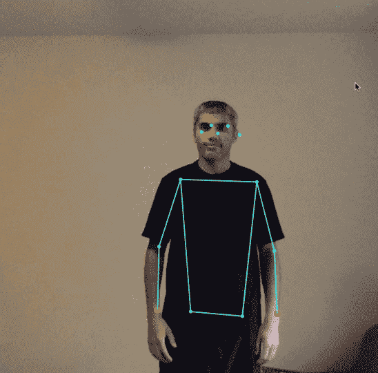

# 联盟

> 原文：<https://dev.to/vabarbosa/veremina-browser-based-video-theremin-4a37>

> *从[medium.com](https://medium.com/ibm-watson-data-lab/veremin-a-browser-based-video-theremin-1548b63200c)T3】传中*

#### 使用 TensorFlow.js、PoseNet 和 Web MIDI & Web 音频 API 制作音乐

[https://www.youtube.com/embed/ZCs8LBBZqas](https://www.youtube.com/embed/ZCs8LBBZqas)

### 遇见 Veremin！

Veremin 是一个视频 [theremin](https://en.wikipedia.org/wiki/Theremin) 允许任何人做出美丽(:-？)音乐只是靠挥动手臂！它使用了 [TensorFlow.js](https://js.tensorflow.org/) 、 [PoseNet](https://github.com/tensorflow/tfjs-models/tree/master/posenet) ，以及 [Web MIDI](https://webaudio.github.io/web-midi-api/) 和[Web Audio](https://developer.mozilla.org/en-US/docs/Web/API/Web_Audio_API)API。

Veremin 是来自麻省理工学院-IBM 沃森人工智能实验室的 johncohnvt 的创意，他建造了第一个粗略的原型。然后我就能把它变成真正有用的东西了！

该应用程序附加到来自网络摄像机的视频流。PoseNet 用于捕捉你的手在视频中的位置。该位置然后被转换成音乐。

由于 TensorFlow.js 的魔力，Veremin 100%生活在浏览器中，并可在所有现代浏览器(Chrome、Safari、Firefox、IE)和平台(OS X、iOS、Android、Windows)上工作。

我们最深切地感谢[谷歌创意实验室](https://medium.com/tensorflow/real-time-human-pose-estimation-in-the-browser-with-tensorflow-js-7dd0bc881cd5)的人们，他们用他们的[演示应用](https://github.com/tensorflow/tfjs-models/tree/master/posenet/demos)给了我们一个良好的开端。

### 打 Veremin！

只需将你的浏览器指向你的台式机、笔记本电脑、平板电脑或手机上的[ibm.biz/veremin](https://ibm.biz/veremin)。出现提示时，允许应用程序使用相机，并确保音量已调高。

站在你的设备摄像头前，调整你的位置，使你的躯干适合屏幕。调整你的姿势，使你以屏幕中央的垂直红线为中心，并且你的腰部大致与水平红线平齐。你应该看到你的表格的简写版本为蓝色。现在，把你的双手移到红色水平线以上。上下移动右手控制音高，左右移动左手控制音量。

[*现在就拿它来摇摇*](https://twitter.com/BradleyHolt/status/1087404900219318273) *！┌(・⌣・)┘♪*

如果你感兴趣，你可以通过点击屏幕右上角的设置图标来调整一些参数。你可以在这里阅读更多关于各种控制选项[的信息。](https://github.com/vabarbosa/veremin/blob/master/CONTROLPANEL.md)

### 使用 Veremin 作为 MIDI 控制器

如果你更喜欢冒险，Veremin 还可以用作 MIDI 控制器。为此，您必须使用支持 MIDI 输出的浏览器(例如 Chrome)。

将 MIDI 设备中的插件安装到电脑上，并在浏览器中启动 Veremin。然后点击屏幕右上角的设置符号，将**输出设备**更改为指向您的 MIDI 输出设备。你现在应该能够控制你的 MIDI 设备了，它可以是任何东西，从一个简单的软件合成器(例如， [SimpleSynth](http://notahat.com/simplesynth/) )到一个 MIDI 控制的特斯拉线圈(像约翰使用的)。

[https://www.youtube.com/embed/75NPajFIYuI](https://www.youtube.com/embed/75NPajFIYuI)

### Veremin 里面是什么？

让我们快速回顾一下我们使用的所有技术。

#### TensorFlow.js 和 PoseNet

[TensorFlow.js](https://medium.com/tensorflow/introducing-tensorflow-js-machine-learning-in-javascript-bf3eab376db) 是一个开源库，用于用 JavaScript 创建、训练和运行机器学习模型。它将机器学习引入浏览器，是开始机器学习的一个很好的方式。关于 TensorFlow.js 的教程、指南和更多信息可以在[这里](https://js.tensorflow.org/)获得。

虽然你可以使用 TensorFlow.js 来建立和训练模型，但真正的乐趣来自于找到新的和创造性的方法来与现有的预训练机器学习模型进行交互，如 PoseNet。

TensorFlow.js 版本的 [PoseNet](https://github.com/tensorflow/tfjs-models/tree/master/posenet) 允许在浏览器中进行实时人体姿态估计。一幅图像被传递给模型，它返回一个预测。该预测包含关键点列表(即，右眼、左手腕等。)和他们的自信分数。你如何处理这些信息取决于你的想象力。

<figure> 

<figcaption>实时人体姿态估计</figcaption>

</figure>

#### Web MIDI API

[Web MIDI API](https://www.w3.org/TR/webmidi) 允许从浏览器连接到 MIDI 输入和输出设备。通过连接的设备，可以发送或接收 MIDI 信息。MIDI 信息(例如[128，72，64])是一个由三个值组成的数组，对应于[命令，音符，力度]。

MIDI 信息只能从输入设备(如键盘)接收。并且只能被发送到输出设备(例如扬声器)。要请求访问 MIDI 设备(并接收连接的输入和输出列表)，必须首先调用 requestMIDIAccess 函数。