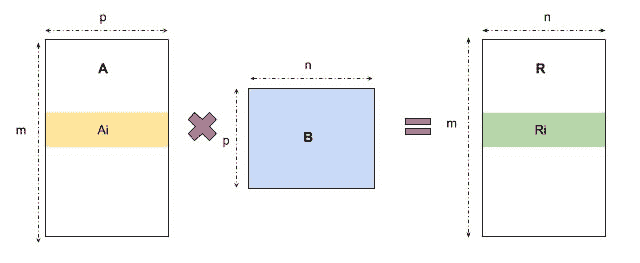
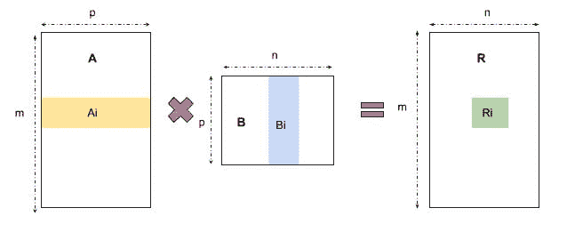
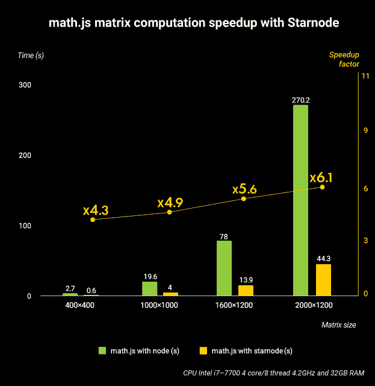
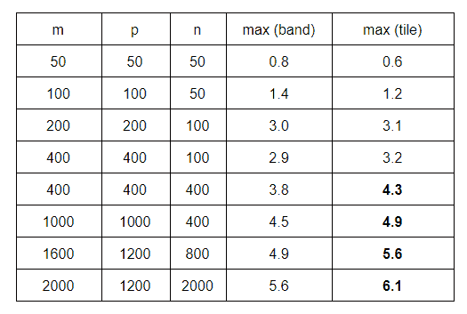

# 如何用 Math.js 加速 Node.js 矩阵计算🌠

> 原文：<https://dev.to/hoshiwarpsjs/how-to-speed-up-nodejs-matrix-computing-with-mathjs--3o68>

*本文最初由 [WarpJS](//www.warpjs.dev) 成员 [Dominique Péré](https://twitter.com/domis66) 在[媒体](https://medium.com/starnodejs/speeding-up-matrix-computation-with-node-js-8e1201a164b2)上发表。*

这是矩阵计算微基准系列文章的第 1 部分。第一篇文章关注 math.js 基准测试，第二部分将讨论 TensorFlow 基准测试。不想错过的一定要订阅哦！

在这篇文章中，你将学习如何执行并行计算来加速两个矩阵的乘法运算。

最近，我有机会重温高中时学过的一些数学知识。终于可以看到那些矩阵乘法习题的用处了！我的背景是 IT 工程，但我不得不承认，AI 涉及的数学比它多得多。

我现在为一家开发 Starnode 的公司工作，这是一个旨在加速 node.js 的 JavaScript 库。 **JavaScript 的唯一问题是它只能使用单线程、单进程和 CPU** 来执行计算(这就像一家只有一个厨师在厨房的餐厅！).JavaScript 为什么要这样设计？目的是保持简单和不阻塞。在本文中，您可以找到更多关于 JavaScript 这方面的内容。

# 为什么矩阵计算永远耗时

矩阵乘法是在许多领域中执行的循环操作，例如信号处理、数据分析以及最近的人工智能。

在这些用例中，实现的矩阵相当大，通常包含一千多行。假设我们在乘两个矩阵，每个矩阵的维数都是 1000 × 1000。需要执行的操作数量如下:

> 2 × 1，000㎡1，000¨1，999，000，000

没错—近 20 亿次操作！当执行这样的计算时，CPU 如此繁忙也就不足为奇了。它的盘子里有这么多东西，它不能做别的事情！因此，让我们看看我们可以做些什么来释放主 CPU 线程和事件循环，并加快进程。

# 加速矩阵计算的关键:并行化

挑战在于:用单线程节点加速两个大型矩阵的乘法运算。好吧，我们可以使用 child_process 库派生另一个进程，并将部分作业分配给派生的进程(或者对工作线程做同样的事情)，但是我们希望保持代码简单，并提出一个能够与可变数量的 CPU/线程一起工作的解决方案。碰巧，我们有一些最熟练的虚拟机博士和工程师与我们合作，帮助我们优化并行化，我们创建了 Starnode，这是一个非常简单的 API，可用于并行化任何标准的 JavaScript 函数。现在，有了执行细粒度并行化的能力，我们可以确定大型矩阵计算可以节省多少时间。

我的硬件工程师同事(恰好是以前的数学教授！)和我专注于并行化顺序算法的可能方法，因为这将允许我们使用基于 JavaScript 的 scale dynamics“warp”(一种动态编译器技术)在多个处理资源之间分割大型矩阵的操作。(更多内容将在另一个故事中讲述)。

# 并行拆分和计算

为了有效地并行化矩阵乘法，无论是使用 Starnode 技术还是使用任何其他并行化技术，都必须从识别可以同时发生的独立操作块开始，以最少的开销时间来执行拆分和重组，并最大限度地减少数据传输。

我们尝试了两种不同的方法，在第一种方法中按带状分解矩阵，在第二种方法中按平铺方式分解矩阵。带状分裂适用于小矩阵，但当我们尝试更大的矩阵(400 行或更多)时，我们发现平铺分裂是最好的方法。

下面，我们可以看到对于乘积 R = A × B，这两种输入矩阵分裂方案是如何实现的:

*   在带状分割的情况下，A 被分割成连续行的块。每个块 Ai 然后乘以全矩阵 B，产生结果 Ri，其构成乘积矩阵 r 中的连续行的块

figcaption 

*图 1a:带状分割*

*   在平铺分割中，A 被分割成连续行的块，B 被分割成连续列的块。然后，每个块 Ai 乘以块 Bi，得到 Ri，这构成了乘积矩阵 r 中的“瓦片”

*图 1b:平铺分割*
矩阵形状对给定数量的元素几乎没有影响，只要矩阵的形状因子不是过度的矩形。对于小矩阵，由于 B 矩阵读取速度更快，并且在乘积矩阵中合并块的过程非常简单，因此带状分割的并行化开销略低于平铺分割。然而，这种优势很快消失，因为 B 矩阵的大小由于所有进程使用完整的 B 阵列数据而导致的高速缓存层次冲突而增加。

# CPU 在燃烧！

由于我们的方法有效地使用了您计算机的所有资源，您可以期待风扇运行得更快，温度增加，您的矩阵在瞬间被计算出来！

我们已经在一台专用服务器上运行了所有测试，该服务器的 CPU 为英特尔 i7–7700 4 核/8 线程 4.2GHz，内存为 32GB。

下图显示了在 node.js 中不使用 Starnode 和使用 Starnode 对不同大小的 math.js 矩阵进行乘法运算所需的时间，以及在每种情况下使用 Starnode 时的加速因子。如你所见，矩阵越大，加速越大！

此图表仅显示使用平铺式并行化方法的结果，因为此方法为大于 400 × 400 的矩阵提供了 node.js 的最佳性能。

*如你所见，使用 Starnode 的 node.js 完成矩阵乘法的速度比普通 node.js 快了 6 倍！*

您可以在下面找到两种拆分方法的详细结果。在该表中:

*   m 是矩阵中的行数
*   p 是 B 矩阵中的行数(以及 A 矩阵中的列数)
*   n 是 B 矩阵中的列数

我们对这些结果感到非常兴奋，因为我们最初只期望在这种规模的并行化上实现 2 或 3 倍的加速因子。令人惊讶的是，当实现 Starnode 并行化时，使两个进程“相互对话”只需要很少的开销，从而大大提高了计算速度。例如，对于一个 2000 × 1200 矩阵的乘法，我们实现了 6.1 的加速因子！⚡

该团队目前也在开发一个具有相同操作模式的 TensorFlow 基准测试，我将很快链接到这里。确保订阅学习新的数学技能来打动你的同事！🤓

* * *

感谢您的阅读！如果你喜欢这篇文章(或者不喜欢)，请随意发表评论。我们会尽最大努力回复和更新这篇文章。