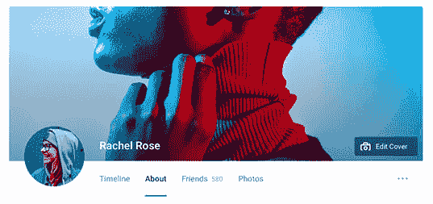
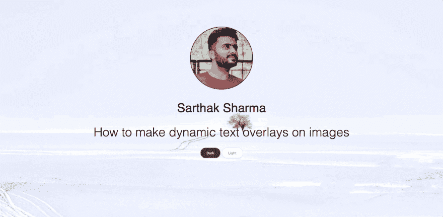
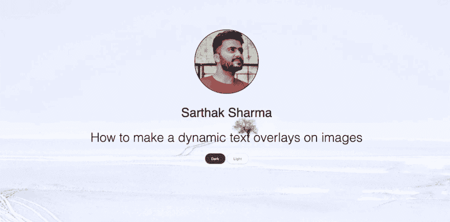
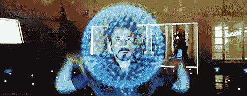
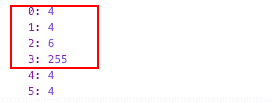
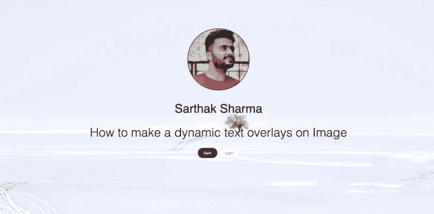

# 如何在图像上制作动态文本叠加

> 原文：<https://dev.to/xenoxdev/how-to-make-dynamic-text-overlays-on-images-dcc>

如果你曾经做过 webapp，你一定对这个场景很熟悉。很多时候，你会发现自己处于这样一种情况，你不得不把一些文字放在图片上。如果图片是由用户上传的，那么很难预测图片会配什么颜色的文字。考虑下面的例子:

[](https://res.cloudinary.com/practicaldev/image/fetch/s--BChnM00u--/c_limit%2Cf_auto%2Cfl_progressive%2Cq_auto%2Cw_880/https://i.imgur.com/hUikRsI.png)

文本 *Rachel Rose* 在深色背景下看起来很完美，但是如果背景是白色的呢？这可能会导致一个问题，因为你永远无法预测用户会上传什么。

一个简单的解决方法是在图像上使用模糊滤镜，就像这样...

```
 .image-blur{
        filter: blur(1px);
    } 
```

Enter fullscreen mode Exit fullscreen mode

...或者在图像上做一个暗覆盖。有许多方法可以做到，它们都依赖于对图像进行修改。但是，如果我们不改变图像，而是改变文本的颜色呢？

“嗯，为什么不呢？”这是我最近有这种想法时告诉自己的。因此，让我们在这篇文章中探索如何做到这一点。

[](https://i.giphy.com/media/xT0xemNCRU4TRrGDAI/giphy.gif)

### 怎么做？

我创建了一个简单的页面来演示这个问题。如果你想边学边做，就复制这个回购。

##  [工艺学](https://github.com/sarthology) / [动态演示](https://github.com/sarthology/dynalay-demo)

### 如何在图像上叠加一个动态文本

<article class="markdown-body entry-content container-lg" itemprop="text">[](https://camo.githubusercontent.com/de66b3305b0d2ba249b3e0d032a9ada2df582e219af74b2b34d9c0f0716077bb/68747470733a2f2f692e696d6775722e636f6d2f503432655066702e706e67)

## Dynalay 演示

一个简单的方法，使一个动态的文字覆盖在图像上。[查看此处](https://sarthology.github.io/dynalay-demo/)

## 屏幕上显示程序运行的图片

[](https://camo.githubusercontent.com/66f9523d578ec5610a3a01faf63a8e48f940be3ff83a640dbb1ee3105297d9d5/68747470733a2f2f7265732e636c6f7564696e6172792e636f6d2f70726163746963616c6465762f696d6167652f66657463682f732d2d5232736b6d3353702d2d2f635f6c696d6974253243665f6175746f253243666c5f70726f6772657373697665253243715f3636253243775f3838302f68747470733a2f2f74686570726163746963616c6465762e73332e616d617a6f6e6177732e636f6d2f692f68746f7166733563736d7970386f3667773875672e676966)

## 先决条件

在本地运行之前，您必须安装这些程序

*   结节
*   网络包

## 安装

它内置于节点中，因此启动过程非常简单

1.  `npm install`
2.  `npm run start:dev`

就是这样，您将看到它在 localhost:8080 上运行

## 贡献的

请随意参与这个项目，并像对待自己的项目一样对待它。<g-emoji class="g-emoji" alias="blush" fallback-src="https://github.githubassets.cimg/icons/emoji/unicode/1f60a.png">😊</g-emoji>

## 作者

萨尔塔克·夏尔马

</article>

[View on GitHub](https://github.com/sarthology/dynalay-demo)

克隆完成后，使用这个提交来检查未解决的问题。

```
 git checkout 0817434   
   npm install npm run start:dev 
```

Enter fullscreen mode Exit fullscreen mode

所以目前，我们有一个网页，有两种类型的背景:黑暗和光明。它还有两个按钮可以在它们之间切换。这是它开始时的样子。

[](https://res.cloudinary.com/practicaldev/image/fetch/s--MoWgzEpx--/c_limit%2Cf_auto%2Cfl_progressive%2Cq_66%2Cw_880/https://thepracticaldev.s3.amazonaws.com/i/hwp2buzhp7c1wb8nkjog.gif)

为了实现这一点，我们将使用画布。想法是在画布中加载图像，然后我们将获取图像的每个像素。然后每个像素的颜色将被转换成它的 *RGB* 值。所以如果你平均这三个值，你会得到那个像素的亮度(在这里阅读更多)。这些值将介于 0(最暗)和 255(最亮)之间。因此，通过对每个像素进行比较，我们将得到图像是否暗。

很好，现在我们理解了算法，让我们写一些代码。
[T3】](https://i.giphy.com/media/CFoV7AtVdp1sc/giphy.gif)

首先，创建一个函数，将 src 从后台加载到一个隐藏的`img`元素中。

```
 const isDark = (src)=>{
        //create a hidden img element
        let img = document.createElement("img");
        img.src = src;
        img.style.display = "none";
        document.body.appendChild(img);
    } 
```

Enter fullscreen mode Exit fullscreen mode

然后使用
在画布上绘制图像

```
const isDark = (src)=>{

    //create a hidden img element
    let img = document.createElement("img");
    img.src = src;
    img.style.display = "none";
    document.body.appendChild(img);

    img.onload = function() {
        // create canvas
        let canvas = document.createElement("canvas");
        canvas.width = this.width;
        canvas.height = this.height;

        let ctx = canvas.getContext("2d");
        ctx.drawImage(this,0,0);
    }
} 
```

Enter fullscreen mode Exit fullscreen mode

现在我们需要得到每个像素的 RGB 值。为此，让我们使用`getImageData`

```
 let imageData = ctx.getImageData(0,0,canvas.width,canvas.height); 
```

Enter fullscreen mode Exit fullscreen mode

输出将类似于

[](https://res.cloudinary.com/practicaldev/image/fetch/s--1kmUzMtS--/c_limit%2Cf_auto%2Cfl_progressive%2Cq_auto%2Cw_880/https://thepracticaldev.s3.amazonaws.com/i/5s83lt1pq4afl9gf93cd.png)

太好了！现在我们有了数据，但这是一个巨大的数组，其中每个像素的 RGB 值都是独立的，就像这样
[](https://res.cloudinary.com/practicaldev/image/fetch/s--a0-52FTl--/c_limit%2Cf_auto%2Cfl_progressive%2Cq_auto%2Cw_880/https://thepracticaldev.s3.amazonaws.com/i/lgilubqqzfulus4vfz1l.png)

所以我们必须像
一样一起循环遍历其中的四个

```
 let imageData = ctx.getImageData(0,0,canvas.width,canvas.height);
        let data = imageData.data;
        let r,g,b,avg;
        for(let x = 0, len = data.length; x < len; x+=4) {
            r = data[x];
            g = data[x+1];
            b = data[x+2];
            avg = Math.floor((r+g+b)/3);
        } 
```

Enter fullscreen mode Exit fullscreen mode

`avg`现在有了每个像素的平均 RGB 值。接下来，将所有像素的平均值相加，然后除以图像中的总像素，得到平均亮度。

```
 let brightness = Math.floor(colorSum / (this.width*this.height)); 
```

Enter fullscreen mode Exit fullscreen mode

所以最终的函数看起来会像这样:

```
const isDark = (src) => {
    return new Promise((resolve, reject) => {
        //create a hidden img element
        let img = document.createElement("img");
        img.src = src;
        img.style.display = "none";
        document.body.appendChild(img);

        let colorSum = 0;
        img.onload = function () {
            // create canvas
            let canvas = document.createElement("canvas");
            canvas.width = this.width;
            canvas.height = this.height;

            let ctx = canvas.getContext("2d");
            ctx.drawImage(this, 0, 0);

            let imageData = ctx.getImageData(0, 0, canvas.width, canvas.height);
            let data = imageData.data;
            let r, g, b, avg;
            for (let x = 0, len = data.length; x < len; x += 4) {
                r = data[x];
                g = data[x + 1];
                b = data[x + 2];

                avg = Math.floor((r + g + b) / 3);
                colorSum += avg;
            }

            let brightness = Math.floor(colorSum / (this.width * this.height));
            resolve(brightness >= 128 ? false : true);
        }
    });
} 
```

Enter fullscreen mode Exit fullscreen mode

让我们用这个函数来检查图像是否暗。

```
 isDark(img/dbg.jpg').then((data) => {
        dynamicHeader.classList.remove("light-text");
        if(data) dynamicHeader.classList.add("light-text");
    }); 
```

Enter fullscreen mode Exit fullscreen mode

所以这里是我们的结果:
[](https://res.cloudinary.com/practicaldev/image/fetch/s--Wk8IKxOp--/c_limit%2Cf_auto%2Cfl_progressive%2Cq_66%2Cw_880/https://thepracticaldev.s3.amazonaws.com/i/uqzltnyx2cxdavq6a299.gif)

但是少了点什么。啊哈，有些风格！

```
.dynamic-header {
    transition: color 2s;
} 
```

Enter fullscreen mode Exit fullscreen mode

[](https://res.cloudinary.com/practicaldev/image/fetch/s--R2skm3Sp--/c_limit%2Cf_auto%2Cfl_progressive%2Cq_66%2Cw_880/https://thepracticaldev.s3.amazonaws.com/i/htoqfs5csmyp8o6gw8ug.gif)

现在完美了。

#### 结论

希望你们喜欢这个小实验，并从中学到一些有用的东西。有很多方法可以达到同样的效果，如果你有，请在下面随意评论。你可能想也可能不想在你的真实项目中使用它，但是我想做一个 npm 包，把它带到下一个层次。如果你想加入，请给我发短信 [@sarthology](https://twitter.com/sarthology) 或者在下面评论。

好了伙计们。下次再见。感谢你阅读这篇文章。

[](https://i.giphy.com/media/DjclSiVtiB11C/giphy.gif)