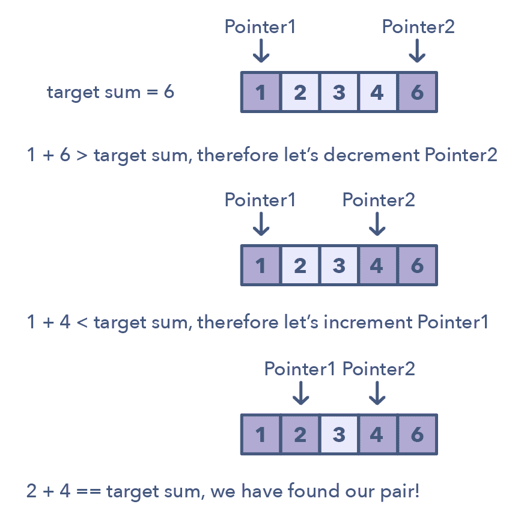
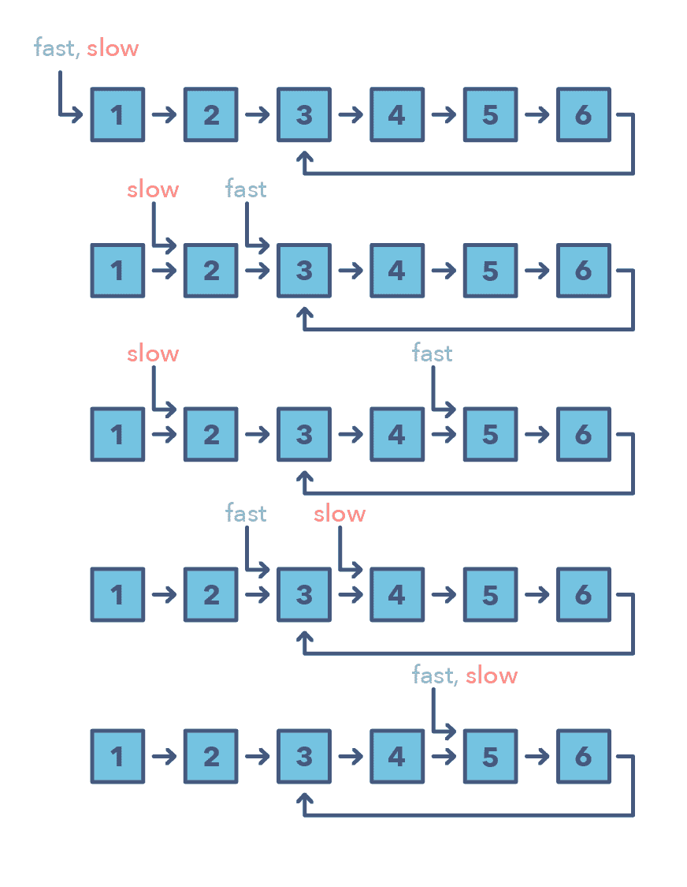
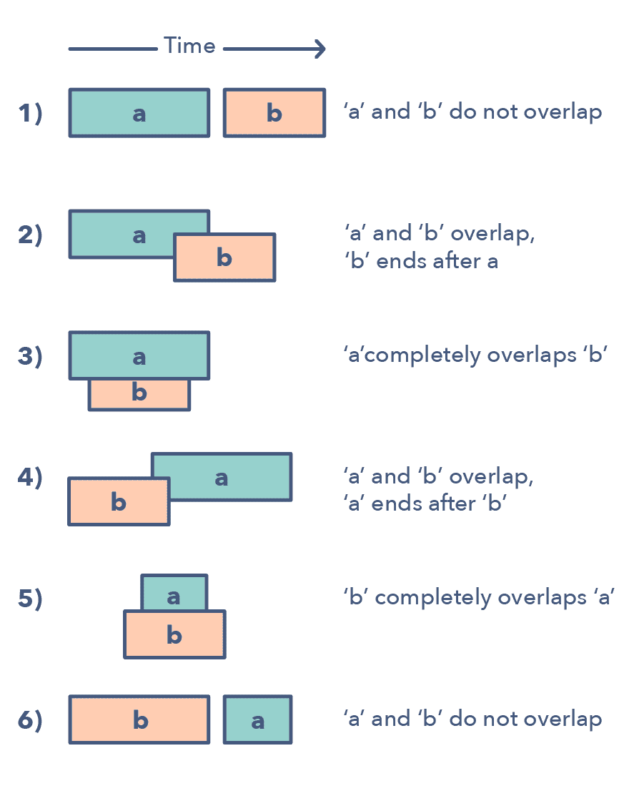
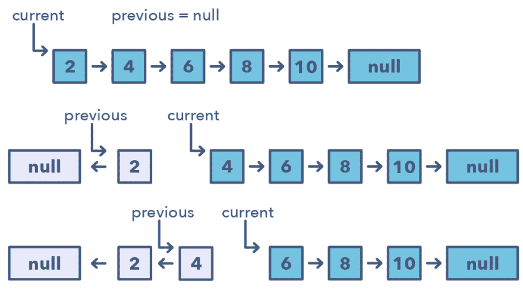
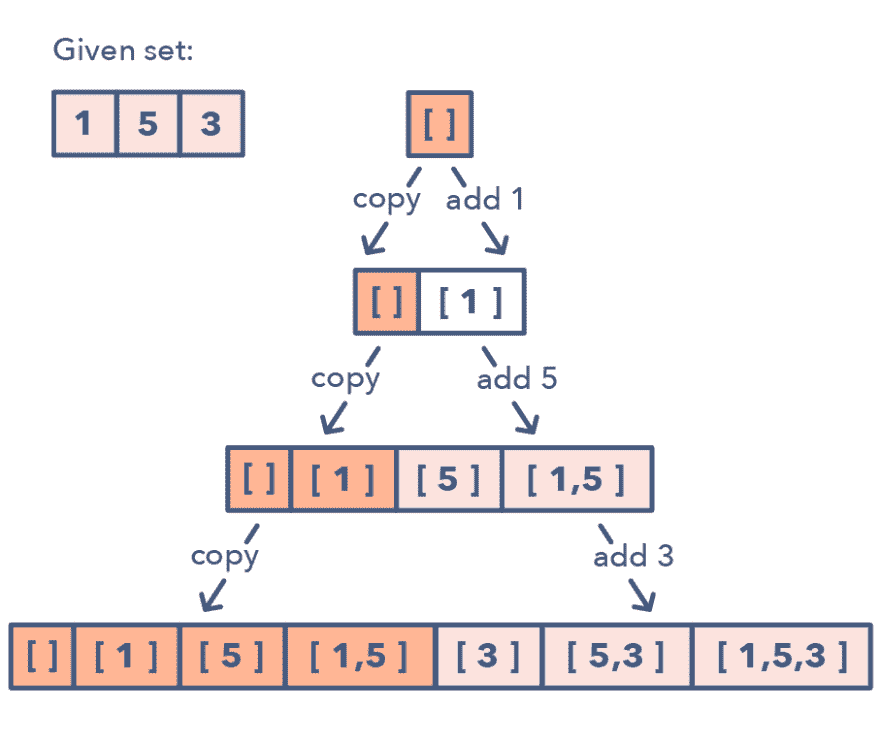
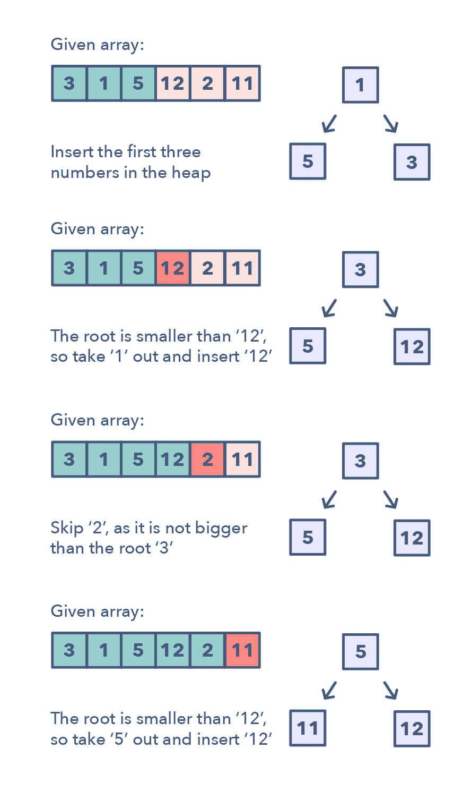
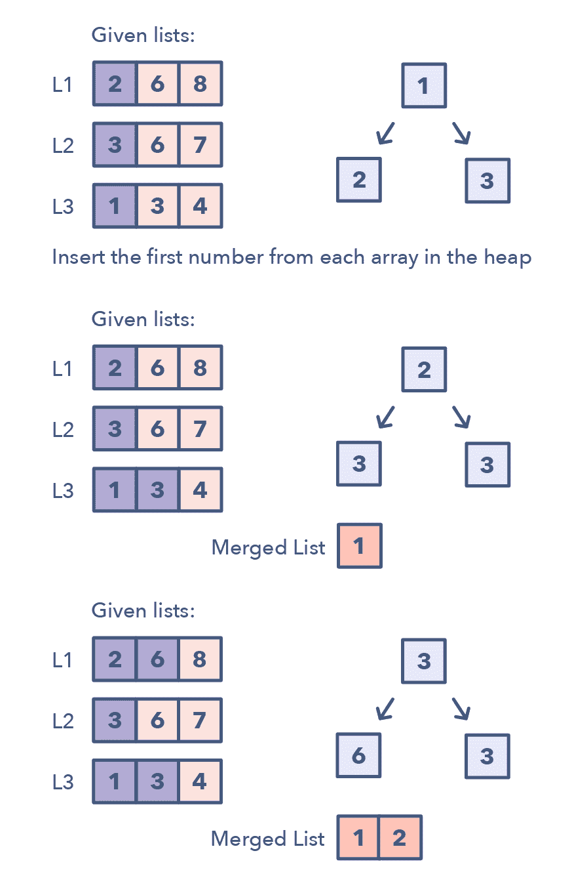
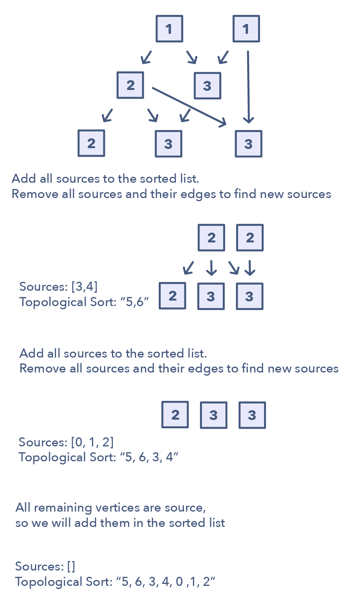

# 应对任何编码面试问题的 14 种模式

> 原文：<https://dev.to/fahimulhaq/14-patterns-to-ace-any-coding-interview-question-d9g>

对于许多开发人员来说，准备编码面试的过程是焦虑诱导的。有太多的内容要涵盖，而且通常感觉很多内容与开发人员的日常工作无关，这只会增加压力。

其中一个结果是，现在开发者花数周时间在 LeetCode 等网站上梳理数百个面试问题已经很常见了。我在面试前与焦虑的开发人员交谈过的一个最常见的问题是:*我解决了足够多的练习题吗？我能做得更多吗？*

这就是为什么我试图专注于帮助开发人员掌握每个问题背后的潜在模式——这样他们就不必担心解决成百上千的问题，并遭受 LeetCode 疲劳。如果您理解了这些通用模式，那么您可以将它们作为一个模板来解决其他各种稍有不同的问题。

在这里，我列出了可以用来解决任何编码面试问题的前 14 个模式，以及如何识别每个模式，以及每个模式的一些示例问题。如果你对任何模式的细节感兴趣，请查看[探索编码面试:编码问题的模式。](https://www.educative.io/collection/5668639101419520/5671464854355968)

以下模式假设您已经熟悉了数据结构。如果没有，请查看这些关于[数据结构的课程。](https://www.educative.io/m/data-structures)

下面是我们今天要学习的 14 种模式。

1.  [滑动窗口](#sliding-window)
2.  [两个指针或迭代器](#two-pointers-or-iterators)
3.  [快速和慢速指针或迭代器](#fast-and-slow-pointers-or-iterators)
4.  [合并间隔](#merge-intervals)
5.  [循环排序](#cyclic-sort)
6.  [链表就地反转](#in-place-reversal-of-linked-list)
7.  [树 BFS](#tree-bfs)
8.  [树 DFS](#tree-dfs)
9.  [两堆](#two-heaps)
10.  [子集](#subsets)
11.  [改良的二分搜索法](#modified-binary-search)
12.  [前 K 个元素](#top-k-elements)
13.  [K 路合并](#k-way-merge)
14.  [拓扑排序](#topological-sort)

我们开始吧！

### 1。滑动窗

滑动窗口模式用于对给定数组或链表的特定窗口大小执行所需的操作，例如查找包含全 1 的最长子数组。滑动窗口从第一个元素开始，并保持向右移动一个元素，并根据您正在解决的问题调整窗口的长度。在某些情况下，窗口大小保持不变，而在其他情况下，窗口大小会变大或变小。

以下是您可以识别给定问题可能需要滑动窗口的一些方法:

*   问题输入是线性数据结构，如链表、数组或字符串
*   您需要找到最长/最短的子串、子数组或所需的值

使用滑动窗口模式的常见问题:

*   大小为“K”的最大和子数组(简单)
*   包含“K”个不同字符的最长子字符串(中等)
*   字符串字谜(硬)

### 2。两个指针或迭代器

两个指针是一种模式，其中两个指针一前一后地遍历数据结构，直到一个或两个指针都满足某个条件。在排序数组或链表中搜索对时，两个指针通常很有用；例如，当您必须将数组中的每个元素与其他元素进行比较时。

需要两个指针，因为只有一个指针，你必须在数组中不断循环寻找答案。单个迭代器的这种来回对于时间和空间复杂性来说是低效的——这一概念被称为渐近分析。虽然使用 1 个指针的强力或幼稚的解决方案可以工作，但它会产生类似于 O(n)的东西。在许多情况下，两个指针可以帮助您找到具有更好的空间或运行时复杂性的解决方案。

确定何时使用双指针方法的方法:

*   它将突出处理排序数组(或链表)的问题，并需要找到一组满足特定约束的元素
*   数组中的元素集是一对、三个一组，甚至是一个子数组

以下是一些以双指针模式为特征的问题:

*   对排序后的数组求平方(简单)
*   总和为零的三元组(中)
*   比较包含退格键的字符串(中等)

### 3。快速和慢速指针或迭代器

快慢指针方法，也称为**野兔&乌龟算法**，是一种使用两个指针的指针算法，这两个指针以不同的速度在数组(或序列/链表)中移动。**这种方法在处理循环链表或数组时非常有用。**

通过以不同的速度移动(比方说，在循环链表中)，算法证明两个指针必定会相遇。一旦快速指针和慢速指针都处于循环中，快速指针就应该捕获慢速指针。

您如何确定何时使用快速和慢速模式？

*   这个问题将处理一个链表或数组中的循环
*   当你需要知道某个元素的位置或者链表的总长度的时候。

什么时候我应该使用它而不是上面提到的两个指针的方法？

*   有些情况下你不应该使用双指针方法，比如在一个单链表中，你不能向后移动。何时使用快慢模式的一个例子是当你试图确定一个链表是否是一个回文时。

快速和慢速指针模式的问题:

*   链表循环(简单)
*   回文链表(中等)
*   循环排列(硬)

### 4。合并间隔

合并间隔模式是处理重叠间隔的有效技术。在许多涉及区间的问题中，你要么需要找到重叠的区间，要么需要合并重叠的区间。该模式是这样工作的:

给定两个音程(“a”和“b”)，这两个音程有六种不同的关联方式:

理解和认识这六种情况将有助于您解决从插入区间到优化区间合并的各种问题。

如何确定何时使用合并间隔模式？

*   如果要求您生成一个只有互斥区间的列表
*   如果你听到“重叠音程”这个术语。

合并区间问题模式:

*   区间交叉点(中等)
*   最大 CPU 负载(硬)

### 5。循环排序

该模式描述了一种有趣的方法来处理包含给定范围内数字的数组问题。循环排序模式一次遍历数组中的一个数字，如果当前迭代的数字不在正确的索引处，就用正确索引处的数字替换它。您可以尝试将数字放在正确的索引中，但是这会产生 O(n 2) 的复杂度，这不是最佳的，因此出现了循环排序模式。

我如何识别这种模式？

*   这些问题涉及到一个在给定范围内的有序数组
*   如果问题要求您在排序/旋转数组中找到缺失/重复/最小的数字

以循环排序模式为特征的问题:

*   找到丢失的数字(简单)
*   找出最小的缺失正数(中号)

### 6。链表就地反转

在很多问题中，你可能会被要求颠倒一个链表的一组节点之间的链接。通常，约束是您需要就地这样做，即使用现有的节点对象，而不使用额外的内存。这就是上面提到的模式有用的地方。

这种模式一次反转一个节点，从指向链表头部的一个变量(current)开始，一个变量(previous)将指向您已经处理过的前一个节点。在锁步方式中，在移动到下一个节点之前，您将通过将当前节点指向上一个节点来反转当前节点。此外，您将更新变量“previous ”,以始终指向您已经处理过的前一个节点。

我如何确定何时使用此模式:

*   如果要求你在不使用额外内存的情况下反转一个链表

以链表模式的就地反转为特征的问题:

*   反转子列表(中)
*   反转每个 K 元素子列表(中)

### 7。树 BFS

这种模式基于广度优先搜索(BFS)技术来遍历树，并在跳到下一层之前使用队列来跟踪一层的所有节点。使用这种方法可以有效地解决任何涉及逐层遍历树的问题。

树 BFS 模式的工作方式是将根节点推到队列中，然后不断迭代，直到队列为空。对于每一次迭代，我们删除队列头的节点并“访问”该节点。从队列中删除每个节点后，我们还将它的所有子节点插入到队列中。

如何识别 BFS 树模式:

*   如果要求您以逐层的方式遍历树(或按层顺序遍历)

以树状 BFS 模式为特征的问题:

*   二叉树层次顺序遍历(简单)
*   之字形遍历(中等)

### 8。树状 DFS

树 DFS 基于深度优先搜索(DFS)技术来遍历树。

在遍历时，可以使用递归(或迭代方法的堆栈)来跟踪所有以前的(父)节点。

树 DFS 模式从树根开始工作，如果节点不是叶子，您需要做三件事:

*   决定是现在处理当前节点(前序)，还是在处理两个子节点之间处理(按序)，或者在处理完两个子节点之后处理(后序)。
*   对当前节点的两个子节点进行两次递归调用以处理它们。

如何识别树形 DFS 模式:

*   如果要求您用有序、前序或后序 DFS 遍历一棵树
*   如果问题需要搜索节点更靠近叶子的地方

树状 DFS 模式的问题:

*   路径数之和(中等)
*   总和的所有路径(中等)

### 9。两堆

在许多问题中，我们被给定一组元素，这样我们就可以把它们分成两部分。为了解决这个问题，我们感兴趣的是知道一部分中最小的元素和另一部分中最大的元素。这种模式是解决这类问题的有效途径。

这种模式使用两个堆；寻找最小元素的最小堆和寻找最大元素的最大堆。该模式的工作原理是将数字的前半部分存储在一个 Max 堆中，这是因为您希望找到前半部分中最大的数字。然后，将数字的后半部分存储在 Min 堆中，因为您希望找到后半部分中最小的数字。在任何时候，都可以从两个堆的顶部元素计算出当前数字列表的中值。

识别两堆模式的方法:

*   在优先级队列、调度
*   如果问题陈述了你需要找到一个集合的最小/最大/中间元素
*   有时，在以二叉树数据结构为特征的问题中很有用

以两堆模式为特征的问题:

*   求一个数流的中位数(中)

### 10。子集

大量的编码面试问题涉及到处理一组给定元素的排列和组合。模式子集描述了一种有效的广度优先搜索(BFS)方法来处理所有这些问题。

模式如下所示:

给定一组[1，5，3]

*   从空集开始:[[]]*将第一个数字(1)加到所有现有子集上，创建新子集:[[]，[1]]；*将第二个数字(5)添加到所有现有子集:[[]，[1]，[5]，[1，5]]；*将第三个数字(3)添加到所有现有子集:[[]，[1]，[5]，[1，5]，[3]，[1，3]，[5，3]，[1，5，3]]。

下面是子集模式的直观表示:

如何识别子集模式:

*   需要找到给定集合的组合或排列的问题

以子集模式为特征的问题:

*   有重复项的子集(简单)
*   通过改变大小写排列字符串(中号)

### 11。改装的二分搜索法

每当给你一个排序数组、链表或矩阵，并要求你找到某个元素时，你可以使用的最佳算法是二分搜索法。该模式描述了处理所有涉及二分搜索法的问题的有效方法。

升序顺序集的模式如下所示:

*   首先，找到起点和终点的中间。找到中间值的简单方法是:middle = (start + end) / 2。但是这很有可能产生整数溢出，所以建议将中间值表示为:middle = start+(end-start)/2
*   如果键等于索引中间的数字，则返回中间值
*   如果“键”不等于索引中间值:
    *   检查键是否< arr[middle]。如果将搜索减少到 end = middle - 1
    *   检查是否 key > arr[middle]。如果是，将搜索减少到 end = middle + 1

下面是修改后的二分搜索法模式的直观表示:

如何识别改良的二分搜索法模式:

*   如果你被要求在数组、链表或矩阵中寻找某个元素

以修正的二分搜索法模式为特征的问题:

*   顺序不可知的二分搜索法(简单)
*   在已排序的无限数组中搜索(中等)

### 12。K 大元素

任何要求我们在给定的集合中找到顶部/最小/频繁的“K”元素的问题都属于这种模式。

跟踪“K”个元素的最佳数据结构是堆。这种模式将利用堆来解决多个问题，一次处理一组给定元素中的“K”个元素。模式如下所示:

*   根据问题将“K”个元素插入最小堆或最大堆。
*   遍历剩余的数字，如果发现有一个数字比堆中的数字大，则删除该数字并插入较大的数字。

不需要排序算法，因为堆会为您跟踪元素。

如何识别顶级“K”元素模式:

*   如果你被要求找出一个给定集合中最上面/最小/最频繁的 K 个元素
*   如果你被要求对一个数组进行排序以找到一个精确的元素

以顶部“K”元素模式为特征的问题:

*   前 K 个数字(简单)
*   前 K 个频繁数字(中)

### 13。k 路合并

k 路合并帮助您解决涉及一组排序数组的问题。

无论何时给定“K”个排序数组，都可以使用堆有效地对所有数组的所有元素进行排序遍历。您可以将每个数组的最小元素放入一个 Min 堆中，以获得总的最小值。获得整体最小值后，将同一数组中的下一个元素推到堆中。然后，重复这个过程，对所有元素进行排序遍历。

模式如下所示:

*   在最小堆中插入每个数组的第一个元素。
*   之后，从堆中取出最小的(顶部)元素，并将其添加到合并列表中。
*   从堆中移除最小的元素后，将同一列表的下一个元素插入到堆中。
*   重复步骤 2 和 3，按排序顺序填充合并列表。

如何识别 k 线合并形态:

*   这个问题的特点是排序的数组、列表或矩阵
*   如果问题要求你合并排序列表，在排序列表中找到最小的元素。

K 路合并模式的问题:

*   合并 K 个排序列表(中等)
*   具有最大和的 k 对(硬)

### 14。拓扑排序

拓扑排序用于查找相互依赖的元素的线性排序。例如，如果事件“B”依赖于事件“A”，则在拓扑排序中，“A”在“B”之前。

这个模式定义了一种简单的方法来理解对一组元素进行拓扑排序的技术。

该模式是这样工作的:
1)初始化

*   使用 HashMap 将图存储在邻接表中
*   为了找到所有的源，使用一个散列表来保存 in-degrees 的计数

2)构建图并找到所有顶点的入度

*   根据输入构建图表，并填充 in-degrees 散列表。

3)查找所有来源

*   所有度数为“0”的顶点将是源，并存储在一个队列中。

4)排序

*   对于每个源，请执行以下操作:
*   将其添加到排序列表中。
*   从图中获取它的所有子节点。
*   将每个子项的入度减 1。
*   如果子节点的入度变为“0”，则将其添加到源队列中。
*   重复步骤 4，直到源队列为空。

如何识别拓扑排序模式:

*   这个问题将处理没有定向圈的图
*   如果要求您按排序顺序更新所有对象
*   如果有一类遵循特定顺序的对象

以拓扑排序模式为特征的问题:

*   任务调度(中等)
*   树的最小高度(硬)

### 接下来是什么？

经历 LeetCode 疲劳？学习这 14 个模式，你会对如何解决问题有一个更完整的了解，不管问题是什么。

我知道我们在这篇文章中讨论了很多数据结构，所以如果你需要复习，你可以访问这里的[。如果你对以上模式或每个模式下的示例问题有兴趣，请查看](https://www.educative.io/m/data-structures)[探索编码面试:编码问题的模式。](https://www.educative.io/collection/5668639101419520/5671464854355968)这是 Grokking 面试系列的最新课程，超过 20，000 名学员使用该课程在顶级科技公司求职。

我能给它的最高认可是，我真的希望它就在我还在准备编码面试的时候。