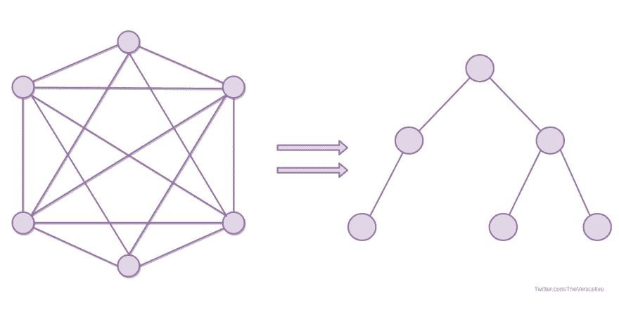
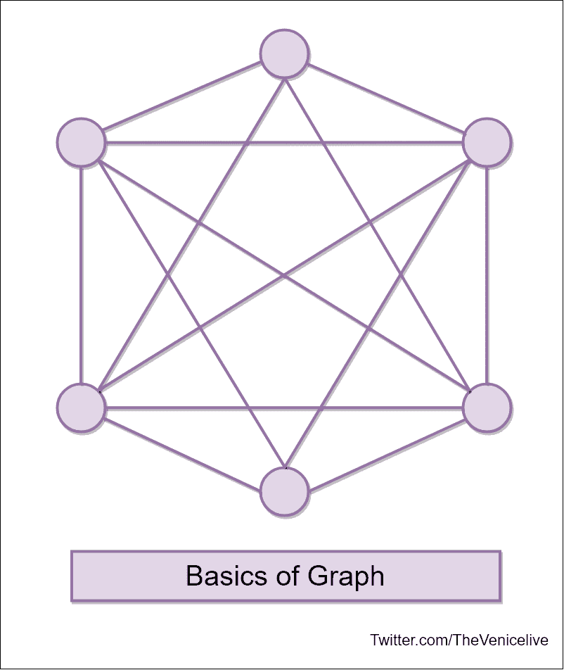
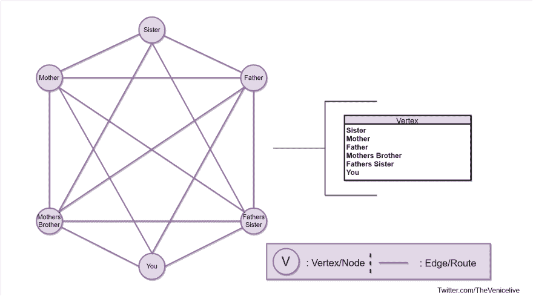
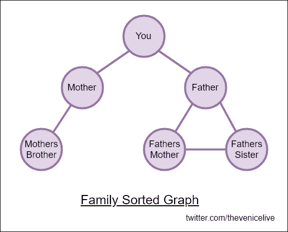
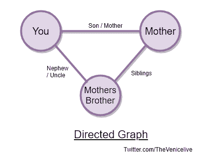
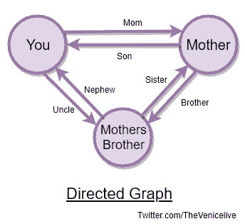
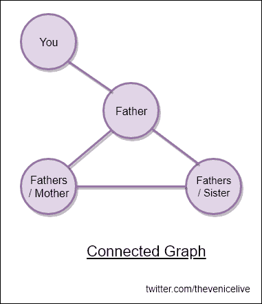
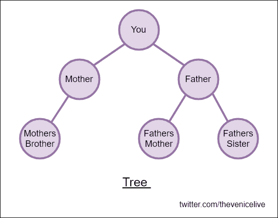

# 适用于 6 岁儿童的 GraphQL

> 原文：<https://dev.to/thevenice/graphql-for-6-year-old-3hej>

### 嘿，我的名字是[普拉卡什](https://twitter.com/thevenicelive)，今天我们将学习 GraphQL 中图形的基本概念

[](https://res.cloudinary.com/practicaldev/image/fetch/s--pd5IZdux--/c_limit%2Cf_auto%2Cfl_progressive%2Cq_auto%2Cw_880/https://thepracticaldev.s3.amazonaws.com/i/xnuafbpcu3j239ku035z.png)

我们将讨论的主题:

1.  [图形](#point1)
2.  [有向/无向图](#point2)
3.  [连通/断开图](#point3)
4.  [Tree and GraphQL Queries](#point4)

    ### 图是多个顶点和边的组合。

    **顶点** : 存储用户提供的数据的节点或块。它是一个可搜索的组件，包含我们可以随时访问的数据。

    **边** : 边是两个顶点之间的路线或关系。边可以表现为顶点数据之间的关系，以及一个数据对另一个数据的意义。在图中搜索特定数据时，多条边为我们提供了到达该数据的精确路径。如果我们有多条路径，边可以帮助我们找到可用的最小路径。但是我们今天不讨论多条路径。

    ### 我们将在本帖中遵循的示例

    #### 这里我创建了一个家族图，用简单易懂的形式用 GraphQL 来解释你。

    

    假设您正在创建一个家庭数据库，您已经在数据库中包含了您的 5 名家庭成员。现在，您的数据库的图形将看起来像上面的图像。顶点将代表你的家庭成员，而边将代表他们之间的关系。这就是 graphQL 如何可视化你的数据库。现在让我们更详细地讨论一下边。

     Now take above image as a reference and observe each side of your family member. For undirected and directed graph i will take Mother's side in the graph as an example.

    ### 1)无向图

    

    *上图是无向图*
    无向图的边从两边的角度表示相同的关系。比如，取母亲= X，母亲的兄弟= Y，他们的关系=兄弟姐妹。所以在无向图中，我们可以说(X，Y)=(Y，X ),因为边没有指向特定的方向。所以它们代表相同的边缘。

    ### 2)有向图

    

    但是在有向图中，边代表不同的观点/视角。边具有方向含义(X，Y)和(Y，X)定义了两个不同的故事，如上图所示，我们有一条从母亲到儿子的边，表示母亲对儿子的关系视角，在这两个顶点之间，我们有另一条边，表示儿子对母亲的关系视角。这就是有向图的工作原理，你可以从有向的一面得到数据，但不能从相反的一面得到数据。

    现在我们知道了有向图和无向图是如何工作的，让我们用图中父亲的角度来讨论连通图和不连通图。

    ### 1)连通图

    

    在我们的上方是一个连通图，它也创造了一个循环，因为父亲-父亲-母亲-父亲-姐妹彼此直接相连。连通图中所有的顶点/节点都是连通的。我们可以看到，你和你的父亲是相连的，你的父亲和他的母亲和妹妹相连。

    ### 2)不连通图

    

    在不连通图中，我们很少有顶点/节点与图中的其他节点不连通，如示例所示。如果我们移除父节点，我们可以看到您和您父亲的家庭之间的连接是不连通的。在图中也是一样，如果我们与任何只有一条路径的节点断开连接，我们可能会丢失该节点中的数据。

    

    树是一个连通的非循环图。GraphQL 可以像上面一样将图形数据分类成一棵树，并准确地提供您所要求的数据类型。GraphQL 提供查询的结果，而它之所以是非循环的，是因为它可以创建到我们在图中搜索的数据顶点的更快的路径。下面的代码片段是您提供给 GraphQL 的一个查询，GraphQL 将返回您所要求的确切数据。

    Example:

    ```
    query{
      myFamily{
        me{
          name
          location
        }
        mom{
          ...
          momsBrother{
            name
            location
          }
        },
        dad{

          ...
          dadsMother{
            name
            location
          },
          dadsSister{
            name
            location
          }
        }
      }
    }

    ```

    这就是 GraphQL 中图形的基本概念，我希望它能帮助你可视化 GraphQL 内部的过程。如果你对这篇文章有任何疑问，请在评论中告诉我，或者发微博给我。感谢您阅读本文。