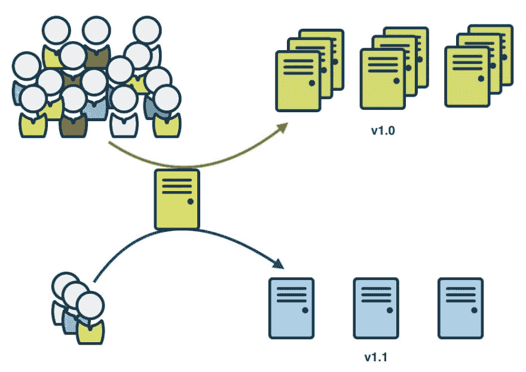
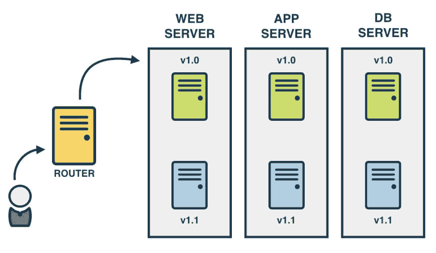

# 微服务的测试策略

> 原文：<https://dev.to/gocd/test-strategy-for-microservices-355p>

这是系列的第二篇文章- [微服务的持续交付](https://www.gocd.org/tags/cd-for-microservices.html)。[在我之前的文章](https://www.gocd.org/2018/04/25/five-considerations-continuous-delivery-microservices/)中，我概述了在微服务架构上构建 CD 管道的五个考虑因素。在这篇文章中，我们将深入探讨测试策略。

## 测试策略

微服务架构涉及许多具有不同保证和故障模式的移动部件。这些系统的测试和验证比测试传统的单一应用程序要细致和复杂得多。一个有效的测试策略需要考虑单独测试单个服务和验证整个系统的行为。您可以将测试大致分为两类:生产前测试和生产中的监控和测试。

## 服务的生产前测试

这里有一个简单的例子，您已经为多个服务构建了管道，并且您正在单独测试一个服务。在这种情况下，传统的[测试金字塔](https://martinfowler.com/bliki/TestPyramid.html)有助于保持不同类型测试之间的平衡。

在典型的测试金字塔中，您有:

单元测试

覆盖软件中最小可测试功能的测试。

**集成测试**

集成测试，在这个上下文中，处理测试服务中组件的集成和接口缺陷；这些是更细致的测试。

**组件测试**

当你看微服务的组件测试时，组件就是一个暴露某些功能的服务。因此，微服务的组件测试只能是服务的验收测试，您的测试需要验证服务是否提供了它承诺的功能。

**契约测试**

另一类非常适用于微服务的测试是契约测试。他们测试您的服务的 API 的契约，以查看 API 是否有效，或者微服务是否遵守其 API。这些契约测试的一个很酷的变体是消费者驱动的契约测试。这些测试由 API 的消费者服务编写；消费者在一套测试中编纂这个契约，这些测试在 API 的每次更改时运行。这样，如果对 API 的更改破坏了它的一个消费者所期望的契约，这种破坏性的更改会在 CD 管道的早期被发现。

端到端测试

我们之前讨论的测试套件适用于测试单个服务。然而，端到端测试更加粗粒度，并且试图测试整个系统的功能。根据您要采用的部署架构，如果您以聚合方式在预生产环境中部署所有服务，您可以在那里运行端到端测试。由于端到端测试通常是脆弱的，并且需要很长时间来运行，所以您通常希望尽可能少地限制这些测试的数量。如果您有完全独立的微服务，并且没有部署到预生产测试环境中，那么考虑在生产中测试的方法。

## 生产中的监视和测试

这种传统的测试方式有其局限性。有几类错误是您无法在测试环境中真正模拟的。这类问题的例子包括由高度分布式系统中的最终一致性引起的问题，以及导致部分系统故障的硬件和网络故障。您必须用一些技术来补充传统的测试技术，这些技术允许您在生产环境中有效地分析和监控系统，并且能够在出现问题时在生产环境中采取补救措施。在这篇文章中，我将重点关注生产中的测试，并在本系列的后续部分讨论补救策略。

生产中有一类测试叫做[故障注入](https://en.wikipedia.org/wiki/Fault_injection)，它是在生产中以一种受控的方式引入错误，看看你的系统是否能承受这些错误。

生产测试的一种变体是在这些环境中流行的一些特定部署策略:

Canary deployment

[Canary deployment](https://www.gocd.org/2017/08/15/canary-releases/)是指您采用一个新版本，并将其发布到生产基础设施的某个部分，看看进展如何，并不断增加新服务的足迹，直到您完全推出它。如果您遇到问题，您可以开始回滚服务的新版本。

**蓝绿部署**

[蓝绿部署](https://www.gocd.org/2017/07/25/blue-green-deployments/)类似，你有一个新服务的新足迹，然后你做一些测试并通过它路由一些流量。如果一切正常，您将所有流量切换到新的服务实例，否则，您将保持旧的足迹。

多变量测试

这种测试的另一个有趣的变化是多变量测试，在这种测试中，你不是真的针对缺陷测试你的新服务，相反，你是在 A/B 测试切换之后 A/B 测试新发布的特性。这种测试的目的是观察这些功能的接受程度。您可以决定向您的所有用户推广它，或者在必要时进行修复。

## 总结

这是我们的[微服务持续交付](https://www.gocd.org/tags/cd-for-microservices.html)博客系列的第 2 部分。我们已经深入讨论了微服务的测试策略，包括如何将传统测试金字塔应用于微服务的生产前测试，以及生产监控和测试的新技术。在我的下一篇文章中，我们将讨论第二个考虑因素:微服务系统的 CI 实践。