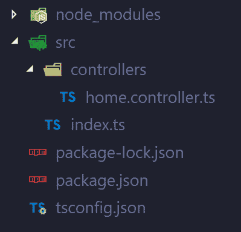

# Odi (Node.js)中没有努力的线程

> 原文：<https://dev.to/dantsk/threads-without-efforts-in-odi-nodejs-4hmo>

## 简介

多线程是同时执行两个或更多线程的过程。大多数编程语言都提供了一个 API 来方便地处理线程和并行性。开发人员可以专注于应用程序逻辑，而不是通信通道、同步或架构设置。

**节点 10.5** 增加了对带有实验标志的`worker_threads`模块的支持。但是从**节点 11.7** 开始，这个特性是现成可用的。这是 Node 中多线程范例的良好开端。

有巨大的潜力，所以 Odi 在早期就加入了对这个模块的支持。一如既往，Odi 的目标是提供方便、干净和极简的 API(用神奇的🧙‍♂️)，这样开发者就可以专注于开发，而不是设置。

## 项目设置

从上一篇文章中，Odi 获得了初始化项目的新 CLI 命令，
定义脚本并安装所有需要的依赖项。

```
 odi init 
```

目前只有几个选项:

```
 -j, --jsx-templating  add jsx templates
    -d, --database        add typeorm integration 
```

### 结构

默认情况下，项目将具有以下结构。

[](https://res.cloudinary.com/practicaldev/image/fetch/s--YBZY763z--/c_limit%2Cf_auto%2Cfl_progressive%2Cq_auto%2Cw_880/https://cdn-images-1.medium.com/max/800/1%2ArM0JN4xIll0-ZkYHi2-9Jw.png)

在命令执行期间，将根据模板类型安装所有必需的依赖项。同样，如果提供了`-j`标志，那么**视图**文件夹将被添加到项目根目录中。

### 源文件

基本模板中有两个预定义的源文件。

包含基本 Odi 配置的`index.ts`文件。默认情况下，
服务器端口设置为`8080`