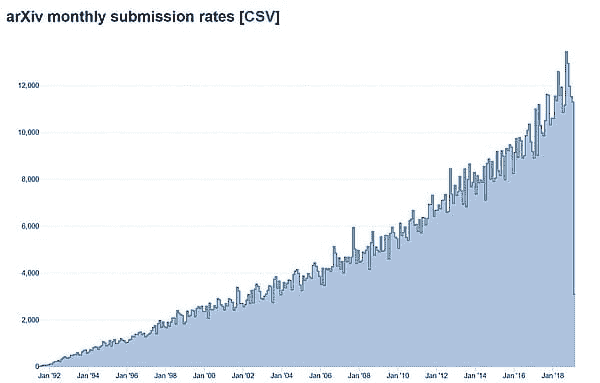

# 打造我自己的(更好的)谷歌镜头

> 原文：<https://dev.to/flyingnobita/building-my-own-and-better-google-lens-562e>

是什么最终促使我打造了一款图像分类手机 app？

## 目录

1.  [那么什么是 fastai 呢？还是 fast.ai？](#so-what-is-fastai-or-fastai)
2.  [为什么选择谷歌镜头](#why-google-lens)

我最近参加了杰瑞米·霍华德提供的[深度学习第一部分在线课程](https://course.fast.ai)。之前上过其他机器学习 MOOCs，包括来自[吴恩达](https://www.coursera.org/learn/machine-learning)、[塞巴斯蒂安·特龙](https://www.udacity.com/course/intro-to-machine-learning--ud120)、[杰弗里·辛顿](https://www.youtube.com/playlist?list=PLoRl3Ht4JOcdU872GhiYWf6jwrk_SNhz9)的课程，我可以说杰瑞米的课程确实和其他人有点不同。我不知道这是因为他用来介绍这个话题的自上而下的方法(他引用了[研究](https://www.gse.harvard.edu/news/uk/09/01/education-bat-seven-principles-educators)表明它有助于学生学习，我同意)，还是他对人工智能实用方法的大力强调，还是他喜欢用自嘲的幽默来取笑他在前世的管理咨询工作。正确答案大概是以上全部。

现在，我急切地等待着他的课程的第 2 部分，我决定听从他的建议，建立一个(据说)小项目，使用 fastai 库实践他在课堂上教授的技术。这是我之前上的课程对我没有的影响。

在这篇和以后的文章中，我将谈论我在这个项目上的进展，并讨论我感兴趣的话题。

## 那么什么是 fastai 呢？还是 fast.ai？

杰里米创办了一家公司 [fast.ai](https://www.fast.ai/) 向大众传授人工智能，并有一个有趣的结局:

> 我们在 fast.ai 的目标是什么都不用教。

fast.ai 提供免费的在线课程，这些课程是他在 SFU 课堂上的录音。

在 [2017](https://www.fast.ai/2017/09/08/introducing-pytorch-for-fastai/) 年，他决定将他在课程中使用的深度学习框架从 Keras 和 TensorFlow 切换到 [PyTorch](https://pytorch.org/) 。但他不止于此。相反，他采纳了 Keras 的想法，在 PyTorch 的基础上构建了一个固执己见的库， [fastai](https://github.com/fastai/fastai) 。他添加了有用的工具，并融入了最新的最佳实践，使应用人工智能解决常见问题变得轻而易举。

PyTorch 是对 [Torch](http://torch.ch/) (一个已经不存在的基于 Lua 的 ML 库)的重写，它源于 ML 研究社区，最近在一般的 ML 社区得到了很多[的关注](https://www.oreilly.com/ideas/why-ai-and-machine-learning-researchers-are-beginning-to-embrace-pytorch)。我认为参加 fasta.ai 课程是我开始使用它的最佳方式。

话虽如此，Jeremy 提出的一个让我产生共鸣的关键点是，我们不应该专注于学习实际的框架(尽管这是必要的)，因为总会有更新更好的框架被开发出来。相反，我们应该将注意力集中在学习底层的人工智能概念和技术上，这将允许我们在需要时切换框架。

<figure> 

<figcaption>

跟上 AI 研究够辛苦([来源](https://arxiv.org/stats/monthly_submissions) )

</figcaption>

</figure>

## 为什么要谷歌镜头

计算机视觉一直是人工智能的一个受欢迎的分支，因为当用生动的视觉呈现时，基本概念可以很容易理解。MNIST 基本上是 ML 的 Hello World。虽然人工智能的最新进展使得编写简单的图像分类器变得容易(例如，对数字、狗和猫进行分类)，并且只需要几行代码，但如果我们想要从大量可能的标签中对一个对象进行分类，就会变得更加困难。

<figure> 

<figcaption>

建筑本应该快很多

</figcaption>

</figure>

以[谷歌镜头](https://lens.google.com/)为例，它非常擅长从几个预定义的类别中识别物体，如地标、植物和狗的品种。但是如果我想识别一个不在这些类别中的物体，比如说一只蝴蝶的[品种](https://butterfly-conservation.org/butterflies/adonis-blue)，或者一幅[梵高画作的名字](https://www.kaggle.com/gfolego/vangogh)，那么它就不起作用了。Google Lens 会推荐包含与我的照片相似的对象的图像，但我仍然需要点击该图像并在页面上搜索我要找的信息。

现在，如果我有一个经过训练的模型来识别蝴蝶品种，另一个模型来识别梵高的颜料，并且我可以事先告诉谷歌镜头使用哪个模型，那么前面提到的问题可能会得到解决。

对我来说，这听起来像是一个简单而有趣的工作项目，有时甚至可能很有用(至少在 Google Lens 或 [Bing 视觉搜索](https://www.digitaltrends.com/mobile/bing-visual-search-launches/)可以开始这样做之前)。

让我们试一试。