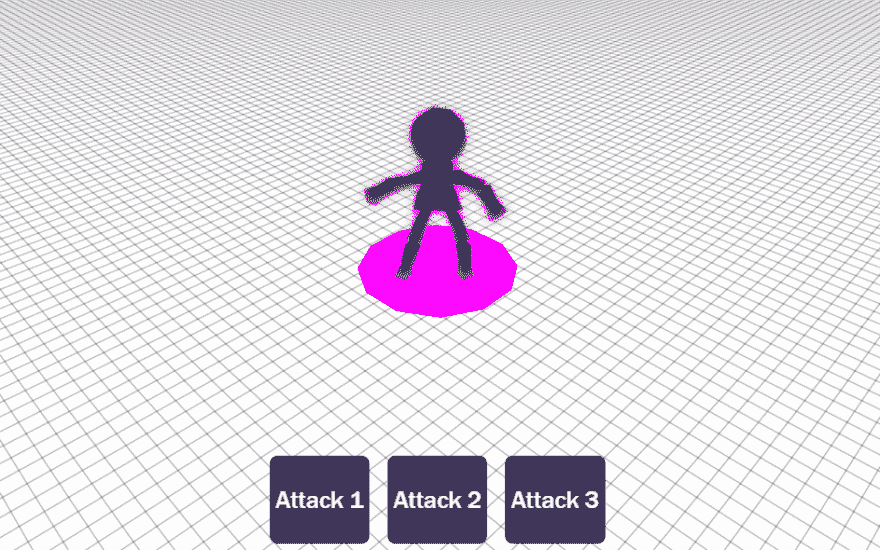
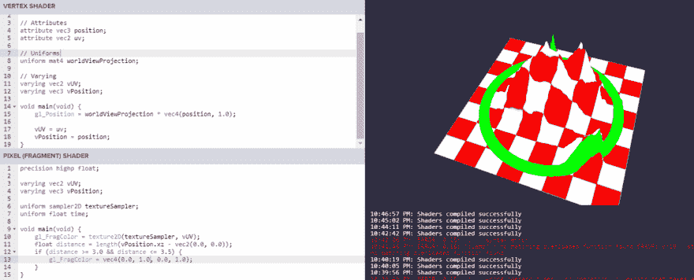

# 着色器构造的简要介绍

> 原文：<https://dev.to/webdva/a-very-brief-introduction-to-the-construction-of-shaders-3pal>

当我创建着色器时，这个代码条目的功能是文档和参考手册。请注意，可能会有一些差异，但它仍然足以作为一个资源。

# 基本面

着色器构造的目标是实现图形效果，如网格变形或重新着色。着色器首先使用目标(如 3D 模型或 2D 纹理)的所有顶点的位置执行操作，然后对已处理顶点的颜色执行操作。着色器中对顶点位置进行操作的部分称为顶点着色器，着色器中对颜色进行操作的部分称为片段着色器或像素着色器。

下面显示的是顶点着色器程序的源代码。

```
#ifdef GL_ES precision mediump float;
#endif 
precision highp float;

// Attributes
attribute vec3 position;
attribute vec2 uv;

// Uniforms
uniform mat4 worldViewProjection;

// Varying
varying vec2 vUV;
varying vec3 vPosition;

void main(void) {
    gl_Position = worldViewProjection * vec4(position, 1.0);

    vUV = uv;
    vPosition = position;
} 
```

Enter fullscreen mode Exit fullscreen mode

# 类似于 C 预处理器的初始段

由于用于创建着色器的编程语言是一种类似于 C 编程语言的语言，并且类似于 C，着色器程序可以用位于程序开始处的一段代码来配置。着色器程序员可以在这里定义常数，如圆周率的值。

## 移动设备支持

```
#ifdef GL_ES precision mediump float;
#endif 
```

Enter fullscreen mode Exit fullscreen mode

这里的预处理器指令指示着色器程序对浮点值使用较低的精度，条件是着色器程序运行在 OpenGL ES 设备上，这意味着 OpenGL 用于移动设备。这可能会导致桌面和移动版本之间的图形质量差异，但这是意料之中的，因为移动设备通常比桌面计算机有更大的性能限制。

# 理解属性、制服和变化的范例

属性值可以从字面上理解为当前顶点的属性，比如位置，即`attribute vec3 position`。请注意，对于我们在这里使用的着色器，CPU(或者更实际地说，使用或调用着色器程序的应用程序)正在从 3D 模型和 2D 纹理向着色器程序提供信息。

统一值可以被认为是，单词*统一*的含义是恒定的，所有顶点或像素将共享的值，因为对于着色器执行的每个顶点或像素，该值是相同的，例如自着色器程序启动以来经过的当前时间。

并且变化可以被认为是一种从顶点着色器向像素着色器提供信息的手段，例如字面上的当前顶点的属性。顶点着色器通常只计算它正在执行的当前顶点的位置，然后将该信息作为`varying`提供给像素着色器，这是该特定顶点着色器唯一要做的。

# `attribute vec2 uv;`

我不知道关于单词 *UV* 需要知道的所有东西，但是从我的 Blender 模型纹理经验和上下文，我推断`uv`属性是纹理和 3D 网格坐标的映射。因此，顶点着色器，特别是当`uv`属性值被分配给变化的`vUV`变量时，将每个不同的纹理坐标映射传递给片段着色器，以便片段着色器可以使用这些映射进行操作，特别是将 2D 纹理应用于 3D 网格。

# 计算位置

`uniform mat4 worldViewProjection`变量是一个[特定的](https://gamedevelopment.tutsplus.com/tutorials/building-shaders-with-babylonjs-and-webgl-theory-and-examples--cms-24146)值，它是世界矩阵乘以视图矩阵再乘以投影矩阵，在本文档条目中将不再讨论。顶点着色器用线
计算并确定当前顶点的位置

```
gl_Position = worldViewProjection * vec4(position, 1.0); 
```

Enter fullscreen mode Exit fullscreen mode

# 伴随像素着色器

结合上述顶点着色器的使用，这里是附带的像素着色器。

```
#ifdef GL_ES precision mediump float;
#endif 
precision highp float;

varying vec2 vUV;
varying vec3 vPosition;

uniform sampler2D textureSampler;
uniform float time;

void main(void) {
    gl_FragColor = texture2D(textureSampler, vUV);
    float distance = length(vPosition.xz - vec2(0.0, 0.0));
    if (distance >= 3.0 && distance <= 3.5) {
        gl_FragColor = vec4(0.0, 1.0, 0.0, 1.0);
    }
} 
```

Enter fullscreen mode Exit fullscreen mode

# 选择圆形

这两个着色器实际上用于创建选择圆，这是一种图形效果，其中一个圆出现在选定 3D 模型的底部周围。作为一个例子，我的最新游戏使用了一个圆形选择效果(尽管没有使用着色器来实现):

[](https://res.cloudinary.com/practicaldev/image/fetch/s--b6qILYYr--/c_limit%2Cf_auto%2Cfl_progressive%2Cq_66%2Cw_880/https://thepracticaldev.s3.amazonaws.com/i/nskjirhrdcf7gh4tz5jz.gif)

创建目标选择圈的理论是利用这个资源获得的:[链接](https://gamedev.stackexchange.com/a/141846)。目标是获得水平面上距离目标中心一定距离的所有顶点，然后对收集到的顶点进行着色。作为选择环，环的线条宽度必须大于一个像素，以便可以注意到资源中没有指定的像素。

# `uniform float time;`

在这个着色器中没有使用`time`变量，但我在这里让它作为一个提醒，它是由着色器的 CPU 或调用程序提供的，用来告诉着色器从着色器开始运行以来已经过了多长时间。它可以是不同的名称，例如`u_time`，如[着色器手册](https://thebookofshaders.com/03/)学习资源所示。

# 将纹理应用于网格

对于 3D 网格的当前部分，由顶点着色器传递给像素着色器的`vUV`模型纹理映射变量被用于通过线
将最初想要的 2D 纹理颜色应用到 3D 网格

```
gl_FragColor = texture2D(textureSampler, vUV); 
```

Enter fullscreen mode Exit fullscreen mode

# 创建选择圆

`length`函数返回向量的长度，用于获取 3D 网格中心和当前片段在 x-z 平面上的位置之间的距离。

```
float distance = length(vPosition.xz - vec2(0.0, 0.0)); 
```

Enter fullscreen mode Exit fullscreen mode

然后使用条件`if (distance >= 3.0 && distance <= 3.5)`来确定当前片段的位置是否在要着色的正确距离内。着色器使用绿色。

```
gl_FragColor = vec4(0.0, 1.0, 0.0, 1.0); 
```

Enter fullscreen mode Exit fullscreen mode

# 结果

[](https://res.cloudinary.com/practicaldev/image/fetch/s--5AgtSbYV--/c_limit%2Cf_auto%2Cfl_progressive%2Cq_66%2Cw_880/https://thepracticaldev.s3.amazonaws.com/i/yf1wdn7yid9ffyjuhd0v.gif)

该着色器在不同高度的地形上工作，它将颜色覆盖到地形上，如图所示，山丘部分被着色。

使用该着色器的一个负面影响是，它可能会显示其过程中的非预期工件。例如，如果模型是一个 3D 立方体，那么它会被清楚地注意到。但是地面地形通常不会与自身重叠，所以这不是问题。