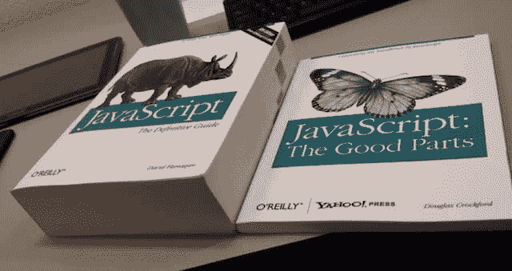
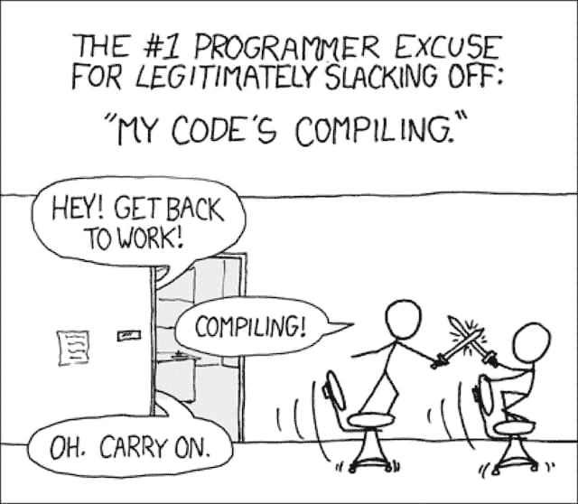
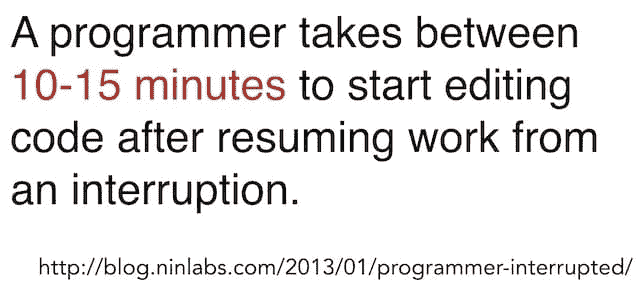
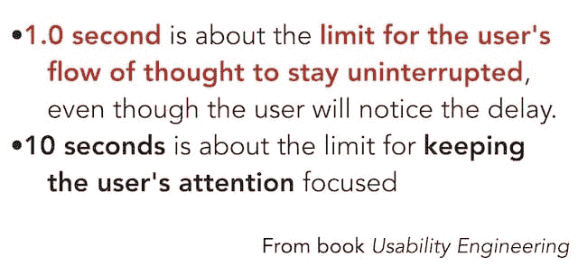
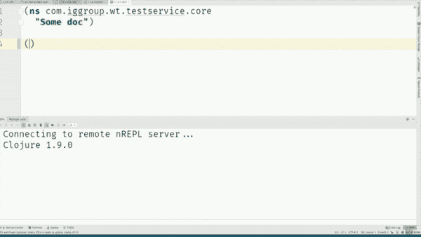
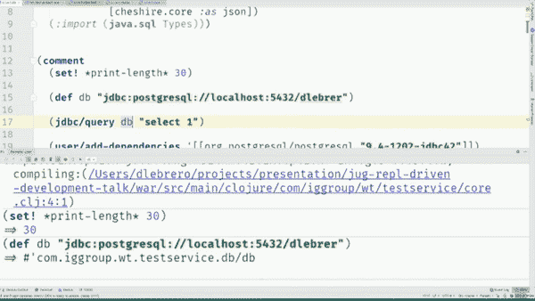
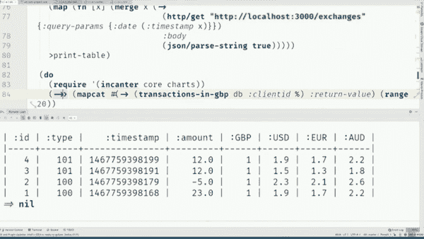
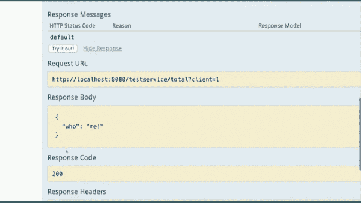

# REPL 驱动的开发:对你的后端代码的即时反馈

> 原文：<https://dev.to/danlebrero/repl-driven-development-immediate-feedback-for-your-backend-code-4b0o>

在这次演讲中，我将解释使用 REPL 的动机，以及在哪里和如何使用它。这个演讲大部分是现场演示。

下面是 [keynote 格式](https://danlebrero.com/slides/repl-driven-development-geecon-2018.key)， [ppt 格式的幻灯片(未经测试！)](https://danlebrero.com/slides/repl-driven-development-geecon-2018.pptx)和 [SlideShare(好歹破了！)](https://www.slideshare.net/DanielLebrero2/habits-ofefficientdevelopers)。

还有视频:

[https://www.youtube.com/embed/ZkJX9ciI5aM](https://www.youtube.com/embed/ZkJX9ciI5aM)

欢迎反馈和提问！

* * *

# 成绩单

大家好，我是 Daniel Lebrero，感谢大家的到来，我们今天在这里
谈论 REPL 驱动的发展。

但在我们开始之前，我要坦白一件事。

[](https://res.cloudinary.com/practicaldev/image/fetch/s--d4AlNPHO--/c_limit%2Cf_auto%2Cfl_progressive%2Cq_auto%2Cw_880/https://danlebrero.cimg/blog/repl-driven-development/001-confession.jpeg)

在我作为开发人员的第一份工作中，我接触了三种技术，这三种技术对我的开发生涯产生了深远的影响。

这三种技术是网景、因特网探索者 4 和因特网探索者 5。

由于这三项技术，我决定成为后端开发人员，多年来避免任何形式的前端工作。我一直是非常快乐的 Java 开发人员，生活在 XML 和 JSON 的世界里。

但是在最近的一个项目中，我再次与一个前端团队合作，我必须承认，从那天起，从那个项目开始，我实际上非常非常嫉妒前端开发人员，直到我在考虑成为他们中的一员的可能性。

你可能会想，哇，这不是很疯狂吗？

也许这些开发人员使用的 JavaScript 与 20 年前我不得不学习和忍受的 JavaScript I 有些不同？

[](https://res.cloudinary.com/practicaldev/image/fetch/s--HUEFeRrT--/c_limit%2Cf_auto%2Cfl_progressive%2Cq_auto%2Cw_880/https://danlebrero.cimg/blog/repl-driven-development/002-js-the-good-parts.jpeg)

你知道，JavaScript 在不断发展，但本质上它仍然是相同的 Javascript。

也许他们已经解决了所有那些曾经让我抓狂的浏览器之间的不兼容问题？

似乎不是这样，似乎他们就在那里，现在有了所有的手机和平板电脑就更糟糕了。

为了真正理解我为什么如此嫉妒前端开发人员，让我们看一张我自己做一些前端工作的照片。

[](https://res.cloudinary.com/practicaldev/image/fetch/s--ZkMMu8iq--/c_limit%2Cf_auto%2Cfl_progressive%2Cq_66%2Cw_880/https://danlebrero.cimg/blog/repl-driven-development/004-css.gif)

那是我试图在 Internet Explorer 和 Opera 上使用两列布局；而且，正如你所看到的，我不太擅长，尽管我尝试了又尝试，结果总是一样的:这只是一大堆废话。

但是即使 CSS 没有任何意义，那张图片上还是有一些非常好的东西，非常强大的东西。所以我们再来看看。

关注格里芬先生的工作流程。

看他如何向一个方向拉绳子，他马上就能看到，没有任何延迟，盲人的结果是什么。他不喜欢这样，他只是把绳子往不同的方向拉。他一直这样做，直到他完成。

这是我作为后端开发人员在日常工作中真正缺少的即时反馈吗？

# 即时反馈

我们从敏捷、scrum 和精益中知道反馈循环非常重要，但是为什么即时反馈对我们如此重要呢？

因为没有这种即时反馈，就很难进入心流或状态。

[](https://res.cloudinary.com/practicaldev/image/fetch/s--otUxX1lw--/c_limit%2Cf_auto%2Cfl_progressive%2Cq_auto%2Cw_880/https://danlebrero.cimg/blog/repl-driven-development/005-the-flow.jpeg)

心流是这样一种状态，当尼欧意识到他是天选之人时，你会觉得自己像他。

当你在流中时，你是如此的专注，以至于真实的世界消失了，取而代之的是你的代码，它的设计，以及流过它的数据。

当你处于流程中时，没有任何问题是足够困难的，没有任何错误可以瞒过你，你的解决方案是干净、简单和优雅的。

[](https://res.cloudinary.com/practicaldev/image/fetch/s--6KWVREd4--/c_limit%2Cf_auto%2Cfl_progressive%2Cq_auto%2Cw_880/https://danlebrero.cimg/blog/repl-driven-development/006-productivity.jpeg)

当你处于“心流”中时，就是你最有效率的时候，这并不是说你生产的更多，而是你生产的东西质量更好。

[](https://res.cloudinary.com/practicaldev/image/fetch/s--4Yw9qOw1--/c_limit%2Cf_auto%2Cfl_progressive%2Cq_auto%2Cw_880/https://danlebrero.cimg/blog/repl-driven-development/007-joy.jpeg)

但是这种生产力只是处于心流中的一个好的副作用。我们真正寻找的是那种快乐的感觉，那种有所成就的感觉，那种创造美好事物的感觉。

这就是为什么 20 年后，我仍然是一名软件开发人员。

但是我们都知道，你在心流中完全专注于做你所有的提示和技巧，然后

[](https://res.cloudinary.com/practicaldev/image/fetch/s--jPqrPP_d--/c_limit%2Cf_auto%2Cfl_progressive%2Cq_66%2Cw_880/https://danlebrero.cimg/blog/repl-driven-development/008-losing-focus.gif)

听起来很熟悉？这就是把你推出去的原因。

我们后端开发人员是这类中断的专家。

[](https://res.cloudinary.com/practicaldev/image/fetch/s--v_Psr6-a--/c_limit%2Cf_auto%2Cfl_progressive%2Cq_auto%2Cw_880/https://danlebrero.cimg/blog/repl-driven-development/009-compiling.jpeg) 
<small>形象归属:[https://www.xkcd.com/303/](https://www.xkcd.com/303/)。</small>T9】

我们总是这样做，我们认为它们是不可避免的，我们甚至有关于它的漫画。

但也许我们会对此一笑置之，因为我们也许不知道一次中断的代价是什么，也不知道脱离心流的代价是什么。

有几项研究试图量化成本是多少

[](https://res.cloudinary.com/practicaldev/image/fetch/s--zKex1-BG--/c_limit%2Cf_auto%2Cfl_progressive%2Cq_auto%2Cw_880/https://danlebrero.cimg/blog/repl-driven-development/010-interruption-cost.jpeg)

似乎每次你被打断的时候，你都会浪费 10 到 15 分钟来找回你正在做的事情的背景。

所以你花了 15 分钟重新开始编码，令人担忧的是如果你看看可用性专家怎么说

[](https://res.cloudinary.com/practicaldev/image/fetch/s--0-K2ZAux--/c_limit%2Cf_auto%2Cfl_progressive%2Cq_auto%2Cw_880/https://danlebrero.cimg/blog/repl-driven-development/011-interrumption-limit.jpeg)

如果你想保持你的思路，中断不能超过一秒钟。如果你被打扰的时间超过 10 秒，很有可能你会继续玩手机，或者查看新闻，或者浏览社交媒体。

这里谁能在一秒或更短的时间内构建、编译、启动运行时呢？

在准备这个演示文稿时，作为测试，我使用该公司的原型创建了一个新的 Tomcat 应用程序，这是一个全新的应用程序，我只是计算了项目构建和启动所花的时间。这个项目有一个什么都没有的控制器，和一个什么都不做的测试。

谁想猜一下 Tomcat 启动一个空应用程序花了多长时间？在我的例子中，是 30 秒，所以 30 秒是一段很长的时间，还是 30 秒是一段合理的时间？

所以让我们思考 30 秒，大约 30 秒。好的，你准备好了吗？

(暂停 30 秒钟)

那是 30 秒，我不知道我对你有什么感觉，但对我来说，站在你们面前，那是非常漫长的 30 秒，我们一直都是这样做的。

这不会有任何好转，对吗？随着我们添加更多的测试，更多的代码，这只会变得越来越糟糕。

但是我们知道这一点，所以如果你想让自己保持高效，你可能已经在遵循那位智者的建议了:

> 不要运行 Tomcat。拥抱 TDD
> <cite>丹·勒布雷罗</cite>

所以你要做的是:你不运行你的应用程序。相反，你所做的是依靠一个好的单元测试套件来知道你是否取得了进展，并且知道你是否没有破坏任何东西。

记住，如果你不想失去注意力，一套好的测试服必须在 10 秒或更短的时间内完成。

如果你做 TDD 的时间够长，你大概知道 TDD 有一些缺点，那就来看看吧。

谁能告诉我仿制品、存根、假货和间谍有什么共同点？

什么是模仿？嘲笑只是谎言。

什么是假货？它们都只是谎言，对吗？

[](https://res.cloudinary.com/practicaldev/image/fetch/s--60a5IDwU--/c_limit%2Cf_auto%2Cfl_progressive%2Cq_auto%2Cw_880/https://danlebrero.cimg/blog/repl-driven-development/012-lies.jpeg)

它们是我们创造的谎言，以保持我们的测试套件非常快，保持我们的工作流程正常，但它们只是谎言。

它们不是真的。现在，我认为我们不能回避它们，但我们真正想要的是可信的谎言。

[](https://res.cloudinary.com/practicaldev/image/fetch/s--_yIOvylW--/c_limit%2Cf_auto%2Cfl_progressive%2Cq_auto%2Cw_880/https://danlebrero.cimg/blog/repl-driven-development/013-credible-lies.jpeg)

我们想创造我们的模仿，他们的行为就像真的一样。但是你怎么能这样做呢？

为了能够模仿真实的东西，你真的真的需要了解真实世界是如何运作的。你是怎么做到的？

嗯，如果你和数据库打交道，我知道的唯一方法就是去数据库，看看有哪些表，哪些列，这些列中值的可能范围是什么。

如果您需要与第三方 HTTP restful 端点集成，我知道的唯一方法是去那里并接触那个东西。

TDD 没有给我们任何工具去理解真实世界是如何工作的，所以我们可以去做我们的嘲笑。

我已经做了 16-17 年的 TDD，我学到的一件事是，不管你有多少测试，你的代码覆盖率是多少

[](https://res.cloudinary.com/practicaldev/image/fetch/s--xb365fD5--/c_limit%2Cf_auto%2Cfl_progressive%2Cq_66%2Cw_880/https://danlebrero.cimg/blog/repl-driven-development/014-dancing-bugs.gif)

他们总是，总是，一些 bug。

你启动了这个东西，也许你的配置不存在或者不正确。也许你的 Spring 接线和你的单元测试并不完全一样。

所以这总是你将要遇到的一种情况，当它崩溃时，TDD 也不会给你任何东西。

# 那么，我们希望我们的工作流程是什么样的呢？

1.  我们希望编写代码并获得即时反馈。
2.  我们不想坐在那里等待构建和部署的发生。
3.  我们需要工具来理解现实世界，
4.  所以我们可以有一个简单的方法来创造忠实的谎言。
5.  我们不希望应用程序启动时出现任何意外。

我们可以用什么样的工具来获得所有这些东西呢？你不会感到惊讶，REPL 是一个可能的工具。

REPL 代表读取、评估、打印循环，我们都可能使用过 REPL，通常以命令行界面的形式出现。

[](https://res.cloudinary.com/practicaldev/image/fetch/s--OMwpZJpK--/c_limit%2Cf_auto%2Cfl_progressive%2Cq_66%2Cw_880/https://danlebrero.cimg/blog/repl-driven-development/015-terminal.gif)

那么控制台在这里做什么呢？读取你的命令，然后计算，运行，然后打印结果，然后循环，回到读取状态，允许你输入另一个命令。

基本上，REPL 是一样的东西，唯一的区别是，我们要做的不是编写 Unix 命令，而是编写小块代码，这些代码将在我们的程序中运行。

所以，我们要做一个演示，演示要做的是:

[](https://res.cloudinary.com/practicaldev/image/fetch/s--QQwOtxU5--/c_limit%2Cf_auto%2Cfl_progressive%2Cq_66%2Cw_880/https://danlebrero.cimg/blog/repl-driven-development/016-repl-setup.gif)

我们将使用 Maven 启动 Tomcat，Tomcat 将启动我们的应用程序，我们的 war，在 war 中，我们将在应用程序中启动 REPL。

现在，因为在那个非常小的屏幕上输入东西非常麻烦，REPL 不是从标准输入中读取，而是要侦听一个套接字，然后从我们最喜欢的 IDE 中，我们只需连接到那个套接字，然后我们将在我们总是在 IDE 中编写代码的地方编写代码。我们将使用快捷方式向应用程序发送代码。代码将在应用程序内部运行，然后我们将得到结果，结果将打印在底部窗口。

好了，我要用 Clojure 做演示了。

[](https://res.cloudinary.com/practicaldev/image/fetch/s--sGSlY8By--/c_limit%2Cf_auto%2Cfl_progressive%2Cq_auto%2Cw_880/https://danlebrero.cimg/blog/repl-driven-development/017-clojure-lisp.jpeg)

Clojure 是目前我最喜欢的语言。Clojure 是 JVM 的 lisp，演示的重点不是 Clojure，所以我不期望任何人理解任何代码，我也不打算解释任何代码，所以我想让你们做的唯一一件事是关注工作流，关注我们如何使用 REPL 完成所有任务，我希望你们将它与你们在工作中如何完成它进行比较。

现在，拥有 REPL 的原因之一是能够学习语言。REPL 是一种工具，它让学习语言变得容易得多，因为玩它更容易，所以我将在清单上添加另一项，即学习语言。

# 演示

(演示开始分钟 12:25，[跳过](#enddemo))

因此，我们要做的第一件事就是启动应用程序。如果你有一个好的 REPL，这是第一件事，在你开始写或者思考你要写什么之前，你要做的第一件事就是启动应用程序。

这通常是所有工作流程中最慢的部分，通常需要 30 秒左右。现在，你可以每天做一次，或者一周一次，或者一个月一次。这取决于你需要改变项目的频率。你会试着让它一直运行。

因此，我们要构建的是一个小型 restful 应用程序，它将进入数据库，为用户获取一些事务，它将进行某种汇总，并在 HTTP 端点上公开这些事务。

#### 基本工作流程同 REPL

所以我们要学一点点 Clojure，但这是为了让你们习惯我一直要做的事情。

所以在 Clojure 中一切都是列表，这是一个 Lisp。

所以列表上的第一件事是你想调用的函数，然后是零个或更多的参数。

[](https://res.cloudinary.com/practicaldev/image/fetch/s--030FLgI3--/c_limit%2Cf_auto%2Cfl_progressive%2Cq_66%2Cw_880/https://danlebrero.cimg/blog/repl-driven-development/repl-001.gif)

我将点击这个神奇的快捷键，我将把这段特定的代码发送给 Tomcat，Tomcat 将向我返回响应。所以你可以看到我发了什么，得到了一个三分。

有问题吗？清楚了吗？因为我会一直这么做。

假设你想进一步了解加号函数:如果你给加号函数传递三个参数会发生什么？你只需编写代码，运行它，你就会看到 Clojure 允许你这么做。如果只传递一个参数给 plus 函数会怎么样？也管用。如果不传递参数会发生什么？它返回零。如果传递一个很长的值会怎么样？似乎有用。让我们使用一个更长的值:它抛出一个算术异常。

所以我们在这里所做的只是试图理解加号函数是如何工作的。以及我们是如何做到的？我们做一些小的改变，编写一些小程序，运行每一个程序，我们马上就能看到结果。

就像我们用 plus 函数做的一样，那是核心语言的一部分，你可以用任何你想探索的库来做。

这就够了 Clojure。

#### 在 REPL 测试配置

所以现在我们要构建真正的应用程序。同样，我们将转到数据库，对于给定的客户，我们将获得他所有交易的列表，我们将做一些非常简单的事情来汇总所有这些交易。

我想做的第一件事就是连接到数据库，检查我们对数据库的配置是否正确。为此，我们只需尝试运行`select one from dual`。

[](https://res.cloudinary.com/practicaldev/image/fetch/s--7D8b2e9E--/c_limit%2Cf_auto%2Cfl_progressive%2Cq_66%2Cw_880/https://danlebrero.cimg/blog/repl-driven-development/repl-002.gif)

如果你懂 Java，这是在告诉你没有适合 Postgres 的驱动程序，所以如果我去我的 pom，我们在这里看到我忘记取消注释了。您通常要做的事情是取消对依赖项的注释，并重启 JVM 以查看是否有效。

但是，与此相反，JVM 能够从任何地方加载代码，并且能够在运行时这样做，所以我们只是告诉 JVM 请转到 Maven，下载 Postgres 驱动程序的所有依赖项，然后安装它。然后我们再试一次。

似乎我们得到了另一个异常，但是这个不同，数据库不存在。这是因为我犯了一个小错误，我们修复它，再试一次，现在我们连接到数据库。

那我们在做什么？我们基本上是在测试我们的配置。我不知道你是如何做到的，但对我来说通常是非常痛苦的，因为当你必须测试配置之类的东西时，你必须不断地重新启动 JVM，看看它是否工作，它是否找到配置文件，如果它没有找到它们，你是否正确地放置了凭证，但在这里我们能够以一种交互的方式来做。

#### 探索数据库

现在我们要去探索真实的世界。假设我们知道包含数据的数据库，但我们不知道数据库中有什么，所以我通常会打开 Oracle SQLDeveloper 之类的东西，然后我会输入凭据，然后我会开始导航，在 UI 中查看那里有什么。

但与此相反，我们要做的是，使用 JDBC 元数据 API，从 Tomcat 中，我们只是要查询数据库，搜索所有以“transac”开头的表。我们在这里看到，Postgres 返回给我们三个对象，三张地图。不要像这样打印，因为阅读起来有点困难，而且因为我们在 JVM 上，我们只是写一个函数，所以我们以一种更表格化的方式打印，这样阅读起来更容易一点。

我们这里有一个名为 transaction 的表，可能是我们想要使用的表，我们要做的是查询数据库，它返回一堆结果，在这里我们会看到有一个货币，有一个金额，有一些时间戳，一个 ID，客户端 ID，所以我们得到了其中数据的一个示例。

现在我们意识到有两种货币，所以如果你想恰当地总结这个东西，我们需要某种外汇。所以我们去找我们的建筑师，我们问他我们有这个问题，一边是欧元，另一边是英镑，我们该怎么办？他说，我们有一个 restful 端点，你可以点击它，它会给你外汇交易。所以他给了我们网址，我们就去戳这个 restful。

#### HTTP 客户端代码，一次一位

所以如果我运行这个，我现在发出 HTTP 请求。不知何故，这是失败的，所以我们要做的是，我们需要看看错误是什么。这是一个 400，如果我们看着身体，它说，像是日期不见了。

那么让我们把它添加到我们的请求参数中，再试一次，我们现在看到在主体中包含了一些 JSON。我们在好的路径上，所以让我们提取主体，看起来不错，让我们解析 JSON，就这样。

看看我们在做什么，看看流程，我们写一小段代码，然后立即运行它，我们看到结果，我们对每一小步都这样做。

现在我们可能要检查，我们有旧的数据吗？似乎我们有数据。非常非常旧的数据怎么办？因为我们没有 1970 年以前的数据。如果将来我们出于某种原因需要数据，会发生什么情况？我们有未来的数据，这是一个非常有趣的特征。如果我们传递一个字符串会发生什么？我们得到一个错误，说日期应该很长。

因此，我们正在探索事情是如何工作的，现在，例如，我们知道错误是什么样子的，所以现在我们可以围绕处理错误来构建我们的逻辑。

#### 为存储的进程生成代码

现在，当你正在构建这个时，你的团队领导进来说:嗯，数据库中已经有一些存储的过程，它将为你做所有这些逻辑，所以不要关注架构师。他们什么都不知道。

那么你要做的是，和之前完全一样的事情，我们将通过 JDBC API 询问数据库，它存储了我们拥有的包含单词“trans”的 procs。我们看到我们有一个“英镑交易”。所以让我们再看一下存储过程是什么。因此，我们看到它返回一个光标，并需要客户端 ID。

现在我们知道他们存储了 proc 期望的和需要的内容，我们可以做的是编写我们的代码，但是你知道 JDBC 客户端代码简直是地狱，但是我们今天在这里做的只是把它打印成表格，但是为什么我们需要把它打印成表格呢？我们也可以把它打印成一段代码。

```
(def-proc  transactions-in-gbp  "transactions_in_gbp"  [:return  Types/OTHER  :return-value]  [:in  Types/BIGINT  :clientid]) 
```

Enter fullscreen mode Exit fullscreen mode

所以我把它打印成一段代码，复制下来，粘贴到我们的文件里，现在我们可以试一试了。有用吗？似乎有用。如果我通过一个不存在的客户端会发生什么？没有价值。如果我传递零值会发生什么？如果我传递一个字符串会发生什么？例外。

#### 为什么不是 SQL 开发者或者邮递员？为什么要去 REPL 探险？

因此，我们只是四处探索，以了解事情是如何工作的，但您可能会想，为什么这比使用 Oracle SQL developer 要好，对吗？这是一个 SQL 专用工具。

我们刚刚生成的这段代码是什么？这是我们的第一段生产代码。这是生产代码。如果您使用的是 SQL Developer，我们会知道该怎么做，但现在我们必须继续键入代码才能调用数据库，并且您需要测试这些代码，因为您并不真正知道它是否有效。

但是，当我们在应用程序中运行这个存储过程并部署它时，它失败的可能性有多大呢？它不起作用吗？想想看，每次我们进行评估，每次我们向 REPL 发送一段代码，我们都是在 Tomcat 内部发送它，所以基本上我们所做的是将这段代码部署到 Tomcat 中，所以这段代码不工作的可能性非常非常小。

我还没有解释，但是，我们在哪里做这些改变？我们正在编辑的文件不是一个特殊的地方，这是一个项目文件。一旦我们完成了这项工作，我们要做的就是提交这个文件。我们不必将这段代码复制到另一个地方。这是生产代码，在正确的地方。

您希望使用 REPL 而不是 SQL 开发人员或邮递员的另一个原因是...有多少人知道怎么做 for 循环？每个人都知道如何做 for 循环。有多少人知道如何在《邮差》中做一个 for 循环？有人告诉我这是可能的。我们整天都在循环，对吧？如果你有一个 REPL，你就有一个完整的语言，你的生产语言，它不是那种不同的语言，是你的生产语言，做任何事情。

同样，因为我们在 JVM 中，如果出于某种原因，为了您的研究，您需要从数据库中获取数据，并以某种方式将它与 HTTP 服务相关联，会发生什么？好吧，如果您使用 Postman 和 SQL Developer，您需要在这两个工具中将结果导出到 CSV，并且可能创建一些 Bash 脚本...但是，我们是在 JVM 上，所以你只需要写一小段代码就可以了，因为 JVM 有几乎所有的库。

我们可以变得更花哨，如果我们真的真的需要，我们也可以做图表。我们在 JVM 中有大量的图形库，所以再一次，我们有 JVM 的所有工具来理解真实世界是如何工作的。

[](https://res.cloudinary.com/practicaldev/image/fetch/s--5YcerOuk--/c_limit%2Cf_auto%2Cfl_progressive%2Cq_66%2Cw_880/https://danlebrero.cimg/blog/repl-driven-development/repl-004.gif)

#### TDD 和 REPL

因此，假设我们已经完成了这个探索阶段，以了解真实世界是如何工作的，现在我们想切换到我们的 TDD 工作流。所以我们要做的第一件事是写一个测试，这是一个测试，如果你看到，它说它失败了，但那是因为我们没有给它提供任何数据，任何模拟数据。

我们可以在这里输入所有的模拟数据，但是如果你仔细想想，我们已经在调用 DB 了，所以一个选择就是将 DB 调用的结果复制到我们的测试设置中。

我们在测试中使用的数据有多大可能存在打印错误？还是不是合适的类型？那来自数据库，所以在我们的探索工作之外，我们能够得到数据片段并且在我们的测试中直接使用它们。

好，假设您的业务经理说我们不希望汇总函数考虑类型为 101 的记录。所以，如果你在做 TDD，你要做的第一件事就是改变预期。你写了测试，你看到它失败了，现在你想让它变绿，所以我们会去代码，我们会删除类型 101，再次运行它，它是绿色的。太好了，我们已经实现了我们的要求。

现在业务经理改变了主意:嗯，你知道，我们不想数数字，因为它们看起来很糟糕，所以总结应该是 23。您再次运行您的测试，现在您转到您的生产文件，并进行更改...但是这种文件之间的切换有点烦人。

因此，我们可以告诉 REPL 跟踪我们在项目中所做的所有更改，并在我们保存文件后立即运行测试。所以我们现在保存文件，它会自动运行测试，而我不需要做任何事情。

它的好处是，它不只是运行所有的测试。如果我去一个没有测试的文件，看他在这里说什么？它没有运行任何测试，因为这个文件根本没有任何测试。因此，它不只是运行所有的测试，所有的测试套件，它只是运行可能会受到您所做的更改影响的测试。

#### 控制器接线

既然我们对自己的业务逻辑感到满意，那么我们唯一缺少的就是创建一个 REST 端点来将这个功能公开给外部世界。

这个特定的服务使用 Swagger。大家都熟悉斯瓦格吗？Swagger 是一种将端点定义为 JSON 的标准方式，因此您可以在不使用工具的情况下使用这种定义。在这种情况下，使用 JSON 定义的是一个 Swagger UI，它只绘制 API 端点，允许您轻松地进行 HTTP 调用，并使用端点。

让我们添加我们的新端点，我们将只是复制前一个，我们称之为总，让我们看看这是否可行。刷新浏览器，我们现在看到总数在这里，这是我们的新端点。我们将需要一个 long 类型的客户机，而不是“who ”,我们需要连接我们的依赖项，让我们调用数据库，并尝试一下。总共二十三个。

[](https://res.cloudinary.com/practicaldev/image/fetch/s--Qj1yDiEu--/c_limit%2Cf_auto%2Cfl_progressive%2Cq_66%2Cw_880/https://danlebrero.cimg/blog/repl-driven-development/repl-005.gif)

好吧，我个人不会在我的控制器上放置或尝试放置任何类型的逻辑，所以我通常不会测试它们，我们在这里所做的只是测试布线是否实际工作。

假设除了总数之外，您还想返回客户端。我们可以在这里检查它，但是从一个工具换到另一个工具来做测试已经变得很烦人了。我很确定，JVM 能够进行 HTTP 调用，所以我们编写了一小段代码，可以直接进行 HTTP 调用，所以现在如果我们将客户端更改为 account，请看，它会自动更改。我们不需要改变另一个工具，我们看到变化出现了，我们可以检查它。

这个反馈循环是即时的。

#### 状态

现在我们有了所有这些代码的自动刷新，应用程序状态会发生什么呢？这里我们有一个状态，我们将使用它来计算这个服务已经完成了多少个 HTTP 请求。

在我们的新端点中，我们将返回包含请求数的计数器:1，2，3，...我们现在有 12 个。现在我们要改变它，那么当它刷新我的更改时会发生什么呢？计数器，那块状态，已经回到 0 了。

发生什么事了？当代码被刷新时，我们正在失去那个状态。这可能是你想做的事情，但有时这有点烦人，例如，当你有一些缓存，你正在测试缓存。从数据库加载缓存需要很长时间，丢失缓存的状态真的很烦人。它只会让你慢下来，所以我们可以告诉 REPL 的是，对于这个特定的州，当有变化时，我不希望你破坏它。

所以我们可以有选择地决定我们想要保留哪一部分状态，但不仅仅是这样。

因为我们真的在 JVM 内部，我们可以去检查状态，你的应用程序中的任何状态，你都可以去查看。这就像有一个调试器连接到 JVM。

同样，你可以检查它，你可以去改变它。

但是有时候，甚至声明你认为你不想摆脱，你可能想摆脱它。所以有一种方法可以告诉 REPL 扔掉所有东西，甚至是你告诉它不要扔掉的东西。

与我们检查状态的方式相同，我们也可以获取正在通过您的应用程序的任何状态，并捕获它，以后再检查它。

## 有些 REPL 的好处

那么我们从 REPL 身上得到了什么呢？

1.  学习编程语言及其库的完美工具。
2.  使用即时反馈编写代码。
3.  没有构建或部署。无需重启即可实时更改我们正在运行的应用程序。
4.  理解真实世界的工具:所有的 JVM 库。
5.  为我们的测试创造真实谎言的简单方法。
6.  启动应用程序时的惊喜更少。
7.  向正在运行的应用程序添加新库。
8.  自动运行受更改影响的单元测试。
9.  检查和管理状态。
10.  在您最喜欢的 IDE 上舒适地停留。

## 一个 REPL 在上演和制作？

如果你想一想，REPL 正在监听一个套接字，而监听套接字的东西意味着你真的不需要在本地运行它们。

那么，如果我们让这个 REPL 在我们的登台和生产环境中打开套接字，会发生什么呢？然后，从我们的 IDE 中，我们将它连接到试运行或生产环境？

有多少次你报告了一个 bug，然后你想:“如果我能看到这个特定对象在 staging 中的状态，我马上就能知道问题出在哪里，我马上就能修复它”。

或者你有多少次想过:“如果我可以在这里添加一个日志行，我就会知道发生了什么”，然后你对你的日志记录进行了更改，你再次部署，你
意识到:“哦，这不是我想要的日志行，我真的需要一个不同的日志行”。

有了 REPL，我们能够在任何你想要的环境中立即做出所有这些改变。

但是谁会如此疯狂地想要在生产中拥有这种力量呢？太危险了，对吧？

> 1999 年 5 月，我们调试并修复了一个在地面测试中没有出现的竞态条件。调试一个运行在 1 亿公里之外的价值 1 亿美元的硬件上的程序是一种有趣的体验。在宇宙飞船上运行一个读取-评估-打印循环被证明在发现和修复问题上是无价的。
> T3【罗恩·加勒特】美国宇航局喷气推进实验室工程师

所以我要声明，如果美国国家航空航天局在生产中有这种能力，也许我们也可以使用它。你必须非常小心，但为什么不呢？

为了完成我们说过的 REPL 赋予您的所有功能，我将再添加两个:

1.  调试试运行和生产环境
2.  控制宇宙飞船

## 更多回复

(又停顿了 30 秒)哦，对不起，只有 30 秒。别担心，只是一小时内的第二次...

记住我们为什么想要一个 REPL:你这么做是为了自己的快乐，也是为了公司的生产力。

正如我所说，这不是 Clojure 独有的，这里有其他不同语言和环境中类似事情的视频。但是每个 REPL 都有不同的能力，它们并不都一样。

*   JavaScript:[https://vimeo.com/123513496](https://vimeo.com/123513496)
*   https://www.youtube.com/watch?v=KZjFVdU8VLI
*   榆树:[http://debug.elm-lang.org/](http://debug.elm-lang.org/)
*   groovy:[https://www.youtube.com/watch?v=bTRUC78X87g](https://www.youtube.com/watch?v=bTRUC78X87g)
*   蟒蛇:[https://www.youtube.com/watch?v=EwI-e3WlTew](https://www.youtube.com/watch?v=EwI-e3WlTew)
*   iOS:[https://www.youtube.com/watch?v=Ci4uviG8S0o](https://www.youtube.com/watch?v=Ci4uviG8S0o)
*   安卓:[https://www.youtube.com/watch?v=mVXTcAEKgF8](https://www.youtube.com/watch?v=mVXTcAEKgF8)
*   团结:[https://www.youtube.com/watch?v=tJr_TD1BtF0](https://www.youtube.com/watch?v=tJr_TD1BtF0)
*   音乐:[https://www.youtube.com/watch?v=yY1FSsUV-8c](https://www.youtube.com/watch?v=yY1FSsUV-8c)

爪哇 REPL 怎么样？

[](https://res.cloudinary.com/practicaldev/image/fetch/s--1zjcU3NV--/c_limit%2Cf_auto%2Cfl_progressive%2Cq_66%2Cw_880/https://danlebrero.cimg/blog/repl-driven-development/018-java9repl.gif)

当我读到 Java 将获得 REPL，然后 REPL 将获得什么时，这就是我。

在你看到的 REPL 可以给你的所有东西中，Java REPL 的目的是使学习语言变得容易，仅此而已，但即使这样，这也很有趣，因为语言在 REPL 中与在 Java 中并不完全相同，因为它有不同的语义，不同的语法，而在更强大的 REPLs 中，你可以获得整个语言，没有区别。

## 参考文献

*   代码:[https://github.com/dlebrero/repl-driven-development-talk](https://github.com/dlebrero/repl-driven-development-talk)
*   布雷特·维克多:发明原理[https://vimeo.com/36579366](https://vimeo.com/36579366)
*   罗恩·加勒特:远程代理实验:调试 6000 万英里外的代码[https://www.youtube.com/watch?v=_gZK0tW8EhQ](https://www.youtube.com/watch?v=_gZK0tW8EhQ)
*   雅各布·尼尔森——可用性工程:[https://www.nngroup.com/books/usability-engineering/](https://www.nngroup.com/books/usability-engineering/)

谢谢大家！