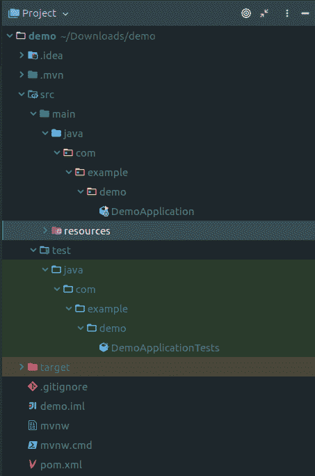

# 如何在新 Spring Boot 项目中启用 JUnit 5

> 原文：<https://dev.to/martinbelev/how-to-enable-junit-5-in-new-spring-boot-project-29a8>

*本帖最初发布于[媒体](https://medium.com/@martinbelev/how-to-enable-junit-5-in-new-spring-boot-project-f95247cd2a3e)。*

在本文中，我们将学习如何在新创建的 Spring
Boot 项目中启用 JUnit 5。我们正在经历以下步骤:

1.  初始化新的 Sprint 启动项目
2.  看看我们的`pom.xml`和主要的`sprint-boot-starter-test`依赖，在`spring-boot-starter-test`中深入一点，看看它使用的是什么 JUnit 版本
3.  如何使用 Maven 排除来自某个依赖项的子依赖项
4.  添加 JUnit 5
5.  将 JUnit 4 迁移到 JUnit 5

* * *

1)首先，让我们去 [Spring Boot 初始化](https://start.spring.io/)并生成一个新项目。

[](https://res.cloudinary.com/practicaldev/image/fetch/s--N_9kfiPu--/c_limit%2Cf_auto%2Cfl_progressive%2Cq_auto%2Cw_880/https://cdn-images-1.medium.com/max/800/1%2A6SfjqHX8SSn-_1LqqcKZ3Q.png)

默认值应该没问题，您可以单击“生成项目”按钮。您应该已经下载了 starter Sprint Boot 项目的. zip 归档文件。解压缩它，并使用您选择的 IDE 打开它(我使用 IntelliJ，下面的代码示例和例子将从它显示)。打开后，您应该会看到以下结构:

[](https://res.cloudinary.com/practicaldev/image/fetch/s--DNb9IOR8--/c_limit%2Cf_auto%2Cfl_progressive%2Cq_auto%2Cw_880/https://cdn-images-1.medium.com/max/800/1%2AS3qBYyrkhUz8qnvn8y92ag.png)

2)现在让我们来关注一下`pom.xml`。

在我们的`pom.xml`中，我们可以看到下面的依赖项，其中包括用于测试 Spring Boot 应用程序的库(如 JUnit、Hamcrest 和 Mockito)。

```
<dependency>
  <groupId>org.springframework.boot</groupId>
  <artifactId>spring-boot-starter-test</artifactId>
  <scope>test</scope>
</dependency> 
```

我们将更深入地了解确切的依赖关系及其版本，重点关注`spring-boot-starter-test`附带的`junit`(在 IntelliJ 中，您可以通过将`Ctrl + click`添加到`spring-boot-starter-test`上来实现这一点)。在下面的代码片段中，我们可以看到`sprint-boot-starter-test`附带了 JUnit 4.12，但是已经有了 JUnit 5。那么我们如何在新的 Spring Boot 项目中使用 JUnit 的新版本呢？

```
<dependency>
  <groupId>junit</groupId>
  <artifactId>junit</artifactId>
  <version>4.12</version>
  <scope>compile</scope>
</dependency> 
```

3)我们应该有办法排除 JUnit 4，因为我们目前因为`spring-boot-starter-test`而依赖它。我们可以通过在我们的`spring-boot-starter-test`依赖项中添加下面几行来做到这一点，这样我们就排除了 JUnit 4。

```
<dependency>
  <groupId>org.springframework.boot</groupId>
  <artifactId>spring-boot-starter-test</artifactId>
  <scope>test</scope>

  <exclusions>
    <exclusion>
      <groupId>junit</groupId>
      <artifactId>junit</artifactId>
    </exclusion>
  </exclusions>
</dependency> 
```

4)我们现在将使用 Maven 将 JUnit 5 配置为依赖项。我们将在`pom.xml`
中添加以下依赖项

```
<dependency>
  <groupId>org.junit.jupiter</groupId>
  <artifactId>junit-jupiter-api</artifactId>
  <version>5.3.2</version>
  <scope>test</scope>
</dependency>
<dependency>
  <groupId>org.junit.jupiter</groupId>
  <artifactId>junit-jupiter-engine</artifactId>
  <version>5.3.2</version>
  <scope>test</scope>
</dependency> 
```

我们应该将下面的 maven 插件添加到我们的构建插件中

```
<plugin>
  <artifactId>maven-surefire-plugin</artifactId>
  <version>2.22.0</version>
</plugin> 
```

5)我们已经移除了对 JUnit 4 的依赖，我们已经添加了 JUnit 5，现在是时候做一些代码更改来使用 JUnit 5 了。让我们关注一下`DemoApplicationTests.java`，在这里我们可以看到下面的代码

```
 package com.example.demo;

import org.junit.Test;
import org.junit.runner.RunWith;
import org.springframework.boot.test.context.SpringBootTest;
import org.springframework.test.context.junit4.SpringRunner;

@RunWith(SpringRunner.class)
@SpringBootTest
public class DemoApplicationTests {

    @Test
    public void contextLoads() {
    }

} 
```

实际上，我们唯一需要改变的是来自 JUnit 4 的`RunWith`注释和`Test`注释的导入。更改后，我们的测试应该看起来像

```
package com.example.demo;

import org.junit.jupiter.api.Test;
import org.junit.jupiter.api.extension.ExtendWith;
import org.springframework.boot.test.context.SpringBootTest;
import org.springframework.test.context.junit.jupiter.SpringExtension;

@ExtendWith(SpringExtension.class)
@SpringBootTest
public class DemoApplicationTests {

    @Test
    public void contextLoads() {
    }

} 
```

现在，您应该准备好开始使用 JUnit 5 编写测试了。: )