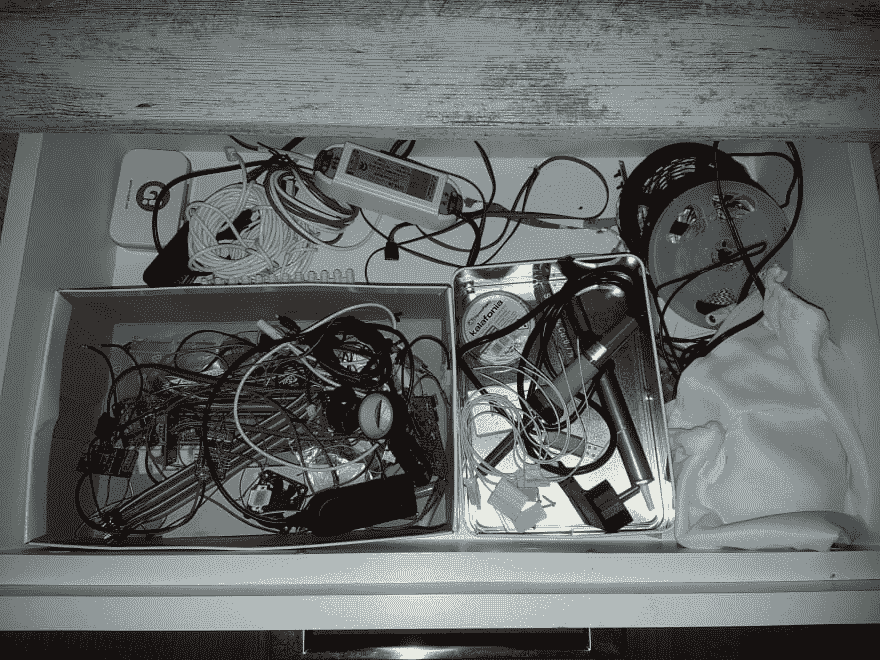
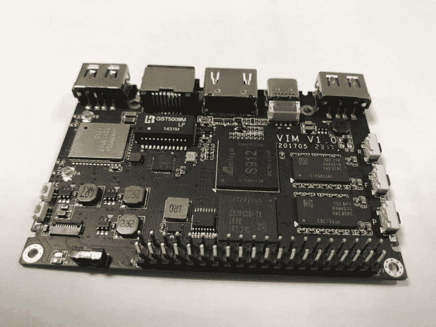
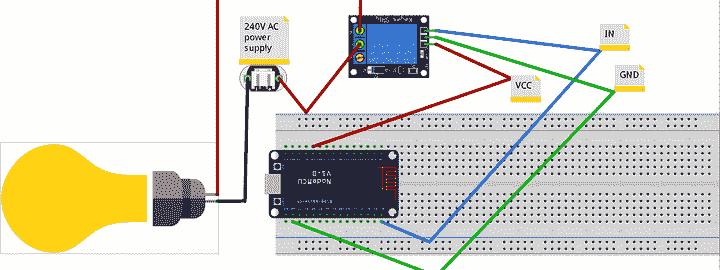
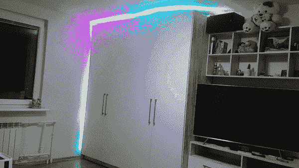
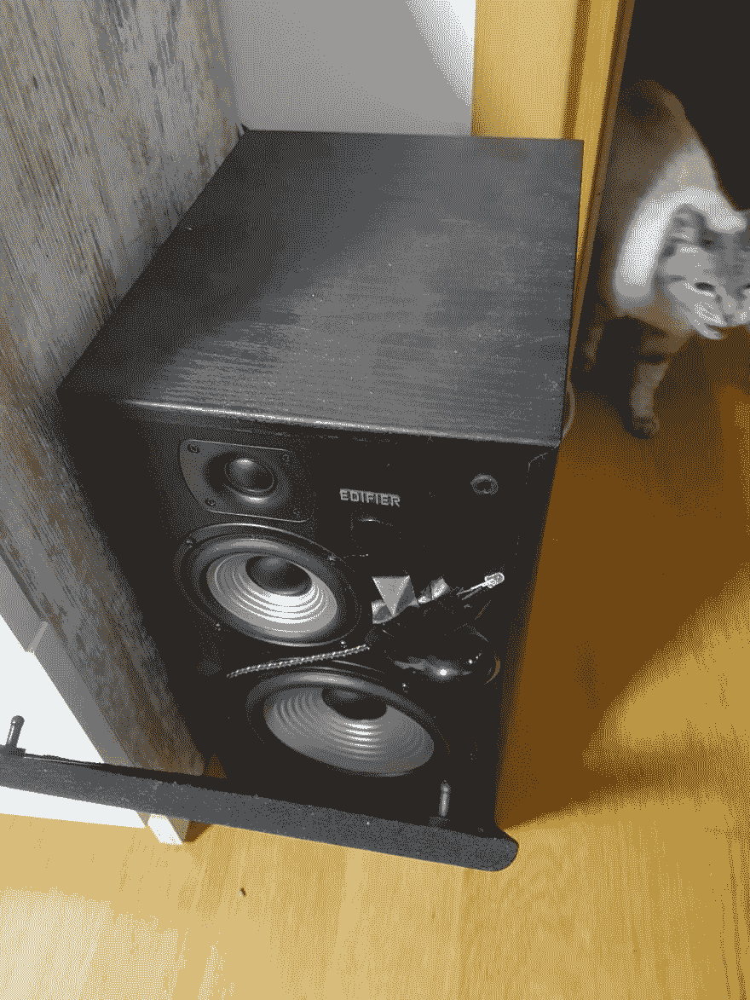
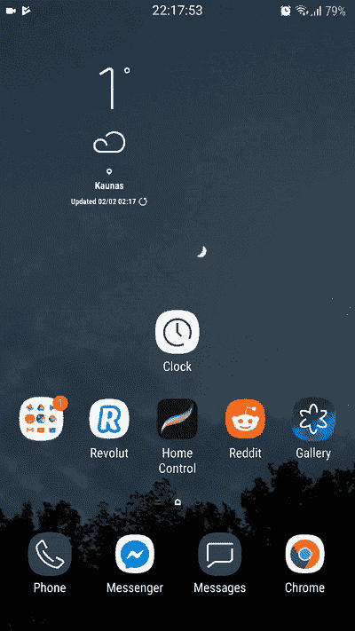
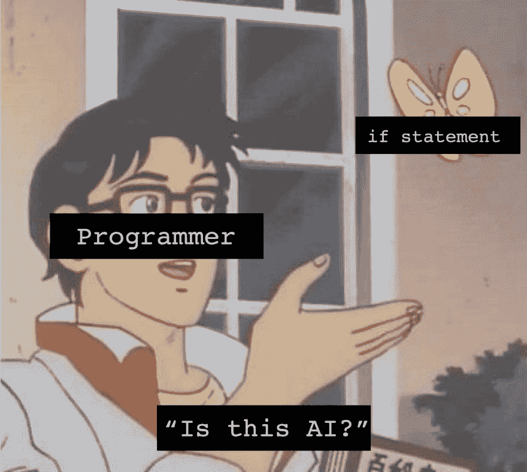

# 我如何从零到家庭自动化领域的英雄

> 原文：<https://dev.to/martis347/how-i-got-from-zero-to-hero-in-home-automation-48jm>

# 这一切是如何开始的

物联网和家庭自动化这几年一直在崛起。

对我来说，一切都开始于大约 3 年前，那时我听说了什么是 Arduino。快进一年左右，我用这个微型控制器建造东西越来越好了。我有多个 LED 灯条、温度传感器、显示器等等。
一步一步，我开始用智能手机控制我的房间。

<figcaption>How one of my drawers looks right now 🙃</figcaption>

# 让我们来谈技术

## 设置包括哪些内容？

*   运行我的 Node.js 服务的中央网关
*   2 盏由微控制器控制的灯
*   1 个可单独寻址的 LED 灯条
*   一组扬声器
*   一切都由 PWA(渐进式网络应用程序)或谷歌助手控制

这个中央网关是一台运行在 Ubuntu 上的单板计算机。
我使用的微控制器是 [NodeMCU](https://www.nodemcu.com/index_en.html) (你可能会问为什么不是 arduino？这些小宝贝内置了无线网络，非常便宜！)

<figcaption>Picture of Khadas VIM</figcaption>

## 建筑

正如我所提到的，有一个中央网关负责一切。它运行一个基本的 Node.js Express 服务器，并根据请求调用某个微控制器。在本地网络中，与微控制器的通信使用 http。
网关本身通过我的路由器公开暴露，因此我可以从任何地方访问它。

### 灯具

<figcaption>Diagram for lamp connection</figcaption>

我房间里有两盏主要的灯(一盏在墙上，另一盏在天花板上)。每个灯由 NodeMCU 使用 220v 继电器控制。

### 灯条

<figcaption>How my lights strip looks like</figcaption>

灯条的控制是非常基本的，只是一个标准的连接，我不想详细介绍。

### 音箱

<figcaption>Speakers setup</figcaption>

我为这个感到非常自豪。我正在使用的扬声器是 [Edifier R2730](https://www.edifier.com/int/en/speakers/r2730db-bluetooth-bookshelf)
控制它们的唯一方法是使用它们附带的遥控器或使用扬声器本身内置的控件。

我的解决方案是读取遥控器的红外代码，保存代码，然后使用我的 NodeMCU 的红外 led 重复这些代码。现在有一个 NodeMCU 贴在我的扬声器上(但从视觉上看不出来),它可以远程控制它们。

### PWA

<figcaption>Overview of the PWA</figcaption>

中央网关由我的 PWA 控制，它是使用 [Vue.js](https://vuejs.org/) 和 [Vuetify](https://vuetifyjs.com/en/) 构建的。
PWA 部署在一个 Azure Web App 的免费实例上。
去往网关的每个调用都通过 Node.js 服务代理，该服务运行在同一个 Web 应用程序上。
但是**为什么**我要代理每个呼叫？它为每个 HTTP 调用增加了额外的开销和延迟。但是有一个问题！对于一个 PWA，你**必须**在 HTTPS 服务它，并且每个呼叫也必须使用 **HTTPS** ！我的网关只是一个 IP 地址，因此我必须通过提供免费 SSL 证书的 Azure Web App 代理一切。

### 谷歌助手

事实上，我买了一个谷歌 Home mini 只是为了把它连接到这个系统上。😄(但它也适用于我的手机)
该网关包含一个小型的类似人工智能的算法，正在处理从谷歌助理接收的输入。
在 [IFTTT](https://ifttt.com/google_assistant) 的帮助下接收该语音输入。然后它就调用微控制器。

<figcaption>"An AI-like solution"</figcaption>

# 结束语

一年多来，我一直在不时地开发这个系统。它实际上是作为一个 React 本地应用程序开始的，后来证明不是最好的解决方案。我和我的女朋友每天都在使用它，我希望能进一步推广。
 
只要说一句“嘿，谷歌，我回来了”，灯就亮了，扬声器播放你最喜欢的电台，你就可以放松下来，开始编写你喜欢的代码，这是非常令人满意的😊。或者，如果已经很晚了，你正在读你在 Dev.to 上的最后一篇文章，当你决定睡觉的时候，你甚至不需要把你的屁股从床上抬起来就可以关掉灯和收音机😁。

有很多细节/特点我没有提到。如果这个帖子得到一些关注，我可以创建一个关于它的更技术性的系列。
例如:

*   NodeMCU 的 OTA 更新
*   通过我的网关播放 Youtube 上的音频
*   我的平板电脑设置(是的，我在墙上安装了一台平板电脑😬)
*   处理从谷歌助理收到的文字
*   内置闹钟

写完这篇文章后，我查了一下关于家庭自动化和物联网的[谷歌趋势](https://trends.google.com/trends/explore?date=today%205-y&geo=US&q=%2Fm%2F02vnd10)，似乎在过去几年里，它的受欢迎程度正在下降😲。