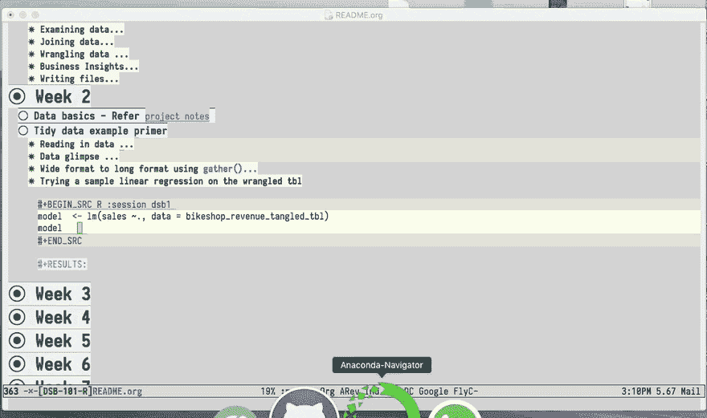

# 使用 Emacs 快速访问备忘单以学习数据科学

> 原文：<https://dev.to/shrysr/rapidly-accessing-cheatsheets-to-learn-data-science-with-emacs-ol7>

[Matt Dancho 的课程 DSB-101-R](https://university.business-science.io/p/ds4b-101-r-business-analysis-r) 是一门非常棒的课程，可以帮助你进入由数据科学推动的投资回报率驱动的商业分析。在这门课程中，除了许多其他事情之外，他还教授理解和使用备忘单的方法，以获得快速的*提升*，尤其是找到连接各种包、功能和工作流的信息。我已经迷上了这种方法，需要一种方法来根据需要快速引用不同的备忘单。

法维奥·瓦兹奎的 ds-cheatsheets repo ，类似于一个环来统治他们所有人(当然是关于 cheatsheets)，结合 Emacs ( [弹丸](https://github.com/bbatsov/projectile) + [头盔](https://github.com/emacs-helm/helm)包)，只需键入几个词，就可以轻松快速地找到特定的 Cheatsheets。 [1](#fn:fn-1)

Scimax 中内置的 Hydras 使得只需按几个键就能轻松完成上述操作。我所做的就是`F12` > > p > > ww，开始键入“ds-”并选择项目，然后开始键入我要找的 PDF 文件的名称。看看下面的动画。

<figure> 

<figcaption>

#### 快速切换到备忘单 PDF

</figcaption>

</figure>

上面的概念适用于切换到任何基于 git 的项目中的任何文件，该项目被添加到弹丸的列表中。

要考虑的下一个方面是在打开的 cheatsheet PDF 的最大化缓冲区和当前代码缓冲区之间切换。正如 Emacs 所说，“可能有一个包可以解决这个问题。”！我的解决方案是使用 Emacs 中的各种框架/窗口配置包之一来保存缓冲区的位置和方向，并在最大化的 PDF 框架和分割代码和解释器框架之间快速切换。

事实上，Scimax 已经提供了上述功能，可以将帧或窗口配置保存到对该会话有效的寄存器中。跨会话持久保存窗口配置(即 Emacs 重启)稍微复杂一些，但是通过一些调整仍然是可能的。Winner 模式也是一个有趣的选项，可以在窗口配置之间快速切换。

* * *

1.  在某种程度上，也有可能像 Alfred 应用程序这样的启动器可以设置或编程为在特定位置进行搜索。对于 Mac 用户来说，这是一个不那么令人讨厌的功能选项。 ^