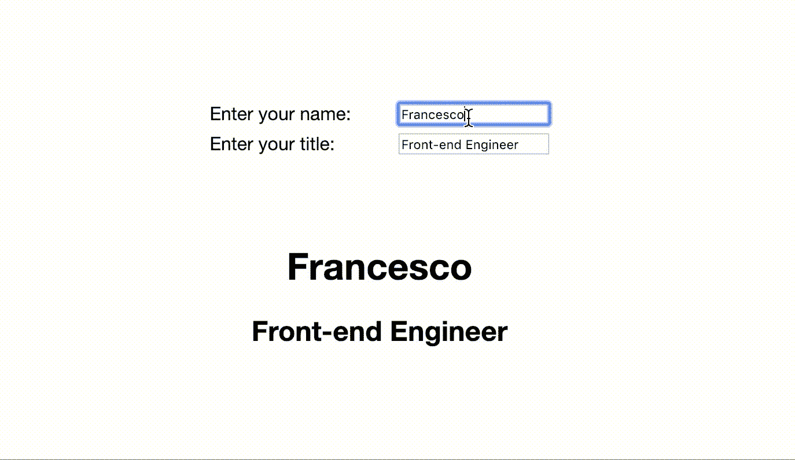

# 普通 JS (POC)中的双向数据绑定

> 原文：<https://dev.to/phoinixi/two-way-data-binding-in-vanilla-js-poc-4e06>

在之前的一篇文章中，我展示了用普通 JS 实现的[单向数据绑定的基本实现👨🏼‍💻。](////dev.to/phoinixi/one-way-data-binding-in-vanilla-js-poc-4dj7)

作为前端工程师，我们通常使用库和/或框架来开发和维护复杂的 web 应用程序，但是这里面有什么呢？你问过自己这个问题吗？你没有！？嗯，你应该！🙃

在这篇文章中，我想把前面的例子扩展到**双向数据绑定**。🕺

### 双向数据绑定🤓

如果您不熟悉这个概念，**双向数据绑定**意味着对**状态**的每一次更改都会立即传播到**视图**(而*反之亦然*)。

### 演示

[](//thepracticaldev.s3.amazonaws.com/i/xax8qjn8qubpijnv2c3o.gif)

### 我们来分解一下

双向数据绑定需要什么？

*   一个**视图**，在我们的例子 HTML 中。
*   一个**状态**，用 JavaScript 保存在内存中。

关键特征是:

> 每次**状态**改变时，**视图**需要更新(单向数据绑定)

并且

> 每次视图改变时，状态都需要更新

所以让我们假设我们有一个 HTML **视图** :

```
 <div class="field">
        <label for="name">Enter your name:</label>
        <input id="name" type="text" name="name"  data-model="name" />
      </div>

      <div class="field">
        <label for="title">Enter your title:</label>
        <input id="title" type="text" name="title" data-model="title" />
      </div>

      <div class="results">
        <h1 data-binding="name"></h1>
        <h2 data-binding="title"></h2>
      </div> 
```

Enter fullscreen mode Exit fullscreen mode

和一个**状态** :

```
 const state = {
      name: 'Francesco',
      title: 'Front-end Developer'
    }; 
```

Enter fullscreen mode Exit fullscreen mode

我们可以很容易地设置**视图**第一次:

```
 document.querySelector('[data-binding="name"]').innerHTML = state.name
    document.querySelector('[data-binding="title"]').innerHTML = state.title
    document.querySelector('[data-model="name"]').value = state.name
    document.querySelector('[data-model="title"]').value = state.title 
```

Enter fullscreen mode Exit fullscreen mode

但是我们想要一些魔法，这样当我们更新状态时:

```
 state.name = 'Richard'
    state.title = 'Technical Lead' 
```

Enter fullscreen mode Exit fullscreen mode

**视图**也应该更新。

为了实现这一点，我们可以修改`state`对象的`set`属性的默认行为，这样除了更新**状态**，它还会更新我们的**视图**。

JavaScript 中的一种方法是使用[代理对象](https://developer.mozilla.org/en-US/docs/Web/JavaScript/Reference/Global_Objects/Proxy) :

```
 const createState = (state) => {
      return new Proxy(state, {
        set(target, property, value) {
          target[property] = value; // default set behaviour
          render(); // updates the view every time the state changes
          return true;
    }
      });
    };

    const state = createState({
      name = 'Francesco'
      title = 'Front-end Engineer'
    }); 
```

Enter fullscreen mode Exit fullscreen mode

借助代理的力量，每次我们更新`state`时，都会调用`render`函数。
`render`的一个可能实现可以是:

```
 const render = () => {
     document.querySelector('[data-binding="name"]').innerHTML = state.name;
     document.querySelector('[data-binding="title"]').innerHTML = state.title;
     document.querySelector('[data-model="name"]').value = state.name;
     document.querySelector('[data-model="title"]').value = state.title;
    }; 
```

Enter fullscreen mode Exit fullscreen mode

我们只是错过了最后一小块。每次我们修改**视图**时，**状态**也要相应改变。我们可以得出，向输入添加一个事件监听器:😎

```
 const listener = (event) => {
      state[event.target.dataset.model] = event.target.value;
    });

   document.querySelector('[data-model="name"]').addEventListener('keyup', listener);  
   document.querySelector('[data-model="title"]').addEventListener('keyup', listener); 
```

Enter fullscreen mode Exit fullscreen mode

然后*瞧啊*！现在把戏完成了！👨‍💻

### 更通用的实现(POC)🌟

[https://stackblitz.com/edit/two-way-data-binding-poc?](https://stackblitz.com/edit/two-way-data-binding-poc?)