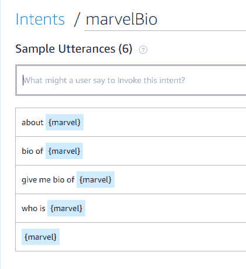
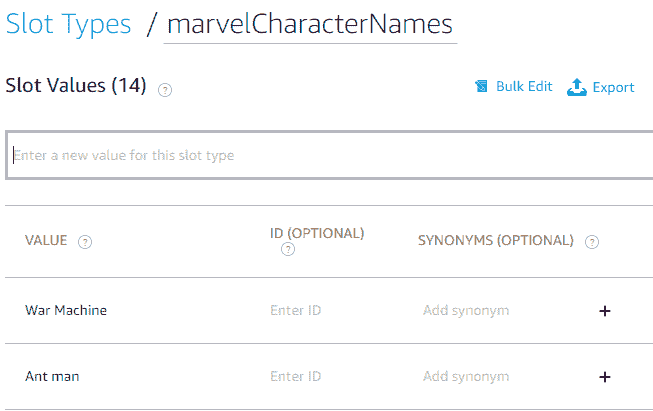
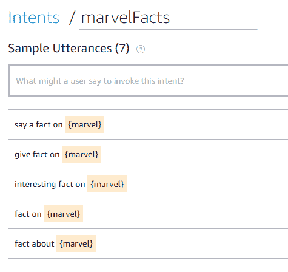
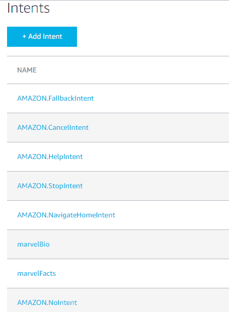
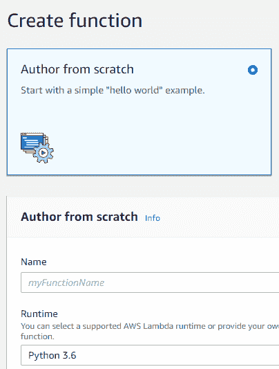
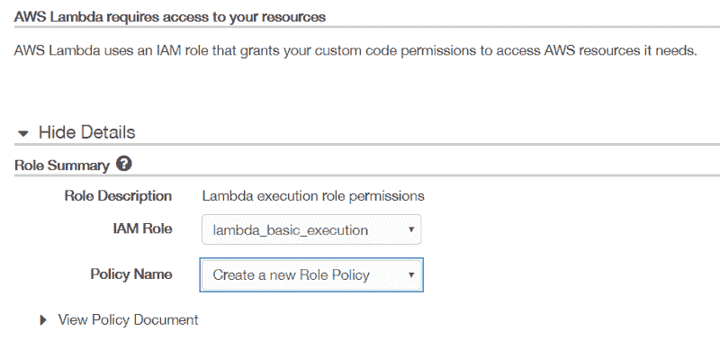
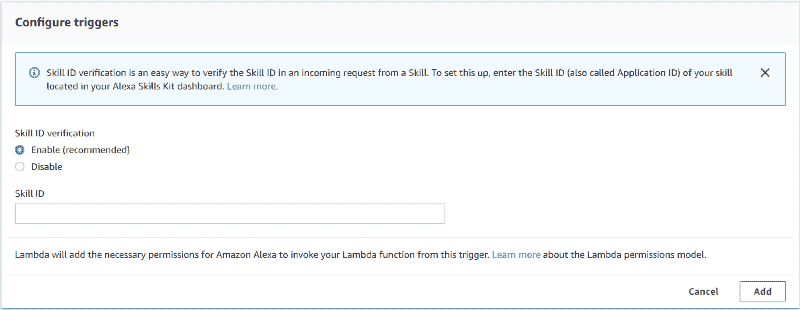

# 从头开始建立自己的 Alexa 技能

> 原文：<https://dev.to/apoorvadave/building-your-own-alexa-skill-from-scratch-3a4b>

亚马逊的 Alexa(以古代亚历山大图书馆命名)是亚马逊的语音控制系统。Alexa 的响应能力是它与基于手机的语音助手不同的地方。我们可以播放音乐，搜索网页，创建待办事项和购物清单，网上购物，获取即时天气预报，只需用你的声音就能控制流行的智能家居产品。

Alexa skill 就像一个 app。你可以使用 Alexa 应用程序来启用或禁用该技能。一旦技能被激活，你就可以启动技能并做技能能够完成的事情。

## Alexa 技能是如何工作的？

在我们开始创建自己的 Alexa 技能之前，理解它是如何工作的对我们来说很重要。所以主要有两个组件:技能接口和技能服务。该请求遵循以下路径:

用户-> Echo 设备->技能接口(亚马逊 Alexa 开发平台)->技能服务(HTTP server/AWS Lambda)

用户向 echo 设备发出的请求被发送到技能界面。技能接口将请求编码成 JSON 格式，并点击技能服务。响应由技能服务生成，同样是 JSON 格式。该响应被提供给技能接口，然后提供给回声设备。回声设备将其翻译成语音，并将信息提供给用户。

技能界面是我们创建交互模型的 Alexa 开发平台。它接收语音作为输入，并提供 JSON 编码的请求。技能服务是我们技能的大脑，它根据用户的请求提供响应。

## 动机

包括我在内的许多人都有一个疑问:为什么要建立一个 Alexa 技能？必须有一个动力的来源，这样我们才能完成我们开始的事情(至少对我来说😛).确实有。亚马逊有一个激励计划，开发者可以使用 Alexa 将他们的想法付诸实践，发布他们的技能，至少可以获得一件免费的限量版 Alexa 开发者 t 恤。如果在文章发表的前 30 天内，有超过 150 个客户支持并使用你的技巧，你也可以得到一个回应点。有动力？😄我是！如果你想发表你自己的 Alexa 技能，请阅读这篇文章的其余部分。我向你保证，你可以在两个小时内掌握你的技能。所以让我们开始吧！

## 培养你的 Alexa 技能

在这篇文章中，我们将创建一个 Alexa 技能，提供漫威超级英雄的简历和事实(超级英雄中心:这是我迄今为止发表的第一个技能。如果你们任何人有回声设备，我请求你们启用它并检查。请让我知道在评论中，如果你面临任何困难，或者你想要更多的功能👼。可以查看链接中的技能)。

现在，同样的代码可以扩展和修改，以获得您的技能。

1.  在亚马逊 Alexa 开发者门户建立交互模型。在这里，您将定义意图(即由您的技能执行的动作)、示例语句(调用您的技能和意图的句子)和端点。
2.  创建 AWS Lambda 函数(技能服务)。您将编写一个函数来处理用户发出的请求，并为其生成一个 JSON 响应。我将使用 Python。也支持 Node.js 等其他语言。
3.  使用服务模拟器测试技能。
4.  提交出版技巧。
5.  为你的 Alexa 技能创建一个图标/标志。

## 交互模式

如果您还没有开发者帐户，请访问此链接并注册。遵循步骤:Alexa ->创建 Alexa 技能->开始一个技能->创建技能。选择一个技能名称，然后选择自定义。

在下一个屏幕中，给出你技能的调用名称。这是用户调用您的技能时会说的名字。所以试着变得有创意和独特。默认情况下，列表中包含一些意图。为了获得超级英雄的传记和事实，我们将再创建 2 个意图:marvelBioand 和 marvelFacts

单击“添加意向”,并将其命名为 marvelBio。它处理用户请求获取超级英雄的个人资料。

在这之后，定义你的示例话语(一个能激发这个意图的句子)。举例:说说钢铁侠吧。现在因为这个“钢铁侠”可以变，所以创造了一个名为漫威的槽点。请给出“告诉我有关{marvel}的情况”这样的话语示例。

[](https://res.cloudinary.com/practicaldev/image/fetch/s---CqmLZbN--/c_limit%2Cf_auto%2Cfl_progressive%2Cq_auto%2Cw_880/https://thepracticaldev.s3.amazonaws.com/i/xtggpv2oe8g7g6bsju2u.png) 

<figcaption>marvelBio 意向</figcaption>

此 marvelslot 需要有一个插槽类型。通过单击添加插槽类型创建一个插槽类型，并命名为 marvelCharacterNames。槽类型将包含超级英雄的名字。你可以填上你想要的超级英雄的名字。

[](https://res.cloudinary.com/practicaldev/image/fetch/s--ywfzecXQ--/c_limit%2Cf_auto%2Cfl_progressive%2Cq_auto%2Cw_880/https://thepracticaldev.s3.amazonaws.com/i/be1s371uugmvu01co5oc.png)

<figcaption>marvelCharactersName 槽类型</figcaption>

类似地，添加一个名为 marvelFacts 的意图。示例话语如下:给我一个{marvel}上的事实。这一特定意图的时段{marvel}被创建。但是，不需要新的插槽类型。可以使用相同的槽类型，因为我们希望将槽{marvel}替换为我们已经在 marvelCharacterNames 中定义的超级英雄的名称。

[](https://res.cloudinary.com/practicaldev/image/fetch/s--vnmcMpa2--/c_limit%2Cf_auto%2Cfl_progressive%2Cq_auto%2Cw_880/https://thepracticaldev.s3.amazonaws.com/i/xxufpiyxgnvlszthmu2h.png) 

<figcaption>奇迹意图</figcaption>

添加内置意图“亚马逊。NoIntent”，点击添加意向，使用 Alexa 内置库中的现有意向。搜索并选择无内容。(我们包含这一意图，因为您可以看到默认情况下它不包含在我们的交互模型中)。最终的意向列表如下所示:

[](https://res.cloudinary.com/practicaldev/image/fetch/s--Uma4ZgIr--/c_limit%2Cf_auto%2Cfl_progressive%2Cq_auto%2Cw_880/https://thepracticaldev.s3.amazonaws.com/i/87jbtakpk5mlhohk3ctz.png)

<figcaption>Alexa 技能最终意向列表</figcaption>

转到端点部分，选择 AWS lambda 函数并复制技能 id。稍后将在 lambda 函数中使用它来链接技能接口和技能服务。

[](https://res.cloudinary.com/practicaldev/image/fetch/s--eHWNIf2h--/c_limit%2Cf_auto%2Cfl_progressive%2Cq_auto%2Cw_880/https://thepracticaldev.s3.amazonaws.com/i/zpgf6d31x3a3vxr0i0dl.PNG) 

<figcaption>端点</figcaption>

请点击“保存模型”来保存您的交互模型。你不会想再做一次的，相信我😟。并检查是否可以成功构建。

## AWSλ功能

转到此链接。如果您还没有帐户，请注册并登录。搜索 Lambda 并点击从头开始创建函数和作者。给出 lambda 函数的名称。选择 python 3.6 和角色作为自定义角色。

[](https://res.cloudinary.com/practicaldev/image/fetch/s--08YjoMBi--/c_limit%2Cf_auto%2Cfl_progressive%2Cq_auto%2Cw_880/https://thepracticaldev.s3.amazonaws.com/i/j7nlswqdkzj8m48j3vvf.png)

<figcaption>λ函数创建</figcaption>

在 IAM 管理器中，单击“允许”按钮，您将被重定向回“创建函数”表单。

[](https://res.cloudinary.com/practicaldev/image/fetch/s--aV0BioXV--/c_limit%2Cf_auto%2Cfl_progressive%2Cq_auto%2Cw_880/https://thepracticaldev.s3.amazonaws.com/i/rac0o53oyja5zg2szhi9.png) 

<figcaption>IAM 经理</figcaption>

点击左侧触发选项中的 Alexa 技能包，粘贴你从“端点”复制的技能 ID。点击添加。

[](https://res.cloudinary.com/practicaldev/image/fetch/s--Kqp5amNk--/c_limit%2Cf_auto%2Cfl_progressive%2Cq_auto%2Cw_880/https://thepracticaldev.s3.amazonaws.com/i/zanu2moo72obgkafmssq.png) 

<figcaption>在 AWS Lambda 函数中添加技能 ID</figcaption>

点击功能名称，滚动到页面底部，更改功能内容。删除现有代码并粘贴下面的函数。

```
from random import randint

#------------------------------Part1-------------------------------- 
Marvel_LIST = ["Ant Man","War Machine"]

Marvel_BIOGRAPHY = {"ant man":"Ant-Man is a legacy super-hero name,  primarily associated with the ability to shrink in size. Former thief  Scott Lang once stole an advanced size-altering suit in order to aid  his ailing  daughter, only to discover that the stolen tech belonged to the  world-renowned Dr. Hank Pym. Seeing the heroic potential within him,  Dr. Pym allowed Scott to continue using the suit, as well as the identity  Pym once battled evil under. As the Astonishing Ant-Man, Scott now  handles the jobs too small for any other Super Hero.",
"war machine" : "Colonel James Rupert Rhodes, commonly known as Rhodey,  is the officer of the United States Air Force. He is the best friend of  Tony Stark and the liaison between Stark Industries  and the military in the Department of Acquisitions."}

Marvel_FACT = {"ant man":["When Paul Rudd told his nine-year old son  that he was playing the titular character in Ant-Man, he responded with,  Wow, I can’t wait to see how stupid that’ll be.","Rudd got in such good  shape that they had to alter the Ant-Man costume to  account for his new physique.","In the comics, Hank Pym is actually  the one who creates Ultron.Of course, Tony Stark does so in  the movies because, y’know, drama."],
"war machine":["IN AN EARLY DRAFT OF THE FIRST IRON MAN MOVIE,  TONY'S FATHER HOWARD STARK WAS THE MAIN VILLAIN, CALLING HIMSELF  WAR MACHINE","DON CHEADLE TOOK ANTI-ANXIETY MEDICATION TO WEAR THE  WAR MACHINE SUIT","JAMES RHODES ORIGINALLY MET TONY STARK  DURING THE VIETNAM WAR"]
}

#------------------------------Part2-------------------------------- 
def lambda_handler(event, context):
    if event['session']['new']:
        on_start()
    if event['request']['type'] == "LaunchRequest":
        return on_launch(event)
    elif event['request']['type'] == "IntentRequest":
        return intent_scheme(event)
    elif event['request']['type'] == "SessionEndedRequest":
        return on_end()

#------------------------------Part3-------------------------------- 
def on_start():

    print("Session Started.")
def on_launch(event):
    onlunch_MSG = "Hi, welcome to the Alexa Skill. My favourite marvel  characters are: " + ', '.join(map(str, Marvel_LIST)) + ". "\
    "If you would like to hear more about a particular character or a  fact related to it, you could say for example: tell me about Ant Man?  or give me a fact on Ant Man "
    reprompt_MSG = "Do you want to hear more about a particular  marvel character?"
    card_TEXT = "Pick a marvel."
    card_TITLE = "Choose a marvel."
    return output_json_builder_with_reprompt_and_card(onlunch_MSG, 
card_TEXT, card_TITLE, reprompt_MSG, False)

def on_end():

    print("Session Ended.")

#-----------------------------Part3.1------------------------------- 
def intent_scheme(event):

    intent_name = event['request']['intent']['name']
if intent_name == "marvelBio":
        return marvel_bio(event) 
    elif intent_name == "marvelFacts":
        return marvel_fact(event) 
    elif intent_name in ["AMAZON.NoIntent", "AMAZON.StopIntent", "AMAZON.CancelIntent"]:
        return stop_the_skill(event)
    elif intent_name == "AMAZON.HelpIntent":
        return assistance(event)
    elif intent_name == "AMAZON.FallbackIntent":
        return fallback_call(event)

#---------------------------Part3.1.1------------------------------- 
def marvel_bio(event):

    name=event['request']['intent']['slots']['marvel']['value']
    marvel_list_lower=[w.lower() for w in Marvel_LIST]
    if name.lower() in marvel_list_lower:
        reprompt_MSG = "Do you want to hear more about a particular  character?"
        card_TEXT = "You've picked " + name.lower()
        card_TITLE = "You've picked " + name.lower()
        return output_json_builder_with_reprompt_and_card
(Marvel_BIOGRAPHY[name.lower()], card_TEXT, card_TITLE,
reprompt_MSG,False)
    else:
        wrongname_MSG = "I cannot help you with that. If you have  forgotten which characters you can pick say Help."
        reprompt_MSG = "Do you want to hear more about a particular ?"
        card_TEXT = "Use the full name."
        card_TITLE = "Wrong name."
        return output_json_builder_with_reprompt_and_card
(wrongname_MSG, card_TEXT, card_TITLE, reprompt_MSG, False)

def marvel_fact(event):

    name=event['request']['intent']['slots']['marvel']['value']
    marvel_list_lower=[w.lower() for w in Marvel_LIST]
    if name.lower() in marvel_list_lower:
        reprompt_MSG = "Do you want to hear a fact on a particular character?"
        card_TEXT = "You've picked " + name.lower()
        card_TITLE = "You've picked " + name.lower()
        return output_json_builder_with_reprompt_and_card
(Marvel_FACT[name.lower()][randint(0, 2)], card_TEXT, card_TITLE, 
reprompt_MSG, False)
    else:
        wrongname_MSG = "I cannot help you with that. If you have  forgotten which characters you can pick say Help."
        reprompt_MSG = "Do you want to hear more about a particular ?"
        card_TEXT = "Use the full name."
        card_TITLE = "Wrong name."
        return output_json_builder_with_reprompt_and_card
(wrongname_MSG, card_TEXT, card_TITLE, reprompt_MSG, False)

def stop_the_skill(event):

    stop_MSG = "Thank you. Bye!"
    reprompt_MSG = ""
    card_TEXT = "Bye."
    card_TITLE = "Bye Bye."
    return output_json_builder_with_reprompt_and_card
(stop_MSG, card_TEXT, card_TITLE, reprompt_MSG, True)

def assistance(event):
    assistance_MSG = "You can choose among these marvels: " +
', '.join(map(str, Marvel_LIST)) + ". Be sure to use the full name when asking about the character."
    reprompt_MSG = "Do you want to hear more about a particular  marvel character?"
    card_TEXT = "You've asked for help."
    card_TITLE = "Help"
    return output_json_builder_with_reprompt_and_card
(assistance_MSG, card_TEXT, card_TITLE, reprompt_MSG, False)
def fallback_call(event):
    fallback_MSG = "I can't help you with that, try rephrasing  the question or ask for help by saying HELP."
    reprompt_MSG = "Do you want to hear more about a particular  marvel character?"
    card_TEXT = "You've asked a wrong question."
    card_TITLE = "Wrong question."
    return output_json_builder_with_reprompt_and_card
(fallback_MSG, card_TEXT, card_TITLE, reprompt_MSG, False)

#------------------------------Part4-------------------------------- 
def plain_text_builder(text_body):

    text_dict = {}
    text_dict['type'] = 'PlainText'
    text_dict['text'] = text_body
    return text_dict

def reprompt_builder(repr_text):

    reprompt_dict = {}
    reprompt_dict['outputSpeech'] = plain_text_builder(repr_text)
    return reprompt_dict

def card_builder(c_text, c_title):

    card_dict = {}
    card_dict['type'] = "Simple"
    card_dict['title'] = c_title
    card_dict['content'] = c_text
    return card_dict

def response_field_builder_with_reprompt_and_card
(outputSpeach_text, card_text, card_title, reprompt_text, value):

    speech_dict = {}
    speech_dict['outputSpeech'] = plain_text_builder(outputSpeach_text)
    speech_dict['card'] = card_builder(card_text, card_title)
    speech_dict['reprompt'] = reprompt_builder(reprompt_text)
    speech_dict['shouldEndSession'] = value
    return speech_dict

def output_json_builder_with_reprompt_and_card
(outputSpeach_text, card_text, card_title, reprompt_text, value):

    response_dict = {}
    response_dict['version'] = '1.0'
    response_dict['response'] = response_field_builder_with_reprompt_and_card
(outputSpeach_text, card_text, card_title, reprompt_text, value)
    return response_dict 
```

我简单说一下我们在代码中做了什么。首先，在第 1 部分中，我们定义了漫威 _ 名单(超级英雄名单)，一个漫威 _ 传记字典，关键字为漫威超级英雄的名字，值为他的简历，最后是字典漫威 _ 事实，这是一个多值字典，有 3 个值(3 个事实)与 1 个角色相关联。

在第 2 部分中，lambda_handler 函数将事件和上下文作为参数，并处理发出的请求(启动、意图或会话结束请求)。发送 LaunchRequest 以调用技能，当调用 IntentRequest 以处理事件时发送 intent request，当会话因错误或用户说 exit 而结束时发送 SessionEndedRequest。

在第 3 部分中，定义了请求处理函数 on_start()、on_launch()和 on_end()。output _ JSON _ builder _ with _ repro mpt _ and _ card()是从 on_launch()函数调用中调用的，我将在下面进行解释。在第 3.1 部分中，intent_scheme(event)根据被调用的意图调用相应的函数。例如，如果有人请求 marvel 上的事实，则会调用 marvel_fact(event)。

Lambda 函数的响应是 JSON 编码的输出，如下所示:

```
{
    "body": {
        "version": "1.0",
        "response": {
            "outputSpeech": {
                "type": "PlainText",
                "text": ""
            },
            "card": {
                "type": "Simple",
                "title": "",
                "content": ""
            },
            "reprompt": {
                "outputSpeech": {
                    "type": "PlainText",
                    "text": ""
                }
            },
            "shouldEndSession": value
        }
    }
} 
```

为了构建这个响应，在第 4 部分中，我们定义了 plain_text_builder(text_body)、re promp _ builder(repr _ text)、card_builder(c_text，c_title)、response _ field _ builder _ with _ re prompt _ and _ card(outputs peach _ text，card_text，card_title，reprompt _ text，value)。最后，函数 output _ json _ builder _ with _ re promp _ and _ card()在这些响应构建器函数的帮助下创建 JSON 编码的输出。

如果代码的任何部分不清楚，你可以留下评论，因为这将是你技能的大脑。同样的代码可以调整，以获得自己的技能。

请保存你的 lambda 函数，复制右上角显示的 ARN(亚马逊资源名)。将 ARN 粘贴到亚马逊开发者 Alexa 技能门户“默认区域”的“端点”标签中。保存您的端点。

[](https://res.cloudinary.com/practicaldev/image/fetch/s--Jl7m2whp--/c_limit%2Cf_auto%2Cfl_progressive%2Cq_auto%2Cw_880/https://thepracticaldev.s3.amazonaws.com/i/s75ilm1cvanw46yu0qvq.PNG)

<figcaption>AWS 中的 AWS lambda 函数</figcaption>

[](https://res.cloudinary.com/practicaldev/image/fetch/s--XFr-CjOu--/c_limit%2Cf_auto%2Cfl_progressive%2Cq_auto%2Cw_880/https://thepracticaldev.s3.amazonaws.com/i/gn54n86uoou38xwmsh9x.PNG) 

<figcaption>Alexa 开发者控制台端点标签</figcaption>

保存您的交互模型并构建它。确保它没有任何错误地成功构建。这就完成了我们技能的发展部分。是时候找点乐子了！😄

## 测试技能

要在模拟器中测试技能，请转到测试选项卡，并从下拉列表中选择发展选项。写下你的要求或使用你的麦克风。

1.  启动(您的调用名称)
2.  跟我说说蚁人
3.  给我关于蚁人的事实
4.  Help(请求“help”调用 assistance()函数，并提供可供选择的奇迹列表。)
5.  再见(放弃技能)

如果任何请求失败，并且您没有得到正确的响应，Alexa 开发者门户提供了一种极好的调试方法。Amazon CloudWatch 包含日志，在这些日志的帮助下，我们可以消除错误。只要确保在你的应用程序中使用正确的日志语句就可以了，因为这样会使调试更加容易。

## 发布你的技能

在你发布你的技能之前，确保你已经覆盖了所有的案例并且测试已经完成。如果认证过程失败，你可以多次重新提交你的技能，但至少事先彻底测试基本情况是好的。

要发布您的技能，请转到“分发”选项卡。填写详细信息，如技能名称、描述、示例语句、隐私政策和使用条款。技能名称应该以这样一种方式选择，这样就没有版权问题(我面临这个问题😝).描述应该包括你的技能所能做的一切。保存并继续进入下一页。

## 为你的技能创建图标/标志

图标创作是其中一个有趣的部分😛。通常，人们努力在网上免费开发他们的标志。Alexa portal 为您提供了一种创建图标的最高效、最快捷的方式。您可以使用可用符号列表中的不同符号。符号的大小可以根据您的需要而改变。为了让你的图标看起来更漂亮，你可以使用纯色和渐变色。戴上你的创意帽子，尽情享受吧👼。这是我为自己的技能设计的标志:

[](https://res.cloudinary.com/practicaldev/image/fetch/s--k88z0X_5--/c_limit%2Cf_auto%2Cfl_progressive%2Cq_auto%2Cw_880/https://thepracticaldev.s3.amazonaws.com/i/wop9nbj1380jq2q6aqb4.png) 

<figcaption>超级英雄枢纽[http://bit.do/superheroes-hub-alexa](http://bit.do/superheroes-hub-alexa)</figcaption>

填写完所有详细信息后，门户将运行验证测试，之后您可以提交技能进行审核。亚马逊团队在审核的时候还是挺快的，挺牛逼的。如果他们发现任何问题，他们会给你发邮件，并建议如何消除错误！一旦问题得到解决，你会收到一封邮件说你的技能现在是活的！😄

这是我第一次尝试写机器学习以外的东西。如果你有任何问题，请留下你的评论。如果你喜欢这篇文章，一定要展示一些❤.请启用我的技能“超级英雄枢纽”。它在印度和美国有售。你们 150 个人可以帮我弄一个回声设备😛。此处可用[。](http://bit.do/superheroes-hub-alexa)

特别感谢以下文章和人物:

[@anamritraj](https://dev.to/anamritraj) 的视频教程。这个系列是建立 Alexa 技能的动机之一:)

[https://www.youtube.com/embed/cj5jSAT3QqM](https://www.youtube.com/embed/cj5jSAT3QqM)

[https://medium . com/crowd botics/how-to-build-a-custom-Amazon-Alexa-skill-step-by-step-my-favorite-chess-player-DCC 0 EDA e 53 FB](https://medium.com/crowdbotics/how-to-build-a-custom-amazon-alexa-skill-step-by-step-my-favorite-chess-player-dcc0edae53fb)